## 一、常用命令

### 初始化设置

1. 设置用户名

   ```
   git config --global user.name Jmoon
   ```

2. 设置邮箱

   ```
   git config --global user.email jmoon531@foxmail.com
   ```

3. 初始化本地库

   ```
   git init
   ```

4. **查看本地库状态**

   ```
   git status
   ```

### 暂存区

暂存区的作用就是让在命令行下可以分多次提交修改。但是在IDEA中可以勾选文件分多次提交，所以**可以认为在IDEA中使用git没有暂存区**（或者把`git add`命令认为是使用git对文件进行版本控制，把`git rm`命令认为是解除对文件的版本控制）。

1. **添加到暂存区**，如果该文件第一次被添加，那么会被git进行版本控制；在工作区修改后再add，可以覆盖暂存区之前的修改。

   ```
   git add <文件名>
   ```

2. 从暂存区中删除文件，可认为是解除版本控制，要求是暂存区的文件内容和本地文件的内容一致，加-f可以强制删除。

   ```
   从暂存区中删除单个文件：git rm --cached <文件名>
   从暂存区中删除全部文件：git rm --cached -r .
   ```

### commit（提交）

1. **提交到本地仓库**

   ```
   git commit -m "提交信息" <文件名>
   ```

2. 舍弃上一次提交，重新提交一个新的版本（图中C2'）。上一次提交不会消失，只是不在当前分支上了（图中C2），git里的所有提交永远都不消失。

   ```
   git commit --amend -m "新的提交信息"
   ```

   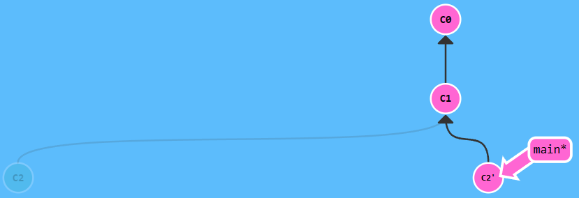

### branch（分支）

1. 查看有哪些分支

   - 查看本地分支：`git branch -v`
   - 查看远程分支：`git branch -r`
   -  查看所有分支：`git branch -a`

2. 在指定版本处创建分支，不加版本号表示在当前版本处

   ```
   git branch <分支名> <版本号>
   ```

   **常用在当前版本处创建分支**

   ```
   git branch <分支名>
   ```

3. 删除分支

   ```
   git branch -d <分支名>
   ```

4. 将指定分支切换到指定的版本处，-f 表示强制，这个命令也可以进行版本回退，与`git reset`的区别是，`git branch -f` 移动的分支不能与head处于合体状态，而`git reset` 必须处于合体状态（也就是`git branch -f` 进行版本回退时不需要head指针带着移动，而`git reset` 必须得head指针带着移动，`git branch -f`看上去确实更加方便快速点，但是在IDEA中不支持这样做，所以建议不要使用`git branch -f`，其实版本控制只记住常用的几个命令就可以了，虽然这个命令可以让操作更加快速，但是这会增加思考的时间成本，典型的太灵活了可能反倒会让工作出错，就记住那几个关键命令，虽然麻烦点，但是在那个思维模式下版本控制的原则显得更加简单，从而让版本更加容易被玩弄）。

   ```
   git branch -f <分支名> <版本号/分支名>
   ```


#### 分支合并

1. **合并分支**，比如，`git merge bugfix` 将bugfix分支合并到master分支，要在master分支上进行，这个操作只会让master分支前进一个版本，对bugfix分支不造成任何影响，因此如果合并一个比当前分支慢的分支（慢的分支处于快的分支的提交树上），不会生成新的节点。

   ```
   git merge <一个或多个分支>
   ```

   注意：当两个分支之间非公共节点（节点就是提交的版本）修改了同一个文件的同一行就会出现冲突，所以修改同一文件在合并时很可能会出现冲突，只要不修改同一文件就不会出现冲突。当出现合并冲突的时候，可以手动合并冲突文件从而解决冲突，也可以选择终止合并。

   ```
   git merge --abort
   ```

2. **rebase命令**，把分支2转移到分支1上，**只写一个分支名表示把当前分支转移到指定分支上**。rebase操作和merge操作产生的效果一样，但是rebase操作可以让提交树更加线性。

   ```
   git rebase <分支名1> <分支名2>
   ```

   例如，在bugfix分支上`git rebase main`可以将bugfix分支上的C2、C3版本复制到main分支上，并且保留bugfix分支。

   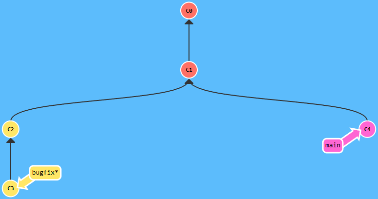

   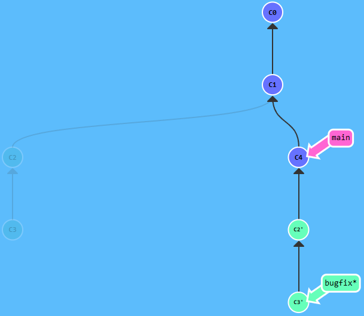

   切换到main分支上，在一个慢分支上使用rebase命令（`git rebase bugfix`）的作用是将慢分支移动到快分支处，相当于在慢分支上使用`git merge bugfix` 或者`git reset bugfix`。从上面合并分支的过程中可以看到，使用rebase合并分支要比使用merge慢一步，另外由于rebase需要在main分支上追加多个版本，所以可能会需要处理多次冲突，即每追加一个都可能会产生冲突，每次都需要手动合并冲突，但是merge最多只会产生一次冲突。

   Git的统一操作逻辑：**移动分支必须先checkout到这个分支，在这一点上，reset、merge、rebase 和 cherry-pick是一样的。**

7. **cherry-pick命令**，把指定的一个或多个提交合并到当前分支上，也可以让提交树更加线性。

   ```
   git cherry-pick <一个或多个版本号>
   ```

   例如，`git cherry-pick C2 C4` 把C2 C4  版本复制到main分支上，如果只想要C4版本，也可以只cherry-pick C4，这比merge生成的提交树更加线性，如果删除分支side，也不会在main分支保留C2、C3，如果是merge，那么合并得到的main分支会保留C2、C3、C4。

   另外，merge 和 rebase 命令后面只能跟分支，而 cherry-pick 命令需要跟版本号，所以在git命令行中提供了交互式rebase（交互式rebase是可视化操作的cherry-pick）。

   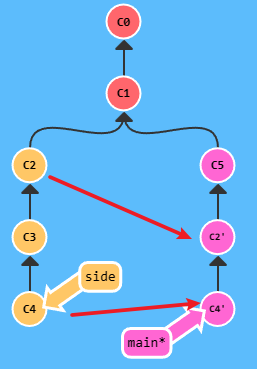

### checkout（移动head指针）

head指针指向的版本就是工作区内容（或者说就是我们看到的内容）的原始版本，工作区新的修改正是与这个版本的内容比较结果，也就是**`git diff`命令就是在拿工作区的内容与head指针指向的版本作比较**，所以head指针位置至关重要。

**`git checkout`命令就是用来移动head指针的，而head指针指向的版本就是我们工作区的内容，所以checkout必定会重置工作区的内容。**

1. 切换到分支（特指将head指针移动到分支名处，与分支进行合体），checkout后面跟分支名，此时head指针会与分支合体。

   ```
   git checkout <分支名> 或 git switch <分支名>
   ```

2. 切换到某个版本，checkout后面跟版本名，此时head指针会指向指定的版本，处于分离状态。

   ```
   git checkout <版本号>
   ```

   如果head指针处于合体状态，通过 **`git checkout head`命令可以快速分离head指针，而不用输入当前分支的版本号，即此时head指针仍然指针当前版本号，只是进行了分离，值得注意的是，这种情况不会重置工作区内容**。

checkout -b 参数的用法（不是重点）：

在指定的版本处 创建分支 并 切换到该分支，版本号省略表示在当前版本处。

```
git checkout -b <分支名> <版本号/分支名> 等同于 git switch -c <分支名> <版本号/分支名> 
```

在当前版本处 创建分支 并 切换到该分支 并 指定要跟踪的远程分支；在IDEA中，当本地没有同名分支时，checkout到远程分支会使用下面这个命令创建同名本地分支并将远程分支设置为上游分支，符合后面总结的使用远程仓库进行版本管理的最佳实践。

   ```
   git checkout -b <本地分支名> <远程分支名>
   ```

### 版本回退

#### 1、`reset`命令

**`reset`命令将分支名移动到指定版本版本处**

```
git reset <版本号/分支名>
```

选项：

- --soft，将head指针回退到指定的版本，不清空暂存区，也不会改变工作区的内容（不清空暂存区的效果就是，没有被重置的工作区的有些内容会变成新的修改）。

- --mixed（默认），将head指针回退到指定的版本，并清空暂存区，但不会改变工作区的内容（清空暂存区的效果就是，没有被重置的工作区的有些内容不会变成新的修改，而是会被作为`untracked`文件，即不被git所管理）。

- --hard，将head指针回退到指定的版本，并清空暂存区，还会把工作区的内容也重置到指定版本。

- --keep，将head指针回退到指定的版本，不清空暂存区，但会把工作区的内容也重置到指定版本。

可以认为在idea中使用git没有暂存区的概念，所以不使用soft和keep。

与`git checkout`的区别：`git reset` 既可以在head指针处于游离状态下使用，也可以在head指针处于合体状态下使用。在合体状态下使用，版本号和head指针可同时移动；在分离状态下，只会移动head指针，相当于checkout命令（checkout命令只能用来移动head指针，即使head指针处于合体状态，`checkout`也无法让分支移动），只不过reset更加灵活一点，可以选择是否重置工作区的内容，而checkout一定会重置工作区的内容，即`git checkout`相当于`git reset --hard`。虽然可以这样使用，但是这并不是reset命令的正确使用方法（不要搞这么灵活），因为reset命令的本意是用来回退版本的，也就是**`reset`用来移动分支的，`checkout`用来移动head指针的**，

强烈不建议在head处于分离状态下使用 `git reset --soft/mixed`，本来移动head指针就是为了改变工作区的内容，你这样做会让工作变得紊乱。

**总结 ：**

1. **不要在head分离状态下使用reset命令，`reset`命令是在head指针处于在合体状态下移动分支的命令，既可以让分支向前移动也可以让分支向后移动，从而实现版本回退。**
2. **不要使用--soft、--mixed、--keep选项，这些选项会让版本控制变得复杂。**

#### 2、`revert`命令

` revert `命令的作用是用新的提交来撤销前面的一个或多个版本的修改。

```
git revert <一个或多个版本号>
```

例如 `git revert c2 c0`会生成两个新的提交，c2'撤销了c2的修改，c0'撤销了c0的修改，比如c0新建0.txt，c1新建1.txt，c2新建2.txt，那么c0'的版本的结果是只有1.txt这个文件。

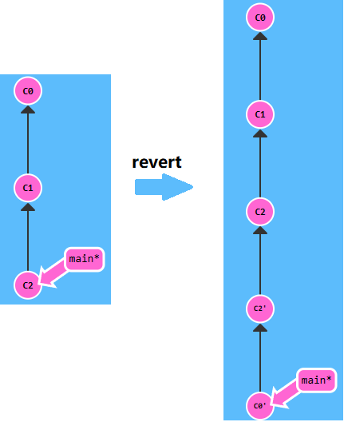

情景：工作上遇到的，从test分支上新建my分支，然后添加a.txt并提交，之后合并到dev分支并部署到测试环境。测试说有bug，然后我分析了一下，要完全舍弃之前的修改，重新写，这个时候如果选择将个人分支回退到test，然后重新添加b.txt，再合并到dev，dev上的版是不会删除a.txt的。（其实这样做不会影响到生产环境，只是会造成dev分支的版本很混乱，dev的版本混乱其实也没什么，dev本来就很混乱，反正每次新建分支都是从master和test上建。）

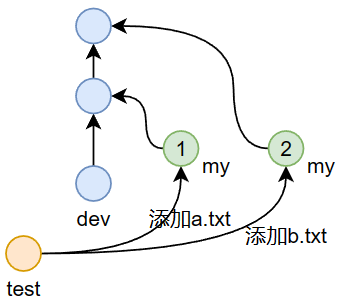

我的做法是，不回退到test，而是直接在my分支上手动删除a.txt，然后添加b.txt，最后合并到dev。其实这样做麻烦了，最正确的做法是用`revet`命令回退一个版本，然后在添加b.txt，这样合并到dev分支，dev分支就不会再保留a.txt了。

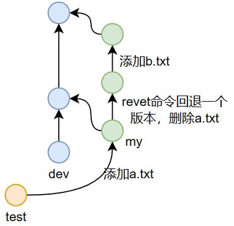

### 关于工作区的内容

- 如果工作区没有新的修改，或者并不关心工作区修改的内容是否会丢失，其实是可以任意切换分支（特指让head指针与分支合体）、移动head指针的位置（特指让head指针处于游离状态）、进行版本回退的，因为这些操作都只是改变head指针的位置，或者分支的位置，而这些操作都是可逆的，因为版本就在那，并不会改变，或者丢失，只要你记得版本号，你就可以让head指针或者分支移动到该处。所以无论使用`git branch -f` 还是 `git reset` 进行版本回退都是一样的，只不过是操作过程有所区别而已。

- **如何舍弃工作区的全部修改？**答：① 可以先checkout到另一个版本，然后checkout回来；② 更快速的方法是使用 `git reset --hard head`（注意，`git checkout head`并不能重置工作区）。

- 如果关心工作区新修改的内容，不想在切换分支、移动head指针、回退版本时丢失，那么处理的办法可以有：

  1. 进行一次新的提交，只要提交生成了新的版本，那么修改就肯定不会丢失。

  2. 如果不想把工作区的内容进行一次新的提交，那么就不能使用checkout，所以就不能实现切换分支，但是移动head指针 和 回退版本 可以分别在 head指针处于分离 和 合体 状态下通过  `git reset --soft/mixed`实现，不过强烈建议不要在分离状态下使用`git reset --soft/mixed`命令，于是总结便是，如果不想把工作区的内容进行一次新的提交，但是还想保留工作区新的修改，那么只能用`git reset --soft/mixed`命令进行版本回退。

     我始终不建议在改变head指针的位置之后，工作区仍然保留之前的修改，也就是**不建议把工作区的修改带到其它版本处，所以还是建议不要使用`git reset --soft/mixed`命令**，也就是不要在想切换分支、移动head指针、回退版本时，还想不生成新的提交，同时还想保留工作区的内容。

  3. `git stash`命令

     使用`git stash`命令将工作区的修改贮藏起来之后再做切换分支、移动head指针、回退版本的操作**。贮藏之后，工作区的内容重置为版本库的内容。可以在任何版本处恢复贮藏点，不一定要在建立贮藏点的版本处。**需要注意的是，恢复贮藏之后，贮藏点的修改会直接应用到工作区，不好将修改有选择性的应用到切换后的分支，最好只是用来在不丢失工作区修改的情况下，暂时切换到其他版本，切回来之后再恢复贮藏点。

     - 贮藏当前工作区和暂存区的修改。

       如果当前工作区有修改但是没有提交，直接切换分支会重置工作区和暂存区。在不想提交的情况下，还想切换分支，可以贮藏当前工作区和暂存区修改的内容。

       ```
       git stash
       ```

     - 查询所有贮藏点。

       ```
       git stash list
       ```

     - 恢复并删除贮藏点（最近一次）。

       ```
       git stash pop
       ```

     - 查询后，恢复第二次提交的贮藏点。

       ```
       git stash apply stash@{2}
       ```

  4. IDEA的shelf（搁置）功能

     `stash`命令在恢复贮藏之后，贮藏点的修改会直接应用到工作区，所以通常只用来在不丢失工作区修改的情况下，暂时切换到其他版本，切回来之后再恢复贮藏点。而IDEA提供了更强大的贮藏功能，即shelf（搁置），它能在切换版本时（改变head指针的位置），保存工作区未提交的修改，然后在任何有需要的时候将这些修改有选择性地应用到工作区（不管当前head指针指向那个版本，或者说这个搁置与版本无关），其实就是在GUI的情况下对stash的改进。

     如何使用shelf（搁置）功能？checkout时如果有未提交的修改，选择smart checkout将直接触发IDEA中的shelf（搁置）功能。

     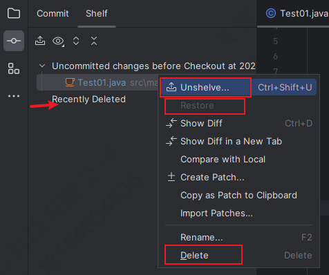

     Unshelve是应用修改，delete是删除这个搁置（再删除一次才会真正删除），restore是将删除一次的搁置还原，这个操作逻辑与回收站一样。

     shelf（搁置）功能在切换分支、移动head指针、回退版本时，既可以保留工作区的修改，又可以在head指针改变位置后重置工作区，**shelf功能默认是直接将搁置的修改应用到切换后版本的工作区，所以可能会产生冲突，如果产生冲突了，可以选择终止应用补丁，如果没有冲突，可以选择回滚工作区的内容，从而实现重置工作区**，后面还可以有选择性地讲将这些修改应用到切换后版本的工作区，可谓一举多得。

  **总结：**

  - **在切换分支、移动head指针、回退版本时进行新的提交绝对不会丢失修改，十分稳妥。**
  - **无论是移动head指针，还是回退版本，不建议把工作区的修改直接应用到其它版本处，所以建议不要使用`git reset --soft/mixed`命令。**
  - **使用IDEA中的shelf（搁置）功能，在任何有需要的时候将修改有选择性地应用到工作区。**

### 远程仓库

1. 克隆仓库

       git clone <url>

2. 添加远程库地址（一个本地仓库可以设置多个远程仓库，但是实际上很少这么干，原因是不要把版本控制搞复杂了）（其实Git的分布式特性也体现在这里，我甚至可以把扶谦和华林的本地仓库设置成我的远程仓库，然后将我的版本推送到他们的分支上，也就是其实Git是没有中心仓库这一概念的，只不过是我们在开发实践中习惯设置一个中心仓库作为远程仓库，这符合我们的思维习惯。）

   ```
   git remote add <远程库名> <url>
   ```

3. 查看添加的远程库

   ```
   git remote -v
   ```

4. 删除远程库地址

   ```
   git remote rm <远程库名>
   ```

5. 重命名远程库的别名

   ```
   git remote rename <旧远程库名> <新远程库名>
   ```

6. 查看远程库状态

   ```
   git remote show <远程库名>
   ```

7. **推送分支到远程库**

   ```
   git push <远程库名> <本地分支名/版本号>:<远程分支名>
   ```

   注意：

   - **本地分支 或者 版本号 必须要比 远程分支 高才能push成功（多人协作时，push前最好先fetch一下，更新一下远程分支的位置），也就是远程分支要在本地分支的提交树上。**
   - 可以将本地分支push到不同名的远程分支上，甚至可以往任意的远程分支上push版本号，所以事实上远程分支和本地分支没有默认的对应或者绑定关系，但是别没事找事，**实践中最好默认有这种绑定对应关系**，不要直接push版本号到远程分支上，并且只将本地分支push到远程同名分支上，最佳实践就是，在将本地分支合并好之后再推送到远程的同名分支上，或者在远程仓库上将分支合并好之后，再在本地仓库拉取同名远程分支的更新。

   省略远程分支名表示推送到远程同名分支：

   ```
   git push <远程库名> <本地分支名>
   ```

   省略本地分支名表示push当前所在的分支，也就是前面两条命令不用checkout分支就可以使用。

   ```
   git push <远程库名>
   ```

   推送一个空本地分支等于删除远程分支：

   ```
   git push <远程库名>  :<远程分支名> 
   ```

   删除远程分支还可以写成：

   ```
   git push <远程库名> --delete <远程分支名>
   ```

   推送所有分支到远程库：

   ```
    git push --all <远程库名>
   ```

8. `fetch`命令

   ```
   git fetch <远程库名> <远程分支名>
   ```

   拉取远程仓库的远程分支的更新，使得本地仓库的远程分支 与 远程仓库同步，省略远程分支名表示拉取所有远程分支。

9. 拉取远程分支到本地库

   ```
   git pull <远程主机名> <远程分支名>:<本地分支名>
   ```

   pull命令等同于先fetch远程分支的更新，然后merge到本地分支上（IEAD可以选择使用merge或者rebase两个合并方式中的任意一个），本地分支和远程分支可以不同名，同样，别没事找事。

   IDEA的这个选项就是`git pull`，功能是将当前分支设置的默认追踪的上游分支fetch下来并合并到当前分支上，可以选择merge或者rebase两种方式，前面说过，如果一个慢分支在快分支的提交树上，那么在一个慢分支上使用merge或者rebase命令的作用是一样的，都是将慢分支移动到快分支处。所以这个选项的功能通常是，更新远程分支，并把本地分支移动到远程分支处。

   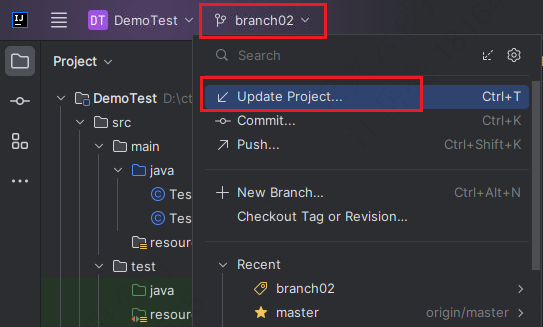
   
   如果没有设置默认追踪的上游分支，那么可以选择要拉取的上游分支，并合并到当前分支上，同时可以将这个上游分支设置为默认追踪的上游分支。
   
   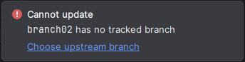
   
   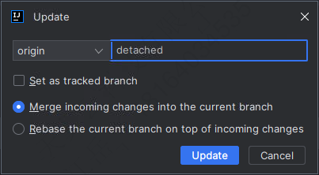
   
   上面的下拉箭头IDEA取名为update，本质是pull，但是只能更新设置有上游分支的本地分支，下面的虚线下拉箭头的功能是fetch all branch。
   
   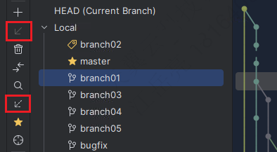
   
   省略本地分支名表示当前分支
   
   ```
   git pull <远程主机名> <远程分支名>
   ```


9. 设置默认追踪的上游分支，即为本地分支和远程分支设置一个绑定关系，之后在该分支上使用push 和 pull 就可以不带参数直接使用了

   ```
   git push --set-upstream <远程库名> <远程分支名>
   ```

   **为每个需要推送到远程仓库的本地分支都设置这个上游分支，以后就默认远程和本地的同名分支有这个绑定对应关系。在push或者pull都先checkout到这个分支上，然后将本地分支合并好之后再push到远程的同名分支上，或者在远程仓库上将分支合并好之后，再在本地仓库pull同名远程分支的更新，这就是最佳实践。**
   
   使用`git status`可以看到为本地分支设置的上游分支。


### 其它常用命令和操作

1. 查看历史操作，显示的是在哪个版本执行了什么操作

    ```
    git reflog
    ```

2. 查看当前分支的版本信息（显示当前版本的提交树），显示的是从第一个版本开始，经过哪些版本（版本中记录的是修改）可以到达当前版本。

    ```
    git log
    ```

    完整用法：`git log <head/分支名/版本号/fetch_head>` 显示从第一个版本开始，经过哪些版本可以到达指定的版本，其中head表示head指针，fetch_head表示远程分支的head指针

3. 打tag标记，标记一般是软件的里程碑版本，省略版本号表示在当前版本打上tag标记

   ```
   git tag <标记> <版本号>
   ```

4. 生成RSA密钥

   ```
   ssh-keygen -t rsa -C "jmoon531@foxmail.com"
   ```

5. 忽略文件

    .ignore文件，将.ignore文件配置到 ~/.gitconfig 文件中，注意不要使用反斜杠

   ```
   # Compiled class file
   
   *.class
   
   # Log file
   
   *.log
   
   # BlueJ files
   
   *.ctxt
   
   # Mobile Tools for Java (J2ME)
   
   .mtj.tmp/
   
   # Package Files #
   
   *.jar
   *.war
   *.nar
   *.ear
   *.zip
   *.tar.gz
   *.rar
   
   # virtual machine crash logs, see http://www.java.com/en/download/help/error_hotspot.xml
   
   hs_err_pid*
   
   # .ignore
   *.gitignore
   *.ignore
   
   # idea
   out
   .idea
   *.iml
   
   # maven
   target
   ```

   ```
   [core]
       excludesfile = C:/Users/Jmoon/git.ignore
   ```

### 常用命令最后总结

**提交：**

- commit、commit --amend

**分支操作：**

- branch（新建和删除分支）

**移动head指针：**

- checkout（切换到分支 和 切换到版本）

**合并版本：**

- merge
- rebase
- cherry-pick

**回退版本：**

- reset --hard
- revert

**贮藏工作区修改：**

- IDEA的shelf（搁置）功能

**远程：**

- push
- fetch
- pull

**其他：**

- log
- tag

## 二、Git关键理解

**head指针、分支、远程分支、标签(tag) 的理解？**

共同点：这些都可以理解为一个在某个版本上取的名字；或者理解成Java中的值类型（基本数据类型和引用），存的值就是版本号。通过这几个标记就能很方便完成git的分支操作，从而实现版本控制。因为分支、远程分支、标签(tag) 都是在某个版本上的名称，所以可以用这个用checkout命令让head指针移动该版本处。

区别：

1、head指针、分支 和 远程分支 是可以移动的，但是标签是不能移动的，也就是head指针、分支 和 远程分支中 存的版本号可以改变，但是标签中存的版本号不能改变。

2、head指针、分支 和 远程分支 的移动是有区别的，其中head指针可以随便移动（使用checkout进行移动）；分支需要与head指针结合才能被head指针带着移动（commit、reset、revert才能移动）；远程分支不能与head指针结合，只能在用push、fetch、pull命令才能移动。

3、head指针指向的版本就是我们工作区的内容，分支、远程分支、标签(tag) 都只是某个版本的别名（这个是最关键的理解）。

------

**git中每一次提交都会生成一个版本，版本记录的就是改变，版本永远都不会消失，也不能被删除。**接着git需要两种指针来实现版本控制，即**head指针**和**分支指针**，head指针只有一个，分支指针取决于你创建了多少分支，指针的实质是版本号，指向某个版本。head指针指向的位置就是你当前工作的位置，其它分支指针相当于是根据情景的需要生成的标记。

命令`git checkout <版本号>`是用来改变head指针指向的位置的，此时head指针处于分离状态；分支指针只有与head指针合体之后才能被改变位置，合体的命令是`git checkout <分支名>`（分支名就是分支指针的名字），合体之后使用命令`git reset`和`git merge`可以同时改变head指针和分支指针的位置，不能单独改变分支指针的位置，分支指针只能被head指针带着。

`git checkout c1`后，head指针处于分离状态：

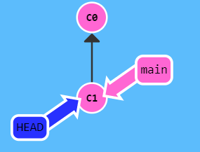

分离状态下也可以提交，但当你切换到其它版本后，还想在切换到这个版本，你就需要记住这个提交的版本号，所以git会在你切换版本时，要求你为提交创建一个分支，以便以后可以通过`git log`追踪到，毕竟分支名是人能记住的：

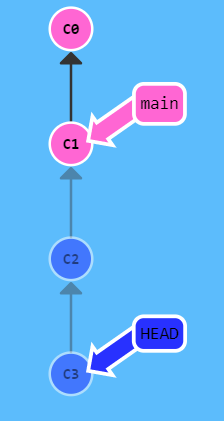

`git branch bugfix01`创建bugfix01分支：

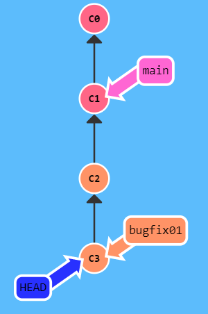

`git checkout main`之后main分支指针和head指针合体，也就是常说的切换到main分支上了：

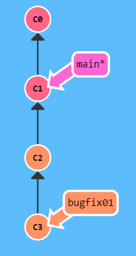

此时可以通过`git merge bugfix01`命令或者`git reset bugfix01`命令或者`git reset c3`命令来移动main分支指针，效果是一样，因为是在同一条路径上；如果两个分支有不在同一条路径上的节点（版本）就必须通过`git merge`命令来合并分支了，此时合并会再生成一个新的版本。

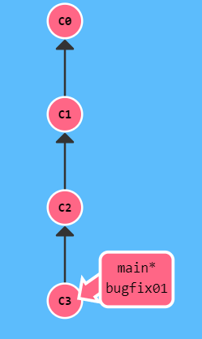

----------

远程分支是本地仓库对远程仓库分支的索引，是一些<u>无法移动的本地分支</u>（无法与head指针合体，于是无法像本地分支一样，可以随head指针一起移动），只有在 Git 进行网络交互时才会更新（push、pull、fetch）。远程分支也像是书签，提醒着你上次连接远程仓库时上面各分支的位置，用 `(远程仓库名)/(分支名)` 的形式表示。

`git fetch` 命令可以将远程仓库的分支拉取到本地仓库的远程分支上，省略分支名表示拉取所有远程仓库的分支：

```
git fetch <远程主机名> <分支名>
```

比如，执行`git fetch origin master`之后，会新增一些从远程仓库拉取下拉的版本，和一个你无法移动的 `origin/serverfix` 指针，然后由你决定是否将本地分支的内容与`origin/serverfix` 指针指向版本进行合并。

`git fetch origin serverfix` 之后的常用操作：

```
① 查看远程分支 或 查看所有分支：git branch -r / git branch -a
② 查看经过哪些版本可以到远程分支所指向的版本：git log origin/master
③ 查看当前master分支与远程分支的差异：git diff master origin/master
④ 因为fetch之后只是下载了一些超前于本地分支的版本，所以你可以把远程分支的内容合并到当前分支：git merge origin/master
④ 在该远程分支上创建一个新的分支并切换到该分支上：git checkout -b bugfix origin/master
```

**push成功的条件**是，首先 *远程分支origin/master*  要与 *远程仓库的master分支*  一致，然后 *本地的master分支* 要超前于 *origin/master*。

-----------

场景：远程分支和本地分支同步之后，然后在这个分支上进行了多次提交，这时想舍弃中间的所有提交，只保留最后一次的提交再推到远程分支上。

解决方案：
    ① 直接reset --mixed到远程分支所在的位置，此时工作区的内容还在，暂存区的内容已经清空，接着添加暂存区然后提交，最后push到远程仓库。
    ②把head指针移动到远程分支所在的位置，然后cherry-pick最后这个版本，接着把回到本地分支上，再reset到刚刚那个版本上就ok了。

如果想保留中间的某几个版本，用cherry-pick的话需要解决冲突，所以一般出现上面这种情况都是开发经验不足造成的吧，我觉得好的项目管理应该是这样的，拿不准的就新建分支，然后在这个分支上随便提交，最后回到主分支上cherry-pick，在主分支上最多出现反悔一次的提交，用amend可以解决。只要不把分支提交到远程仓库，你确实可以随心所欲的在本地仓库中提交，如果把分支推到远程仓库以后就没得反悔了。
git的提交会形成一棵树，每次提交就是这棵树上的一个节点，把分支看成是某次提交的一个标记，或者把分支看成从根到某次提交中间的每次提交的记录，都行，因为效果都是一样的。节点不会消失，但是不在分支上的节点可以说是消失了，因为如果你不记得它的版本号，他就等于石沉大海了。

`git log <分支名>`就是来追踪这个分支上的每一次提交的，所以merge的两个父节点都是这个分支上的节点，都可以追踪到，于是rebase要直观一点，它带来的是线性提交。

-----

**删除某个本地仓库的分支并不影响其他本地仓库的分支**

考虑这样一个情景，A本地仓库新建了branch01，然后推送到远程仓库，之后B本地仓库拉取branch01，然后在远程仓库中删除branch01，此时fetch或者pull并不会删除A、B本仓库的branch01分支，这很好理解，因为分支只是在某个版本处起的名字，在远程仓库中删除分支，其实也就是删除了标记，版本号并没有在仓库中消失，而fetch或和pull并不会删除本地仓库的分支，这两个命令只会拉取远程仓库分支新的提交，所以本地仓库的分支也就没有被删除。此时如果在A本地仓库删除branch01，也不会影响到B本地仓库，还是上面的原因，如果愿意，B本地仓库可以重新推送branch01到远程仓库，其实也就是只是把这个名字推送上去了，因为这些版本其实还在远程仓库中，这个情景真的很好地体现了git分布式仓库的特点。

## 三、Git提交规范

在使用 Git 进行版本控制时，遵循一定的提交规范是非常重要的。这不仅有助于团队成员之间的沟通，也便于后续的代码维护和问题追踪。以下是一些常见的 Git 提交信息前缀及其含义：

* feat: 表示新增了一个功能，如 feat: 新增登录接口。
* fix: 表示修复了一个 Bug，如 fix: 修复登录验证失败问题。
* docs: 仅仅修改了文档，比如 docs: 更新了安装文档。
* style: 对代码格式进行了调整，不影响代码逻辑，例如 style: 调整缩进。
* refactor: 代码重构，没有新增功能或修复 Bug，如 refactor: 优化了搜索算法。
* perf: 性能优化，提高性能的代码更改，例如 perf: 优化图片加载速度。
* test: 添加或修改测试代码，如 test: 添加用户模块单元测试。
* chore: 变更构建流程或辅助工具，如 chore: 更新依赖版本。
* revert: 撤销之前的提交，例如 revert: 撤销上一次提交。
* ci: 持续集成相关的改动，如 ci: 修改 CI 配置。

这些规范的提交信息有助于自动化工具（如发布工具或 Changelog 生成器）解析和处理提交记录。通过编写符合规范的提交消息，可以让团队和协作者更好地理解项目的变更历史和版本控制，从而提高代码维护效率和质量。
例如，当你完成一个新功能的开发时，你可以使用 feat 前缀来提交，这样团队成员就能清楚地知道这次提交增加了一个新功能。同样，如果你修复了一个 Bug，使用 fix 前缀可以明确地告知团队这次提交的目的是修复问题。
总的来说，遵循 Git 提交规范可以使项目更加模块化、易于维护和理解。它不仅提高了项目的可读性，还为团队协作提供了清晰的历史记录和指导。

