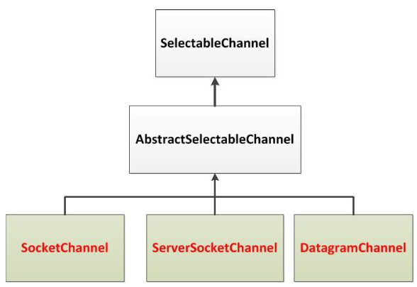
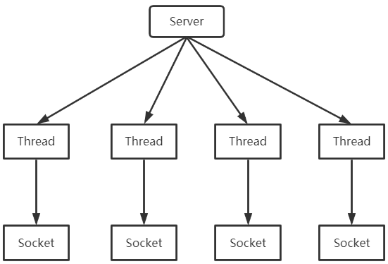
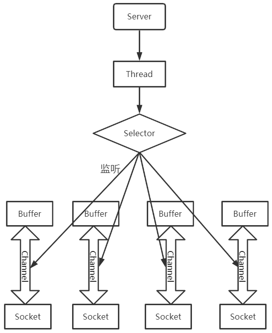

---

Created at: 2021-08-15
Last updated at: 2021-11-10


---

# 5-NIO之选择器与IO多路复用


多路复用，非阻塞式IO是针对网络IO而言的，选择器（Selector）就是多路复用的实现。Selector 可以同时监控多个 SelectableChannel 的 IO 状况，也就是说，利用 Selector 可使一个单独的线程管理多个 Channel。

抽象类java.nio.channels.SelectableChannel的三个主要实现类是SocketChannel、ServerSocketChannel、DatagramChannel，均用网络IO，所以Selector不能监视用于本地IO的FileChannel。

Selector的用法：

1. 创建 Selector ：通过调用 Selector.open() 方法创建一个 Selector

```
Selector selector = Selector.open();
```

2. 向选择器注册通道：SelectableChannel.register(Selector sel, int ops)，第二个参数 ops用于指定监听事件，可以选择的事件有：

* 读 : SelectionKey.OP\_READ  （1）
* 写 : SelectionKey.OP\_WRITE    （4）
* 连接 : SelectionKey.OP\_CONNECT （8）
* 接收 : SelectionKey.OP\_ACCEPT  （16）

若注册时不止监听一个事件，则可以使用“或”操作符连接，如：SelectionKey.OP\_READ|SelectionKey.OP\_WRITE

下面以服务端接收来自多个客户端请求为例，在BIO模式下，每一个客户端的连接都会创建新的线程来处理，客户端与服务端以同步阻塞式IO的方式进行通信，如图所示：


而在NIO模式下，虽然服务器端只有主线程这么一个线程，但是selector可以同时监视多个Channel的状态，达到同时与多个客户端连接的效果，如下图所示：


服务端：
```
public class Server {
    public static void main(String[] args) throws IOException {
        `//1. 获取选择器`
 `Selector selector = Selector.open();`
        `//2. 准备缓冲区，缓冲区复用了，并没有一个socket一个对应的缓冲区，因为是单线程，所以是顺序的处理每个socket中的数据`
 `ByteBuffer buf = ByteBuffer.allocate(1024);`
        //3. 获取通道
        ServerSocketChannel ssChannel = ServerSocketChannel.open();
        //4. 切换非阻塞模式
        ssChannel.configureBlocking(false);
        //5. 绑定连接
        ssChannel.bind(new InetSocketAddress(9999));
        `//6. 将通道注册到选择器上, 并且指定“监听接收事件”`
 `ssChannel.register(selector, SelectionKey.OP_ACCEPT);`
        `//7. select是阻塞的，一旦有Channel的事件准备好了就返回`
 `while (selector.select() > 0) {`
            `//8. 获取当前选择器中所有注册的“选择键(已就绪的监听事件)”，`
 `// 因为这里返回的是所有已经准备就绪的事件，所以下面的循环遍历的所有事件都是有数据的`
            Iterator<SelectionKey> it = selector.selectedKeys().iterator();
            while (it.hasNext()) {
                //9. 获取“就绪”的事件
                SelectionKey sk = it.next();
                //10. 如果是ACCEPT事件
                if (sk.isAcceptable()) {
                    //11. 获取客户端连接
                    SocketChannel sChannel = ssChannel.accept();
                    `//12. 切换非阻塞模式`
 `sChannel.configureBlocking(false);`
                    `//13. 将该通道注册到选择器上`
 `sChannel.register(selector, SelectionKey.OP_READ);`
                } else if (sk.isReadable()) { //14. 如果是READ事件
                    //15. 获取当前选择器上“读就绪”状态的通道
                    SocketChannel sChannel = (SocketChannel) sk.channel();
                    `//16. 读取数据，不会读取不到数据，所以这里是不会阻塞的`
                    int len = 0;
                    `// BIO在读取套接字文件中的数据时，会阻塞一直等待套接字文件中数据的到来，也就是说在BIO方式看来套接字是一个没有结束标志的文件，`
 `// 而从通道中读取就不同的，当本次事件里的数据读完了就会返回，类似于从文件中读`
 `while ((len = sChannel.read(buf)) > 0) {`
                        buf.flip();
                        System.out.println(new String(buf.array(), 0, len));
                        buf.clear();
                    }
                }
                //17. 取消选择键 SelectionKey
                it.remove();
            }
        }
    }
}
```
selector.select()会阻塞，只要有一个Channel的事件准备好了，selector.select()就会返回，再进入到while循环里面通过selector.selectedKeys().iterator()拿到所有已经准备好的事件，里面的操作都是同步的，并且不会阻塞，同步的意思是一个事件接着一个事件的处理，不会阻塞是因为处理的事件都是已经准备好有数据的。
在BIO模式下，读一行就是读一行，如果没有一行就阻塞的等一行数据到来，读完一行再返回；而在NIO模式下，Selector只有当数据准备好了才会通知，所以读的时候肯定是有数据的。总结一句非阻塞主要在于Selector。

客户端：
```
public class Client {
   public static void main(String[] args) throws Exception {
      //1. 获取通道
      SocketChannel sChannel = SocketChannel.open(new InetSocketAddress("127.0.0.1", 9999));
      //2. 切换非阻塞模式
      sChannel.configureBlocking(false);
      //3. 分配指定大小的缓冲区
      ByteBuffer buf = ByteBuffer.allocate(1024);
      //4. 发送数据给服务端
      Scanner scan = new Scanner(System.in);
      while(scan.hasNext()){
         String str = scan.nextLine();
         buf.put((new SimpleDateFormat("yyyy/MM/dd HH:mm:ss").format(System.currentTimeMillis()) + "\n" + str).getBytes());
         buf.flip();
         sChannel.write(buf);
         buf.clear();
      }
      //5. 关闭通道
      sChannel.close();
   }
}
```
即使服务端只有一个线程，也可以同时于多个客户端建立连接发送数据，这就IO多路复用的强大之处。但正因为是在单线程下顺序的处理每个准备好了的事件，所以每个事件不应该太过于繁重，不然下一个事件就会等很久，导致响应慢。

