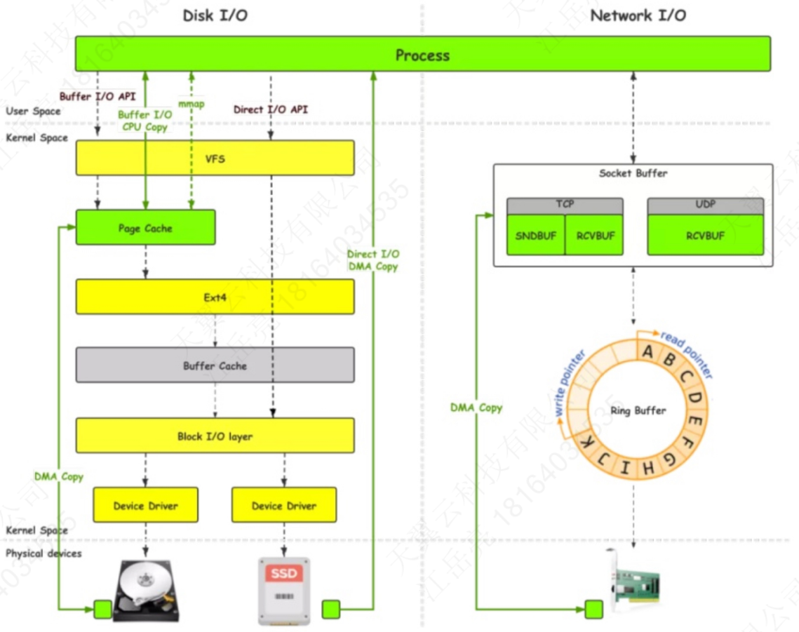
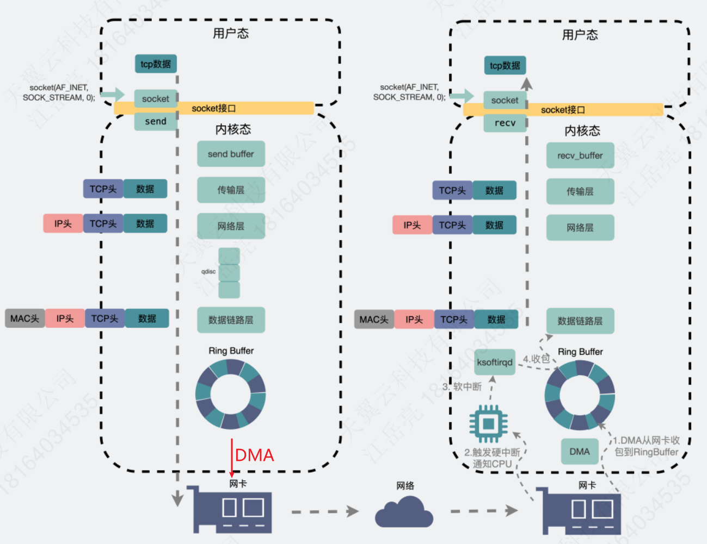

---

Created at: 2024-09-11
Last updated at: 2025-03-06
Source URL: https://www.cnblogs.com/longchang/p/11162813.html


---

# IO


IO的一些基本的事实：
1、常规情况下，无论是磁盘IO还是网络IO，数据经过内核空间，比如 Input 的时候数据需要先到内核空间（Kernel Space）然后再拷贝到用户空间（User Space），Output的时候数据需要先从用户空间拷贝到内核空间。
2、IO的最后一步是DMA完成的，不需要CPU参与，最后一步是指把数据 从内存搬到IO设备的缓冲区（该缓冲区在IO设备中） 或者 从IO设备缓冲区中搬到内存。
**总结：常规的，无论是磁盘IO还是网络IO，数据需要先经过内核空间，比如 Input 的时候数据先经过DMA从IO设备搬到内核空间（Kernel Space）然后再经过CPU拷贝到用户空间（User Space），Output的时候数据先经过CPU从用户空间拷贝到内核空间然后再经过DMA搬到IO设备中。**




**前面说的5种IO模型从用户线程的视角出发，是用户线程与操作系统内核交互的方式，这里说的磁盘IO方式和网络IO方式是操作系统内核把数据从外设搬到内存的过程，两者不冲突，是独立的两块内容，也是相互搭配使用的关系，比如IO多路复用通常都是用于网络IO，但其实也可以与磁盘IO搭配使用。**

以上这些IO模型理论上是通用的，不挑文件类型，不管是磁盘文件还是Socket文件，都可以用，但是不同类型的文件的差异比较大，比如Socket文件有两个特点：一是数据并不是时刻被准备好了，二是数据没有尽头；上述任何模型都可以用于Socket文件的IO；但是磁盘文件的特点正好相反，磁盘文件总是大小已知并可读，所以同步非阻塞IO、IO多路复用并不适合磁盘文件。
```
文心一言：
问：linux的IO多路复用系统调用select可以用于磁盘文件IO吗？
答：在Linux系统中，select系统调用主要用于监视多个文件描述符（file descriptors）的状态变化，包括套接字（sockets）、管道（pipes）以及终端设备等，以便在这些文件描述符上执行IO操作。尽管select的设计初衷是处理网络IO和类似的基于流的IO操作，它确实可以用于监视任何类型的文件描述符的状态变化，包括那些与磁盘文件相关联的文件描述符。
然而，将select用于磁盘文件IO时，需要明确一点：select监视的是文件描述符的“可读”、“可写”和“异常”条件，而不是直接用于监控磁盘文件的读写进度或完成状态。这意味着，对于磁盘文件，select能告诉你的只是某个时刻文件描述符是否准备好进行非阻塞的读或写操作，而不是文件IO操作本身何时完成。
对于磁盘文件来说，因为文件通常被缓存到内存中，所以“可读”和“可写”条件大多数情况下都是立即可用的，这可能会让select的使用在磁盘文件IO上看起来不那么有用。实际上，对于磁盘IO，更常用的方法是使用更底层的接口（如直接IO或异步IO）或更高级的抽象（如Linux的AIO接口或使用线程/进程池来处理IO密集型任务），这些方法可能更适合处理磁盘IO的复杂性和性能需求。
总结来说，虽然select系统调用在技术上可以用于磁盘文件IO，但其主要应用场景仍然是网络IO和类似的基于流的IO操作。对于磁盘文件IO，可能需要考虑其他更适合的方法或工具。
```
代码验证，可以成功读磁盘文件：
```
#include <stdio.h>  
#include <stdlib.h>  
#include <unistd.h>  
#include <fcntl.h>  
#include <sys/select.h>  
#include <sys/time.h>  
#include <errno.h>  
#include <string.h>  
int main() {
    int fd;  
    fd_set readfds;  
    struct timeval tv;  
    int retval;  
    // 打开一个文件用于读取  
    fd = open("example.txt", O_RDONLY);  
    if (fd == -1) {  
        perror("open");  
        exit(EXIT_FAILURE);  
    }  
    // 初始化文件描述符集合  
    FD_ZERO(&readfds);  
    FD_SET(fd, &readfds);  
    // 设置超时时间（这里设置为1秒）  
    tv.tv_sec = 1;  
    tv.tv_usec = 0;  
    // 使用select监视文件描述符  
    retval = select(fd + 1, &readfds, NULL, NULL, &tv);  
    if (retval == -1) {  
        perror("select");  
        close(fd);  
        exit(EXIT_FAILURE);  
    } else if (retval == 0) {  
        printf("No data within one second.\n");  
    } else {  
        // 如果返回值大于0，说明有文件描述符准备好了  
        // 但对于磁盘文件，这几乎总是会发生  
        if (FD_ISSET(fd, &readfds)) {  
            printf("File descriptor %d is ready to read.\n", fd);  
            // 这里可以添加读取文件的代码  
            // 但由于文件通常已经打开并准备好读取，所以这一步可能看起来是多余的  
            //读fd表示的文件并输出到标准输出
            char buffer[1024];
            int bytes_read = read(fd, buffer, sizeof(buffer));
            if (bytes_read > 0) {
                buffer[bytes_read] = '\0';
                printf("%s", buffer);
            }
        } else {
            printf("Unexpected condition.\n");
            close(fd);
            exit(EXIT_FAILURE);
        }  
    }  
    // 关闭文件描述符  
    close(fd);  
    return 0;  
}
```
从AI的回答，以及select系统调用的定义，select不仅可以用于监视文件描述符的“可读”状态，还可以监视“可写”状态。所以上述IO模型不仅能用于I，还能用于O，只不过像IO多路复用绝大多数情况都在用于I。总的来说，同步阻塞IO 和 异步IO 在　磁盘I和O 和 网络I和O 都常用，但是同步非阻塞IO 和 IO多路复用 多用于 网络I，作为服务端。
```
int select(int nfds, fd_set *_Nullable restrict readfds,
                  fd_set *_Nullable restrict writefds,
                  fd_set *_Nullable restrict exceptfds,
                  struct timeval *_Nullable restrict timeout);
```
```
文心一言：
问：select监视文件描述符的“可写”状态用于什么场景?
答：select 系统调用监视文件描述符的“可写”状态主要用于那些需要确保在写入数据之前，目标文件描述符（如套接字、管道或文件）处于可以非阻塞写入的状态的场景。然而，对于不同类型的文件描述符，这种“可写”状态的监控具有不同的实际意义和应用场景。
套接字（Sockets）
在套接字编程中，select 的“可写”状态监视尤为重要。因为网络套接字在写入数据时可能会因为网络拥塞、对方缓冲区满等原因而阻塞。通过 select 监视套接字的可写状态，应用程序可以在尝试写入之前知道套接字是否准备好接收数据，从而避免不必要的阻塞或选择更合适的时机发送数据。
管道（Pipes）和 FIFOs
管道和 FIFOs 是进程间通信的一种机制。当写入端尝试向管道或 FIFO 写入数据时，如果读取端没有足够快地读取数据，写入端可能会因为管道缓冲区满而阻塞。使用 select 监视管道或 FIFO 的可写状态可以帮助写入端在尝试写入之前确认管道或 FIFO 有足够的空间，从而避免阻塞。
磁盘文件
对于磁盘文件，select 的“可写”状态监视通常不是必需的，因为现代操作系统通常使用缓存机制来管理磁盘文件的读写操作。这意味着，当应用程序向磁盘文件写入数据时，数据首先被写入到内存中的缓存中，而不是直接写入到磁盘上。因此，磁盘文件的“可写”状态在大多数情况下都是立即可用的，除非磁盘空间不足或文件系统存在其他限制。
然而，在某些特殊情况下，如需要确保数据已经安全地写入到磁盘上（而不仅仅是缓存中）时，应用程序可能会使用 fsync 或 fdatasync 等系统调用来强制将缓存中的数据写入磁盘。但这种情况下，select 并不是用来监视磁盘文件的可写状态的正确工具。
总结
因此，select 监视文件描述符的“可写”状态主要用于网络套接字和管道等类型的文件描述符，以确保在写入数据之前这些文件描述符处于可以非阻塞写入的状态。对于磁盘文件，由于操作系统的缓存机制，通常不需要使用 select 来监视其可写状态。
```

常规情况下，磁盘IO数据需要在内核空间和用户空间之间进行一次拷贝，网络IO数据需要经过内核空间的拆包或者封包的过程（非常规地，使用原始套接字可以直接拿到经过网卡解析后的原始数据包）。
非常规地，针对磁盘IO，可以在考虑减少一次从内核空间到用户空间的拷贝，于是就出现了 mmap 和 直接IO，所以磁盘IO一共有三种方式：标准I/O、直接 I/O、mmap。
1、直接IO
直接IO是一个系统调用，直接 I/O 绕过了内核缓存，数据直接在用户空间和磁盘之间传输，减少了额外的内存拷贝操作，多与异步IO方式结合使用（早期Linux的异步IO只支持直接IO [原生的 Linux 异步文件操作，io_uring 尝鲜体验 - 我大EOI前端 - SegmentFault 思否](https://segmentfault.com/a/1190000019300089)）。
直接IO最常见就是应用于数据库系统，数据库自己更加了解该如何缓存自己的数据以及刷写脏页的时机，所以此时操作系统的pagecache反倒添乱降低了性能，所以数据库都使用直接IO。

2、mmap
mmap直接将文件映射到虚拟地址空间，用户可以直接以内存的方式访问文件，而不需要显示地调用读写函数，和用户程序访问其他数据一样，数据并不是一定被加载到内存了，当访问的数据不在内存的时候就会发生缺页中断（page fault），然后启动磁盘IO从磁盘把数据读到内存，读到内存之后，在虚拟地址空间中，用户空间和内核空间的Pagecache的虚拟地址都会映射到同一片物理内存，所以mmap避免了标准IO的数据拷贝，由于内核空间pagecache也映射了，所以mmap也有预读（预读的页内核空间pagecache映射了，但是用户空间没有映射，后面需要通过缺页中断完成映射），并且也会被自动刷脏（真正达到了修改内存就像修改磁盘上的文件一样）。

mmap直接将文件映射到虚拟地址空间，用户可以直接以内存的方式访问文件，而不需要显示地调用读写函数，当访问的数据不在内存的时候就会发生缺页中断（page fault），缺页中断程序首先会检查PageCache里面有没有，如果有就直接更新页表指向PageCache那段物理内存，如果没有就指挥DMA把数据从磁盘读到PageCache，然后再更新页表指向PageCache指向的这段物理内存，所以mmap避免了标准IO的数据拷贝，并且还具备了PageCache预读和刷脏的能力。

mmap和直接IO相对标准IO都减少了数据拷贝；mmap和标准IO相比于直接IO不同之处在于，直接IO绕过了pagecache，而mmap和标准IO都利用了pagecache；mmap相比于直接IO和标准IO的不同之处在于，mmap依靠缺页中断从磁盘中读数据，而直接IO和标准IO依靠系统调用从磁盘中读数据，不过归根结底都是磁盘IO，依靠DMA将数据从磁盘搬到内存，只不过走的路径不同罢了，所以他们两者的效率的比较就是**系统调用和额外的复制操作的开销**和**页错误的开销**之间的比较，哪一个开销少就是哪一个表现更好。
```
文心一言：
问：对于连续多页的缺页，一次缺页中断能搞定吗？
答：在连续多页缺页的情况下，即程序连续尝试访问多个不在物理内存中的虚拟内存页面时，每个未映射的页面访问都会触发一次独立的缺页中断。操作系统会逐一处理这些中断，每次处理一个缺页，直到所有缺页都被加载到物理内存中。
这种现象被称为“页面抖动”（Page Thrashing），它会导致大量的 I/O 操作和 CPU 时间消耗在页面的加载和置换上，严重影响系统性能。为了避免页面抖动，操作系统和应用程序通常会采用预取策略，预测并提前加载可能需要的页面，以减少缺页中断的频率。此外，现代操作系统还采用了各种优化技术，如页面缓存、页面预读和页面合并，以提高 I/O 效率和减少缺页中断的影响。
```

mmap是不是全面优于标准IO？
从上面AI的回答来看，虽然mmap和标准IO都有利用pagecache的预读机制，但是mmap每读一次新页都是一次缺页中断，虽然如果页被预读了可以不真正进行磁盘IO，但是缺页中断却是必须的，而标准IO却不同，标注IO可以一次系统调用连续读多页，所以说mmap和标准IO的效率比较就是**系统调用和额外的复制操作的开销**和**页错误的开销**之间的比较。从这点来看，mmap适合大文件的随机读，标准IO适合大文件的顺序读和读很多零碎的小文件。
mmap，pagecache预读的多页，用户空间的页表应该也映射了才对，这样效率才高，不至于每读一页都是一次缺页中断。这样的话，mmap缺页中断的次数全依赖pagecache的预读策略了，可能在某些情况下ｍｍap缺页中断的开销仍然比系统调用和额外的复制操作的开销要大。

拓展：malloc也使用了mmap。mmap按照映射的类型主要可以分为文件映射和匿名映射，在内存中分配空间就是匿名映射。
mmap参考:
<https://www.zhihu.com/question/522132580/answer/2524710759>
<https://www.zhihu.com/question/522132580/answer/2624604520>

磁盘IO三种方式的比较：
1.直接IO：虽然直接IO相比于标准IO减少了数据拷贝，但是它也失去了pagecache的优点，即预读与合并写，所以适合有能力管理预读和刷脏的应用程序，比如数据库，或者是针对大文件的大规模顺序读写。
2.mmap：利用了pagecache的优势，同时也避免数据拷贝的劣势，看似完全碾压标准IO，但是mmap每次读新页都是一次缺页中断，积少成多会比标准IO更差，所以mmap适合大文件的随机读写，不适合大文件的顺序读写和读写很多零碎的小文件。
3.标准IO：最简单通用的IO方式，pagecache带来的优势比劣势可观，各类文件的读写性能都不会太差。

零拷贝 zero-copy（sendfile）
下面是sendfile系统调用
```
ssize_t sendfile(int out_fd, int in_fd, off_t *_Nullable offset,
                        size_t count);
```
关于文件描述符in\_fd和out\_fd的解释：
```
The in_fd argument must correspond to a file which supports
       mmap(2)-like operations (i.e., it cannot be a socket).  Except
       since Linux 5.12 and if out_fd is a pipe, in which case
       sendfile() desugars to a splice(2) and its restrictions apply.

       Before Linux 2.6.33, out_fd must refer to a socket.  Since Linux
       2.6.33 it can be any file.  If it's seekable, then sendfile()
       changes the file offset appropriately.
```
in\_fd必须是支持mmap的文件，不能是socket文件，在Linux 2.6.33之前，out\_fd必须是socket，但是Linux 2.6.33之后可以是任意文件。所以零拷贝不限于从磁盘读往网络写的场景，也可以是从磁盘读往磁盘写。使用sendfile从磁盘读往磁盘写就纯粹是文件复制了，使用直接IO读写也可以达到避免数据拷贝的效果（不过多了一次系统调用的开销），并且直接IO还可以修改文件内容，所以sendfile还是多用于从磁盘读往网络写的场景，比使用直接IO从磁盘读网络IO向网络写性能更高，因为sendfile会直接把pagecache映射到socket缓冲区，而直接IO需要将用户空间的数据往内核的socket缓冲区中复制，并且sendfile只有一次系统调用。
java nio中的transferTo()正是使用了sendfile系统调用。

