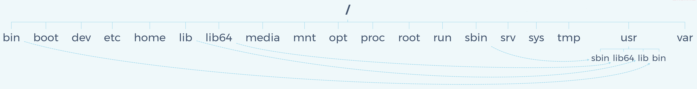

---

Created at: 2021-11-04
Last updated at: 2021-11-10
Source URL: https://juejin.cn/post/6844904050048106504

---

# 1-目录结构

分区设置：boot、swap、根分区

根分区目录结构：

/bin：
binaries，这个目录存放着经常使用的命令。

/boot：
存放的是启动 Linux 时使用的一些核心文件，包括一些连接文件以及镜像文件。

/dev ：
device，该目录下存放的是 Linux 的外部设备，在 Linux 中访问设备的方式和访问文件的方式是相同的。

/etc：
etcetera(等等)，这个目录用来存放所有的系统管理所需要的配置文件和子目录。

/home：
用户的主目录，在 Linux 中，每个用户都有一个自己的目录，该目录名是以用户的账号命名。

/lib：
library，这个目录里存放着系统最基本的动态连接共享库，其作用类似于 Windows 里的 DLL 文件，几乎所有的应用程序都需要用到这些共享库。

/lost+found：
这个目录一般情况下是空的，当系统非法关机后，这里就存放了一些文件。

/media：
linux 系统会自动识别一些设备，例如U盘、光驱等等，当识别后，Linux 会把识别的设备挂载到这个目录下。

/mnt：
mount，系统提供该目录是为了让用户临时挂载别的文件系统的，我们可以将光驱挂载在 /mnt/ 上，然后进入该目录就可以查看光驱里的内容了。

/opt：
optional，这是给主机额外安装软件所摆放的目录，比如你安装一个ORACLE数据库则就可以放到这个目录下，默认是空的。

/proc：
process，/proc 是一个伪文件系统，这个目录的内容不在硬盘上而是在内存里，里面的一系列特殊文件存储的是当前系统中进程和线程运行的状态等信息，比如查看进程状态：cat /proc/<pid>/status，注意，需要先通过ps命令查到某个进程的pid。

/root：
该目录为系统管理员(也称作超级权限者)的用户主目录。

/run：
是一个临时文件系统，存储系统启动以来的信息。当系统重启时，这个目录下的文件应该被删掉或清除，如果你的系统上有 /var/run 目录，应该让它指向 run。

/sbin：
s 是 Super User 的意思，所以sbin是 Superuser Binaries 的缩写，这里存放的是系统管理员使用的系统管理程序。

/selinux：
这个目录是 Redhat/CentOS 所特有的目录，Selinux 是一个安全机制，类似于 windows 的防火墙，但是这套机制比较复杂，这个目录就是存放selinux相关的文件的。

/srv：
services，该目录存放一些服务启动之后需要提取的数据。

/sys：
system，这是 Linux2.6 内核的一个很大的变化，该目录下安装了 2.6 内核中新出现的一个文件系统 sysfs 。sysfs 文件系统集成了下面3种文件系统的信息：针对进程信息的 proc 文件系统、针对设备的 devfs 文件系统以及针对伪终端的 devpts 文件系统。

/tmp：
temporary，这个目录是用来存放一些临时文件的。

/usr：
unix system resources，这是一个非常重要的目录，类似于 windows 下的 program files 目录。
/usr/bin：系统用户使用的应用程序。
/usr/sbin：超级用户使用的比较高级的管理程序和系统守护程序。
/usr/src：内核源代码默认的放置目录。

/var：
variable，这个目录中存放着在不断扩充着的东西，我们习惯将那些经常被修改的目录放在这个目录下，包括各种日志文件。

