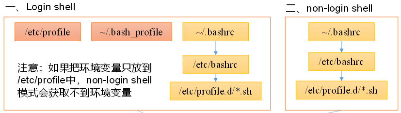

---

Created at: 2021-11-06
Last updated at: 2021-11-11
Source URL: https://www.zhihu.com/search?type=content&q=Java%E8%83%BD%E5%88%9B%E5%BB%BA%E8%BF%9B%E7%A8%8B%E5%90%97


---

# 11-shell变量


**变量**
定义变量，注意等号两边不能有空格
```
a=2
```
使用变量需要在变量名前加上$，还可以加上{}，加花括号是可选的
```
echo $a
echo ${a}=2
```

在bash中，变量的值都是字符串类型（所以无法直接进行数值运算），所以字符串可以不用引号，但是变量的值如果有空格，需要使用双引号或单引号括起来
```
#!/bin/bash
a=100
echo '$a'
echo "$a"
echo "'$a'"
echo '"$a"'
```
```
$a
100
'100'
"$a
```
总结，单引号和双引号的区别：

* 单引号里的任何字符都会原样输出，转义字符或者是取变量值都不行
* 双引号里可以取变量值，也可以有转义字符，注意双引号嵌套单引号，单引号只是双引号里面的普通字符

**反引号**
反引号会把反引号中的内容作为命令执行一遍，然后把命令的输出结果作为反引号最终的内容，$() 与 反引号 的作用一样。
比如：
```
# date
2021年 11月 06日 星期六 07:09:10 EDT
```
反引号把date的输出结果作为反引号最终的内容，然后交给shell作为命令执行：
```
# `date`
-bash: 2021年: 未找到命令
```
再比如，$\[1+1\]计算得2，然后反引号把2作为命令执行，$\[1+1\]的计算并不是一条命令
```
# echo `$[1+1]`
-bash: 2: 未找到命令
```
再比如，反引号把函数fun的输出结果作为反引号最终的内容，然后赋值给了变量a
```
# fun(){
> echo 123
> echo 456
> return 111
> }
#a=`fun`
# echo $a
123 456
```

**只读变量**
使用 readonly 命令可以将变量定义为只读变量，只读变量的值不能被改变
```
readonly b=3
```

**删除变量**
使用 unset 命令可以删除变量，注意readonly变量不能被unset，除非退出当前shell进程才能销毁只读变量
```
unset a
```

**数组**
```
数组名=(值1 值2 ... 值n)
```
例如：
```
array_name=(value0 value1 value2 value3)
```
还可以单独定义数组的各个分量：
```
array_name[0]=value0
array_name[1]=value1
```
读取数组元素：
```
echo $array_name[1]
```
```
echo ${array_name[@]}
```
使用 @ 符号可以获取数组中的所有元素，必须加上{}：
```
echo ${array_name[@]}
```

**变量的种类**
**本地变量**：直接定义的变量就是本地变量，只在当前shell进程中有效。
**环境变量**：对当前shell及子shell都有效的变量，需要使用export定义，环境变量一般都大写，需要注意的是子shell进程是将环境变量拷贝了一份副本到自己的进程中了，所以在子shell中修改环境变量的值并不会改变父shell中环境变量的值。
```
export XX=abc
```
我们知道，打开一个控制台其实就是启动了一个可以和用户进行交互的shell进程，使用bash或sh命令执行一个shell脚本，其实是启动了另外一个shell进程来执行脚本中命令，启动的另外一个shell就是当前shell的子进程，在当前shell中定义的环境变量可以在子进程中使用，在子shell中修改该环境变量的值并不会影响到父shell，因为子shell相当于是把环境变量在自己的地址空间中复制了一份，为了提高性能，Linux在实现时其实并没有真正复制，而是采用写时复制的策略，写时复制的具体实现是，在创建子进程时，只把页表复制一份，也就是两个进程的分页指向了相同的物理内存，当子进程修改变量的值时，Linux会先把变量复制一份，然后修改再修改变量的值，最后再修改子进程页表的指向。
用户在/etc/profile等文件中配置的环境变量和这里说的环境变量是一回事，每次启动一个新shell时都会先加载这些文件，如/etc/profile，/etc/profile.d/\*.sh，~/.bashrc，~/.bash\_profile，所以在这里配置的环境变量是全局的。
bash的运行模式可分为login shell和non-login shell。通过终端登录的是一个login shell，通过ssh登录的是一个non-login shell。这两种shell的主要区别在于，它们启动时会加载不同的配置文件，login shell启动时会加载/etc/profile，~/.bash\_profile，~/.bashrc，non-login shell启动时会加载~/.bashrc。
而在加载~/.bashrc（实际是~/.bashrc中加载的/etc/bashrc）或 /etc/profile 时，都会执行如下代码片段：
```
for i in /etc/profile.d/*.sh /etc/profile.d/sh.local ; do
    if [ -r "$i" ]; then
        if [ "${-#*i}" != "$-" ]; then
            . "$i"
        else
            . "$i" >/dev/null
        fi
    fi
done
```
也就是说，不管是login shell还是non-login shell，启动时都会加载/etc/profile.d/\*.sh中配置的环境变量，所以建议用户直接在/etc/profile.d目录下新建一个.sh文件专门存放用户自己的所需要定义的环境变量。
常用的系统预定义的环境变量有：$HOME、$PWD、$SHELL、$USER、$PATH、$HOSTNAME

**特殊变量**
**$n：**$0代表该脚本名称，其它$n都是参数，$1-$9代表第一到第九个参数，第十以上的参数需要使用花括号${10}
**$#**：参数个数
**$?**：最后一条命令的退出状态，0表示没有错误，其他任何值表明有错误；如果最后一条命令执行的是一个函数，那么$?表示是函数退出状态，函数return的返回值就是函数的退出状态，如果函数没有使用return返回，那么会将函数的最后一条命令的退出状态作为函数的退出状态，return后跟的数值的范围是0-255
**$\***：这个变量包含所有传递的参数，用双引号括起来的时候，会以"$1 $2 … $n"的形式输出所有参数
**$@**：与$\*一样，这个变量包含所有传递的参数，但是用双引号括起来的时候，会以"$1" "$2" … "$n" 的形式输出所有参数
参数可以是传递给shell脚本的参数（像给main函数传参一样），也可以是传递给函数的参数。
$n、$#、$?测试：
```
#!/bin/bash
function func1(){
  echo '$2' = $2
  return 7
}
function func2(){
  echo '$3' = $3
  echo '$#' = $#
}
func1 1 2 3 4
echo '$?' = $?
func2 1 2 3 4
```
输出：
```
$2 = 2
$? = 7
$3 = 3
$# = 4
```
$\*和$@测试：
```
#!/bin/bash
function func1(){
  echo $*
  for v in "$*"
  do
    echo $v
  done
}
function func2(){
  echo $@
  for v in "$@"
  do
   echo $v
  done
}
func1 1 2 3
func2 1 2 3
```
输出：
```
1 2 3
1 2 3
1 2 3
1
2
3
```

