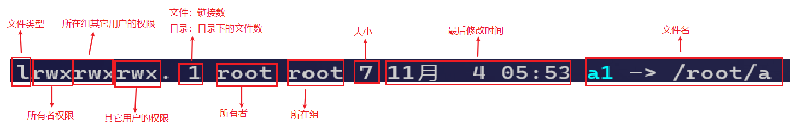

---

Created at: 2021-11-04
Last updated at: 2021-11-07
Source URL: https://github.com/CyC2018/CS-Notes/blob/master/notes/Linux.md#%E4%B9%9D%E6%AD%A3%E5%88%99%E8%A1%A8%E8%BE%BE%E5%BC%8F


---

# 4-文件管理


**文件管理**
ls，list，查看当前目录下的文件和目录
查看所有
```
ls -a
```
递归的查看所有子目录中文件和目录
```
ls -R
```
查看详细信息
```
ls -l  简写：ll
```
友好地显示文件大小
```
ls -lh
```
统计目录下有多少个文件（不包含目录）
```
ll 目录 | grep ^- | wc -l
```
统计目录及其子目录下有多少个文件
```
ll -R 目录 | grep ^- | wc -l
```
以树状的形式展现目录，默认没有tree命令，要先安装
```
yum install tree
```
```
tree 目录
```

wc，word count，统计文件的Byte数、字数、或是列数，若不指定文件名称、或是给的文件名为"-"，wc指令会从标准输入设备读取数据

* \-c或--bytes或--chars       显示Bytes数
* \-l或--lines                        显示行数
* \-w或--words                    显示字数

pwd，present work directory

cd，change directory
返回家目录
```
cd ~
```
返回之前的目录
```
cd -
```

mkdir，make directory
创建多级目录
```
mkdir -p
```

rmdir，remove directory，删除空目录

rm，remove，删除文件和目录
强制递归删除该目录或者文件。-r，recursive，递归；-f，force，强制；
```
rm -rf
```

cp，copy，复制，如果源文件有两个以上，则目的文件一定要是目录才行
```
cp 源文件或者目录 目标文件或者目录
```
\-r 递归复制整个目录
\\cp 强制覆盖不提示

mv，move，重命名或移动 文件和目录，在同一目录就是重命名，不在同一目录就是移动

cat，catenate
\-n显示行号
```
cat xx.txt | more
```

tac，cat 的反向操作，从最后一行开始打印

more，more是基于VI编辑器的文本过滤器，按回车一行一行的看，按空格一页一页的翻
```
more xxx.txt
```

less，less和more一样，也是用来一页一页的查看文件的内容，但是比more多了一个向前翻页的功能，less并不是将整个文件一次加载到内存，而是根据显示的情况加载

echo
```
echo $PATH
echo $HOSTNAME
```

head，查看文件前几行
\-n，指定行数，head和tail不指定行数都是默认看10行
```
head -n 5 xxx.txt
```

tail ，查看文件最后几行
实时监控文件
```
tail -f
```

od，Octal Dump，以八进制、十进制、十六进制显示文件内容

ln，link
软连接（符号连接）
```
ln -s [源文件或目录] [目标]
```
硬链接
```
ln [源文件或目录] [目标]
```


文件类型：

* \- 表示普通文件
* l 表示链接
* d 表示目录
* c 表示字符设备，如鼠标、键盘
* b 表示块设备

rwx作用到文件：

* r 表示可读
* w 表示可写，但是不一定能删除，除非该用户对文件所在的目录具有写权限
* x 表示可执行

rwx作用到目录：

* r 表示可读
* w 表示修改
* x 表示可进入到目录

chown，修改文件的所有者，-R 使改变对目录下的所有文件生效
```
chown 用户名 文件名
```
chgrp，修改文件的所在组，-R 使改变对目录下的所有文件生效
```
chgrp 组名 文件名
```
也可以直接使用chown修改文件的所有者和组，文件的所有者可以不在所属组
```
chown 用户:用户组 多个文件或目录
```
chmod，修改文件的权限
```
chmod 777 文件名
```
u：所有者，g：所在组，o：其它人，a：所有人
```
chmod u=rwx,g=rx,o=x 文件名
```
给其它人加上可执行的权限
```
chmod o+x 文件名
```
给所在组去掉写权限
```
chmod g-x 文件名
```
给所有人可执行的权限
```
chmod a+x 文件名
```
或者省略a也是给所有人可执行的权限
```
chmod +x 文件名
```

touch，更新文件时间 或 建立新文件
```
touch [选项] filename
```
选项：

* \-a   更新 atime
* \-c   更新 ctime，若该文件不存在则不建立新文件
* \-m  更新 mtime
* \-d   后面可以接更新日期而不使用当前日期，也可以使用 --date="日期或时间"
* \-t    后面可以接更新时间而不使用当前时间，格式为\[YYYYMMDDhhmm\]

**压缩和解压**
gzip/gunzip
压缩
```
gzip a
```
解压
```
gunzip a.gz
```

zip/unzip
压缩目录
```
zip -r 压缩文件名 目录
```
解压
```
unzip 压缩文件 -d 目标路径
```

tar，Tape(磁带) Archive
压缩指令只能对一个文件进行压缩，而打包能够将多个文件打包成一个大文件。tar 不仅可以用于打包，也可以使用 gzip、bzip2、xz 将打包文件进行压缩。
选项：

* \-z ：使用 zip
* \-j ：使用 bzip2
* \-J ：使用 xz
* \-c ：新建打包文件
* \-t ：查看打包文件里面有哪些文件
* \-x ：解打包或解压缩的功能
* \-v ：在压缩/解压缩的过程中，显示正在处理的文件名
* \-f ：filename：要处理的文件
* \-C 目录 ：在特定目录解压缩

打包压缩
```
tar [-z|-j|-J] [cv] [-f 新建的 tar 文件] filename...
```
比如，将a b c 三个文件打包
```
tar -zcvf test.tar.gz a b c
```
解压
```
tar [-z|-j|-J] [xv] [-f 已有的 tar 文件] [-C 目录]
```
比如：
```
tar -zxvf test.tar.gz -C ./dir
```
查看
```
tar [-z|-j|-J] [tv] [-f 已有的 tar 文件]
```
比如：
```
tar -ztvf test.tar.gz
```

**搜索文件**
find
按文件名查找，在home及其所有子目录下查找以hello开头的文件
```
find /root -name hello*
```
按用户查找
```
find /root -user bob
```
查找文件大小大于200M的文件
```
find /root -size +200M
```

locate，可以快速定位文件位置，使用locate需要先建立数据库
使用locate指令之前要使用updatedb指令创建数据库
```
updatedb
```
```
locate hello.txt
```

which，可以查看指令的可执行文件在哪个目录下，该命令基本只在$PATH路径中搜索，查找范围小，查找速度快
```
which man
```

whereis，和which一样
```
whereis man
```

