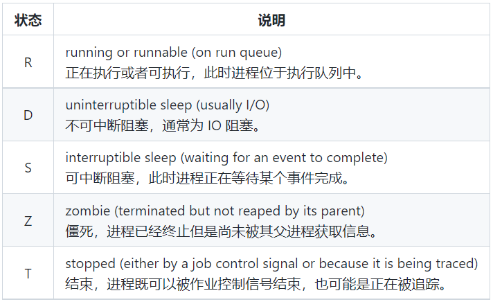
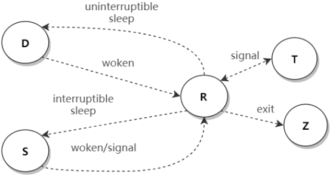

---

Created at: 2021-11-06
Last updated at: 2021-11-09


---

# 7-进程管理


**进程管理**
参考：https://www.jianshu.com/p/943b90150c10


ps，Process Status，查看所有进进程
常用的就3种：ps -f 、ps aux 和 ps -ef ，ps -f会显示当前shell进程及其父进程和子进程，ps aux和ps -ef都会显示所有进程，区别在于ps aux会实现进程的资源占用情况，ps -ef会显示进程的PPID，即父进程号。
显示当前shell进程及其父进程和子进程
```
ps -f
```
查看指定进程
```
ps aux | grep sshd
```
按cpu使用率排序显示
```
ps -aux --sort -%cpu | less
```
通过ppid查看父进程，systemd为1号进程，是所有进程的父进程
```
ps -ef | less
```

还可以安装psmisc，通过pstree命令以树状形式查看进程之间的关系
```
yum install psmisc
```
查看进程树，-p 带进程号显示进程树，-u 带上用户信息
```
pstree
```

top，实时显示进程信息
\-d 指定刷新的时间间隔(秒)，默认3秒；-i 不显示任何闲置和僵死进程；-p 指定进程号监控特定的进程，-H 显示线程
```
top
```
交互操作：

* P：按cpu使用率排序，默认
* M：按内存使用率排序
* N：按PID排序
* u：监视指定用户启动的进程
* H：切换是否显示线程
* k：杀死进程
* q：退出

在命令末尾加上字符 & 可以将命令置于后台执行，然后可以使用 jobs -l 命令显示后台作业信息

noup，no hang up，nohup与&一起用的效果是将进程置于后台运行，并且在退出终端时不关闭后台进程，如果不适用nohup，而仅使用&的话，退出终端会关闭后台进程，例如：
```
nohup sleep 60 &
```

kill，杀死进程，-9，强制杀死
killall，杀死进程及其所有子进程

**服务管理**
systemctl管理的服务都在/usr/lib/systemd/system下
查看所有服务
```
systemctl list-unit-files | less
```
启动/关闭/重启 服务
```
systemctl start/stop/restart 服务名
```
查看服务状态
```
systemctl status 服务名
```
激活/禁止自动启动
```
systemctl enable/disable 服务名
```
查看服务是否激活
```
systemctl is-active sshd
```
查看服务是否是开机自启
```
systemctl is-enabled sshd
```

