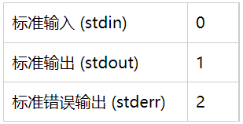

---

Created at: 2021-11-04
Last updated at: 2021-11-07
Source URL: https://www.jianshu.com/p/943b90150c10


---

# 9-其它命令


**时间和日期**
cal，calendar，显示日历

date，当前时间
显示年
```
date +%Y
```
显示年月日
```
date "+%Y-%m-%d %H:%M:%S"
```

设置系统当前时间
```
date -s ''2021-11-11 11:11:11''
```

**定时任务**
crontab，-e 编辑定时任务，-l 查询crontab任务，-r 删除当前用户的所有crontab任务
```
crontab -e
```
然后输入以下内容，表示每一分钟执行一次
```
*/1**** ls -l /root
```

**其它有用的命令**
man，manual，获取帮助信息，比如获取ls命令的帮助信息
```
man ls
```

history，查看历史命令
查看10条历史命令
```
history 10
```

修改主机名
```
vim /etc/hostname
```

hostname，查看主机名
```
hostname
```

grep，Globally search a Regular Expression and Print，文本搜索工具，能使用特定模式匹配（包括正则表达式）搜索文本，并默认输出匹配行。
选项：

* \-r 以递归的方式查找目录下所有符合条件的文件及该行的内容
* \-c 统计匹配到的行数
* \-v 反向选择，也就是显示出没有匹配的行
* \-n 输出行号
* \-i 忽略大小写

输出匹配的行及行号
```
grep -n 'yes' /root/hello.txt
```
查找 /root 目录及其子目录下所有文件中包含字符串"yes"的文件，并打印出该字符串所在行的内容
```
grep -r 'yes' /root
```

last 命令用于显示用户最近登录信息

**输入输出重定向**

输出重定向 >(覆盖) 和 >>(追加)
```
echo aaa 1> a.txt
```
echo的输出默认是标准输出，这里使用 1> 表示将标准输出重定向到文件a.txt，等价于直接使用
```
echo aaa > a.txt
```
将ll命令的标准输出和标准错误输出合并：
```
ll > list.txt 2>&1
```

双向输出重定向
tee指令会从标准输入中读取数据，将内容输出到标准输出的同时输出到文件
选项：-a 附加到既有文件的后面，而非覆盖它
```
tee [-a] file
```

**管道**
管道串起的两个命令会依次执行。 Linux系统实际上会同时运行这两个命令，在系统内部将它们连接起来。在第一个命令产生输出的同时，输出会被立即送给第二个命令。数据传输不会用到任何中间文件或缓冲区。

**关机、重启**
立刻关机
```
shutdown -h now
poweroff
init 0
halt
```
定时关机
一分钟后关机，直接输入 shutdown 等同于一分钟后关机
```
shutdown -h 1
```
11:00关机
```
shutdown -h 11:00
```
立即重启
```
shutdown -r now
init 6
reboot
```
定时重启
10分钟后重启
```
shutdown -r 10
```
11：00重启
```
shutdown -r 11:00
```
同步内存中的数据到磁盘
```
sync
```

**运行级别**：

* 0：halt 关机，代表系统停机状态，默认情况下，系统运行级别不能设置为0，否则电脑一开机就进入关机模式，电脑将不能正常启动
* 1：Single user mode 单用户模式，只支持root账户，主要用于系统维护，禁止远程登陆，类似于Windows下的安全模式
* 2：Multiuser without NFS，多用户模式，没有网络文件系统支持
* 3：Full Multiuser mode 完全多用户模式，有网络文件系统，用户登录后进入控制台命令行模式，在没有网络的环境下等同于运行级别2
* 4：unused 系统未使用，用作保留，一般不用，在一些特殊情况下可以用它来做一些事情，例如：在笔记本电脑的电池用尽时，可以切换到这一模式来做一些设置
* 5：X11 图形界面的多用户模式用户登录后直接进入X-Window系统
* 6：Reboot 重启，默认情况下，运行级别不能设为6，否则电脑一开机就进入重启模式会一直不停地重启，系统将不能正常的启动

获取默认运行级别
```
systemctl get-default
```

