---

Created at: 2021-08-15
Last updated at: 2022-10-21
Source URL: https://zhuanlan.zhihu.com/p/64138532


---

# 1-IO


前情提要：
**用户态和内核态**指的是cpu正在执行谁的代码，如果执行的是用户代码，那么cpu正处于用户态，如果执行的是操作系统内核的代码，那么cpu处于内核态。当用户程序进行系统调用时会执行操作系统内核的代码，于是cpu便会从用户态切换到内核态，当系统调用完成时，cpu也就从内核态切换回用户态。需要重点说明的是从用户态切换到内核态并不是cpu进入什么神奇的状态，只不过是运行的不同层次的代码而已，当然因为操作系统能执行权限更高的指令，所以也就是内核态相比于用户态更有更高的访问权限。
从用户态到内核态的切换代价是很大的，因为当用户程序调用系统调用时，进程就会开始执行操作系统内核的代码，每次执行操作系统代码的时候可能真正执行我们想要的功能的代码就那几行，但是为了执行这几行代码需要经过操作系统的层层调用，因为操作系统是一个通用性很强的平台，需要做很多其它的事情，比如校验等，所以说系统调用从用户态切换到内核态的代价很大。
**用户空间**指的是操作系统为用户进程分配的内存空间。**内核空间**指的是操作系统自己执行时的内存地址空间。

**IO：**
应用进程并不是直接与IO设备交互完成数据的输入输出，而是通过系统调用与操作系统交互，再由操作系统调用设备的驱动程序完成IO。
比如应用程序读数据的过程是，在用户态调用操作系统的系统调用，然后切换到内核态，在内核态操作系统会调用驱动程序将外部设备的数据读到内核缓冲区，接着操作系统将内核缓冲区的数据拷贝到用户程序的地址空间中，最后由内核态切换到用户态。
应用程序将数据写出的过程与读入的过程一样，只是数据的流向相反，即使用系统调用从用户态切换到内核态，然后操作系统将数据从用户程序地址空间拷贝到内核缓冲区，接着由操作系统调用驱动程序将数据写出到外部设备。
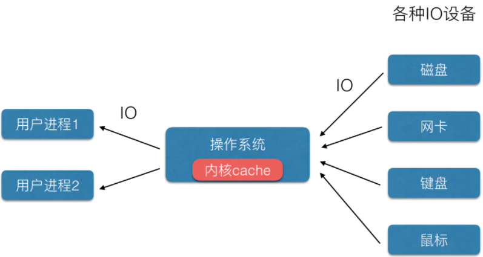
可见用户程序与外部设备完成数据交互的过程都需要经过操作系统，从而IO也就被分为了两个过程，即外部设备与操作系统内核缓冲区之间的数据传输、操作系统内核缓冲区与用户程序地址空间之间数据传输。

为什么不直接将数据从用户地址空间写到外部设备 或者 从外部设备读到用户地址空间，而非要在内核空间加一个缓冲区呢？
首先是读数据，因为进程调度的缘故，我们知道IO比较耗时，所以当进程发生IO是一定要被加入到等待队列中阻塞的，如果不在内核设置缓冲区，直接将数据写到用户地址空间的话，那么每来一个字节的数据就需要唤醒进程进行处理，这样的调度开销无疑巨大。那怎么不在用户进程地址空间设置缓冲区呢，当缓冲区填满了再唤醒用户进程处理？好主意，但是由于虚拟内存的机制，用户进程的缓冲区分页可能会被调出，这会存在问题（至于什么问题不能说得很清楚，反正能感觉到就是有问题）。所以最稳妥的方式是在内核建立缓冲区（其实还是个双缓冲区机制），当缓冲区满了之后再复制到用户空间。
其实数据从内存到内存的速度是很快的（当然这中间需要经过cpu），为了进一步提高效率，可以使用Memory Map (mmap，也是一个Linux的系统调用，这个应该仅限于从内核缓冲区中读数据的情况)，就是直接把内核缓冲区的地址空间映射到用户地址空间（应该是直接将操作系统内核缓冲区的地址写到进程的页表即可），这样就省去了一次数据复制的成本。
然后写数据也是同样的道理，没有内核缓冲区，直接将数据从用户地址空间写到外部设备时，需要阻塞用户进程，这期间用户进程的数据分页可能会被换出，将分页从磁盘换进又是一次IO，效率降低（有没有可能锁住分页不然操作系统换出呢，读数据的时候肯定是不能采用锁页这种操作的，因为不知道数据什么时候来，强行锁页会导致整个用户地址利用急剧降低，但是写数据不应该有这样的顾虑，还有一个问题是操作系统有锁住分页这这种操作吗）。

根据外部IO设备的不同，IO可分为很多种，比如磁盘IO、网络IO、标准输入输出设备的IO等，各种IO的特点不同，所以针对每一种IO设备都有不同的数据输入输出方式。

外部设备 到 操作系统内核缓冲区 之间的数据传输方式有：

1. 轮询方式：CPU主动在各种设备中轮询检查状态，有数据就IO。
2. 中断方式：设备有数据的时候，发出中断，由CPU决定要不要响应中断，然后中断，去处理设备的IO，CPU不用经常轮询设备状态，被动接收中断就行。
3. DMA（direct memory access，直接存储器访问）方式：如果1个字节的数据中断一次，传1KB的数据得中断1024次，太浪费CPU时间，于是有了DMA方式，CPU只需要把开头和结束的地址告诉DMA，中间由DMA完成数据IO，CPU从字节干预解放到数据块的干预。
4. 通道控制方式：DMA方式只能控制一个设备的一块数据，多块数据还是要CPU干预多次，于是就有了通道来控制IO，它比DMA更强大，能控制多块数据，多个设备的IO，更加解放了CPU参与IO过程。

比如从网卡接收数据写到操作系统缓冲区的过程是，网卡接收到发送端发送过来的数据，经解调转换成数字信号缓存在网卡的缓冲区中（这个缓冲区应该比较小），然后由DMA将缓冲区数据写到内核缓冲区中（这个过程应该是由DMA执行网卡驱动程序完成的），接着网卡向cpu发送中断信号通知有数据到达，然后cpu执行中断程序，中断程序做的事情是，先将内核缓冲区中的数据写到对应的socket的接收缓冲区中，然后将该socket等待队列中的进程唤醒，至此数据已经到达内核缓冲区，用户进程也被唤醒了。这个过程属于数据从外部设备到操作系统内核缓冲区的过程，至于操作系统如何将进程加入socket的等待队列就属于操作系统向应用程序提供的IO模型的范围了，反正中断处理程序只负责将数据写到对应socket的输入缓冲区并唤醒socket等待队列中的进程。
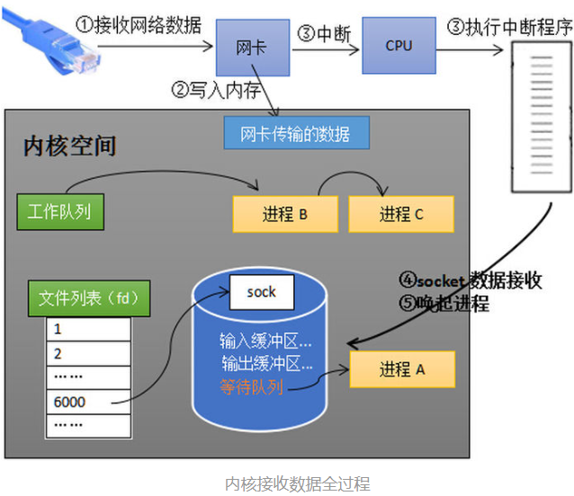
有个问题，在《现代操作系统》这本书里描述的过程是数据先缓存在外部设备的缓冲区里，然后复制到内核缓冲区中，再复制到用户缓冲区中。如果是中断处理程序将已经写到内存中数据再重新根据套接字的5元组写到对应的socket的输入缓冲区，这中间又多了一次数据的复制，能不能直接由DMA调用网卡驱动程序将网卡缓冲区中的数据直接写到socket对应的输入缓冲区中呢（或者说socket的输入输出缓冲区在用户地址空间？感觉也不对呀，这个等待队列应该在内核缓冲区）。

上面描述的是DMA方式，如果采用中断的方式读数据，我想应该是这样的，网卡先将数据缓存在自己的缓冲区中，然后向cpu发送中断信号，接着cpu执行网卡驱动程序将数据从缓冲区写到socket的输入缓冲区中，然后唤醒进程，可以看到从数据从外部设备到内存是需要cpu参与的，即由cpu执行驱动程序，而DMA方式中CPU不参与，由DMA完成，中断程序需要cpu参与执行，但是这是数据从内存到内存的操作，所以应该很快。因为网卡解调的速度和网卡的缓冲区大小有限，所以需要通过网络协议协调发送方的发送速率。

DMA解决的是数据从外部设备到内核缓冲区这个过程不需要CPU参与，但是数据从内核缓冲区到用户缓冲区 或者 从内核缓冲区到内核缓冲区 之间的拷贝是需要CPU参与，不过这个过程很快，总之就是数据从内存到内存需要经过CPU，但是数据从内存到外设　或者　从外设到内存里不需要经过CPU，在DMA的控制下就可以完成。

对于用户进程而言，用户进程能看到的只是操作系统内核缓冲区中的数据，所以当用户进程读数据时，内核缓冲区中有没有数据，如果没有操作系统需不需要阻塞用户进程，采取不同的策略就是操作系统提供用户的不同的编程接口，俗称IO模型；当用户进程写数据时，内核缓冲区没有空间，是一定会阻塞用户的进程，没有其它策略（待确定？）。

操作系统内核缓冲区 与 用户程序地址空间 之间的数据传输方式，也就是操作系统向应用程序提供的IO模型（只是读数据？）：

1. 阻塞：用户线程调用某些系统函数去内核取数据，直到数据到达内核cache前，该线程处于阻塞状态，等待数据到达。
2. 非阻塞：用户线程取数据时如果内核cache没有数据，用户线程不会阻塞等待，而是直接返回，然后不断地循环去内核态取数据，直到内核态准备好了数据。
3. IO多路复用：一个线程管理多路IO，线程还是被阻塞调用，其中一路或几路IO有数据了就返回。例如 socket 的 select() 函数，线程调用 select() 进入阻塞态，任何一个IO有数据了，线程就退出阻塞态，然后线程遍历全部IO，判断是哪个IO有数据。
4. 信号驱动IO：给一个IO注册一个信号和信号触发的回调函数，一旦信号被触发，回调函数里读取数据。例如给 socket 注册一个“可读”的信号，当数据来了，可读的时候，信号被触发，执行回调函数从内核cache复制数据到用户空间。
5. 异步IO：异步IO中，操作系统完成了数据从内核到用户空间的拷贝后，以信号的方式通知用户线程可以下一步操作。省去了用户线程阻塞下来拷贝数据的过程。

注意，对于磁盘IO而言，系统调用都是阻塞IO，因为磁盘上文件都是事先准备好的数据，不像网络IO需要等待数据的到来，所以网络IO需要考虑数据到了没有，从而决定是否需要阻塞用户进程，所以网络IO有上面5种方式。总之一句话，考虑IO时不能总想着网络IO，每一种IO设备根据数据输入的特点不同，都有不同的IO方式。

以下重点说明网络IO的各种实现方式：
1.阻塞IO
一个线程负责读取一个socket中的数据，如果内核缓冲区的数据没有准备好，那么就阻塞等待，直到操作系统把数据从内核缓冲区复制到用户空间。
阻塞IO模型很简单，就是当socket的输入缓冲区没有数据时直接将线程阻塞到socket的等待队列中。
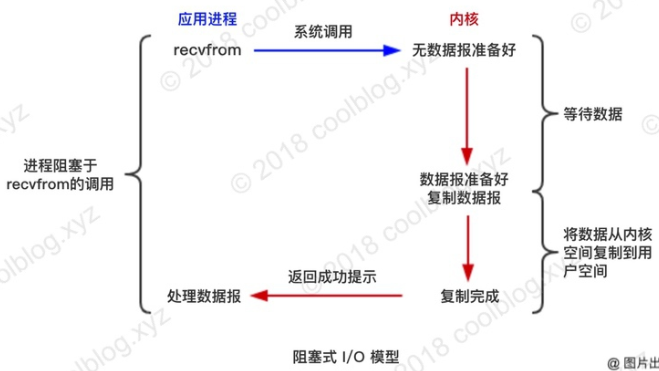
2.非阻塞式IO
一个线程负责读取一个socket中的数据，如果内核缓冲区的数据没有准备好，不阻塞而是直接返回，然后不断循环去内核态取数据，直到内核态准备好了数据。与阻塞式IO相比，此种方式没有线程调度的开销，但是存在着不断从用户态与内核态之间切换的开销。
非阻塞IO模型也很简单，就是当socket的输入缓冲区没有数据时不阻塞线程，由线程自己决定是否再次向内核取数据。
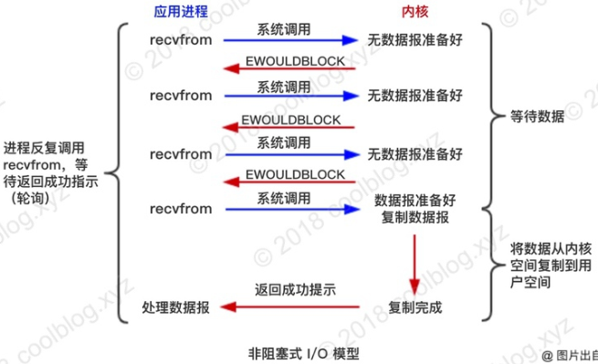
3.IO多路复用
一个线程负责读取多个socket中数据，如果内核缓冲区的数据没有准备好，那么就阻塞等待，一旦内核缓冲区有socket的准备好了数据，就立即返回处理数据，处理完后再进行下一轮。
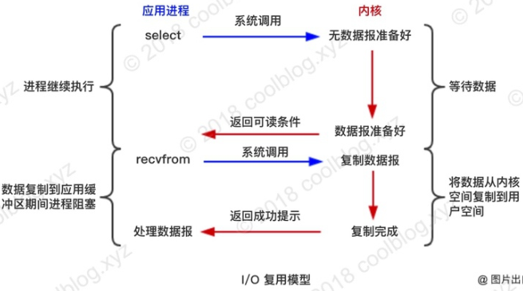
IO多路复用在Linux上有多种实现方式，比如select、poll、epoll（FreeBSD 中则为 kqueue，即epoll 是 linux 下的，kqueue 是 unix 下的）等。

**select：**
用法：将要监听的socket的文件描述符加入到监听集合中，然后阻塞等待（考虑的是没有数据的情况），一旦有事件准备就绪了就返回，然后遍历整个socket集合查看哪些socket中有数据。
```
int s = socket(AF_INET, SOCK_STREAM, 0);  
bind(s, ...)
listen(s, ...)
int fds[] =  存放需要监听的socket
while(1){
    int n = select(..., fds, ...)
    for(int i=0; i < fds.count; i++){
        if(FD_ISSET(fds[i], ...)){
            //fds[i]的数据处理
        }
    }
}
```
原理：
调用select时，
① 会将socket集合从用户空间拷贝到内核空间，
② 然后操作系统遍历该集合，将线程加入到所有socket的等待队列中，然后阻塞线程，
③ 接着一旦某个socket的输入缓冲区有数据到达，操作系统就会将数据从内核空间复制到用户空间，然后再次遍历socket集合将线程移出每个socket的等待队列，唤醒该线程，回到用户态
④ 最后用户进程遍历socket集合查看哪些socket中有数据。
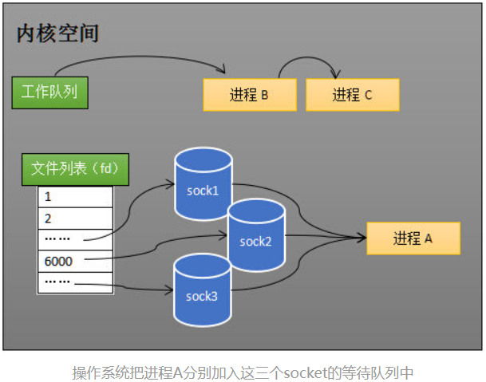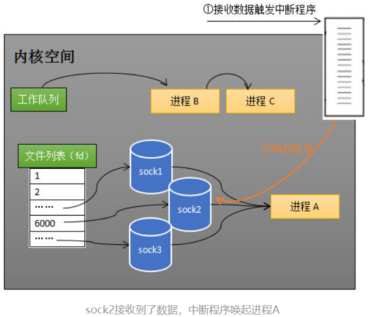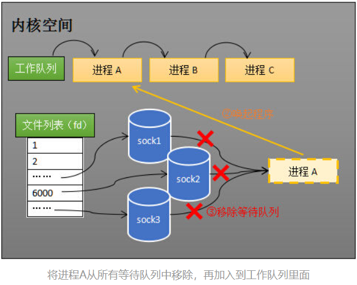
从这个流程中可以看到select方式有如下的缺点：
1.每次调用select都需要将整个socket文件描述符集合从用户空间拷贝到内核空间
2.操作系统每次将进程加入或者移除等待队列时需要遍历整个监听集合，进程每次被唤醒之后也需要遍历整个监听集合，所以一次select调用要遍历3次

**epoll：**
epoll就是来解决select这些缺点的，主要是将select的第②步拆开了。
epoll的用法是：先用epoll\_create创建一个epoll对象epfd，再通过epoll\_ctl将需要监视的socket添加到epfd中（此步可以看作是只是将进程加入到了socket的等待队列中，并没有真正阻塞进程），最后调用epoll\_wait等待数据（这里才阻塞了进程）。
```
int s = socket(AF_INET, SOCK_STREAM, 0);   
bind(s, ...)
listen(s, ...)

int epfd = epoll_create(...);
epoll_ctl(epfd, ...); //将所有需要监听的socket添加到epfd中

while(1){
    int n = epoll_wait(...)
    for(接收到数据的socket){
        //处理
    }
}
```
为什么说epoll解决了select的那些问题呢？
1.调用epoll\_ctl是将需要监听的socket的放到epoll\_create创建的epoll对象epfd的等待队列中，并不是将进程放到socket的等待队列中，所以并没有阻塞进程，只有当调用epoll\_wait才阻塞进程，阻塞进程是将进程放到epfd的另一个等待队列中，所以每次进程被唤醒的时候，只需要将进程程移出等待队列即可，并不需要将socket移出等待队列，也就是说使用epoll只需要在第一次将监听集合拷贝到内核空间，当然如果后续还需要将socket加入或移出监听集合，有相应的系统调用。
2.进程被唤醒时操作系统返回的是所有已经接收到数据的socket，并不需要用户进程遍历整个监听集合进行判断。

epoll原理：
操作系统是如何将进程加入或移出到socket的等待队列中的呢，是在第一次遍历整个监听集合，以后每当有新的socket需要加入，或者旧的socket移出时都重新遍历一次socket集合吗（新加入socket时为防止重复加入需要遍历）？
① 其实并不需要遍历整个socket集合，因为epoll为整个socket集合创建了一个红黑树索引，这样新加入socket的时候直接在红黑树上查找看有没有重复即可，没有重复就将socket的索引插入到红黑树上，重复了就拒绝插入。将socket移出监听集合时直接在红黑树上查找socket对应的索引然后删除即可。
（注意这个红黑树索引就在eventpoll中，在epoll源码的数据结构中叫rbr，eventpoll也是文件系统中的一员，由系统调用epoll\_ceate创建，和socket一样，它也有等待队列，稍后阻塞进程的时候会把进程加入这个eventpoll的等待队列中。）
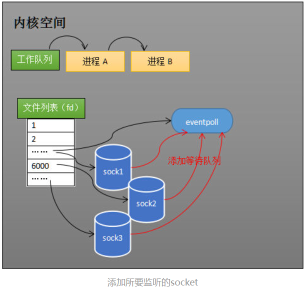
② 然后阻塞进程（所有socket都没有数据）
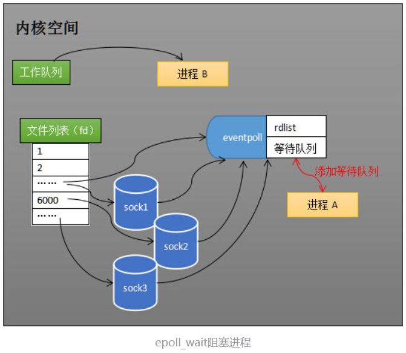
③ 然后有数据来了，中断程序一是会把有数据的socket的索引添加到就绪列表中（这个就绪列表也在eventpoll中，在epoll源码的数据结构中叫rdlist，是一个链表结构），二是会唤醒eventpoll等待队列中的进程。（感觉epoll能比select更高效，主要就是靠这个中断程序，原先在select中，中断程序只能唤醒socket等待队列中的进程，现在在epoll中，中断程序不仅可以维护rdlist列表，还可以唤醒等待队列中的进程）
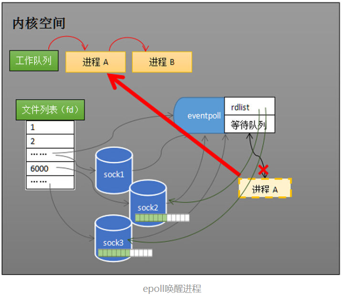
④ 最后将socket的数据和rdlist从内核空间复制到用户空间，然后从用户进程执行。

**总结：**select和epoll的区别就在于，select是一次系统调用，即传入监听集合和阻塞进程用一步操作完成；但是epoll是3次系统调用，即先用epoll\_create创建epoll，也就是内核空间的eventpoll，也是一个文件；然后epoll\_ctl传入监听集合，最后epoll\_wait阻塞进程。问题的关键就在于每次调用select的时候，都会把这三件事都做一遍，而epoll把这三件事拆解了，在使用epoll的时候，每次处理完数据只需要调用最后一步重新阻塞进程即可，不需要在把前面重复的事情再做一遍。

4.信号驱动IO
一个线程负责读取一个socket中的数据，不管内核数据有没有准备到都是直接返回，然后接着继续运行处理其它事情，当内核缓冲区准备好数据后，操作系统会给线程发送一个信号，线程收到信号之后调用回调函数。
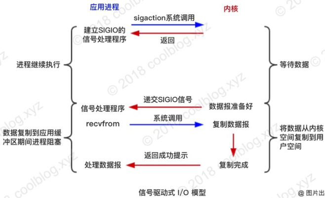
5.异步IO
与信号驱动IO类似，一个线程负责读取一个socket中的数据，不管内核数据有没有准备到都是直接返回，然后接着继续运行处理其它事情，只不过异步IO返回的时机是当操作系统把内核空间的数据复制到用户空间时，而不是内核空间准备好数据时。
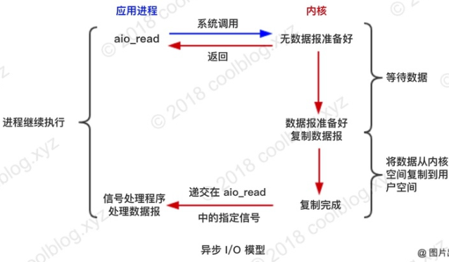

总结：最后几种IO方式的对比如下，可以看到，前4种在内核空间准备好数据后都会阻塞等待操作系统将内核空间的数据复制到用户空间，而异步IO不需要，这是因为前4中方式都使用了系统调用recvfrom从内核缓冲区取数据，当用户程序调用系统调用时，进程就会开始执行操作系统内核的代码，而不是用户的代码，所以对于用户层面来说可以认为是阻塞了。
除了IO多路复用外的其它IO方式都是一个线程处理一个socket，虽然在处理的延时上是优于IO多路复用，但是用的最多的还是IO多路复用方式，因为它可以实现一个线程处理大量socket，从而实现高并发连接。
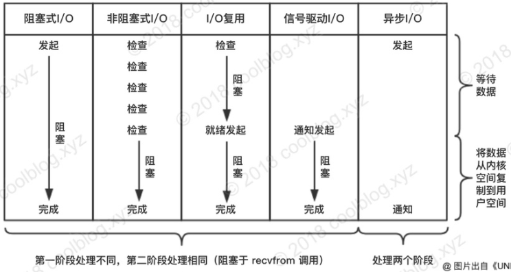

前面的IO模型好像都是针对用户进程读数据而言的（待确定？好像IO多路复用中有write事件），对于将数据从用户进程写数据，好像只能是先将数据从用户地址空间写到内核缓冲区，不能使用mmap，而且调用写数据的系统调用时一定是会阻塞用户进程的，直到数据写完为止。

但如果是先从外部设备读，然后再写到外部设备，那么这个过程是可以优化的。
1.读的时候可以使用mmap。这样就相当于是直接将数据从内核的读缓冲区写到了内核写缓冲区，减少了一次将数据从内核缓冲区拷贝到用户地址空间的成本。
2.使用sendfile系统调用一次搞定。相比于mmap只是减少一次用户态到内核态的切换，数据同样是直接从内核的读缓冲区写到了内核写缓冲区。因为只在内核态进行，所以用户进程无法操作数据，代码上的体现就是，使用mmap是两部搞定的，所以中间可以对数据进行操作，但是使用snedfile是一次系统调用，没有操作数据的余地。
3.sendfile+DMA Scatter/Gather。相比于只使用sendfile，减少了一次数据拷贝，数据是直接从内核读缓冲区映射到内核写缓冲区的。

