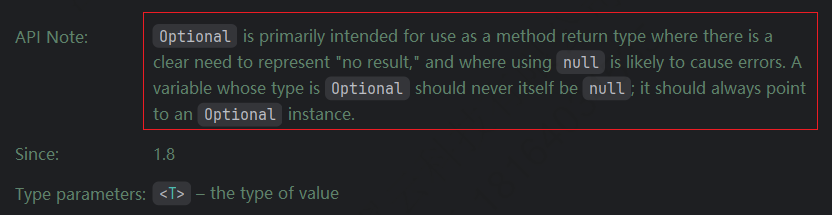
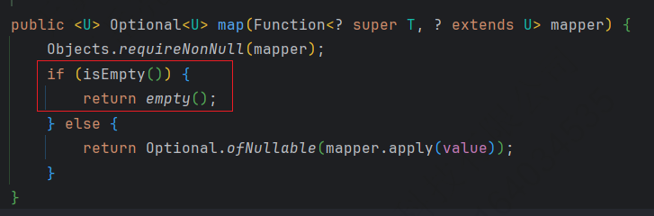
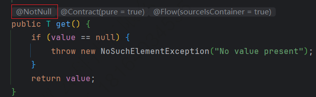
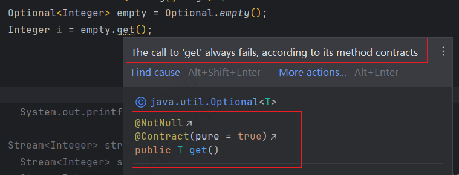

---

Created at: 2023-09-23
Last updated at: 2024-08-18
Source URL: about:blank


---

# Stream 和 Optional


**使用的Stream的步骤：**

1. 获取Stream流
2. 中间方法（加工数据）
3. 终结方法

**一、获取Stream流**

1. 集合List、Set使用Collection接口的stream方法

```
default Stream<E> stream();
```

2. 数组使用Arrays工具类的静态方法（基本数据类型数组 和 引用数据类型数组 均可使用）

```
public static IntStream stream(int[] array);
public static <T> Stream<T> stream(T[] array);
```

3. 零散数据使用Stream接口中的of方法（引用数据类型数组 也可使用）

```
public static<T> Stream<T> of(T t);
public static<T> Stream<T> of(T... values);
```
例如：
```
Stream<Integer> stream = Stream.of(1, 2, 3);
```

**二、中间方法**

|     |     |
| --- | --- |
| **方法名** | **说明** |
| Stream<T> filter(Predicate predicate) | 用于对流中的数据进行过滤 |
| Stream<T> limit(long maxSize) | 返回此流中的元素组成的流，截取前指定参数个数的数据 |
| Stream<T> skip(long n) | 跳过指定参数个数的数据，返回由该流的剩余元素组成的流 |
| static <T> Stream<T> concat(Stream a, Stream b) | 合并a和b两个流为一个流 |
| Stream<T> distinct() | 返回由该流的不同元素（根据Object.equals(Object) ）组成的流 |
| <R> Stream<R> map(Function<? super T, ? extends R> mapper); | 转换  |
| ..... |     |

**三、终结方法**
```
void forEach(Consumer<? super T> action);
Object[] toArray(); `//收集到数组中`
<A> A[] toArray(IntFunction<A[]> generator);
T reduce(T identity, BinaryOperator<T> accumulator); //T identity 是传递给reduce的初始值，所以方法的返回值肯定不为null
Optional<T> reduce(BinaryOperator<T> accumulator); //这个reduce方法没有初始值，所以reduce的结果就有可能为null，Option就是一个可以包含Null和值的一个类型
Optional<T> min(Comparator<? super T> comparator);
Optional<T> max(Comparator<? super T> comparator);
long count();
<R, A> R collect(Collector<? super T, A, R> collector); `//收集到集合中`
```

把结果收集到集合中
```
<R, A> R collect(Collector<? super T, A, R> collector);
```
参数工具类Collectors提供了具体的收集方式

|     |     |
| --- | --- |
| **方法名** | **说明** |
| public static <T> Collector toList() | 把元素收集到List集合中 |
| public static <T> Collector toSet() | 把元素收集到Set集合中 |
| public static Collector toMap(Function keyMapper,Function valueMapper) | 把元素收集到Map集合中 |

```
List<Integer> list = list1.stream().filter(number -> number % 2 == 0).collect(Collectors.toList());
Set<Integer> set = list1.stream().filter(number -> number % 2 == 0).toSet());
Map<String, Integer> map = list.stream().collect(Collectors.toMap(
                s -> s.split(",")[0], //第一个lambda表达式指定如何获取到Map中的键
                s -> Integer.parseInt(s.split(",")[1]) ));//第二个lambda表达式指定如何获取Map中的值
```

**Optional**
Optional有两个作用：
1、Optional类的注释说，Optional设计的主要目的是作为方法的返回值，提醒调用者Optional包裹的值可能为null。

2、函数式编程时的链式调用不用总去考虑NullPointerException，换句话说，只要你处理的时候一直在用Optional，就不用考虑空指针异常，除非你要取出Optional里的value时才需要考虑值有可能为null。
比如：
```
public class OptionalTest {
    public static void main(String[] args) {
        m1().stream()
                .map(i -> i.map(a -> a + (a % 2 == 0 ? " is even" : " is odd")))
                .filter(Optional::isPresent)
                .map(Optional::get)
                .forEach(System.out::println);
    }

    static List<Optional<Integer>> m1() {
        return Stream.of(1, 2, 3, null, 5, null, 7, 8).map(Optional::ofNullable).toList();
    }
}
```

为什么说只要你处理的时候一直在用Optional，就不用考虑空指针异常？
因为在使用Optional的map、flatMap方法时，map、flatMap方法里面已经判空了。

为什么说只有当你从Optional里的value时才需要考虑值有可能为null？
从Optional里取value时会用到get()、orElse()等方法，这些方法考虑到了null的情况，提醒调用者去处理，比如get()上面的注解：



