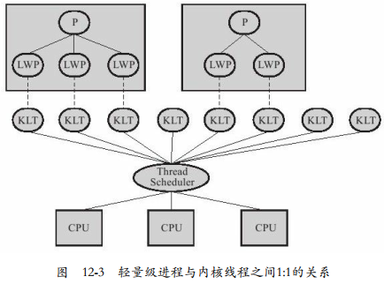
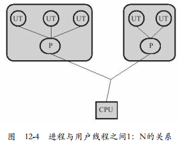
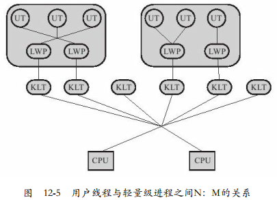

---

Created at: 2021-11-09
Last updated at: 2021-11-30
Source URL: https://www.jianshu.com/p/c1015f5ffa74

---

# 2-进程与线程 和 进程间的通信方式

**进程与线程**
在线程概念还没有提出来的时候，如果想要在完成一个任务的同时充分利用cpu的计算资源，可以开启多个进程，这时进程不仅是调度的单位，还是资源分配的单位。
作为调度的单位，如果是运行在单核cpu上，当某个进程因需要等待IO完成，操作系统就可以先把它挂起，把cpu资源让出来给其它进程执行，从而充分利用了cpu的计算资源，如果是多核cpu，这些进程还可以并行执行。这样虽然可以充分利用cpu的计算资源，但是在对进程进行调度时，上下文切换的代价太大。
作为资源分配的单位，每个进程拥有自己独立的地址空间，互补干扰，因为创建多个进程是为共同完成同一件事情，所以进程之间免不了要进行信息的交流，这时只能依靠进程间的通信完成，比如需要依靠信号量完成同步互斥、需要依靠消息队列或者共享内存等方式完成数据的传递。这种通信不仅代价大，因为都是系统调用，需要从用户态切换到内核态，而且编程模型还比较复杂，远没有像线程直接依靠共享地址空间那样来的直接方便。

所以线程就被提出来了，一个进程中可以包含多个线程，线程作为资源调度的单位，进程就不再被作为调度的单位，只作为资源分配的单位，各个线程共享进程的地址空间（如Java中的堆和方法区），每个线程只保留少量自己私有的资源（如Java中的栈和程序计算器）。线程引入之后，可以依靠多个线程来合作完成之前用多个进程完成的工作。
线程解决了之前进程切换开销大的问题，因为线程切换需要保留的执行现场只是自己拥有的哪些少留的资源，并不需要管整个进程。线程之间协作完成某项工作也不需要像进程直接通信那么麻烦了，直接依靠共享的地址空间即可。

引入线程之后，现代操作系统实现线程的方式有：
1.内核线程实现，也称1:1实现
一个LWP（light wight Process，轻量级进程，也就是线程，广义上属于用户线程）映射到一个KLT（Kernel-Level Thread，内核线程）。因为需要依靠操作系统调度内核线程执行，所以此种方式需要操作系统内核的支持，也就是操作系统要有内核线程。LWP是KLT的一种高级接口，所以需要操作系统支持KLT才能在用户进程内创建LWP。

2.用户线程实现，也称N:1实现
此种方式下内核感知不到用户线程的存在，所以也就不需要操作系统有内核线程，于是也就没有将用户进程映射到内核线程上的说法，这种线程实现方式只需要函数库支持就行，不需要操作系统内核的支持，也就是说在不支持线程只支持进程的操作系统上也能实现这种方式，所以这种实现方式称为用户线程。
从操作系统来看这和没有引入线程只有进程时没有什么区别，操作仍然直接以进程为单位进行调度，用户线程的创建、调度和销毁完全在用户态完成，可以在用户进程中创建多个UT（User Thread），这就相当于是多线程了，虽然这种方式创建线程拥有线程的特点和优点，但是多个线程不能真正并行执行，不过这还是要比没有线程的单个进程要好~~，因为某个线程因IO阻塞了，进程可以调度其它线程执行~~。其实用户线程实现方式要比内核线程实现方式在线程的创建、销毁、同步、调度方面的开销更小，因为用户线程的这些操作完全在用户态中完成，而内核线程的创建、销毁、同步需要系统调用，也就是需要在用户态和内核态之间来回切换。
注意，一定要从操作系统的发展来看，也就是对于用户线程而言，不必修改线程没有出现前只支持进程的操作系统的内核也可实现；而对于内核线程而言，为了支持多线程在多核cpu上并行，必须修改原来只支持进程的操作系统的内核才能实现。

3.混合实现，也称Ｎ:M实现
既有UT，又有LWP，还有KLT

操作系统线程的实现方式决定着用户线程如何并发，比如1:1实现和混合实现都能做到同一进程内的线程在处理器上并行执行，而用户线程的实现不能做到。不过，无论线程是单核上的并发，还是多核上的并行，线程之间的执行都是异步，也就是我们无法预知指令的执行顺序，所以都需要同步机制实现 线程对共享资源的互斥访问 或者是 线程之间先后关系，也就是都需要靠加锁来实现线程之间的同步，于是乎无论哪一种实现方式，对于多线程编程来说都是一样的，只不是在实际运行时的并发规模和运行效率上有差异而已。

从进程到线程的发展来看：
1.即使没有引入线程只依靠进程也可以并发，只不过是进程相比于线程调度开销更大，对用户而言，编程模型更加复杂一点。
比如依然可以利用Linux的系统调用fork()创建多个子进程完成并发，使用管道等通信方式完成进程的同步以及数据的传递。
再比如python也可以创建进程，使用多个进程完成并发。还比如PHP中也是利用多进程完成并发。

2.在引入线程之后，即使操作系统不支持线程，也可以由函数库支持实现线程，这种实现方式称为用户线程。
比如早期的Linux，在没有向内核中引入内核线程时，就是使用函数库的支持向应用程序提供了线程。
再比如python的多线程，完全就是用户线程的实现（过程应该是这样的，如果python运行在1:1实现的操作系统上，那么python虚拟机会将python程序中所有创建的线程放到一个LWP中执行，又因为一个用户态的LWP会映射一个内核态的KLT上，所以所有在python中创建的线程不可能做到并行执行，只能像在单核cpu上轮转执行）。

现在的Linux的线程实现方式是1:1（有些商业级操作系统是混合实现），Java也是采用1:1实现。
Java并不支持多进程并发，也就是不能在一个Java进程中创建另一个Java进程，只能在Java进程中创建线程。Java重新规定了运行在进程内部的线程的状态，并不遵从操作系统对线程状态的定义，所以也就会出现即使操作系统将某个Java线程挂起了，但是对于Java而言这个线程的状态还是Runnable的情况，这也是Java向用户提供统一编程思想的体现。

**进程之间的通信方式IPC (Inter-Process Communication)**
因为进程的地址空间是隔离的，所以不能像线程那样可以直接修改共享资源那样完成通信，进程之间的通信必须要操作系统来帮忙，也就是需要系统调用，所以进程通信时需要在用户态和内核态之间切换，至于通信的数据需不需要从用户态复制到内核态然后再复制到用户态，这个我觉得应该视具体的通信方式而定，对于单机内进程间的通信，可能操作系统的某些通信方式并不需要这样来回拷贝数据（我认为单机内进程间的数据交换都需要经过内核缓冲区，不过不需要来回复制，通过mmap可以高效的解决），但对于不同主机之间的进程的跨网络通信，可以肯定的是需要在用户态和内核态之间来回拷贝数据，因为跨网络通信属于IO，必须经过操作系统内核缓冲区（在接收方可以mmap）。

**Linux的IPC方式：**
1.信号
在Linux 中信号发送和捕获的系统调用，这是一种在早期unix系统里面就存在的通信方式，shell命令kill -9就是在向进程发送结束的信号。
2.管道
无名管道仅用于父子进程或兄弟进程之间的数据传递。早期unix的无名管道只支持半双工方式，但是现代unix支持全双工方式了。
有名管道也称FIFO管道，有名管道和无名管道本质一样，只不过有名管道会在文件系统中生成一个目录项，于是就可以允许与其它不具有亲缘关系的进程进行通信了。
3.消息队列
4.共享存储区
5.信号量
6.套接字
套接字由3个属性确定：域、端口号、协议类型
套接字有两种域：
一个域是AF\_INET，指的是Internet网络，用于跨网络通信；另一个域是AF\_UNIX，表示UNIX文件系统，用于本机进程之间的通信，比使用网络套接字更加高效。也就是说套接字给了网络通信和本地通信一个统一的模型。

套接字有3种协议类型：
一是流套接字，在域中通过TCP/IP连接实现。
二是数据报套接字，在域中通常是通过UDP/IP协议实现的。
三是原始套接字，原始套接字允许对较低层次的协议直接访问，比如IP、 ICMP协议，也可以用来发送一些自定包头或自定协议的IP包。

