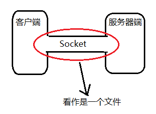

---

Created at: 2021-08-14
Last updated at: 2022-08-04


---

# 3-BIO之网络IO


磁盘IO都是阻塞IO，本节主要讲的是阻塞式网络IO的实现方式
Socket编程抽象：
socket在JDK中被抽象成了一种文件，在Linux里面socket也是被抽象成文件，当socket连接建立之后，就相当于新建了一个文件，客户端与服务器通过文件流的方式读写socket里面的数据从而完成通信。


BIO：Blocking IO 阻塞式IO
使用BIO的方式进行数据的传输，每一个客户端的连接都会创建新的线程来处理，客户端与服务端以同步阻塞式IO的方式进行通信，代码如下。
服务端：
```
public class Server {
    public static void main(String[] args) throws IOException {
        ServerSocket ss = new ServerSocket(9999);
        while (true) {
            /**
              * main线程在这里会阻塞等待客户端的连接，但是此时线程的状态在jvisualvm中看到的是运行Runnable。
              * 对于这个现象我是这样认为的，Java线程实现的方式是一对一，即一个Java线程对应于一个cpu线程，这里main线程
              * 确实是在操作系统层面是阻塞了，但是Java层面认为没有阻塞，因为Java中规定的是只有线程在竞争synchronized锁失败才会
              * 进入阻塞状态，这是Java对线程状态的一次包装。
              */
            Socket socket = ss.accept();
            /**
             * 使用lambda表达式，socket就被闭包了
             * 如果不使用lambda表达式，就需要写一个实现Runnable接口的类，将socket通过构造器传进去
             * 然后每次new这个类的对象，再把这个对象传给Thread
             */
            Runnable task = () -> {
                try {
                    BufferedReader bufferedReader = new BufferedReader(new InputStreamReader(socket.getInputStream()));
                    String line;
                    while ((line = bufferedReader.readLine()) != null) {
                        System.out.println("服务端收到：" + line);
                    }
                } catch (IOException e) {
                    e.printStackTrace();
                }
            };
            new Thread(task).start();
        }
    }
}
```
客户端：
```
public class Client {
    public static void main(String[] args) throws IOException {
        Socket socket = new Socket("localhost", 9999);
        PrintStream printStream = new PrintStream(socket.getOutputStream());
        Scanner scanner = new Scanner(System.in);
        while (true) {
            System.out.print("客户端发送：");
            String line = scanner.nextLine();
            printStream.println(line);
        }
    }
}
```
这种通信方式的好处是客户端发送的消息服务端可以及时收到，因为是阻塞式的同步等待。但坏处也很明显，如果有大量连接同时存在就会新建大量的线程，每一个线程都需要保存自己运行时的信息，积少成多，直接导致栈内存OOM。（~~这里没说每一个线程都有一个栈，是因为我觉得栈是线程运行时才会分配的内存空间，线程失去cpu时间片后就没有该线程的栈了，而是将自己运行时的信息保存下来，等待下次被调度执行时再恢复执行现场，这就是上下文切换。~~）

使用线程池可以控制线程的数量避免栈内存OOM，还可以减少频繁创建和销毁线程的开销（线程池没有减少调度线程时的上下文切换等开销）。当任务在阻塞队列中，还没有被放在线程中执行的时候，服务器就不能及时收到客户端发来的消息，这是异步IO的效果，所以说靠线程池实现的IO是一种伪异步IO。
为什么可以有这种异步的效果呢？
因为操作系统内核空间已经准备好了数据，只是线程没有被调度，导致应用进程不能从内核空间中读取数据。

使用线程池的BIO数据传输方式的服务器端代码如下，当任务还在阻塞队列中，也就是没有被放到线程中执行的时候，意味着不能从socket中读数据，但实际上服务器端的socket的数据已经准备好了：
```
public class Server {
    public static void main(String[] args) throws IOException {
        ServerSocket ss = new ServerSocket(9999);
        ThreadPoolExecutor pool = new ThreadPoolExecutor(2, 3, 10, TimeUnit.SECONDS,
                new ArrayBlockingQueue<Runnable>(2), Executors.defaultThreadFactory(),
                (r, executor) -> System.out.println(r.toString() + "is discard"));
        while (true) {
            Socket socket = ss.accept();
            Runnable task = () -> {
                try {
                    BufferedReader bufferedReader = new BufferedReader(new InputStreamReader(socket.getInputStream()));
                    String line;
                    while ((line = bufferedReader.readLine()) != null) {
                        System.out.println("服务端收到：" + line);
                    }
                } catch (IOException e) {
                    e.printStackTrace();
                }
            };
            pool.execute(task);
        }
    }
}
```

