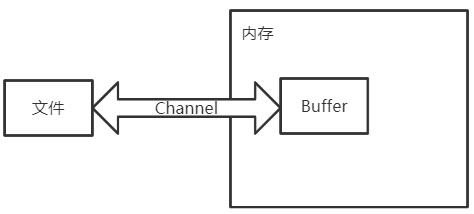
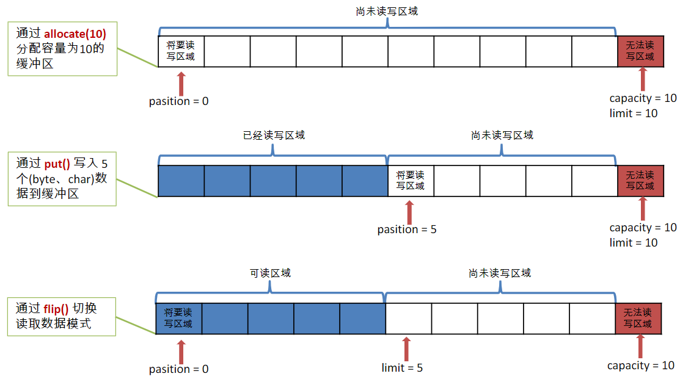
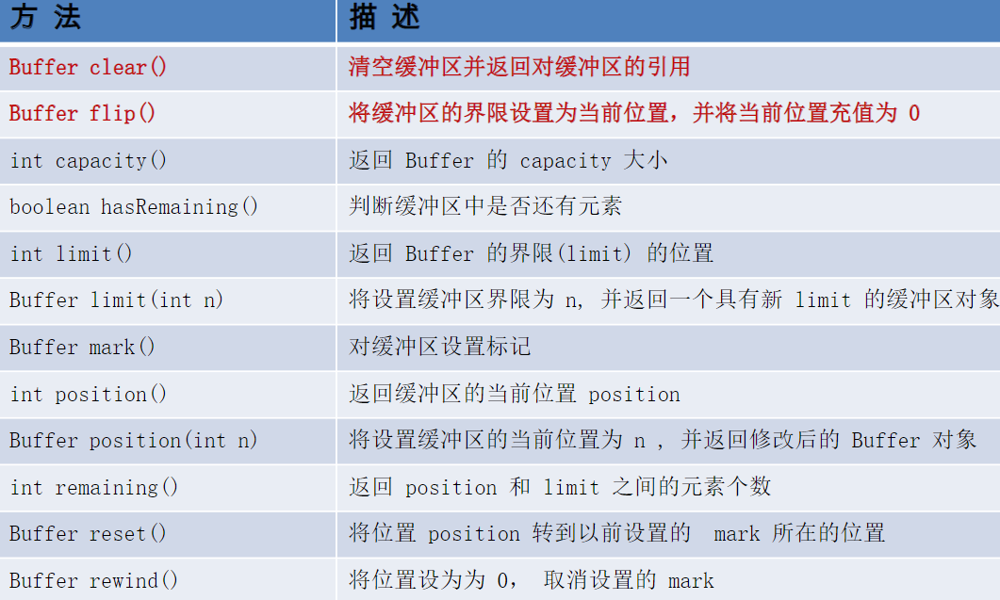
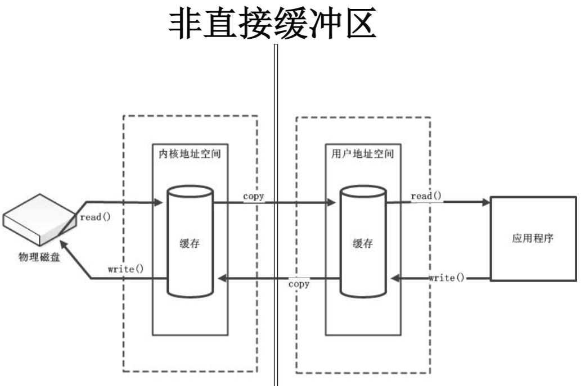
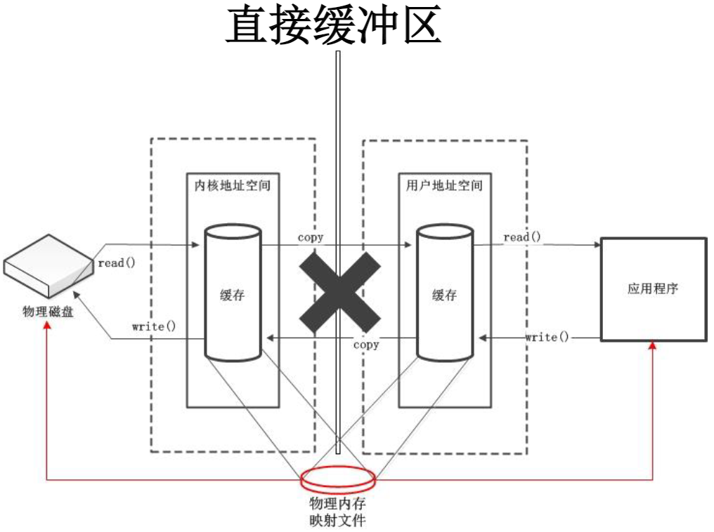
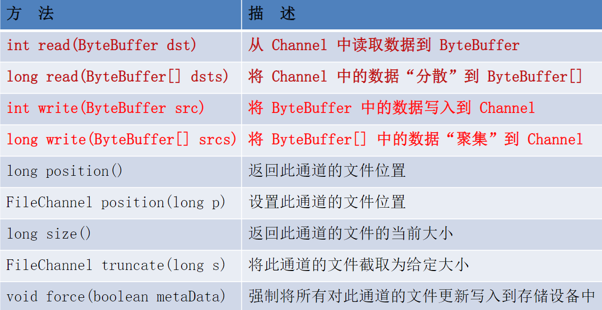

---

Created at: 2021-08-14
Last updated at: 2021-11-11
Source URL: https://blog.csdn.net/zxm1306192988/article/details/60581173


---

# 4-NIO之缓冲区和通道


JDK1.4引入的NIO，是New IO或者Non-blocking IO的缩写，与BIO基于文件流的编程思想不同，NIO引入了一套新的IO编程模型或者说是编程思想，这套编程模型基于三个基本组件：通道、缓冲区、选择器。
我觉得NIO更准确应该是New IO的缩写，因为对于本地文件读写并没有非阻塞，非阻塞是针对网络IO的而言的，只有网络IO才能使用上选择器，选择器是用来监听网络IO事件的，是实现非阻塞IO的关键。
Java程序员是幸福的，JDK总是屏蔽底层的差异，封装成统一的编程模型供程序员使用，NIO就是一个典型的例子，NIO的底层实现在Windows与Linux中肯定不同，Linux中的实现可能是基于select、poll或者是epoll实现，但是在Java中使用NIO提供的API时完全不用关心底层的具体细节，只需了解Java为我们封装好的模型和编程实现即可。

**通道****（Channel）****和缓冲区（Buffer）**
通道：通道表示打开到文件的连接，IO设备和套接字都可看作是文件，通道是双向的，而BIO的文件流是单向的。
缓冲区：存储特定基本数据类型的容器，所有缓冲区都是抽象类 java.nio.Buffer 的子类，通道只能与缓冲区进行交互。
如下图所示，数据是从通道读入缓冲区，从缓冲区写入通道中的。


**缓冲区（Buffer）**
Buffer的子类：

* ByteBuffer
* CharBuffer
* ShortBuffer
* IntBuffer
* LongBuffer
* FloatBuffer
* DoubleBuffer

Buffer的重要概念：

* 容量 (capacity) ：表示Buffer的最大数据容量，不能为负，创建后不能更改。
* 限制 (limit)：写的时候指向最后一个可写入的位置，读的时候指向最后一个不能读的位置。
* 位置 (position)：下一个要读取或写入的位置


抽象类Buffer中常用的方法：


Buffer的子类各自都提供了get()方法和put()方法用于操作缓冲区中的数据，以ByteBuffer为例：

* 获取 Buffer 中的数据

get() ：读取单个字节
get(byte\[\] dst)：批量读取多个字节到 dst 中
get(int index)：读取指定索引位置的字节(不会移动 position)

* 放入数据到 Buffer 中

put(byte b)：将给定单个字节写入缓冲区的当前位置
put(byte\[\] src)：将 src 中的字节写入缓冲区的当前位置
put(int index, byte b)：将指定字节写入缓冲区的索引位置(不会移动 position)
示例：
```
public static void main(String[] args) {
    String str="abcde";

    //1.分配一个指定大小的缓冲区
    ByteBuffer buf=ByteBuffer.allocate(1024);
    System.out.println("--------------allocate()----------------");
    System.out.println(buf.position());//0
    System.out.println(buf.limit());//1024
    System.out.println(buf.capacity());//1024

    //2.利用put()存放数据到缓冲区中
    buf.put(str.getBytes());
    System.out.println("-------------put()-------------");
    System.out.println(buf.position());//5
    System.out.println(buf.limit());//1024
    System.out.println(buf.capacity());//1024

    //3.切换读取数据模式
    buf.flip();
    System.out.println("--------------flip()------------");
    System.out.println(buf.position());//0
    System.out.println(buf.limit());//5
    System.out.println(buf.capacity());//1024

    //4.利用get()读取缓冲区中的数据
    byte[] dst=new byte[buf.limit()];
    buf.get(dst);
    System.out.println(new String(dst,0,dst.length));//abcd
    System.out.println("--------------get()------------");
    System.out.println(buf.position());//5
    System.out.println(buf.limit());//5
    System.out.println(buf.capacity());//1024

    //5.rewind():可重复读
    buf.rewind();
    System.out.println("--------------rewind()------------");
    System.out.println(buf.position());//0
    System.out.println(buf.limit());//5
    System.out.println(buf.capacity());//1024

    //6.clear():清空缓冲区。但是缓冲区中的数据依然存在，只是处在“被遗忘”状态
    buf.clear();
    System.out.println("--------------clear()------------");
    System.out.println(buf.position());//0
    System.out.println(buf.limit());//1024
    System.out.println(buf.capacity());//1024
    System.out.println((char)buf.get());
}
```

```
public static void main(String[] args) {
    String str="abcde";
    ByteBuffer buf=ByteBuffer.allocate(1024);
    buf.put(str.getBytes());
    buf.flip();

    byte[] dst=new byte[buf.limit()];
    buf.get(dst,0,2);
    System.out.println(new String(dst,0,2));//ab
    System.out.println(buf.position());//2

    //mark():标记
    buf.mark();
    buf.get(dst,2,2);//再读两个位置
    System.out.println(new String(dst, 2, 2));//cd
    System.out.println(buf.position());//4

    //reset():恢复到mark的位置
    buf.reset();
    System.out.println(buf.position());//2

    //判断缓冲区中是否还有剩余数据
    if(buf.hasRemaining()){
        //获取缓冲区中可以操作的数量
        System.out.println(buf.remaining());//3
    }
}
```

直接缓冲区与非直接缓冲区：

* 非直接缓冲区：通过allocate()方法分配缓冲区，将缓冲区建立在JVM的内存中。
* 直接缓冲区：通过allocateDirect()方法分配直接缓冲区，将缓冲区建立在本地物理内存中。直接缓冲区还可以通过FileChannel 的 map() 方法来创建，该方法返回MappedByteBuffer对象，MappedByteBuffer是ByteBuffer的子类。直接缓冲区的读写效率远高于非直接缓冲区，但其分配和回收的效率低于非直接缓冲区。

```
public static void main(String[] args) {
    //分配直接缓冲区
    ByteBuffer buf=ByteBuffer.allocateDirect(1024);
    System.out.println(buf.isDirect());//true
}
```


**通道****（Channel）**
通道是与文件建立的双向连接，只能与缓冲区进行交互。
java.nio.channels.Channel 接口的主要实现类：

* FileChannel：用于读取、写入、映射和操作文件的通道。
* SocketChannel：通过 TCP 读写网络中的数据。
* ServerSocketChannel：可以监听新进来的 TCP 连接，对每一个新进来的连接都会创建一个 SocketChannel。
* DatagramChannel：通过 UDP 读写网络中的数据通道。

获取通道：
1.java针对支持通道的类提供了getChannel()方法

* 本地IO：

FileInputStream/FileOutputStream
RandomAccessFile

* 网络IO：

Socket
ServerSocket
DatagramSocket
2.JDK 1.7 的NIO.2 针对各个通道提供了静态方法 open()
3.JDK 1.7 的NIO.2 的Files工具类的newByteChannel()

下面以FileChannel为例展示通道的用法
FileChannel 的常用方法：


示例1，通道可以与文件建立可读可写的双向连接：
```
public static void main(String[] args) {
    try (
            `//1.获取通道`
 `FileChannel channel = FileChannel.open(Paths.get("D:/1.txt"), StandardOpenOption.WRITE, StandardOpenOption.READ, StandardOpenOption.CREATE)`
    ) {
        ByteBuffer buf01 = ByteBuffer.allocate(1024);
        buf01.put("abcedfg".getBytes());
        buf01.flip();
        `//往通道里写`
 `channel.write(buf01, 0);`

        ByteBuffer buf02 = ByteBuffer.allocate(1024);
        `//从通道里读`
 `channel.read(buf02);`
        buf02.flip();
        byte[] bytes = new byte[buf02.limit()];
        buf02.get(bytes);
        System.out.println(new String(bytes, 0, bytes.length));
    } catch (Exception e) {
        e.printStackTrace();
    }
}
```

示例2，使用通道完成本地文件的复制，注意，从流中获取的通道并不是双向的：
```
public static void main(String[] args) {
    long start = System.currentTimeMillis();
    try (FileInputStream fis = new FileInputStream("d:/1.avi");
         FileOutputStream fos = new FileOutputStream("d:/2.avi");
         `//1.获取通道`
 `FileChannel inChannel = fis.getChannel();`
 `FileChannel outChannel = fos.getChannel()`
    ) {
        //2.分配指定大小的缓冲区
        ByteBuffer buf = ByteBuffer.allocate(1024);
        `//3.将文件中数据从通道读到缓冲区中`
        while (inChannel.read(buf) != -1) {
            buf.flip();//切换读取数据的模式
            `//4.将缓冲区中的数据从通道写到文件中`
            outChannel.write(buf);
            buf.clear();//清空缓冲区
        }
    } catch (Exception e) {
        e.printStackTrace();
    }
    long end = System.currentTimeMillis();
    System.out.println("耗费时间：" + (end - start));//耗费时间：1094
}
```

示例3，使用直接缓冲区完成本地文件的复制：
```
public static void main(String[] args) {
    long start = System.currentTimeMillis();
    try (
            FileChannel inChannel = FileChannel.open(Paths.get("d:/1.avi"), StandardOpenOption.READ);
            FileChannel outChannel = FileChannel.open(Paths.get("d:/2.avi"), StandardOpenOption.WRITE, StandardOpenOption.READ, StandardOpenOption.CREATE)
    ) {
        //内存映射文件
        MappedByteBuffer inMappedBuf = inChannel.map(FileChannel.MapMode.READ_ONLY, 0, inChannel.size());
        MappedByteBuffer outMappedBuf = outChannel.map(FileChannel.MapMode.READ_WRITE, 0, inChannel.size());
        byte[] dst = new byte[inMappedBuf.limit()];
        `//直接对缓冲区进行数据的读写操作`
 `inMappedBuf.get(dst);`
 `outMappedBuf.put(dst);`
    } catch (IOException e) {
        e.printStackTrace();
    }
    long end = System.currentTimeMillis();
    System.out.println("耗费的时间为：" + (end - start));//耗费的时间为：200
}
```

或者使用 _transferFrom()_ 或者 _transferTo()_直接通道对通道传输完成本地文件的复制，同样也是使用了直接缓冲区：

```
public static void main(String[] args) {
    long start = System.currentTimeMillis();
    try (
            FileChannel inChannel = FileChannel.open(Paths.get("d:/1.txt"), StandardOpenOption.READ);
            FileChannel outChannel = FileChannel.open(Paths.get("d:/3.txt"), StandardOpenOption.WRITE, StandardOpenOption.READ, StandardOpenOption.CREATE)
    ) {
        `inChannel.transferTo(0, inChannel.size(), outChannel);`
        //outChannel.transferFrom(inChannel, 0, inChannel.size());
    } catch (IOException e) {
        e.printStackTrace();
    }
    long end = System.currentTimeMillis();
    System.out.println("耗费的时间为：" + (end - start));//耗费的时间为：200
}
```

还可以使用分散读取和聚集写入完成本地文件的复制
分散读取（Scattering Reads）：将通道中的数据分散读到多个缓冲区中
聚集写入（Gathering Writes）：将多个缓冲区中的数据聚集写到通道中
区别只在于read和write传的是缓冲区数组
```
public static void main(String[] args) {
    try (
            FileChannel inChannel = FileChannel.open(Paths.get("d:/1.txt"), StandardOpenOption.READ);
            FileChannel outChannel = FileChannel.open(Paths.get("d:/4.txt"), StandardOpenOption.WRITE, StandardOpenOption.READ, StandardOpenOption.CREATE)
    ) {
        ByteBuffer buf01 = ByteBuffer.allocate(100);
        ByteBuffer buf02 = ByteBuffer.allocate(1024);
        ByteBuffer[] bufs = {buf01, buf02};
        inChannel.read(bufs);
        for (ByteBuffer byteBuffer : bufs) {
            byteBuffer.flip();
        }
        outChannel.write(bufs);
    } catch (IOException e) {
        e.printStackTrace();
    }
}
```

