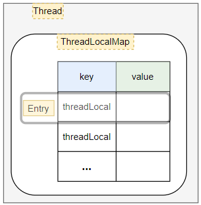

---

Created at: 2021-08-10
Last updated at: 2022-08-23
Source URL: about:blank


---

# 07-ThreadLocal原理


实例化ThreadLocal对象的两种方式：
1.普通的实例化
```
ThreadLocal<Integer> threadLocal = new ThreadLocal<>();
```
2.指定初始化value的实例化，在get()方法没有值时调用initialValue()方法设置默认值
```
ThreadLocal<Integer> threadLocal = new ThreadLocal<>() {
    @Override
    protected Integer initialValue() {
        return 1;
    }
};
```
上面的写法等价于，推荐使用下面这种，withInitial()方法就是jdk提供用来替代上面那种实例化方式的方法
```
ThreadLocal<Integer> threadLocal = ThreadLocal.withInitial(() -> 1);
```

原理：
ThreadLocalMap是ThreadLocal的一个静态内部类，每个Thread对象都有一个ThreadLocalMap对象，值就保存在该ThreadLocalMap对象里面，通过调用ThreadLocalMap的set()和get()方法来设置和获取值。
```
ThreadLocal.ThreadLocalMap threadLocals = null;
```

ThreadLocal会为每个Thread对象创建一个ThreadLocalMap实例，所以每个线程set值和get值都不会互相干扰。在set值的时候，key是调用set方法的ThreadLocal对象，所以Thread可以利用不同的ThradLocal保存不同的值。
```
public void set(T value) {
    Thread t = Thread.currentThread();
    ThreadLocalMap map = getMap(t);
    if (map != null) {
        map.set(this, value);
    } else {
        createMap(t, value);
    }
}
```

没看源码之前的思考是：ThreadLocal是一个Map，每个Thread调用ThreadLocal的set就是在往这个Map里设置值，key是Thread，所以ThreadLocal需要解决并发修改Map的问题。如果要保存多个值就需要创建多个ThreadLocal。
看了源码之后发现是反的，每个Thread都有一个Map，然后调用ThreadLocal的set就是在往这个Map里设置值，key是ThreadLocal对象，如此一来就不需要解决并发修改Map的问题，因为每个线程都有自己的Map，不存在并发修改的问题。因为key是ThreadLocal对象，所以要保存多个值就需要创建多个ThreadLocal，也可以达到同样的目的并且还巧妙的避开了并发修改Map的问题。
下面是ThradLocal的get()方法，可以看到就是在Thread自己的Map上取值。
```
public T get() {
    Thread t = Thread.currentThread();
    ThreadLocalMap map = getMap(t);
    if (map != null) {
        ThreadLocalMap.Entry e = map.getEntry(this);
        if (e != null) {
            @SuppressWarnings("unchecked")
            T result = (T)e.value;
            return result;
        }
    }
    return setInitialValue();
}
```

**ThreadLocal的内存泄露问题**：如果一个使用了ThreadLocal的线程迟迟不结束，那么它就会一直持有ThreadLocalMap对象的引用，所以ThreadLocalMap对象也就不能被回收，ThreadLocalMap对象里面保存着key和value，它们也是引用，不过key是ThreadLocal对象的弱引用，所以不会给ThreadLocal对象的回收造成负担，但是value是用户设置的强引用，所以只要ThreadLocalMap对象不释放，value所指向的对象也就不能被释放，并且还会出现key所指向的ThreadLocalMap对象已经被回收，此时key为null，但是key对应的value却不能回收的情况，这就是妥妥的内存泄露。（ThreadLocalMap的Entry的key是弱引用，所以Entry的key不会作为ThreadLocal对象的引用计数，当发生gc时，如果ThreadLocal对象没有强引用了（典型的就是最初创建ThreadLocal对象时的引用），ThreadLocal对象可以被顺利回收，此时ThreadLocalMap的Entry的key为null。）
解决内存ThreadLocal的内存泄露的方法就是当线程不再使用ThreadLocal时，需要调用其remove()方法删除ThreadLocalMap对象里的Entry。

