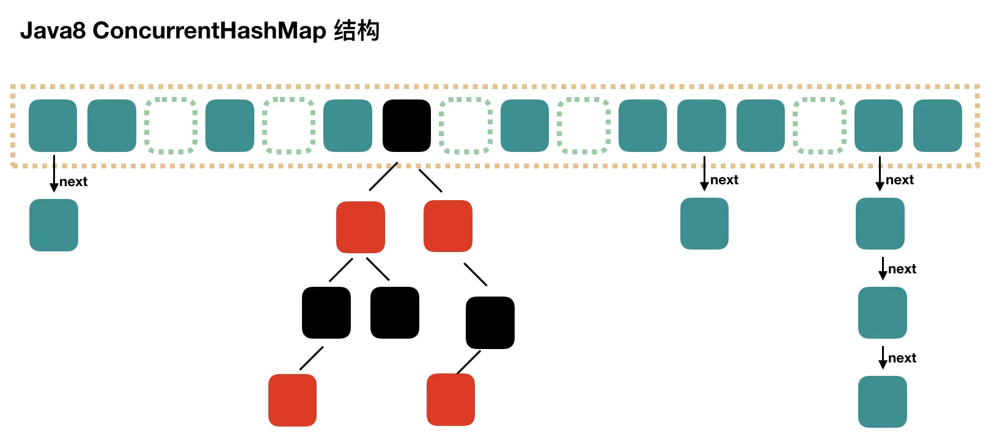
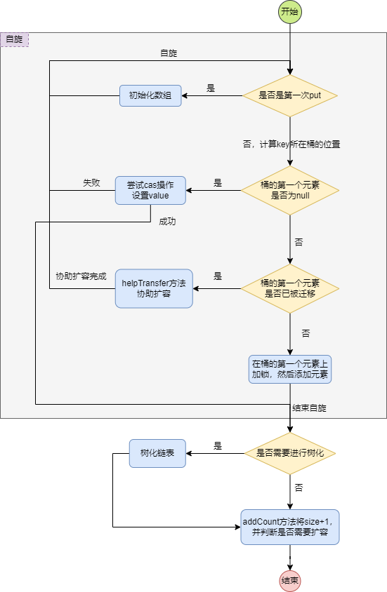
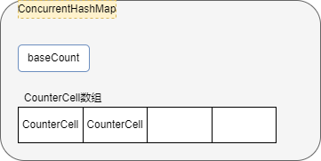
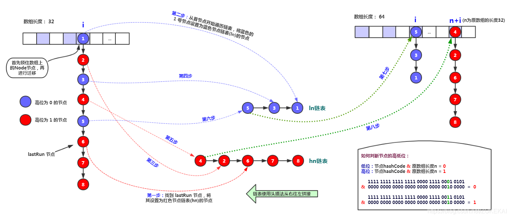

---

Created at: 2021-08-10
Last updated at: 2024-08-29
Source URL: about:blank


---

# 08-ConcurrentHashMap-jdk15源码解读


ConcurrentHashMap的数据结构和HashMap一样：数组+链表+红黑树。


**几个重要的常量**
```
//数组最大容量
private static final int MAXIMUM_CAPACITY = 1 << 30;
//数组默认容量
private static final int DEFAULT_CAPACITY = 16;
//默认的装载因子，也可以在构造器中给出，不过它只在初始化数组的时候有用，之后的扩容阈值都与它没关系，即之后计算扩容阈值没有使用它进行计算，而是使用位运算，如n - (n >>> 2)
private static final float LOAD_FACTOR = 0.75f;
//默认树化阈值，当链表长度大于等于这个阈值时考虑树化
static final int TREEIFY_THRESHOLD = 8;
//解除树化的阈值
static final int UNTREEIFY_THRESHOLD = 6;
//最小树化的容量，即当数组长度小于64的时候，若链表长度大于8，不会进行树化，而是进行扩容
static final int MIN_TREEIFY_CAPACITY = 64;
//最小迁移步长，多线程迁移map时，每个线程领取的最小子数组的长度
private static final int MIN_TRANSFER_STRIDE = 16;
//协助扩容的最大线程数
private static final int MAX_RESIZERS = (1 << (32 - RESIZE_STAMP_BITS)) - 1;
//forwarding节点的hash值
static final int MOVED = -1; // hash for forwarding nodes
`//如果一个桶已经树化了，那么树根节点的hash就是-2`
`static final int TREEBIN   = -2; // hash for roots of trees`
//cpu核数
static final int NCPU = Runtime.getRuntime().availableProcessors();
```

**几个重要的静态内部类**
链表的节点：
```
static class Node<K,V> implements Map.Entry<K,V> {
    final int hash;
    final K key;
    volatile V val;
    volatile Node<K,V> next;
}
```
迁移时，放在已经迁移完的桶上，就是把数组元素原来的位置上的节点替换成forwarding节点
```
static final class `ForwardingNode`<K,V> extends Node<K,V> {
    final Node<K,V>[] nextTable;
    ForwardingNode(Node<K,V>[] tab) {
        super(`MOVED`, null, null);
        this.nextTable = tab;
    }
}
```
红黑树节点：
```
static final class TreeNode<K,V> `extends Node<K,V>` {
    TreeNode<K,V> parent;  // red-black tree links
    TreeNode<K,V> left;
    TreeNode<K,V> right;
    TreeNode<K,V> prev;    // needed to unlink next upon deletion
    boolean red;

    TreeNode(int hash, K key, V val, Node<K,V> next,
             TreeNode<K,V> parent) {
        super(hash, key, val, next);
        this.parent = parent;
    }
}
```
维护ConcurrentHashMap的节点数时用：
```
@jdk.internal.vm.annotation.Contended static final class CounterCell {
    volatile long value;
    CounterCell(long x) { value = x; }
}
```

**几个重要的静态方法**
这几个是利用CAS操作实现的原子方法：
```
//取数组下标 i 处的Node节点
static final <K,V> Node<K,V> tabAt(Node<K,V>[] tab, int i) {
    return (Node<K,V>)U.getReferenceAcquire(tab, ((long)i << ASHIFT) + ABASE);
}

//设置数组下标 i 处的Node节点，如果符合预期c，才设置为v
static final <K,V> boolean casTabAt(Node<K,V>[] tab, int i,
                                    Node<K,V> c, Node<K,V> v) {
    return U.compareAndSetReference(tab, ((long)i << ASHIFT) + ABASE, c, v);
}

//直接将Node设置到数组下标 i 处
static final <K,V> void setTabAt(Node<K,V>[] tab, int i, Node<K,V> v) {
    U.putReferenceRelease(tab, ((long)i << ASHIFT) + ABASE, v);
}
```

**几个重要的成员变量**
```
//数组
transient volatile Node<K,V>[] table;
//扩容时新建的数组，等到把原数组中的元素都迁移到新新数组后，就会把这个变量的值赋给上面table，然后这个变量赋为null。所以这个变量只在扩容时才非null
private transient volatile Node<K,V>[] nextTable;
//ConcurrentHashMap的节点数的基数，它与下面的CounterCell数组中所有元素的和才是真正的ConcurrentHashMap的节点数，这样做的目的是提高并发程度，其原理和原子累加器LongAdder一样
private transient volatile long baseCount;
private transient volatile CounterCell[] counterCells;
//对counterCells并发修改时的锁标记（利用cas实现）
private transient volatile int cellsBusy;
//sizeCtl的值含义比较多，后面单独说明
private transient volatile int sizeCtl;
//扩容时，transferIndex指示着还没有被领取迁移任务的数组最大下标+1
private transient volatile int transferIndex;
```

**sizeCtl含义**

* sizeCtl为0，代表数组未初始化， 且数组的初始容量为16
* sizeCtl为正数，如果数组未初始化，那么其记录的是数组的初始容量，如果数组已经初始化，那么其记录的是数组的扩容阈值
* sizeCtl为-1，表示数组正在进行初始化
* sizeCtl小于0，并且不是-1，表示数组正在扩容， -(1+n)，表示此时有n个线程正在共同完成数组的扩容操作

**初始化**
ConcurrentHashMap中一共有5个构造方法，这四个构造方法中都没有对内部的数组做初始化， 只是对一些变量的初始值做了处理，真正做数组初始化是在第一次添加元素时完成，即懒初始化（Lazily initialized）。
```
//如果调用该方法，数组长度默认是16
public ConcurrentHashMap() {
}
//传一个初始容量，ConcurrentHashMap会基于这个值计算一个比这个值大的2的幂次方数作为初始容量
public ConcurrentHashMap(int initialCapacity) {
    this(initialCapacity, LOAD_FACTOR, 1);
}

public ConcurrentHashMap(Map<? extends K, ? extends V> m) {
    this.sizeCtl = DEFAULT_CAPACITY;
    putAll(m);
}

public ConcurrentHashMap(int initialCapacity, float loadFactor) {
    this(initialCapacity, loadFactor, 1);
}
//计算一个大于或者等于给定的容量值，该值是2的幂次方数作为初始容量
public ConcurrentHashMap(int initialCapacity,
                         float loadFactor, int concurrencyLevel) {
    if (!(loadFactor > 0.0f) || initialCapacity < 0 || concurrencyLevel <= 0)
        throw new IllegalArgumentException();
    if (initialCapacity < concurrencyLevel)   // Use at least as many bins
        initialCapacity = concurrencyLevel;   // as estimated threads
    long size = (long)(1.0 + (long)initialCapacity / loadFactor);
    int cap = (size >= (long)MAXIMUM_CAPACITY) ?
        MAXIMUM_CAPACITY : tableSizeFor((int)size);
    this.sizeCtl = cap;
}
```

**put方法**
源码解读：
```
public V put(K key, V value) {
    return putVal(key, value, false);
}

/** Implementation for put and putIfAbsent */
//put方法和putIfAbsent方法的实现都是putVal方法，onlyIfAbsent就是用来区分的标记
final V putVal(K key, V value, boolean onlyIfAbsent) {
    if (key == null || value == null) throw new NullPointerException();
    int hash = spread(key.hashCode()); //计算key的hash值
    int binCount = 0; //桶中节点的数量
    // cas操作失败后需要重试，所以使用死循环，使用死循环+cas操作的无锁并发策略比加互斥锁效率更高，
    // 另外可以看到循环里面有很多if分支，也就是当cas操作失败后会重试很多种不同的情况，
    // 并不像最初入门乐观锁只会不断重试一个操作的例子，这里才是乐观锁正确的打开方式
    for (ConcurrentHashMap.Node<K,V>[] tab = table;;) {
        ConcurrentHashMap.Node<K,V> f; int n, i, fh; K fk; V fv;
        if (tab == null || (n = tab.length) == 0) //第一次put的时候才会初始化数组
            **`tab = initTable();`**
        // (n - 1) & hash就是hash对n取余的操作，所以i就是桶的位置
        // 如果这个桶里面没有元素，那么直接使用cas操作设置即可，失败了死循环重试其他操作
        else if ((f = tabAt(tab, i = (n - 1) & hash)) == null) {
            if (casTabAt(tab, i, null, new ConcurrentHashMap.Node<K,V>(hash, key, value)))
                break;                   // no lock when adding to empty bin
        }
        // 如果正处于扩容阶段，并且当前的桶已经被迁移到新数组，那么就需要当前的put线程进行协助扩容，以便尽快完成扩容，然后死循环重试其他添加操作
        else if ((fh = f.hash) == MOVED)
            **tab = helpTransfer(tab, f);**
        else if (onlyIfAbsent // check first node without acquiring lock
                && fh == hash
                && ((fk = f.key) == key || (fk != null && key.equals(fk)))
                && (fv = f.val) != null)
            return fv;
        else {
            V oldVal = null;
            // 对桶的第一个元素加锁，可以确保其他put线程不对该桶进行添加操作或者树化操作，
            // 如果有扩容线程，那么还可以保证扩容线程不对该桶进行迁移，直到当前线程的添加操作完成
            synchronized (f) {
                // 如果有线程线程因为上一句的加锁操作阻塞了，当本线程的添加操作完成紧接着完成了树化操作，
                // 那么桶的的哥元素就可能变了，所以当阻塞线程被唤醒之后，需要在这里double check一下
                if (tabAt(tab, i) == f) {
                    if (fh >= 0) { //大于0表示是链表
                        binCount = 1;
                        //每遍历一个节点，binCount加1，后面会根据binCount的值判断是否需要进行树化
                        for (ConcurrentHashMap.Node<K,V> e = f;; ++binCount) {
                            K ek;
                            //如果有相同的key，那么直接更新
                            if (e.hash == hash &&
                                    ((ek = e.key) == key ||
                                            (ek != null && key.equals(ek)))) {
                                oldVal = e.val;
                                if (!onlyIfAbsent)
                                    e.val = value;
                                break;
                            }
                            //如果没有相同的key，那么将新节点添加在链表尾部
                            ConcurrentHashMap.Node<K,V> pred = e;
                            if ((e = e.next) == null) {
                                pred.next = new ConcurrentHashMap.Node<K,V>(hash, key, value);
                                break;
                            }
                        }
                    }
                    //不是链表，如果是树
                    else if (f instanceof ConcurrentHashMap.TreeBin) {
                        ConcurrentHashMap.Node<K,V> p;
                        //因为已经是树化了，所以并不需要binCount++，直接赋值为2即可，赋值为2的原因是因为后面判断binCount<=1进行其他操作
                        binCount = 2;
                        if ((p = ((ConcurrentHashMap.TreeBin<K,V>)f).putTreeVal(hash, key,
                                value)) != null) {
                            oldVal = p.val;
                            if (!onlyIfAbsent)
                                p.val = value;
                        }
                    }
                    else if (f instanceof ConcurrentHashMap.ReservationNode)
                        throw new IllegalStateException("Recursive update");
                }
            }
            //binCount != 0表示添加完成了
            if (binCount != 0) {
                //判断是否需要进行树化
                if (binCount >= TREEIFY_THRESHOLD)
                    treeifyBin(tab, i);
                //如果key值已经存在，那么就不需要执行后面的addCount了，直接返回即可
                if (oldVal != null)
                    return oldVal;
                break;
            }
        }
    }
    `//对ConcurrentHashMap的size+1`
 `**addCount(1L, binCount);**`
    return null;
}
```
put方法概述：put方法实现并发安全的主要思想是 cas+自旋 的无锁并发策略，ConcurrentHashMap里的很多操作都是基于 cas+自旋 的策略，大致做法就是，在自旋里面会有很多if分支，然后逐个进行判断，如果符合某个分支判断就进行cas操作，当cas操作成功就break退出自旋，如果cas失败就自旋重试重新逐个判断。
put的大致流程如下：
1\. 首先检查是否是第一次put元素，如果是，需要先初始化数组，也就是在new ConcurrentHashMap的时候并没有初始化数组，真正做数组初始化是在第一次添加元素时完成，即懒初始化（Lazily initialized）。初始化完成后自旋进行添加元素。
2\. 将keyhash之后找到key所在桶，然后检查为null，如果是，尝试使用cas设置value，cas成功就直接break，表示添加成功，如果失败了，自旋重新尝试其他情况的添加操作。
3\. 上一步失败后表示桶的第一个位置一定有了元素，所以需要检查桶的第一个元素是否是forwarding节点，如果是，表示当前桶已经被迁移到新数组了，并且扩容操作还没有结束，此线程需要去协助扩容。
4\. 如果桶的第一个元素不是forwarding节点，那么可能的情况有3种：【没有进行扩容】、或者【正在扩容，但是桶还没有被迁移】、或者【正在扩容，但是桶还没有被迁移完，只被迁移了一部分】。由于执行添加操作需要修改链表或者树，所以需要对桶的第一个节点加互斥锁，对于前两种情况，该线程都可以加锁成功并添加成功，但是对于第3种情况，该线程会被阻塞，因为扩容线程正在迁移桶的时候也会对桶的第一个元素加互斥锁，等到扩容线程释放锁之后，该线程抢到锁也不能添加成功，因为会double check一个桶的第一个元素是否还是原来的那个元素，显然第一个元素被扩容线程换成了forwarding节点，于是该线程添加失败，自旋重新尝试后到第3步去协助扩容。
5\. 添加完成后需要检查桶的节点数量，如果达到树化的阈值，需要进行树化，需要注意的是，与HashMap一样，当数组长度小于64并且链表长度达到树化的阈值8的时候，并不会进行树化操作，而是进行扩容操作。
6\. 最后会调用\`addcount\`方法维护节点个数，并且当节点个数达到扩容阈值时\`addCount\`方法还会调用扩容方法。


什么情况下线程才会进行扩容或说加入扩容？

1. put线程发现桶已被迁移，即桶的第一个节点是ForwardingNode，那么他会加入扩容。（putVal方法里面调用helpTransfer，然后调用transfer方法）

2. put线程put成功之后对节点数加1，然后发现达到扩容阈值并且没有线程在进行扩容，那么他会作为第一个线程启动扩容流程。（addCount方法里面调用transfer方法）
3. put线程put成功之后，达到树化的阈值，但是数组长度却小于64，那么他会作为第一个线程启动扩容流程。（putVal方法里面调用treeifyBin方法，然后调用tryPresize方法，然后调用transfer方法）

3. put线程put一个新节点成功之后对节点数加1，然后发现有线程在进行扩容，那么它会加入扩容（注意put的是已有value，那么它不需要对节点数加1，也就不会加入扩容）。（addCount方法里面调用transfer方法）

如果已有线程正在进行扩容，这时新来了一个put线程，发现桶还没有被迁移，那么它会怎么做？
当put线程发现桶还没有被迁移，那么表示桶的第一个节点不是ForwardingNode，此时有两种情况可能发生，第一种情况是，这个桶正在被迁移，那么第一个节点一定已经被其他扩容线程加了锁，于是该put线程阻塞；第二种情况是桶的第一个节点没有被加锁，那么该put线程会加锁，然后put成功，如果put的是已有value，那么它不需要对节点数加1，也就不会加入扩容，但如果put的是一个新的节点，那么该put线程在put成功之后会加入扩容。

总结：一个增加新节点的线程触发了扩容操作，然后开始迁移桶，后面来的写线程如果桶还没被迁移，那么可以直接设置成功，如果该线程也是新增节点，那么会进行协助扩容，如果该线程不是新增节点，而是修改已有节点的value，则不会进行进行协助扩容；如果后面来的写线程的桶已经被迁移了，那么不管是新增节点的线程还是修改已有节点的value的线程，都会被加入协助扩容的大军中，直到扩容完毕，线程才能完成新增节点或者修改节点value。

**数组初始化**
```
private final ConcurrentHashMap.Node<K,V>[] initTable() {
    ConcurrentHashMap.Node<K,V>[] tab; int sc;
    // 用循环的目的就是，如果有多个线程在put的时候数组都还没有初始化，那么这些线程都会进入这里，
    // 然后之后的cas操作只会有一个线程成功，也就是初始化操作只会让一个线程完成，但是剩下的线程
    // 还不能跳出这个初始化方法，必须等待初始化线程完成才可以，所以这里使用while循环让其他线程
    // 进行自旋，类似的，在ConcurrentHashMap里有很多地方都是使用cas操作+循环的方式实现无锁的并发安全。
    while ((tab = table) == null || tab.length == 0) {
        //sc小于0的情况只有sc=-1，也就是下面cas操作成功的线程将sc设置为了-1，表示正在初始化
        if ((sc = sizeCtl) < 0)
            Thread.yield(); // lost initialization race; just spin
        else if (U.compareAndSetInt(this, SIZECTL, sc, -1)) { //cas操作成功的线程将sc设置为了-1，表示正在初始化
            try {
                // 其他没有进行初始化的线程在初始化线程退出后，同样会成功执行cas操作，为了避免重复初始化，
                // 这里必须进行校验，类似的双重校验在ConcurrentHashMap里还有很多地方有
                if ((tab = table) == null || tab.length == 0) {
                    // sizeCtl为0，代表数组未初始化， 且数组的初始容量为16
                    // sizeCtl为正数，如果数组未初始化，那么其记录的是数组的初始容量
                    int n = (sc > 0) ? sc : DEFAULT_CAPACITY;
                    @SuppressWarnings("unchecked")
                    ConcurrentHashMap.Node<K,V>[] nt = (ConcurrentHashMap.Node<K,V>[])new ConcurrentHashMap.Node<?,?>[n];
                    table = tab = nt;
                    // 初始化完成，sc记录的是数组的扩容阈值，n - (n >>> 2)= 3/4 * n = 0.75n
                    sc = n - (n >>> 2);
                }
            } finally {
                sizeCtl = sc;
            }
            break;
        }
    }
    return tab;
}
```

**addCount方法**
put方法的最后需要维护ConcurrentHashMap节点个数，即将节点个数加1，addCount就是这个功能，并且加1之后还会检查节点的数量是否大于扩容阈值，如果大于，那么就需要进行扩容。
```
// 维护数组长度，与原子累加器LongAdder的实现思路一致，大致流程就是：
// 先定义一个baseCount变量，当线程成功添加一个元素之后，首先使用cas操作对其加1，
// 如果cas成功，那万事大吉，如果cas操作失败，表示发生了竞争，这时让竞争失败的线程
// 对CounterCell[]数组的某个元素（随便一个元素就行）使用cas操作进行加1操作，如果这样还发生了竞争，
// 那竞争失败的线程会对CounterCell[]数组扩容，然后再对CounterCell[]数组的某个元素使用cas操作进行加1操作。
// 如此一来，ConcurrentHashMap节点的数量的计算过程就应该是baseCount加上CounterCell[]数组的和。
private final void addCount(long x, int check) {
    ConcurrentHashMap.CounterCell[] cs;
    long b, s;
    if ((cs = counterCells) != null ||
            //使用cas操作对baseCount加1，如果cas成功，那万事大吉，不进入if内
            !U.compareAndSetLong(this, BASECOUNT, b = baseCount, s = b + x)) {
        ConcurrentHashMap.CounterCell c;
        long v;
        int m;
        boolean uncontended = true;
        // 到这里表示对baseCount的cas操作失败了，发生了竞争，竞争失败的线程需要对CounterCell[]数组的某个元素加1，
        // cs == null，如果CounterCell[]数组还没有初始化，那直接初始化；
        // 如果已经初始化了，但是对CounterCell[]数组的某个元素使用cas操作进行加1又发生了竞争，
        // 那竞争失败的线程会对CounterCell[]数组进行初始化或者扩容，fullAddCount就是初始化或者扩容的方法
        if (cs == null || (m = cs.length - 1) < 0 ||
                (c = cs[ThreadLocalRandom.getProbe() & m]) == null ||
                !(uncontended =
                        //加1操作
                        U.compareAndSetLong(c, CELLVALUE, v = c.value, v + x))) {
            `//初始化或者扩容`
 `**fullAddCount(x, uncontended);**`
            return;
        }
        //check传的是binCount，链表和树都会大于1
        if (check <= 1)
            return;
        s = sumCount(); //计算ConcurrentHashMap节点的数量
    }
    // 对ConcurrentHashMap节点的数量加1之后就需要检查节点的数量是否大于扩容阈值，如果大于，那么就需要进行扩容
    if (check >= 0) {
        ConcurrentHashMap.Node<K, V>[] tab, nt;
        int n, sc;
        // 节点数量大于扩容阈值sizeCtl，并且 (tab = table) != null数组已经初始化，
        // 并且(n = tab.length) < MAXIMUM_CAPACITY 数组长度小于最大长度，那么进行扩容
        // 死循环的作用是，如果当前线程参加完一轮扩容之后，检查发现仍然满足扩容条件，那么当前线程
        // 继续加入扩容大军，我感觉不会出现这种情况
        while (s >= (long) (sc = sizeCtl) && (tab = table) != null &&
                (n = tab.length) < MAXIMUM_CAPACITY) {
            // 扩容第一步就是要给sizeCtl设置一个小于-1的负数，表示有线程正在扩容，
            // 这里的rs=-242626568是一个基数，之后每增加一个扩容线程，就会加1
            int rs = resizeStamp(n) << RESIZE_STAMP_SHIFT;
            if (sc < 0) { //sc < 0表示正在进行扩容
                //如果扩容已经结束，直接break
                if (sc == rs + MAX_RESIZERS || sc == rs + 1 ||
                        (nt = nextTable) == null || transferIndex <= 0)
                    break;
                //如果扩容没有结束，那么当前线程加入到扩容大军中
                if (U.compareAndSetInt(this, SIZECTL, sc, sc + 1))
                    **transfer(tab, nt);**
            } else if (U.compareAndSetInt(this, SIZECTL, sc, rs + 2))
                **transfer(tab, null);** //如果不是正在扩容，那么当前线程作为第一个线程进行扩容，sizeCtl的初值为rs + 2
            s = sumCount();
        }
    }
}
```

fullAddCount方法的作用是，对CounterCell\[\]初始化或者扩容，并完成加1的操作。
```
// CounterCell[]初始化或者扩容，并完成加1的操作，
// wasUncontended表示是否没有发生竞争，传进来的参一定是false，即有发生竞争
private final void fullAddCount(long x, boolean wasUncontended) {
    int h;
    //就是给h随便赋个值
    if ((h = ThreadLocalRandom.getProbe()) == 0) {
        ThreadLocalRandom.localInit();      // force initialization
        h = ThreadLocalRandom.getProbe();
        wasUncontended = true;
    }
    boolean collide = false;                // True if last slot nonempty
    for (;;) {
        ConcurrentHashMap.CounterCell[] cs; ConcurrentHashMap.CounterCell c; int n; long v;
        //如果CounterCell[]已被初始化
        if ((cs = counterCells) != null && (n = cs.length) > 0) {
            //如果找的位置为null
            if ((c = cs[(n - 1) & h]) == null) {
                //尝试new一个，cellsBusy就是一个上锁标志
                if (cellsBusy == 0) {            // Try to attach new Cell
                    ConcurrentHashMap.CounterCell r = new ConcurrentHashMap.CounterCell(x); // Optimistic create
                    //new CounterCell会锁住整个CounterCell[]，不准后面的线程new，但是可以对CounterCell[]中已有的元素进行加1
                    //可能你在想为什么不只锁住这个即将new CounterCell的slot，让其他空slot也可以new，对不起做不到，那样太复杂了
                    if (cellsBusy == 0 &&
                            U.compareAndSetInt(this, CELLSBUSY, 0, 1)) {
                        boolean created = false;
                        try {               // Recheck under lock
                            ConcurrentHashMap.CounterCell[] rs; int m, j;
                            //双重检查，因为后面来的线程也可能选中了这个位置，并且进行第二个if判断时这个线程还没赋上值
                            if ((rs = counterCells) != null &&
                                    (m = rs.length) > 0 &&
                                    rs[j = (m - 1) & h] == null) {
                                rs[j] = r;
                                created = true;
                            }
                        } finally {
                            cellsBusy = 0;
                        }
                        if (created)
                            break;
                        continue;           // Slot is now non-empty
                    }
                }
                collide = false;
            }
            else if (!wasUncontended)       // CAS already known to fail
                wasUncontended = true;      // Continue after rehash
            //如果找的位置不为null，直接cas加1
            else if (U.compareAndSetLong(c, CELLVALUE, v = c.value, v + x))
                break;
            else if (counterCells != cs || n >= NCPU) //变量collide的作用有两个，一是如果CAS非空cell失败了一次，那么再继续重试一次，而不是直接走扩容，二是如果counterCells的长度大于CPU的核心数，那么就不会再对CounterCell[]进行扩容了。
                collide = false;            // At max size or stale
            else if (!collide)
                collide = true;
            //如果多个线程选中同一个CounterCell，并且还发生竞争，那么就会对CounterCell[]进行扩容
            else if (cellsBusy == 0 &&
                    U.compareAndSetInt(this, CELLSBUSY, 0, 1)) {
                try {
                    // 扩容，扩容的时候可以对其中的CounterCell加1，因为CounterCell[]中存的是指向CounterCell的引用，
                    // 这是两个不同的对象，并发操作互不影响，如果想new一个CounterCell加入到CounterCell[]才会并发冲突，这就是设置cellsBusy变量的原因
                    if (counterCells == cs) // Expand table unless stale
                        counterCells = Arrays.copyOf(cs, n << 1);
                } finally {
                    cellsBusy = 0;
                }
                collide = false;
                continue;                   // Retry with expanded table
            }
            h = ThreadLocalRandom.advanceProbe(h);
        }
        //如果CounterCell[]还没有被初始化
        else if (cellsBusy == 0 && counterCells == cs &&
                U.compareAndSetInt(this, CELLSBUSY, 0, 1)) {
            boolean init = false;
            try {                           // Initialize table
                //双重校验，因为后面需要改变counterCells的值
                if (counterCells == cs) {
                    //初始化
                    ConcurrentHashMap.CounterCell[] rs = new ConcurrentHashMap.CounterCell[2];
                    //加1操作
                    rs[h & 1] = new ConcurrentHashMap.CounterCell(x);
                    counterCells = rs;
                    init = true;
                }
            } finally {
                cellsBusy = 0;
            }
            if (init)
                break;
        }
        //初始化CounterCell[]时出现了竞争，竞争失败的线程会到这里来，直接对baseCount加1
        else if (U.compareAndSetLong(this, BASECOUNT, v = baseCount, v + x))
            break;                          // Fall back on using base
    }
}
```

ConcurrentHashMap维护size的流程概述：
数据结构如下图所示


1. 如果CounterCell\[\]数组不为空，那么直接对CounterCell\[\]数组中某个元素（随机的）做加1的cas操作
2. 如果CounterCell\[\]数组为空，那直接对baseCount做加1的cas操作，如果成功就返回，如果失败那么对CounterCell\[\]数组中某个元素（随机的）做加1的cas操作
	

对CounterCell\[\]数组中某个元素做加1的cas操作流程如下：

1. 如果CounterCell\[\]数组不为空，那随机找一个元素加1，如果改元素为null，那先new一个元素，然后自旋加1，如果加1失败，那就再自旋重试一次，如果再次失败则判断CounterCell\[\]长度是否大于CPU核心数，如果小于则将CounterCell\[\]数组扩容为原来两倍，否则一直自旋重试
	
2. 如果CounterCell\[\]数组为空，则初始化CounterCell\[\]数组，然后随机找一个元素加1
	
3. 如果竞争初始化CounterCell\[\]数组失败，那就对baseCount做加1的cas操作。
	

需要注意两点：
1.为什么加1操作都要这么麻烦，因为想高效的实现多个线程的并发写，不同线程对多个不同的对象执行加1的cas操作更加不容易失败
2.CounterCell\[\]数组在扩容时，其他线程可以对已有的CounterCell做加1的cas操作，但是不能new一个CounterCell加入到CounterCell\[\]数组中，因为前者是在两个不同的对象中完成，后者是多个线程在修改同一个对象。

**size方法**，用于计算ConcurrentHashMap节点的数量，计算过程就应该是baseCount加上CounterCell\[\]数组的和。
```
public int size() {
    long n = sumCount();
    return ((n < 0L) ? 0 :
            (n > (long)Integer.MAX_VALUE) ? Integer.MAX_VALUE :
            (int)n);
}
```
```
final long sumCount() {
    CounterCell[] cs = counterCells;
    long sum = baseCount;
    if (cs != null) {
        for (CounterCell c : cs)
            if (c != null)
                sum += c.value;
    }
    return sum;
}
```

**transfer方法**，扩容方法的实现
```
// 扩容，参数tab是旧的hash表，nextTab是即将要迁移到的新hash表，迁移完成之后会将nextTab赋给table，然后nextTable置为null
// （类似sc是成员变量sizeCtl的局部变量副本，tab是成员变量table的局部变量副本，nextTab是成员变量nextTable的局部变量副本）
private final void transfer(ConcurrentHashMap.Node<K,V>[] tab, ConcurrentHashMap.Node<K,V>[] nextTab) {
    int n = tab.length, stride;
    // 计算步长stride，每个扩容线程每次都是领取数组的一个步长长度作为一次迁移任务，本次迁移任务完成之后，再领取下一次的迁移任务，
    // 若cpu是单核，即NCPU=1，那么stride就等于整个数组的长度，也就是只用一个线程完成整个map的迁移，否则通过cpu核数与数组长度一起计算出stride，
    // 若步长小于最小迁移步长，那么就使用最小迁移步长
    if ((stride = (NCPU > 1) ? (n >>> 3) / NCPU : n) < MIN_TRANSFER_STRIDE)
        stride = MIN_TRANSFER_STRIDE; // subdivide range
    //如果新数组还没有被初始化，那就先进行初始化
    if (nextTab == null) {            // initiating
        try {
            @SuppressWarnings("unchecked")
            ConcurrentHashMap.Node<K,V>[] nt = (ConcurrentHashMap.Node<K,V>[])new ConcurrentHashMap.Node<?,?>[n << 1];
            nextTab = nt;
        } catch (Throwable ex) {      // try to cope with OOME
            sizeCtl = Integer.MAX_VALUE;
            return;
        }
        //将初始化好的新数组赋给成员变量nextTable
        nextTable = nextTab;
        // 成员变量transferIndex指示着还没有被迁移的数组最大下标，即下一次迁移任务会从这里开始领取一个步长，
        // 每次的迁移任务都是从右往左分配一个步长
        transferIndex = n;
    }
    int nextn = nextTab.length;
    //新建一个Forwarding节点，ForwardingNode有个成员变量nextTable，同样指向新的还未迁移完的数组
    ConcurrentHashMap.ForwardingNode<K,V> fwd = new ConcurrentHashMap.ForwardingNode<K,V>(nextTab);
    boolean advance = true; //标识迁移线程是否继续--i
    //标识迁移是否结束，这个变量的主要作用是，控制最后一个完成迁移的线程在即将退出迁移时做一次整个数组的扫描，以免出现有未被迁移的桶
    boolean finishing = false; // to ensure sweep before committing nextTab
    //i指示着线程正在处理的桶，bound指示本次迁移任务的下界
    for (int i = 0, bound = 0;;) {
        ConcurrentHashMap.Node<K,V> f; int fh;
        while (advance) {
            int nextIndex, nextBound;
            //未到本次迁移任务的下界，就--i继续做迁移动作
            if (--i >= bound || finishing) {
                advance = false;
            }
            //transferIndex=0表示整个数组划分的迁移任务都被领取完了，
            //所以如果i<bound并且transferIndex=0，也就表示当前线程不必再领取迁移任务了
            else if ((nextIndex = transferIndex) <= 0) {
                i = -1;
                advance = false;
            }
            //线程在这里领取一个迁移任务，比如当前就数组长度是64，那么transferIndex=64，于是bound=64-16=48，i=63，
            //也即线程本次的迁移任务是数组的[48,63]这16个桶
            else if (U.compareAndSetInt
                    (this, TRANSFERINDEX, nextIndex,
                            nextBound = (nextIndex > stride ?
                                    nextIndex - stride : 0))) {
                bound = nextBound;
                i = nextIndex - 1;
                advance = false;
            }
        }
        // i<0的时候，也就是transferIndex=0并且当前线程以已经完成本次迁移任务的时候，
        // 也就是整个数组划分的迁移任务都被领取完了
        if (i < 0 || i >= n || i + n >= nextn) {
            int sc;
            if (finishing) {
                nextTable = null;
                table = nextTab;
                sizeCtl = (n << 1) - (n >>> 1);
                return;
            }
            //当前线程以已经完成本次迁移任务并且没有可领取的迁移任务，需要退出迁移，退出前sc - 1，表示正在扩容的线程数量-1
            if (U.compareAndSetInt(this, SIZECTL, sc = sizeCtl, sc - 1)) {
                //不等号成立表示当前线程并不是最后退出迁移的线程，所以之前返回即可
                if ((sc - 2) != resizeStamp(n) << RESIZE_STAMP_SHIFT)
                    return;
                //能走到这里，表示当前线程就是最后一个退出迁移的线程，所以置finishing=true
                finishing = advance = true;
                //i=n就是让最后退出迁移的任务重新检查一遍数组，以免出现遗漏的违背迁移的桶
                i = n; // recheck before commit
            }
        }
        //正准备迁移的桶为null，直接将forwarding节点设置到当前桶即可
        else if ((f = tabAt(tab, i)) == null)
            advance = casTabAt(tab, i, null, fwd);
        // 桶的第一个元素的hash值为MOVED表示当前桶已经被迁移，所以需要直接检查下一个桶，
        // 这个if条件只在最后一个线程退出时检查整个数组时成立
        else if ((fh = f.hash) == MOVED)
            advance = true; // already processed
        else { //进到这里表示需要对桶中的链表或者树的每一个节点进行迁移
            synchronized (f) { //锁住链表或者树的第一个节点，以免其他put线程在该桶上插入或修改节点，（不会导致其他扩容线程的阻塞，因为每个线程领取到的任务都是不同的范围）
                if (tabAt(tab, i) == f) { //double check一下
                    ConcurrentHashMap.Node<K,V> ln, hn;
                    `// 下面进行链表或树的迁移，值得注意的地方是，迁移过程中会对每个节点进行复制，也就是新Map中的节点都是new出来的，`
 `// 并不只是将桶的第一个元素复制到了新数组，这么做的原因就是确保读写可以并发，即写时复制的思想，保证迁移过程中读不受影响`
 `// 迁移完之后会将forwarding节点设置到旧桶上，之后的读会被转发到新数组上进行`
                    if (fh >= 0) { //如果是链表
                        int runBit = fh & n;
                        ConcurrentHashMap.Node<K,V> lastRun = f;
                        for (ConcurrentHashMap.Node<K,V> p = f.next; p != null; p = p.next) {
                            int b = p.hash & n;
                            if (b != runBit) {
                                runBit = b;
                                lastRun = p;
                            }
                        }
                        if (runBit == 0) {
                            ln = lastRun;
                            hn = null;
                        }
                        else {
                            hn = lastRun;
                            ln = null;
                        }
                        for (ConcurrentHashMap.Node<K,V> p = f; p != lastRun; p = p.next) {
                            int ph = p.hash; K pk = p.key; V pv = p.val;
                            if ((ph & n) == 0)
                                ln = new ConcurrentHashMap.Node<K,V>(ph, pk, pv, ln);
                            else
                                hn = new ConcurrentHashMap.Node<K,V>(ph, pk, pv, hn);
                        }
                        setTabAt(nextTab, i, ln);
                        setTabAt(nextTab, i + n, hn);
                        setTabAt(tab, i, fwd); //将forwarding节点设置到旧桶上，之后的读会被转发到新数组上进行
                        advance = true;
                    }
                    else if (f instanceof ConcurrentHashMap.TreeBin) { //如果已经树化
                        ConcurrentHashMap.TreeBin<K,V> t = (ConcurrentHashMap.TreeBin<K,V>)f;
                        ConcurrentHashMap.TreeNode<K,V> lo = null, loTail = null;
                        ConcurrentHashMap.TreeNode<K,V> hi = null, hiTail = null;
                        int lc = 0, hc = 0;
                        for (ConcurrentHashMap.Node<K,V> e = t.first; e != null; e = e.next) {
                            int h = e.hash;
                            ConcurrentHashMap.TreeNode<K,V> p = new ConcurrentHashMap.TreeNode<K,V>
                                    (h, e.key, e.val, null, null);
                            if ((h & n) == 0) {
                                if ((p.prev = loTail) == null)
                                    lo = p;
                                else
                                    loTail.next = p;
                                loTail = p;
                                ++lc;
                            }
                            else {
                                if ((p.prev = hiTail) == null)
                                    hi = p;
                                else
                                    hiTail.next = p;
                                hiTail = p;
                                ++hc;
                            }
                        }
                        ln = (lc <= UNTREEIFY_THRESHOLD) ? untreeify(lo) :
                                (hc != 0) ? new ConcurrentHashMap.TreeBin<K,V>(lo) : t;
                        hn = (hc <= UNTREEIFY_THRESHOLD) ? untreeify(hi) :
                                (lc != 0) ? new ConcurrentHashMap.TreeBin<K,V>(hi) : t;
                        setTabAt(nextTab, i, ln);
                        setTabAt(nextTab, i + n, hn);
                        setTabAt(tab, i, fwd); //将forwarding节点设置到旧桶上，之后的读会被转发到新数组上进行
                        advance = true;
                    }
                    else if (f instanceof ConcurrentHashMap.ReservationNode)
                        throw new IllegalStateException("Recursive update");
                }
            }
        }
    }
}
```

**helpTransfer方法**， 协助扩容方法，put线程对key做完hash取余操作后，发现桶已经被迁移到新数组，那么该线程也会参与扩容，好处是提高并发，以便快速完成扩容，只有完成扩容之后，该线程才能将值put成功。
```
// 协助扩容方法，当put线程对key做完hash取余操作后，发现桶已经被迁移到新数组，那么该线程也会参与扩容，好处是提高并发，以便快速完成扩容，
// 只有完成扩容之后，该线程才能将值put成功。
final ConcurrentHashMap.Node<K,V>[] helpTransfer(ConcurrentHashMap.Node<K,V>[] tab, ConcurrentHashMap.Node<K,V> f) {
    ConcurrentHashMap.Node<K,V>[] nextTab; int sc;
    //重复检查一下数组是否为null，当前节点是否是ForwardingNode，新数组是否为Null，以免并发出现问题，啥问题也懒得细想了
    if (tab != null && (f instanceof ConcurrentHashMap.ForwardingNode) &&
            (nextTab = ((ConcurrentHashMap.ForwardingNode<K,V>)f).nextTable) != null) {
        //sizeCtl正在扩容时的基数，每增加一个扩容线程就会在此基础上加1
        int rs = resizeStamp(tab.length) << RESIZE_STAMP_SHIFT;
        while (nextTab == nextTable && table == tab &&
                (sc = sizeCtl) < 0) {
            //如果没有扩容线程了（当前线程并不是扩容的发起者，它只是在添加元素时发现了map正在扩容罢了），或者没有子任务了，就可以直接返回了
            if (sc == rs + MAX_RESIZERS || sc == rs + 1 ||
                    transferIndex <= 0)
                break;
            //否则参加扩容，扩容线程数加1
            if (U.compareAndSetInt(this, SIZECTL, sc, sc + 1)) {
                transfer(tab, nextTab);
                break;
            }
        }
        return nextTab;
    }
    return table;
}
```

扩容 步长是如何计算的？
若cpu是单核，即NCPU=1，那么stride就等于整个数组的长度，也就是只用一个线程完成整个map的迁移，否则通过cpu核数与数组长度一起计算出stride，然后若步长小于最小迁移步长，那么就使用最小迁移步长16。

多线程扩容流程概述：

1. 首先检查是否是第一次put元素，如果是，需要先初始化数组，也就是在new ConcurrentHashMap的时候并没有初始化数组，真正做数组初始化是在第一次添加元素时完成，即懒初始化（Lazily initialized）。初始化完成后自旋进行添加元素。
2. 将keyhash之后找到key所在桶，然后检查为null，如果是，尝试使用cas设置value，cas成功就直接break，表示添加成功，如果失败了，自旋重新尝试其他情况的添加操作。
3. 上一步失败后表示桶的第一个位置一定有了元素，所以需要检查桶的第一个元素是否是forwarding节点，如果是，表示当前桶已经被迁移到新数组了，并且扩容操作还没有结束，此线程需要去协助扩容。
4. 如果桶的第一个元素不是forwarding节点，那么可能的情况有3种：【没有进行扩容】、或者【正在扩容，但是桶还没有被迁移】、或者【正在扩容，但是桶还没有被迁移完，只被迁移了一部分】。由于执行添加操作需要修改链表或者树，所以需要对桶的第一个节点加互斥锁，对于前两种情况，该线程都可以加锁成功并添加成功，但是对于第3种情况，该线程会被阻塞，因为扩容线程正在迁移桶的时候也会对桶的第一个元素加互斥锁，等到扩容线程释放锁之后，该线程抢到锁也不能添加成功，因为会double check一个桶的第一个元素是否还是原来的那个元素，显然第一个元素被扩容线程换成了forwarding节点，于是该线程添加失败，自旋重新尝试后到第3步去协助扩容。
5. 添加完成后需要检查桶的节点数量，如果达到树化的阈值，需要进行树化，需要注意的是，与HashMap一样，当数组长度小于64并且链表长度达到树化的阈值8的时候，并不会进行树化操作，而是进行扩容操作。
6. 最后会调用addcount方法维护节点个数，并且当节点个数达到扩容阈值时addCount方法还会调用扩容方法。


链表的迁移：

值得注意的是：链表和树的迁移时，是对每个节点进行复制，也就是新Map中的节点都是new出来的，而不是只将桶的第一个元素复制到了新数组，这么做的原因就是确保读写可以并发，即写时复制的思想，保证迁移过程中读不受影响（迁移时同一个桶上的元素会被分散迁移到新数组的两个不同的桶中，所以如果不对节点进行复制必然会对读操作混乱），迁移完之后会将forwarding节点设置到旧桶上，之后的读会被转发到新数组上进行。

**get方法**
ConcurrentHashMap的设计已经解决了读写并发的问题，只管读就好，主要原因：
1.Node的val用volatile修饰，所以如果写线程先修改了，读线程能及时读到（这里没有数据库事务的那种概念，没有说我现在在读，其他线程不能写的情况）。
2.读操作发生在写操作之前，或者读操作发生在写操作之后，或者读操作发生在写操作之中（扩容时）都是可以的，容器并不保证这种读写顺序，想要保证读写顺序应该是上层应用根据实际业务另外加锁。解释一下读操作发生在写操作之中（扩容时）的场景：如果正在发生扩容操作，并且读线程的所读的桶被迁移了，读线程不会被拉到扩容大军，而是直接`根据forwarding节点的nextTable属性在新扩容的数组上查找`，这也就是forwarding节点名字的由来，即将读请求转发到新的扩容数组。
```
public V get(Object key) {
    Node<K,V>[] tab; Node<K,V> e, p; int n, eh; K ek;
    int h = spread(key.hashCode());
    if ((tab = table) != null && (n = tab.length) > 0 &&
        (e = tabAt(tab, (n - 1) & h)) != null) {
        //如果桶的第一个节点就是要找的，直接返回
        if ((eh = e.hash) == h) {
            if ((ek = e.key) == key || (ek != null && key.equals(ek)))
                return e.val;
        }
        `//eh<0有两种可能，一是，该桶是一颗树，根节点的hash值等于-2；另外一种可能是ConcurrentHashMap正在扩容，该桶已经被迁移了，所以此位置是一个forwarding节点。因为节点都是继承自Node，所以e.find(h, key)会调用对应实例的方法在树上查找，或者根据forwarding节点的nextTable属性在新扩容的数组上查找。`
        else if (eh < 0)
            return (p = e.find(h, key)) != null ? p.val : null;
        //在链表上查找
        while ((e = e.next) != null) {
            if (e.hash == h &&
                ((ek = e.key) == key || (ek != null && key.equals(ek))))
                return e.val;
        }
    }
    return null;
}
```

