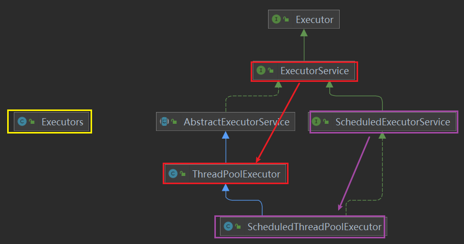
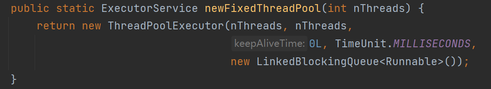
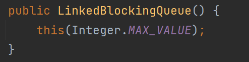
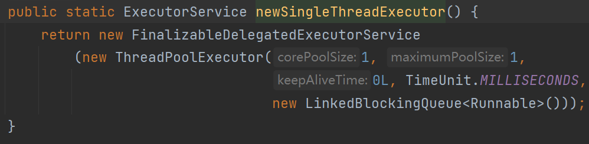
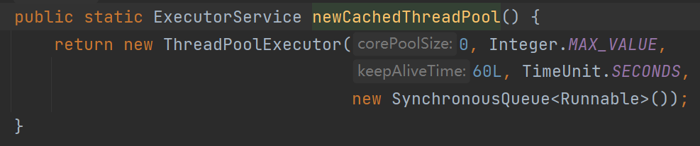

---

Created at: 2021-08-10
Last updated at: 2021-12-16
Source URL: about:blank


---

# 10--线程池




Executors是线程池的工具类和工厂类，主要是来创建线程池的，比如：
```
ExecutorService threadPool = Executors.newFixedThreadPool(5);    //固定容量
ExecutorService threadPool = Executors.newSingleThreadExecutor();     //单个线程的线程池
ExecutorService threadPool = Executors.newCachedThreadPool();     //缓存的 即超出就自动创建线程的
```
这几种类型的线程池其实都是ThreadPoolExecutor的实例。

下面是ThreadPoolExecutor类的构造器：
```
public ThreadPoolExecutor(int corePoolSize,
                          int maximumPoolSize,
                          long keepAliveTime,
                          TimeUnit unit,
                          BlockingQueue<Runnable> workQueue,
                          ThreadFactory threadFactory,
                          RejectedExecutionHandler handler)
```
corePoolSize：线程池中常驻的线程数 。初始时，当线程池中线程池数小于corePoolSize时，系统默认是添加一个任务才创建一个线程池，可以通过调用prestartAllCoreThreads方法一次性的启动corePoolSize个数的线程，当线程数等于corePoolSize时，新任务会追加到workQueue中。
maximumPoolSize：线程池中最大线程数
keepAliveTime： 超过常驻线程数的线程在空闲下来keepAliveTime后会被销毁
unit：keepAliveTime的时间单位
workQueue：阻塞队列
threadFactory：线程工厂，用于创建线程，一般默认
handler：拒绝策略，当阻塞队列满了，并且线程池中的线程数等于最大线程数时，新提交的任务会执行拒绝策略

线程池的工作流程：
    1.当提交的任务数小于常驻线程数corePoolSize时，直接使用常驻线程执行任务；
    2.常驻线程均在执行任务时，再提交的任务会进入阻塞队列workQueue
    3.阻塞队列已满时，会直接再创建线程执行新的任务，但总的线程数不会超过maximumPoolSize
    4.总的线程数等于最大线程数maximumPoolSize，并且所有线程均在执行任务，而且此时任务队列也是满的，那么再提交的任务会执行拒绝策略handler


拒绝策略：
1.AbortPolicy，默认的，直接抛出异常，阻止系统正常工作
```
new ThreadPoolExecutor.AbortPolicy()
```
2.CallerRunsPolicy，把任务交给调用者线程执行
```
new ThreadPoolExecutor.CallerRunsPolicy()
```
3.DiscardPolicy，默默丢弃任务
```
new ThreadPoolExecutor.DiscardPolicy()
```
4.DiscardOldestPolicy，丢掉最老的任务，也就是下一个即将执行的任务
```
new ThreadPoolExecutor.DiscardOldestPolicy()
```

示例：
```
public class ThreadPoolDemo02 {
    public static void main(String[] args) {
        ThreadPoolExecutor threadPoolExecutor = new ThreadPoolExecutor(
                5,
                8,
                2,
                TimeUnit.SECONDS, new LinkedBlockingQueue<Runnable>(2),
                Executors.defaultThreadFactory(),
                new ThreadPoolExecutor.AbortPolicy()
//                new ThreadPoolExecutor.CallerRunsPolicy()
//                new ThreadPoolExecutor.DiscardPolicy()
//                new ThreadPoolExecutor.DiscardOldestPolicy()
        );
        for (int i = 0; i < 15; i++) {
            final int temp = i;
            threadPoolExecutor.execute(()->{
                System.out.println(Thread.currentThread().getName() + " 为提供 " + temp + " 服务");
            });
        }
        threadPoolExecutor.shutdown();
    }
}
```

以下几种创建线程池的方式用的少
创建固定容量的线程池
```
ExecutorService threadPool = Executors.newFixedThreadPool(5);    //固定容量
```
实际上

其中new LinkedBlockingQueue<Runnable>()就是：

所以固定容量的线程池多出的任务会放在LinkedBlockingQueue中，直到OOM

创建单个线程的线程池：
```
ExecutorService threadPool = Executors.newSingleThreadExecutor();     //单个线程的线程池
```

所以多出的任务会放在LinkedBlockingQueue中，直到OOM

创建缓存线程池：
```
ExecutorService threadPool = Executors.newCachedThreadPool();     //缓存的 即超出就自动创建线程的
```

也就来新任务后，如果线程池就没有空闲的线程就创建新线程执行新任务，直到创建的线程太多了导致OOM

