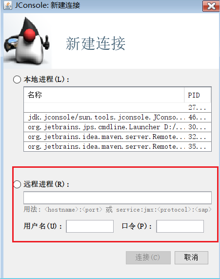

---

Created at: 2021-08-11
Last updated at: 2021-11-09


---

# 11-查看和杀死线程


Windows cmd命令：

|     |     |
| --- | --- |
| 查看进程 | tasklist |
| 杀死进程 | taskkill |

Linux命令：

|     |     |
| --- | --- |
| 查看所有进程 | ps -ef |
| 查看某个进程（PID）的所有线程 | ps -fT -p <PID> |
| 杀死进程 | kill |
| 按大写 H 切换是否显示线程 | top |
| 查看某个进程（PID）的所有线程 | top -H -p <PID> |

Java命令：

|     |     |
| --- | --- |
| 命令查看所有 Java 进程 | jps |
| 查看某个 Java 进程（PID）的所有线程状态 | jstack <PID> |

jconsole 远程监控配置

1.启动时配置必要的虚拟机参数信息，使得能远程访问到
```
java -Djava.rmi.server.hostname=<ip地址> -Dcom.sun.management.jmxremote -Dcom.sun.management.jmxremote.port=<连接端口> -Dcom.sun.management.jmxremote.ssl=<是否安全连接> -Dcom.sun.management.jmxremote.authenticate=<是否认证> java类
```
2.命令行输入jconsole即可开启，选择远程连接


