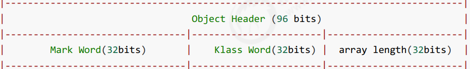
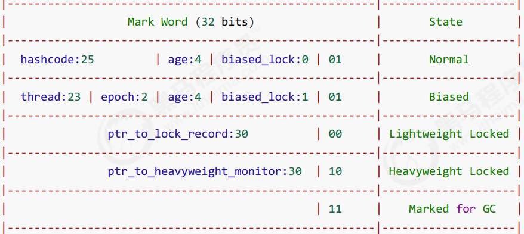
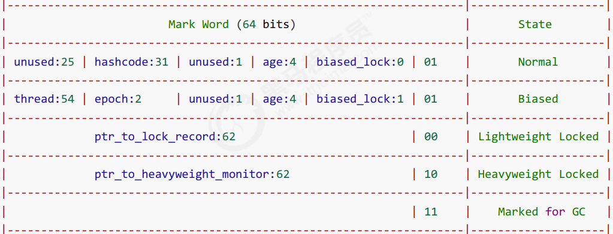

---

Created at: 2021-08-11
Last updated at: 2021-10-07

---

# 12-对象头结构

**Java对象头**（以32位虚拟机为例）

1.普通对象
普通对象的对象头由 **Mark Word** 和 **类型指针** 两部分组成，其中Mark Word占32位，类型指针也占32位，如下所示：

2.数组对象
数组对象还需要额外32位用于存储数组长度

**Mark Word 的结构**
32位虚拟机

64位虚拟机

当对象位Normal正常状态时，有31位存的是hashcode，hashcode值会延迟到程序调用hashCode()方法时才会计算并填充；有4位是分代年龄，可以看出分代年龄的最大值只能设为15；紧接着的是biased\_lock偏向锁的标志位，通过该标志位可以区分对象是处于Normal正常状态还是Biased可偏向状态，因为这两种状态最后两个标志位是相同的。

对象处于Biased可偏向状态时，前54位存的是线程id，这个线程id是由操作系统分配的，与在Java程序中通过Thread.getId()获取的线程id没有关系；epoch是偏向时间戳，不知道具体用处；然后是分代年龄和偏向锁标志位，与前面介绍的一样。

对象处于Lightweight Locked轻量级锁定状态时，前62位ptr\_to\_lock\_record存的是指向锁记录的指针，我们知道每一个方法调用都会在虚拟机栈中生成一个栈帧，当这个方法中出现synchronized加锁操作时，会在栈帧中生成一个锁记录（后面会具体讲这个锁记录的用处），对象头里的这个指针就是指向栈帧里的这个锁记录。

对象处于Heavyweight Locked重量级锁定状态时，前62位ptr\_to\_heavyweight\_monitor存的是管程的地址，管程是由操作系统创建的一个结构，是锁的实现（后面会具体讲管程是如何实现锁的功能的）。

最后一种状态是要被GC的状态，也就是对象即将被垃圾回收器清理。

