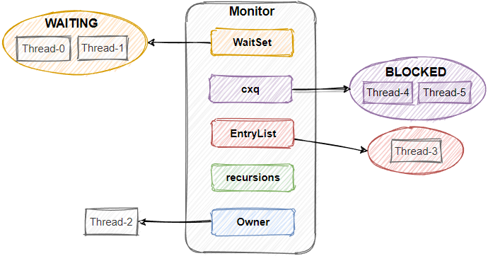

---

Created at: 2021-08-11
Last updated at: 2022-08-24
Source URL: https://www.iodraw.com/diagram/

---

# 13-Monitor与重量级锁的加锁原理

**Monitor 管程**
Monitor翻译为管程，在操作系统里也被称为管程，它其实是锁的一种实现，所以也称为锁。
Monitor的结构如下：

* WaitSet指向因为调用Object::wait而处于等待状态的线程集合。
* cxq指向因为竞争锁失败而阻塞的线程集合。
* EntryList指向即将被唤醒的线程队列，每次当锁被释放时会唤醒EntryList队首的线程。
* Owner指向的获得锁的线程。
* recursions是锁重入计数。

**重量级锁的加解锁过程**：
重量级锁加锁过程：

1. 在对象上加重量级锁的时候，首先会检查对象MarkWord最后两位是不是01，即是否处于Heavyweight Locked重量级锁定状态，如果不是，那么先给对象初始化一个Monitor管程对象，然后将对象头的MarkWord用cas操作置为重量级锁状（MarkWord的前62位是指向Monitor对象的指针，后两位是01），之后再将Monitor的Owner指向该线程，并设置recursions为1，此时该线程就加锁成功了。
2. 如果发现对象已经处于重量级锁定状态，那么首先会通过MarkWord的前62位找到Monitor，然后检查Owner是否指向自己，如果是，那么锁重入，直接将recursions加1即可，如果不是，那么就将线程加入到cxq竞争队列中然后挂起。
3. 如果线程在解锁之前调用Object::wait，那么该线程也会释放锁，然后加入到WaitSet队列中然后挂起。**当其他线程调用****Object::notifyAll****，会将WaitSet中的线程加入到EntryList。**
4. 当 synchronized块结束 或者 使用Object::wait **释放锁时**，会先将cxq中的线程加入到EntryList，然后**唤醒EntryList队首的线程**。

总结：锁释放时，只会唤醒EntryList队首的线程。所以对于处于waiting状态的线程，如果没有其他线程调用notify方法，那么他就不会被加入到EntryList队列中，也就永远不会被唤醒；对于因为竞争锁失败而阻塞的线程，因为每次释放锁都会将cxq队列中的线程加入到EntryList队列，所以只要锁被释放，它们就有被唤醒的机会（可以简单地将cxq队列和EntryList队列看作是一起的，然后每次调用notify方法都会将WaitSet中的线程加入到EntryList队列）。

