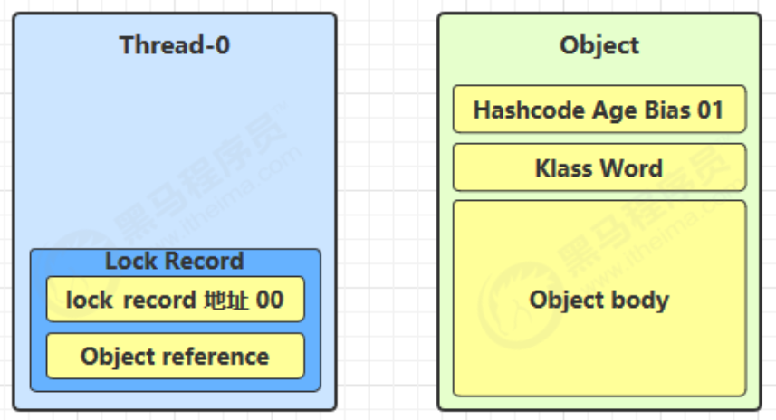
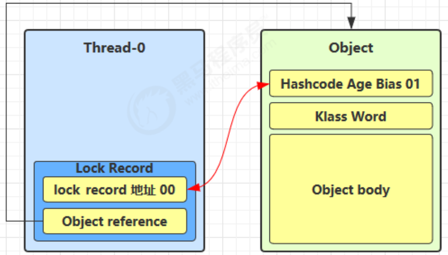
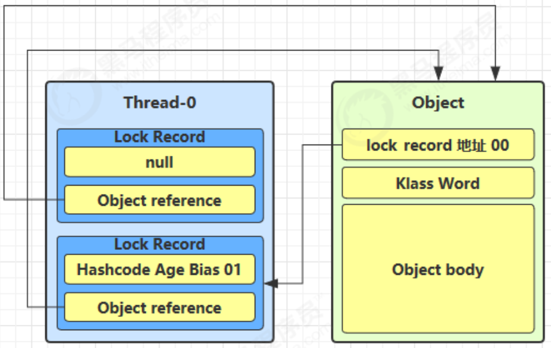
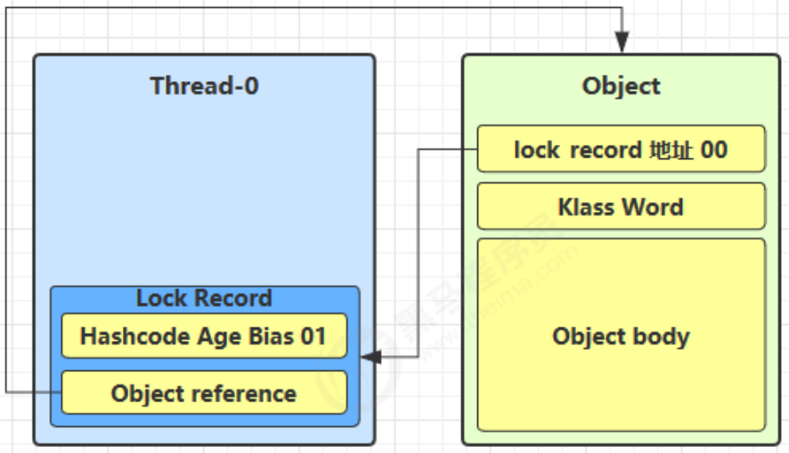

---

Created at: 2021-08-11
Last updated at: 2021-12-06

---

# 14-轻量级锁的加锁原理

每次加锁都创建Monitor未免开销太大，尤其对于锁竞争不激烈的程序而言，为此JVM对synchronized进行了优化，提出了轻量级锁的方法。也就是第一次对对象加锁时不创建Monitor，而是先加轻量级锁，如果当轻量级锁未解锁时有新的线程来竞争这把锁，就将轻量级锁升级为重量级锁。

**轻量级锁的加锁过程：**
1.当方法执行synchronized(obj)时，会再对应的栈帧中生成一个Lock Record锁记录，锁记录的第一项是锁记录地址（最后两位是标志位00），第二项是obj对象的引用地址。

2\. 让锁记录中 Object reference 指向锁对象，并尝试用 CAS 将锁记录地址与对象的 Mark Word交换。

3\. 如果 cas 替换成功，那么表示轻量级锁加锁成功，此时对象头存储了 锁记录地址和状态 00 ，也就是对象已经处于轻量级锁定状态了。

有两种情况会导致 cas 失败，
① 如果其它线程已经持有了该 Object 的轻量级锁，那么cas操作会失败，因为cas期望Mark Word的后两位是01，而此时是00处于轻量级锁定状态，在轻量级锁定状态下出现锁竞争情况，会导致进入锁膨胀过程，因为需要将线程加入到阻塞队列，只有管程才有这个功能。
② 如果还是本线程执行了 synchronized 也会导致cas操作失败，不过这是锁重入现象，会再添加一条 Lock Record 作为重入的计数

**轻量级锁的解锁过程：**
1\. 当退出 synchronized 代码块即解锁时，如果有取值为 null 的锁记录，表示有重入，这时删除锁记录，表示重入计数减1
2\. 当退出 synchronized 代码块（解锁时）锁记录的值不为 null，这时使用 cas 将 Mark Word 的值恢复给对象头，若cas操作成功，则解锁成功，若失败，说明轻量级锁进行了锁膨胀已经升级为重量级锁，要进入重量级锁解锁流程。

