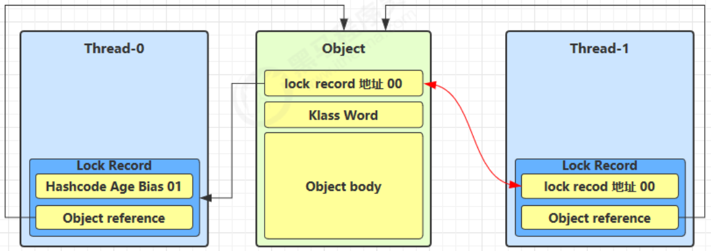
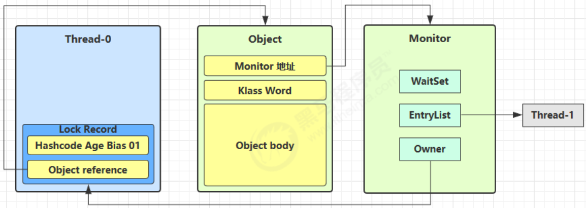

---

Created at: 2021-08-11
Last updated at: 2021-12-06

---

# 15-锁膨胀和自旋优化

**锁膨胀**
Thread-0线程已经持有了对象的轻量级锁，那么Thread-1的加锁操作会失败，因为cas操作期望Mark Word的后两位是01，而此时是00处于轻量级锁定状态。当在轻量级锁定状态下出现锁竞争情况时，会导致进入锁膨胀过程，锁膨胀后会为对象创建Monitor，因为需要将线程加入到阻塞队列，只有管程才有这个功能。

1\. 当 Thread-1 进行轻量级加锁时，Thread-0 已经对该对象加了轻量级锁

2\. 这时 Thread-1 加轻量级锁失败，进入锁膨胀流程，首先会为 Object 对象申请 Monitor ，让 对象的Mark Word指向Monitor地址，然后自己进入 Monitor 的 EntryList阻塞队列。

3\. 当 Thread-0 退出同步块解锁时，使用 cas 将锁记录中保存的Mark Word恢复给对象头的操作会失败，因为cas操作期望对象头的后两位式00，而此时是10处于重量级锁锁定状态。这时会进入重量级解锁流程，即先按照 Monitor 地址找到 Monitor 对象，然后设置 Owner 为 null，接着唤醒 EntryList 中 BLOCKED 线程。

****自旋优化**：** 竞争重量级锁的时候，或者是锁膨胀后，如果一个线程未竞争到锁，那么JVM并不会立即将这个线程加入到阻塞队列挂起，而是先会让这个线程自旋一会，也就是让这个线程反复再尝试几次加锁，如果成功，那么就顺利进入临界区，否则就会被加入到阻塞队列挂起。

