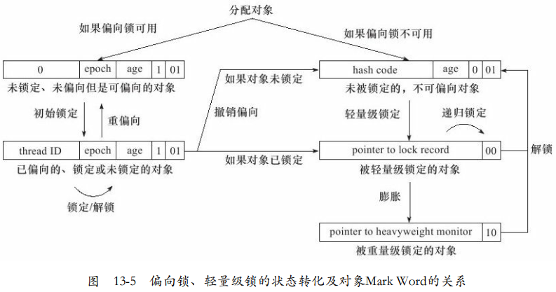

---

Created at: 2021-08-11
Last updated at: 2022-08-04

---

# 16-偏向锁及锁消除

**偏向锁**

轻量级锁在没有其它线程竞争时，每次重入仍然需要执行 CAS 操作（这是个会失败的CAS操作）， Java 6 中引入了偏向锁来做进一步优化。
开启了偏向锁（默认开启），那么对象创建后，markword 值为 0x05 即最后 3 位为 101，这时它的thread、epoch、age 都为 0。偏向锁是默认是延迟的，不会在程序启动时立即生效，如果想避免延迟，可以加 VM 参数 -XX:BiasedLockingStartupDelay=0 来禁用延迟。
如果使用了hashCode()方法，那么对象头的状态会立马变成Normal正常状态，然后将hashcode填入Mark Word中，以后加锁就与偏向锁无关了，起步就是轻量级锁。

如果偏向锁可用，那么偏向锁的加锁过程是，线程第一次synchronized给对象加锁时，会使用 CAS 将线程 ID 设置到对象的 Mark Word 头，在没有其它线程插手的情况下，该线程解锁前，对此对象的synchronized操作都将只需要检查Mark Word中的线程ID是不是和自己的相同，相比于轻量级锁确实快了不少。如果出现锁竞争，那么立即锁膨胀升级为重量级锁。
有一种情况会导致偏向锁升级为轻量级锁，那就是在偏向锁解锁后，又有另外一个线程给这个对象加锁了，这不是同一时间段的竞争关系，所以不会导致升级为重量级锁，但是会导致后加锁的线程加的锁变成轻量级锁，而不是偏向锁。

**锁升级：**

<https://blog.csdn.net/DBC_121/article/details/105453101>

**锁消除**：锁消除的意思是，JVM的即时编译器会把某些无意义的加锁操作直接优化掉。

