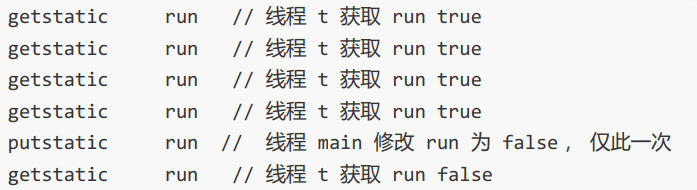
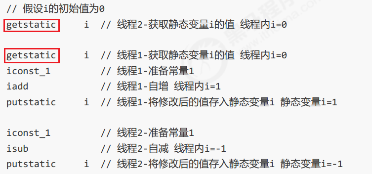
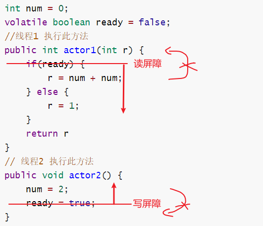

---

Created at: 2021-08-10
Last updated at: 2021-10-07
Source URL: https://gitee.com/moxi159753/LearningNotes/tree/master/%E6%A0%A1%E6%8B%9B%E9%9D%A2%E8%AF%95/JUC/1_%E8%B0%88%E8%B0%88Volatile/1_Volatile%E5%92%8CJMM%E5%86%85%E5%AD%98%E6%A8%A1%E5%9E%8B%E7%9A%84%E5%8F%AF%E8%A7%81%E6%80%A7


---

# 17-volatile


volatile是Java虚拟机提供的轻量级的同步机制，它的三个特点是：

* 保证可见性
* 不保证原子性
* 禁止指令重排

**可见性**
volatile保证可见性的意思是，保证线程执行getfield、getstatic等读操作字节码指令时，一定拿到的是主内存中的最新结果。（可以这样认为加了volatile的变量，线程只能从主内存中获取它的值）

可见性代码验证：
以下代码验证了volatile的可见性，在没加volatile之前，主线程不能及时发现主内存中已经修改了的number，这是即时编译器的优化，即时编译器将字节码编译成本地机器指令后，只从缓存中获取number的值，也就是一直使用的是工作内存里最开始时读到的number，所以一直死循环；加了volatile之后，线程t一旦将修改过后的number写回主内存之后，就会强制刷新其它线程工作内存里的number值，所以这时主线程能及时发现number已经改变，从而跳出死循环。
```
class MyData {

    `volatile` int number = 0;

    public void addTo60() {
        this.number = 60;
    }
}
/**
* 验证volatile的可见性
*/
public class VolatileDemo {

    public static void main(String args []) {
        // 资源类
        MyData myData = new MyData();
        new Thread(() -> {
            System.out.println(Thread.currentThread().getName() + "\t come in");
            //保证主线程的while循环先读到了number的值
            try {
                TimeUnit.SECONDS.sleep(1);
            } catch (InterruptedException e) {
                e.printStackTrace();
            }
 `// 主线程的while循环先读到了number的值后，此线程再修改number的值，`
 `// 如果没有加volatile，那么主线程就无法及时获取到修改后的number值`
            myData.addTo60();
            // 输出修改后的值
            System.out.println(Thread.currentThread().getName() + "\t update number value:" + myData.number);
        }, "t").start();

        while(myData.number == 0);

        System.out.println(Thread.currentThread().getName() + "\t mission is over");
    }
}
```

**原子性**
可见性 vs 原子性
上面的例子体现的实际就是可见性，它保证的是在多个线程之间，一个线程对 volatile 变量的修改对另一个线程可见，但volatile不能保证原子性，仅适用于一个写线程，多个读线程的情况， 上例从字节码理解是这样的：


对于两个写线程，只能保证可见性，不能保证操作的原子性，比如一个线程做i++，另一个线程做i--，字节码指令的执行顺序可能是这样的：

两个线程的getstatic操作均是从主内存中获取最新的值，这是volatile所保证的，但是由于i++和i--不是原子操作，所以最终结果不正确。

**有序性**
为了提升CPU指令流水线的效率，JVM的即时编译器或者是CPU都可能会在不影响程序顺序执行结果的前提下，对指令进行重排序，这在单线程的环境下不会有什么问题，因为重排序不会影响程序的顺序执行的结果，但这在多线程的环境就会有问题。指令重排不是出现在字节码中，而是运行时JVM或CPU对指令执行顺序的一种改变。

典型例子如下：如果actor2()方法内的两条语句没有进行指令重排序，那么在多线程的环境下，actor1()方法的返回值可能是1或者是4；但如果对actor2()方法内的两条语句进行指令重排序，也就是先ready = true再num = 2，显然这对actor2()方法顺序执行的结果并没有影响，但在多线程的环境下，actor1()方法的返回的结果就有可能是0了。
```
int num = 0;
boolean ready = false;
//线程1 执行此方法
public int actor1(int r) {
    if(ready) {
        r = num + num;
    } else {
        r = 1;
    }
    return r
}
// 线程2 执行此方法
public void actor2() {
    num = 2;
    ready = true;
}
```

volatile可以禁止指令重排序， volatile 的底层实现原理是内存屏障

* 对 volatile 变量的写指令后会加入写屏障
* 对 volatile 变量的读指令前会加入读屏障

写屏障：
    ① 保证可见性：写屏障之前对共享变量的改动，都同步到主存当中
    ② 保证有序性：不会将写屏障之前的代码排在写屏障之后
读屏障：
    ① 保证可见性： 屏障之后对共享变量的读取，加载的是主存中最新数据
    ② 保证有序性： 不会将读屏障之后的代码排在读屏障之前



