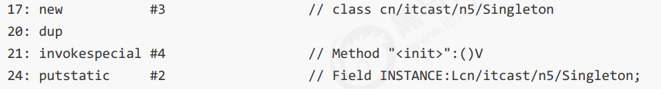

---

Created at: 2021-08-11
Last updated at: 2022-08-21
Source URL: about:blank


---

# 18-DCL单例模式


单线程下的单例模式在多线程环境下会出错，示例：
```
public class Singleton {

    private static Singleton instance = null;

    private Singleton () {
        System.out.println(Thread.currentThread().getName() + "\t 我是构造方法SingletonDemo");
    }

    public static Singleton getInstance() {
        if(instance == null) {
            instance = new Singleton();
        }
        return instance;
    }

    public static void main(String[] args) {
        for (int i = 0; i < 10; i++) {
            new Thread(() -> {
                Singleton.getInstance();
            }, String.valueOf(i)).start();
        }
    }
}
```

DCL，Double Check Lock 双重检查锁形式的单例模式可以解决这个问题，它与直接在方法上加synchronized的区别是，直接在方法上加synchronized会让所有线程调用getInstance()方法都加锁，而双重检查则只会让部分通过第一个if检查的线程加锁，当这部分中的某个线程创建完实例之后，剩余部分的线程就不能通过第一if的检查了，从而不必再加锁。

```
public class Singleton {

    private static `volatile` Singleton instance = null;

    private Singleton() {
        System.out.println(Thread.currentThread().getName() + "\t 我是构造方法SingletonDemo");
    }

    public static Singleton getInstance() {
        if (instance == null) {
            synchronized (Singleton.class) {
                if (instance == null) {
                    instance = new Singleton();
                }
            }
        }
        return instance;
    }
}
```

`记得还要在变量上加volatile`，因为instance = new Singleton();这条语句编译后会产生多条字节码，如下图所示，如果没加volatile，那么21行和24行可能会被重排序，也就是先给instance赋值，然后再调用构造方法初始化对象，当给instance赋值后另外一个线程执行第一个if判断结果不为null，然后返回instance，最后被使用的instance就是还没被初始化的对象，于是出现线程不安全的现象；如果加上volatile，将禁止这多条字节码指令重排，就不会出现先赋值后初始化的现象了，只能是先初始化后赋值。



