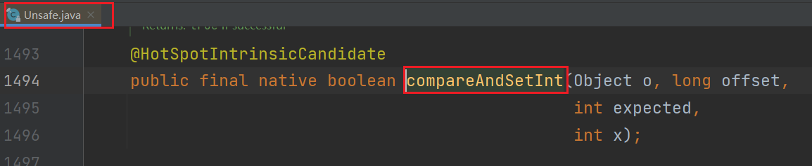
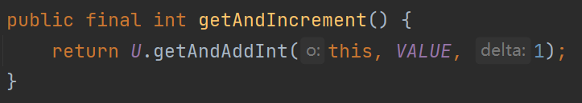
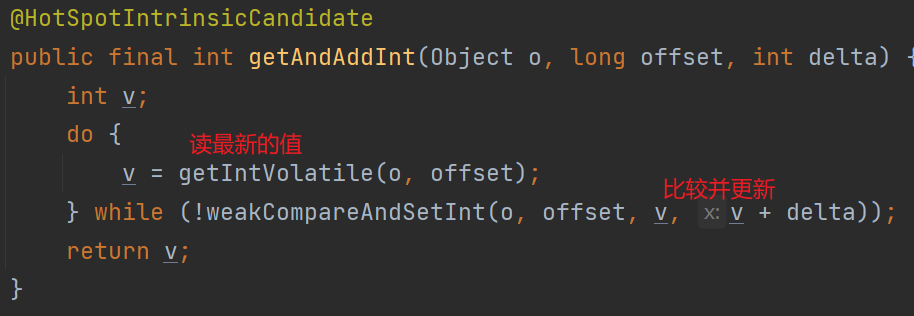

---

Created at: 2021-08-10
Last updated at: 2025-02-15
Source URL: about:blank


---

# 19-CAS及自旋锁


CAS：Compare And Set 比较并更新 或者 Compare And Swap 比较并交换
CAS是并发环境下更新变量的一种技术，它的更新过程是：持有一个变量的预期值和新值，更新时先检查变量的值是否与预期值相同，如果相同则更新为新值，返回true，表示更新成功；如果不同则返回false，表示更新失败。这是乐观锁的思想，现代处理器基本上都支持CAS原子指令。

为了能在Java中也可以使用CAS操作，JDK提供了Unsafe类，Unsafe类有一系列的compareAndSet方法，每个native的 compareAndSet方法都是一个原子的CAS操作，用于更新内存中一个变量的值，该变量必须被声明为volatile，不然更新结果可能对其它线程不可见，也就是在Java中使用CAS操作必须配合volatile关键字，比如AtomicInteger等类的成员变量都是被声明为volatile（AtomicInteger是使用Unsafe类提供的CAS操作实现的一个原子类，实现了多线程环境下对整数的原子操作）。

比如下面这个更新int变量的compareAndSetInt方法，它的第一个参数Object o是要更新的字段所在对象；第二个参数long offset是字段在对象中的相对偏移地址，相当于c的指针；第三个参数是expected变量预期值；第四个参数x是想修改成的新值。所以它的更新过程是，首先检查内存中变量的值是否与expected相等，如果相等则设置为新值x并返回true，否则直接返回false；
Unsafe类的这些方法都是native方法，JDK并不想我们直接使用这个类，而是使用一些更上层的类，比如AtomicInteger等。


AtomicInteger使用Unsafe提供的CAS操作实现了一系列好用的线程安全的方法，比如，AtomicInteger类的getAndIncrement()方法的作用是自增加1，它实际上是调用了Unsafe的getAndAddInt()方法，如下，getAndAddInt()方法的执行过程是：首先读取内存中变量的最新值，然后在此值的基础上加delta，再调用weakCompareAndSetInt方法比较并更新，如果返回false，表示更新失败，重新读取变量的最新值，然后在此值的基础上加delta，再尝试比较并更新，如此一直循环下去，直到更新成功返回true。
读到最新的值后，就到一边做运算，这个运算不是原子的，可能很耗时，运算完后拿着结果尝试比较并更新，比较并更新的这个过程是原子的，如果更新失败，表示在我计算期间有人做了更新，我这次的计算结果已经没有用了，只能再次读取最新值后重新计算，直到这个更新成功。典型的乐观锁。

AtomicInteger类的getAndIncrement()方法：

Unsafe的getAndAddInt()方法：


CAS实现自旋锁：

```
public class SpinLock {

   //原子引用线程
   AtomicReference<`Thread`> atomicReference = new AtomicReference<>();

   /**
    * 加锁
    */
   public void myLock() {
       `// 加锁操作，如果是null，则更新为当前线程，否者自旋`
 `while(!atomicReference.compareAndSet(null, Thread.currentThread()));`
       System.out.println(Thread.currentThread().getName() + "加锁成功");
   }

   /**
    * 解锁
    */
   public void myUnLock() {
       `// 解锁操作`
 `atomicReference.compareAndSet(Thread.currentThread(), null);`
   }

   public static void main(String[] args) {

       SpinLock spinLock = new SpinLock();

       // 启动t1线程，开始操作
       new Thread(() -> {
           // 开始占有锁
           spinLock.myLock();
           try {
               TimeUnit.SECONDS.sleep(5);
           } catch (InterruptedException e) {
               e.printStackTrace();
           }
           // 开始释放锁
           spinLock.myUnLock();
       }, "t1").start();

       // 让main线程暂停1秒，使得t1线程，先执行
       try {
           TimeUnit.SECONDS.sleep(1);
       } catch (InterruptedException e) {
           e.printStackTrace();
       }

       // 1秒后，启动t2线程，开始占用这个锁
       new Thread(() -> {
           // 开始占有锁
           spinLock.myLock();
           // 开始释放锁
           spinLock.myUnLock();
       }, "t2").start();
   }
}
```

或者使用AtomicInteger类：
```
public class LockCas {
   private AtomicInteger state = new AtomicInteger(0);

   public void lock() {
       `// 加锁操作`
 `while (!state.compareAndSet(0, 1));`
   }

   public void unlock() {
       `// 解锁操作`
 `state.set(0);`
   }
}
```

从以上基于CAS操作实现变量值加1和自旋锁可以看出，这是线程安全的一种无锁实现，它并不需要像sychronized和可重入锁这种悲观锁那样会阻塞线程，有线程上下文切换的开销，所以一般而言这种无锁的实现可能效率更高，但是一直循环重试也会性能上的开销，所以并不见得一定比悲观锁效率更高，如果在单核CPU下，这种无锁现实线程安全的方式就没意义了，因为不但会切换线程，而且还会循环重试。

