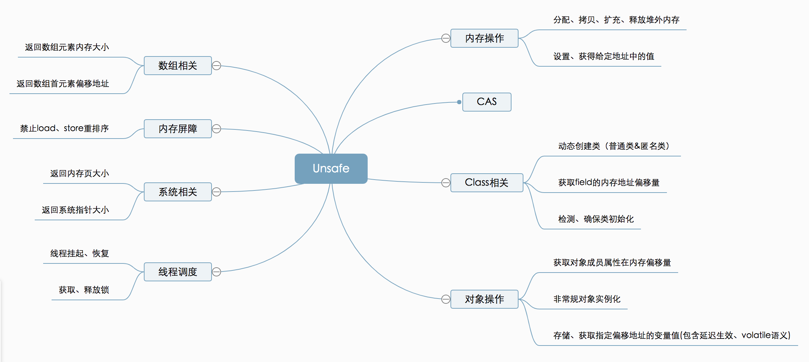

---

Created at: 2021-08-13
Last updated at: 2021-10-07
Source URL: https://tech.meituan.com/2019/02/14/talk-about-java-magic-class-unsafe.html


---

# 20-Unsafe类


Unsafe提供的API大致可分为`内存操作`、`CAS`、Class相关、对象操作、`线程调度`、系统信息获取、内存屏障、数组操作等几类。


**Unsafe类对象的获取**
从Unsafe类的构造器可以看出Unsafe类是单例的，但是它提供的静态getUnsafe()方法会判断调用getUnsafe()的方法所处的类是否是由引导类加载器加载的，如果不是就抛出异常，所以JDK并不希望我们直接使用Unsafe类，从它的名字就可以看出开发人员直接使用它是不安全的，但是非要获取也是有办法的，那就是通过反射获取。（我们知道，除了通过枚举实现的单例不能被反射打破外，其它通过构造器私有的方式实现的单例都可以被反射打破。不过接下来并不是以新创建对象的方式获取Unsafe对象，而已直接获取Unsafe以单例方式创建的实例对象）


通过反射获取Unsafe类的实例：
```
try {
    Field theUnsafe = Unsafe.class.getDeclaredField("theUnsafe");
    theUnsafe.setAccessible(true);
    unsafe = (Unsafe) theUnsafe.get(null);
} catch (NoSuchFieldException | IllegalAccessException e) {
    throw new Error(e);
}
```

通过Unsafe对象操作其它实例对象：
```
class Student {
    volatile int id;
    volatile String name;

    @Override
    public String toString() {
        return "Student{" +
                "id=" + id +
                ", name='" + name + '\'' +
                '}';
    }

    public static void main(String[] args) throws Exception {
        Unsafe unsafe = null;
        try {
            Field theUnsafe = Unsafe.class.getDeclaredField("theUnsafe");
            theUnsafe.setAccessible(true);
            unsafe = (Unsafe) theUnsafe.get(null);
        } catch (NoSuchFieldException | IllegalAccessException e) {
            throw new Error(e);
        }
        Field id = Student.class.getDeclaredField("id");
        Field name = Student.class.getDeclaredField("name");
        // 获得成员变量的偏移量
        long idOffset = unsafe.objectFieldOffset(id);
        long nameOffset = unsafe.objectFieldOffset(name);
        Student student = new Student();
        // 使用 cas 方法替换成员变量的值
        unsafe.compareAndSwapInt(student, idOffset, 0, 20); // 返回 true
        unsafe.compareAndSwapObject(student, nameOffset, null, "张三"); // 返回 true
        System.out.println(student);
    }
}
```

