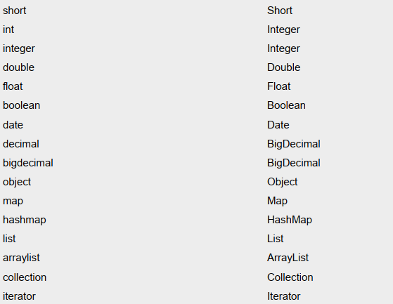

---

Created at: 2023-08-03
Last updated at: 2024-06-25
Source URL: about:blank


---

# 2.核心配置文件 与 引入映射文件的方式


**1.核心配置文件**
核心配置文件中的标签必须按照固定的顺序写，有的标签可以不写，但顺序一定不能乱： properties、settings、typeAliases、typeHandlers、objectFactory、objectWrapperFactory、reflectorFactory、plugins、environments、databaseIdProvider、mappers

```
<?xml version="1.0" encoding="UTF-8" ?>
<!DOCTYPE configuration
        PUBLIC "-//MyBatis.org//DTD Config 3.0//EN"
        "http://MyBatis.org/dtd/MyBatis-3-config.dtd">
<configuration>

    `<!-- resource引入类路径的属性配置文件，url引入磁盘上或者网络上的，二者选其一 -->`
 `<properties resource="druid.properties" url=""/>`

 `<!-- 这是 MyBatis 中极为重要的调整设置，它们会改变 MyBatis 的运行时行为 -->`
 `<settings>`

 `<!--设置可以将数据库的下划线命名 order_id 映射成java类的驼峰命名 orderId-->`
 `<setting name="mapUnderscoreToCamelCase" value="true"/>`

 `<!-- 参数map的key使用参数名，默认也是true，使用该选项需要编译加上-parameters选项 -->`
 `<setting name="useActualParamName" value="true"/>`

 `<!-- 当使用<association>时，如下两条配置可以设置延迟加载 -->`
 `<setting name="lazyLoadingEnabled" value="true"/>`
 `<setting name="aggressiveLazyLoading" value="false"/>`

 `</settings>`

    <typeAliases>
        <!--
            typeAlias：设置某个具体的类型的别名，在resultType时可以直接用类型别名指定，如果不设置需要指定全类名
            属性：
            type：需要设置别名的类型的全类名
            alias：设置此类型的别名，`别名不区分大小写`。若`不设置此属性，该类型拥有默认的别名，即类名`
        -->
        <!--<typeAlias type="com.atguigu.mybatis.bean.User"></typeAlias>-->
        <!--<typeAlias type="com.atguigu.mybatis.bean.User" alias="user">
        </typeAlias>-->
        <!--以包为单位，设置改包下所有的类型都拥有默认的别名，即类名且不区分大小写-->
        <package name="com.atguigu.mybatis.bean"/>
    </typeAliases>

    <!--
    environments：设置多个连接数据库的环境
    属性：
        default：设置默认使用的环境的id
    -->
    <environments default="mysql_test">
        <!--
        environment：设置具体的连接数据库的环境信息
        属性：
            id：设置环境的唯一标识，可将environments标签的default属性设置为某个环境的id，表示默认使用的环境
        -->
        <environment id="mysql_test">
            <!--
            transactionManager：设置事务管理方式
            属性：
                type：设置事务管理方式，type="JDBC|MANAGED"
                type="JDBC"：设置当前环境的事务管理都必须手动处理
                type="MANAGED"：设置事务被管理，例如spring中的AOP
            -->
            <transactionManager type="JDBC"/>
            <!--
            dataSource：设置数据源
            属性：
                type：设置数据源的类型，type="POOLED|UNPOOLED|JNDI"
                type="POOLED"：使用数据库连接池，即会将创建的连接进行缓存，下次使用可以从缓存中直接获取，不需要重新创建
                type="UNPOOLED"：不使用数据库连接池，即每次使用连接都需要重新创建
                type="JNDI"：调用上下文中的数据源
            -->
            <dataSource type="POOLED">
                <!--设置驱动类的全类名-->
                <property name="driver" value="${jdbc.driver}"/>
                <!--设置连接数据库的连接地址-->
                <property name="url" value="${jdbc.url}"/>
                <!--设置连接数据库的用户名-->
                <property name="username" value="${jdbc.username}"/>
                <!--设置连接数据库的密码-->
                <property name="password" value="${jdbc.password}"/>
            </dataSource>
        </environment>
    </environments>

    `<!--引入映射文件-->`
 `<mappers>`
        <!-- <mapper resource="UserMapper.xml"/> -->
        <!--
        以包为单位，将包下所有的映射文件引入核心配置文件
        注意：
            1. 此方式必须保证mapper接口和mapper映射文件必须在相同的包下
            2. mapper接口要和mapper映射文件的名字一致
        -->
        <package name="com.atguigu.mybatis.mapper"/>
    </mappers>
</configuration>
```

**2.引入映射文件**
maven默认只会打包**资源目录**（src/main/resources）下面的所有文件到target，而不会将**源码目录**（src/main/java）下的XML文件等资源文件打包，只会将源码目录中的Java文件进行编译打包。所以如果需要把XML文件放在java目录下，需要配置pom.xml中的resources标签，指定打包时加入src/main/java下面的XML文件，需要注意的是 设置resources标签会覆盖maven默认的配置，所以还需要指定打包**资源目录**（src/main/resources）下面的所有文件。
```
<build>
    <resources>
            <resource>
                <directory>src/main/java</directory>
                <includes>
                    <include>**/*.xml</include>
                </includes>
            </resource>

            <resource>
                <directory>src/main/resources</directory>
                <includes>
                    <include>**/*</include>
                </includes>
            </resource>
        </resources>
</build>
```

编译之后，**不管****映射文件是否和接口处于同一目录下，是否名字相同，都需要在核心配置文件中引入映射文件。**
1.如果不在同一路径下，那么只能用<mapper resource=""/> 来引入。
2.如果在同一路径，并且接口名与映射文件名相同，那么还可以用<mapper class=""/> 来引入，这种方式每次只引入一个类的映射文件。可以使用<package name=""/>指定包名，一次性引入包下面的所有XML文件，更加方便。

**3.类型别名**
MyBatis默认的类型别名：



