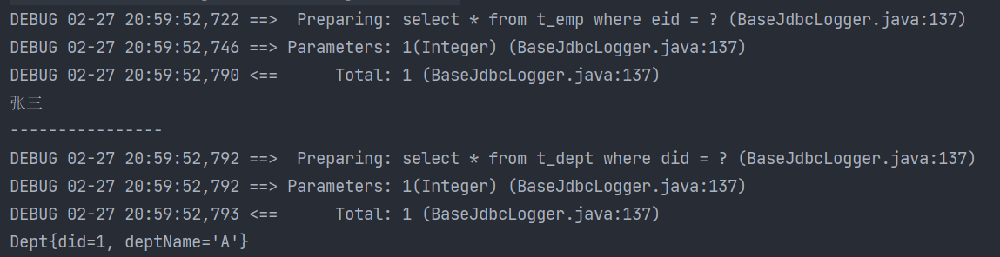

---

Created at: 2023-08-13
Last updated at: 2023-08-29
Source URL: about:blank


---

# 6.返回值 - resultType 和 resultMap


select标签必须设置属性resultType或resultMap，用于设置**实体类与数据库表一行数据的映射关系**（因为用基本数据类型、包装数据类型、Map的封装规则是固定的，所以主要是关于实体类返回值类型的封装规则）**。**

* resultType：自动映射，用于属性名和表中列名一致的情况。
* resultMap：自定义映射，用于属性名和表中列名不一致、一对多、多对一 的情况。

**一、resultType**
resultType用于属性名和表中列名一致的情况。如果resultType设置为Map，那么一个Map对象对应数据库中一条数据，列名设置为key，值设置为value。

在 列名 和 实体类的属性名 不一致的情况下仍要使用resultType，此时可通过以下两种方式处理列名和实体类属性的映射关系：

* 如果表的列名使用\_下划线的规则，实体类的属性名使用驼峰命名规则，那么只需要在MyBatis的核心配置文件中的setting标签中，设置一个全局配置信息mapUnderscoreToCamelCase，可以在查询表中数据时，自动将\_类型的字段名转换为驼峰，例如：将列名user\_name映射成属性名userName。

```
<settings>
    <setting name="mapUnderscoreToCamelCase" value="true"/>
</settings>
```

* 为列起别名，保证和实体类中的属性名保持一致

```
<!--List<Emp> getAllEmp();-->
<select id="getAllEmp" resultType="Emp">
    select
        eid,
        `emp_name as empName,`
        age
    from
        t_emp
</select>
```

**二、resultMap**
resultMap用于设置表的列名 与 实体类属性 的映射关系。
resultMap属性：

* id：表示自定义映射的唯一标识，不能重复
* type：查询的数据要映射的实体类

子标签：

* id：设置主键的映射关系
* result：设置普通字段的映射关系
* 子标签属性：
	* property：设置映射关系中实体类中的属性名
	* column：设置映射关系中表中的字段名

1.比如如果不使用 as 为列取别名，还可以使用resultMap来设置映射关系：
```
<resultMap `id``="stuResultMap"` type="cn.ctyun.pojo.Student">
    <id column="id" property="id" ></id>
    <result column="name" property="name" ></result>
    <result column="sex" property="sex" ></result>
    `<result column="class_name" property="className" ></result>`
</resultMap>
<!--List<Student> getAllStudent();-->
<select id="getAllStudent" `resultMap="stuResultMap"`>
    select * from Student
</select>
```

**2.将 多列数据 映射到 实体类的一个属性**
比如将查询到的部门信息封装到dept字段中
```
public class Emp {  
    private Integer eid;  
    private String empName;  
    private Integer age;  
    private String sex;  
    private String email;  
    `private Dept dept;`
    //...构造器、get、set方法等
}
```
写法一：
```
<resultMap id="empAndDeptResultMapOne" type="Emp">
    <id property="eid" column="eid"></id>
    <result property="empName" column="emp_name"></result>
    <result property="age" column="age"></result>
    <result property="sex" column="sex"></result>
    <result property="email" column="email"></result>
    `<result property="dept.did" column="did"></result>`
 `<result property="dept.deptName" column="dept_name"></result>`
</resultMap>
<!--Emp getEmpAndDept(@Param("eid")Integer eid);-->
<select id="getEmpAndDept" resultMap="empAndDeptResultMapOne">
    select *
    from t_emp
        left join t_dept
        on t_emp.eid = t_dept.did
    where t_emp.eid = #{eid}
</select>
```

写法二：使用association标签

* property：属性名
* javaType：属性类型

```
<resultMap id="empAndDeptResultMapTwo" type="Emp">
    <id property="eid" column="eid"></id>
    <result property="empName" column="emp_name"></result>
    <result property="age" column="age"></result>
    <result property="sex" column="sex"></result>
    <result property="email" column="email"></result>
    `<association property="dept" javaType="Dept">`
 `<id property="did" column="did"></id>`
 `<result property="deptName" column="dept_name"></result>`
 `</association>`
</resultMap>
<!--Emp getEmpAndDept(@Param("eid")Integer eid);-->
<select id="getEmpAndDept" resultMap="empAndDeptResultMapTwo">
    select * from t_emp left join t_dept on t_emp.eid = t_dept.did where t_emp.eid = #{eid}
</select>
```

写法三：使用association标签进行分步查询
就是SQL子查询的写法，下面的例子相当于把子查询套在了设了select中。
第一步：查询员工信息

* column：把column的值作为入参调用第二步的查询
* select：设置第二步查询的sql，即 mapper接口的 <全类名.方法名>

```
<resultMap id="`empAndDeptByStepResultMap`" type="Emp">
    <id property="eid" column="eid"></id>
    <result property="empName" column="emp_name"></result>
    <result property="age" column="age"></result>
    <result property="sex" column="sex"></result>
    <result property="email" column="email"></result>
    <association property="dept" `column="did"`
 `select="com.atguigu.mybatis.mapper.DeptMapper.getEmpAndDeptByStepTwo">`
    </association>
</resultMap>
<!--Emp getEmpAndDeptByStepOne(@Param("eid") Integer eid);-->
<select id="getEmpAndDeptByStepOne" resultMap="`empAndDeptByStepResultMap`">
    select * from t_emp where eid = #{eid}
</select>
```

第二步：查询部门信息
这个子查询就是一个普通的查询，如果之前就已经有了，可以被现在这个需求复用，这种分步查询的可读性真的很差，除了可以复用之前写的查询语句，不然真的想不到这种写法的优势了。
```
<!--此处的resultMap仅是处理字段和属性的映射关系，不是分步查询所必要的-->
<resultMap id="EmpAndDeptByStepTwoResultMap" type="Dept">
    <id property="did" column="did"></id>
    <result property="deptName" column="dept_name"></result>
</resultMap>
<!--Dept `getEmpAndDeptByStepTwo`(@Param("did") Integer did);-->
<select id="getEmpAndDeptByStepTwo" resultMap="EmpAndDeptByStepTwoResultMap">
    select * from t_dept where did = #{did}
</select>
```

**3.将 多行数据 映射到 实体类的一个属性上**
相比于前面，这里不仅需要将 多列汇聚到一个实体类中，还要将多行数据汇聚到List中。

比如查询一个部门的所有员工
```
public class Dept {
    private Integer did;
    private String deptName;
    `private List<Emp> emps;`
    //...构造器、get、set方法等
}
```

写法一：使用collection标签

* collection：集合
* ofType：集合中元素的类型

相当于MyBatis自动添加了group by，然后进行聚合。
```
<resultMap id="DeptAndEmpResultMap" type="Dept">
    <id property="did" column="did"></id>
    <result property="deptName" column="dept_name"></result>
    `<collection property="emps" ofType="Emp">`
        <id property="eid" column="eid"></id>
        <result property="empName" column="emp_name"></result>
        <result property="age" column="age"></result>
        <result property="sex" column="sex"></result>
        <result property="email" column="email"></result>
    </collection>
</resultMap>
<!--Dept getDeptAndEmp(@Param("did") Integer did);-->
<select id="getDeptAndEmp" resultMap="DeptAndEmpResultMap">
    select * from t_dept left join t_emp on t_dept.did = t_emp.did where t_dept.did = #{did}
</select>
```

写法二：使用collection标签分步查询
第一步：查询部门信息

* column：把column的值作为入参调用第二步的查询
* select：设置第二步查询的sql，即 mapper接口的 <全类名.方法名>

```
<resultMap id="`DeptAndEmpByStepOneResultMap`" type="Dept">
    <id property="did" column="did"></id>
    <result property="deptName" column="dept_name"></result>
 `<collection property="emps" column="did"`
 `select="com.atguigu.mybatis.mapper.EmpMapper.getDeptAndEmpByStepTwo">`
 `</collection>`
</resultMap>
<!--Dept getDeptAndEmpByStepOne(@Param("did") Integer did);-->
<select id="getDeptAndEmpByStepOne" resultMap="`DeptAndEmpByStepOneResultMap`">
    select * from t_dept where did = #{did}
</select>
```

第二步：根据部门id查询部门中的所有员工
这个子查询就是一个普通的查询，如果之前就已经有了，可以被现在这个需求复用。
```
<!--List<Emp> getDeptAndEmpByStepTwo(@Param("did") Integer did);-->
<select id="`getDeptAndEmpByStepTwo`" resultType="Emp">
    select * from t_emp where did = #{did}
</select>
```

总结：使用association标签进行分步查询 的 子查询 只能返回一行数据；而使用collection标签分步查询 的 子查询 会返回多行数据。

`开发应该遵循良好的命名规范，即数据库使用\_下划线的命名方式，Java类中的属性使用驼峰命名，这样做，resultType可以覆盖98%的使用需求，即使列名与属性名对不上，也可以使用as起别名，比resultMap更加方便，从而resultType基本可以覆盖99%的需求`，应该很少有机会使用到association标签 和 collection标签 完成 多对一的映射，即使有个别需求需要使用，那分步查询也不会是首选，所以下面介绍的延迟加载更是很少很少有机会用到。

**封装实体类的过程（没看源码，全凭实验现象总结）：**
如果列名与属性名的映射关系确定（符合下划线与驼峰的命名规则 或者 使用resultMap指定映射规则），那么MyBatis会直接反射调用属性的setter方法赋值；如果不确定，则先尝试调用有参构造，将查询得到的数据按顺序给有参构造函数的参数逐个赋值，如果没有抛异常则构造成功，如果抛异常，则再尝试用无参构造创建对象（没有无参构造则直接失败），并将能确定映射关系的列用属性的setter方法赋值，其他不能确定映射关系的列则为null。

**三、延迟加载**
使用 resultMap 的分步查询可以实现延迟加载，即只有用到第二步SQL查询的字段时才会执行第二步的SQL，使用延迟加载需要先在核心配置文件中进行配置。

1. lazyLoadingEnabled：延迟加载的全局开关。当开启时，所有关联对象都会延迟加载
2. aggressiveLazyLoading：当开启时，任何方法的调用都会加载该对象的所有属性。 否则，每个属性会按需加载。

此时就可以实现按需加载，获取的数据是什么，就只会执行相应的sql。
还可通过association和collection中的fetchType属性设置当前的分步查询是否使用延迟加载，fetchType="lazy(延迟加载)|eager(立即加载)"，这个设置会覆盖全局的设置。
```
<settings>
    <!--开启延迟加载-->
    <setting name="lazyLoadingEnabled" value="true"/>
</settings>
```

```
@Test
public void getEmpAndDeptByStepOne() {
    SqlSession sqlSession = SqlSessionUtils.getSqlSession();
    EmpMapper mapper = sqlSession.getMapper(EmpMapper.class);
    Emp emp = mapper.getEmpAndDeptByStepOne(1);
    System.out.println(emp.getEmpName());
}
```

关闭延迟加载，两条SQL语句都运行了：


开启延迟加载，只运行获取emp的SQL语句：


开启延迟加载，用到查询dept的时候才会调用相应的SQL语句：
```
@Test
public void getEmpAndDeptByStepOne() {
    SqlSession sqlSession = SqlSessionUtils.getSqlSession();
    EmpMapper mapper = sqlSession.getMapper(EmpMapper.class);
    Emp emp = mapper.getEmpAndDeptByStepOne(1);
    System.out.println(emp.getEmpName());
    System.out.println("----------------");
    System.out.println(emp.getDept());
}
```


