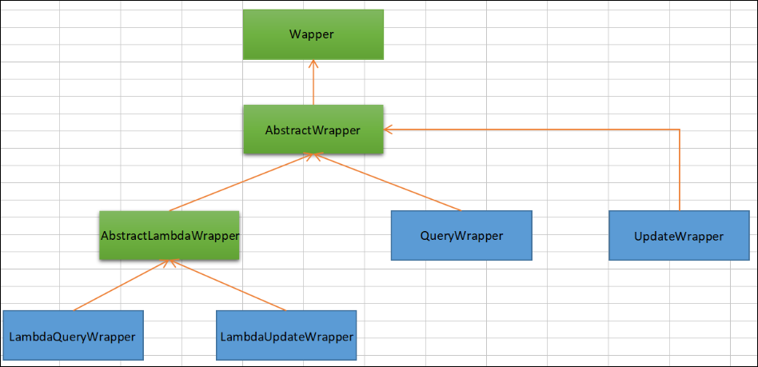

---

Created at: 2023-09-02
Last updated at: 2023-09-04
Source URL: about:blank


---

# 8.MyBatis-plus


**一、MyBatis-Plus 与 MyBatis 的区别**
**MyBatis-Plus 只做增强不做改变**：MyBatis-plus只是在MyBatis的基础增加了让使用更加方便的功能，最主要是改进了MyBatis对单表查询的写法，能十分方便地构造出业务需求中99%的单表查询，更加极致地简化了单表查询的开发，比如使用MyBatis对某张表进行批量查询时，需要现在Mapper接口里面写方法，然后在XML或者注解里面写SQL，显然单表批量查询是一个十分常见的SQL，于是MyBatis-plus就将这种通用的SQL提取出来，开发人员可以直接使用。
使用MyBatis-plus，不用编写SQL即可实现对单表的大部分CRUD操作，对于复杂单表查询，多表关联查询等无能为力，这时就需要动用MyBatis的能力，可以说MyBatis的设计是为了通用性，拥有完整的持久化层框架的功能，而MyBatis-plus的设计则是为了更加方便的使用，极致地简化的MyBatis单表操作能力。

总的来说，MyBatis-plus提供了以下几个方面的增强功能：
1、BaseMapper和ServiceImpl提供单表的CRUD实现，可通过Wrapper十分方便地实现条件的封装。
2、提供方便的注解，以支持常用的功能，比如可以指定映射的数据库表名、支持多种主键生成策略、逻辑删除、乐观锁等。
3、提供分页、乐观锁等插件。

**二、****在SpringBoot项目中****使用MyBatis-plus**
MyBatis-plus一般都是在SpringBoot项目中使用，引入MyBatis-plus的场景启动器：
```
<dependency>
    <groupId>com.baomidou</groupId>
    <artifactId>mybatis-plus-boot-starter</artifactId>
    <version>最新版本</version>
</dependency>
```
MyBatis和MyBatis-plus的配置都写在application.yml的mybatis-plus下
```
#MyBatis-Plus相关配置
mybatis-plus:
  mapper-locations: 'classpath:cn.telecom.ctyun.mapper/*.xml'
  configuration:
    #配置日志
    log-impl: org.apache.ibatis.logging.stdout.StdOutImpl
```

**三、BaseMapper**
BaseMapper<T>封装了通用CRUD接口，方法名分别以Insert、Delete、Update、Select开头。泛型T是ORM对象，如果需要BaseMapper提供的通用CRUD能力，那么就需要让自己的Mapper接口继承BaseMapper：
```
public interface UserMapper extends BaseMapper<User> {
}
```
使用@MapperScan("cn.telecom.ctyun.mapper")注解扫描Mapper接口，MyBatis-plus会自动解析泛型T对应的实体关系映射，然后将Mapper接口的实现类对象注入到容器中，之后可从容器中自动装配拿到这个对象并使用其提供的通用CRUD功能：
```
@SpringBootTest
public class MyBatisPlusTest {
 `@Resource`
 `private UserMapper userMapper;`

    @Test
    void testSelectList() {
        //通过条件构造器查询一个list集合，若没有条件，则可以设置null为参数
        List<User> users = userMapper.selectList(null);
        users.forEach(System.out::println);
    }
}
```


**四、IService和ServiceImpl**
ServiceImpl<M extends BaseMapper<T>, T> 是通用的Service层实现类，也有CRUD方法，是对BaseMapper的方法的进一步封装，提供更多的通用CRUD功能；为了与BaseMapper方法区分，ServiceImpl中save方法代替了BaseMapper的insert方法，saveOrUpdate方法代替了update，remove方法代替了 delete方法，get查询单行、list查询集合、page分页查询代替了select方法。
ServiceImpl不是一个抽象类，也不是一个接口，而是一个具体的实现类，所以理论上是可以直接new ServiceImpl对象进行使用的，但是由于ServiceImpl很多方法的实现都是调用BaseMapper的方法，所以ServiceImpl类有一个BaseMapper的属性，而这个属性需要依靠自动装配获得对象，所以要想正常使用ServiceImpl，必须要从SpringBoot容器中拿，即：
```
@Resource
ServiceImpl<UserMapper, User> userService;
```
这样虽然可以使用ServiceImpl提供的通用CRUD方法，但是却不能在Service层新增加方法，所以一般都不这样用，而是用我们自己的Service层方法去继承 ServiceImpl ：
```
public class UserServiceImpl extends ServiceImpl<UserMapper, User> {
    @Resource
    private UserMapper userMapper;
}
```
又因为在我们习惯面向接口编程，一般是在Service层先写一个接口，然后再写一个它的实现类，所以：
```
public interface UserService {
}
```
然后
```
public class UserServiceImpl extends ServiceImpl<UserMapper, User> implements UserService {
    @Resource
    private UserMapper userMapper;
}
```
但是这样UserService接口里没有ServiceImpl方法的声明，无法通过UserService接口调用ServiceImpl实现的通用CRUD方法，于是MyBatista-plus提供了IService接口，ServiceImpl正是实现了IService，所以只要UserService接口继承IService接口即可实现面向接口编程：
```
public interface UserService extends IService<User> {
}
```


**五、条件构造器**
delete、update、select均可以带where条件，所以BaseMapper和ServiceImpl中的通用方法可分为两类，一类是where条件中用于过滤数据的字段是固定的，见方法名就能知道其意思，比如getById；另外一类就是where条件中用于过滤数据的字段是灵活可变的，这种就需要使用条件构造器来构造，比如 T getOne(Wrapper<T> queryWrapper);


* AbstractWrapper： 用于查询条件封装，生成 sql 的 where 条件。
* QueryWrapper：继承自 AbstractWrapper，多了几个select方法，用于选择select哪些列。
* UpdateWrapper：继承自 AbstractWrapper，多了几个set方法，用于选择set哪些列的值。
* LambdaQueryWrapper：功能等同于QueryWrapper，提供了Lambda表达式的语法可以避免填错列名。
* LambdaUpdateWrapper：功能等同于UpdateWrapper，提供了Lambda表达式的语法可以避免填错列名。

LambdaQueryWrapper与QueryWrapper区别仅仅在于，LambdaQueryWrapper可以使用pojo对象getter方法的方法引用来避免填错列名，例如：
```
LambdaQueryWrapper<User> queryWrapper = new LambdaQueryWrapper<>();
queryWrapper.like(StringUtils.isNotBlank(username), `User::getName`, username);
List<User> list = userMapper.selectList(queryWrapper);
```

上面代码的形式是，先使用Wrapper链式的构造条件，然后将构造好的Wrapper传递到delete、update、select方法中组成完整的SQL语句，是一种符合常规编程思维的方式。除此之外，ServiceImpl还提供了一种链式调用的写法（与Stream的写法一样），先一步一步构造好，最后再调用查询的方法。
query
```
// 链式查询 普通
QueryChainWrapper<T> query();
// 链式查询 lambda 式。注意：不支持 Kotlin
LambdaQueryChainWrapper<T> lambdaQuery();

// 示例：
query().eq("column", value).one();
lambdaQuery().eq(Entity::getId, value).list();
```

update
```
// 链式更改 普通
UpdateChainWrapper<T> update();
// 链式更改 lambda 式。注意：不支持 Kotlin
LambdaUpdateChainWrapper<T> lambdaUpdate();

// 示例：
update().eq("column", value).remove();
lambdaUpdate().eq(Entity::getId, value).update(entity);
```

**六、注解**
@TableName： 表名注解，标识实体类对应的表
@TableId： 主键注解， 实体类主键字段
@TableField：字段注解（非主键）
@Version：乐观锁注解
@EnumValue：普通枚举类注解(注解在枚举字段上)
@TableLogic：标记在用于逻辑删除的字段上

**七、分页**
MyBatis Plus自带分页插件，只要向容器中添加分页插件即可使用分页功能：
```
@Configuration
@MapperScan("com.atguigu.mybatisplus.mapper")
public class MyBatisPlusConfig {
    @Bean
    public MybatisPlusInterceptor mybatisPlusInterceptor(){
        MybatisPlusInterceptor interceptor = new MybatisPlusInterceptor();
        //添加分页插件
        interceptor.addInnerInterceptor(new PaginationInnerInterceptor(DbType.MYSQL));
        return interceptor;
    }
}
```

1、使用BaseMapper自带的selectPage方法或者ServiceImpl自带的page方法
```
`Page<User> page = userService.page(new Page<>(1, 10), new LambdaQueryWrapper<User>().between(User::getAge, 3, 33));`
List<User> records = page.getRecords(); //分页数据
boolean hasNext = page.hasNext();
long pages = page.getPages();
long current = page.getCurrent();
long size = page.getSize();
long total = page.getTotal();
```

2、自带的分页查询仅针对单表查询的场景，如果是多表关联后的分页查询则只能自定义查询方法，比如：
account与user的关系是 n: 1，即一个account只属于一个user，一个user有多个account。
**自定义分页查询方法，page分页对象、必须放在第一位。**
```
@Results({
        @Result(id = true, column = "account_id", property = "id"),
        @Result(column = "uid", property = "uid"),
        @Result(column = "money", property = "balance"),
        @Result(column = "user_id", property = "user.id"),
        @Result(column = "name", property = "user.name"),
        @Result(column = "age", property = "user.age"),
        @Result(column = "email", property = "user.email")
})
@Select("""
        select
            a.id as account_id,
            uid,
            money,
            b.id as user_id,
            name,
            age,
            email
        from public.account a
        left join public.user b
        on a.uid=b.id
        `${ew.customSqlSegment}`
        """)
`//page 分页对象必须放在第一位`
Page<Account> selectAccountWithUserPage(`@Param("page") Page<User> page`, `@Param(Constants.WRAPPER) LambdaQueryWrapper<Account> ew`);
```
```
@Test
public void testPage03() {
    Page<Account> page = accountMapper.selectAccountWithUserPage(new Page<>(1, 10), new LambdaQueryWrapper<Account>().between(Account::getBalance, 0, 10000));
    List<Account> records = page.getRecords(); //分页数据
    records.forEach(System.out::println);
}
```
上面这个示例还展示了**如何在自定义Mapper方法使用条件构造器，即 param 参数名要么叫ew,要么加上注解@Param(Constants.WRAPPER)，然后使用${ew.customSqlSegment}，注意是$。使用条件构造器可以避免使用动态SQL拼接where条件。**

**最佳实践总结：**
1、直接在SpringBoot项目中引入MyBatis-plus的依赖，MyBatis-plus基于MyBatis，所以会自动导入MyBatis的场景启动器。
2、在application.yml中的 mybatis-plus: 下写配置，摒弃XML写配置的方式。
3、继承BaseMapper、IService、ServiceImpl，并在springboot主程序类（或者在配置类）上使用@MapperScan注解把Mapper接口注册到容器中。
4、对于单表的CRUD，直接在Service中使用ServiceImpl自带的方法，不要使用BaseMapper中原始的CRUD方法；对于复杂的SQL，比如多表关联查询，则需要在Mapper中写接口，并搭配Java15的Text Block语法使用注解开发编写SQL，能不使用XML尽量不使用XML，然后在Service中使用Mapper的该方法。
5、只使用Lambda条件构造器

官网： [MyBatis-Plus (baomidou.com)](https://baomidou.com/)

下一步重点学习目标：代码生成器的使用、主键策略

