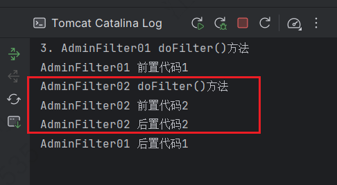

---

Created at: 2024-03-24
Last updated at: 2024-06-13
Source URL: about:blank


---

# 10-过滤器


JavaWeb的三大组件：Servlet、Filter（过滤器）、Listener（监听器）。
**Filter（过滤器）**
_参考：_ _https://juejin.cn/post/7000950677409103880_

Filter和Servlet差不多，都是处理请求的，只不过Filter在Servlet之前执行，起到过滤请求的作用，比如：避免中文乱码（统一设置请求和响应的编码）、权限验证、自动登录等。
1、配置Filter的请求路径，路径一般都是模糊匹配，以做到拦截更多请求
```
<filter>
    <filter-name>AdminFilter01</filter-name>
    <filter-class>filter.AdminFilter01</filter-class>
    <init-param>
        <param-name>url</param-name>
        <param-value>it's a url.</param-value>
    </init-param>
</filter>
<filter-mapping>
    <filter-name>AdminFilter01</filter-name>
    <url-pattern>/admin/*</url-pattern>
</filter-mapping>

<filter>
    <filter-name>AdminFilter02</filter-name>
    <filter-class>filter.AdminFilter02</filter-class>
</filter>
<filter-mapping>
    <filter-name>AdminFilter02</filter-name>
    <url-pattern>/admin/*</url-pattern>
</filter-mapping>
```

2、实现javax.servlet.Filter接口
```
public class AdminFilter01 implements Filter {
    FilterConfig filterConfig;

    public AdminFilter01() {
        System.out.println("1. AdminFilter构造器");
    }

    @Override
    public void init(FilterConfig filterConfig) throws ServletException {
        System.out.println("2. AdminFilter init()方法");
        this.filterConfig = filterConfig;
        System.out.println("filter-name的值是：" + filterConfig.getFilterName());
        System.out.println("初始化参数url的值是" + filterConfig.getInitParameter("url"));
        System.out.println(filterConfig.getServletContext());
    }

    /**
     * 拦截/admin下的所有请求，实现只有username=admin的用户才能访问admin下的资源。
     */
    @Override
    public void doFilter(ServletRequest request, ServletResponse response, FilterChain chain) throws IOException, ServletException {
        System.out.println("3. AdminFilter doFilter()方法");
        HttpSession session = ((HttpServletRequest) request).getSession();
        User user = (User) session.getAttribute("user");
        if (user == null){ //访问admin下的资源时发现用户没有登录，重定向到用户登录页面
            request.getRequestDispatcher("/login.jsp").forward(request,response);
        } else if (!user.getName().equals("admin")) { //访问admin下的资源时发现用户不是admin，重定向到普通主页面
            request.getRequestDispatcher("/index.jsp").forward(request,response);
        } else { //用户是admin
            System.out.println("前置代码1"); //上面都是前置代码，过滤器的核心业务逻辑
            /**
             * chain.doFilter(request, response);的作用：
             *    1.如果有下一个Filter过滤器，则执行下一个过滤器
             *    2.如果没有下一个过滤器，则放行，执行对应的Servlet
             * 如果这个地方没有写chain.doFilter(req,resp); 资源就会被拦截，不再往下走了，也就是不会执行Servlet
             */
            chain.doFilter(request, response); //放行
            System.out.println("后置代码1（执行完Servlet后再回到这里）");
        }
    }

    @Override
    public void destroy() {
        System.out.println("4. AdminFilter destroy()方法");
    }
}
```

3、Filter的生命周期

1. 初始化：servlet 容器在实例化Filter后会init方法进行初始化，区别于Servlet，过滤器会在容器启动时立即实例化并初始化。init方法会传递一个FilterConfig对象，从该对象可以获取初始化参数，并且可以通过FilterConfig获取ServletContext对象。
2. 存活：和应用的生命周期是一致的，在内存中是单例的，针对拦截范围内的资源，每次访问都会调用void doFIlter(request,response.chain)进行拦截。
3. 销毁：应用关闭时，会调用destroy方法。

4、多个过滤器的执行顺序
当请求对应存在多个过滤器时，过滤器按照web.xml中<filter-mapping>定义的先后顺序执行。


