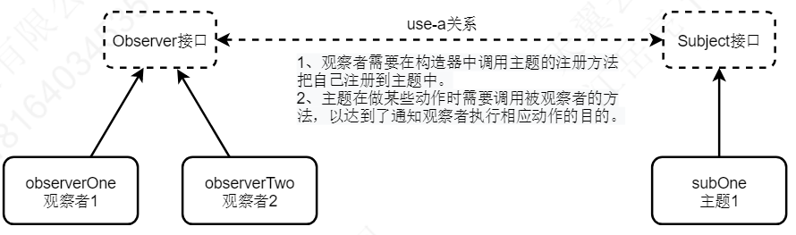

---

Created at: 2024-03-28
Last updated at: 2024-03-29
Source URL: about:blank


---

# 11-监听器（内含观察者模式）


监听器（Listener）
_参考：https://juejin.cn/post/7001392790282174472_

**一、观察者模式**
观察者接口，所有观察者都要实现的接口
```
public interface Observer {
    /**
     * 当Subject（主题）发生变化的时候会调用此方法，于是就达到了通知观察者执行相应动作的目的
     *
     * @param subject 通知观察者的主题
     * @param arg     要向观察者传递的其他参数
     */
    void response(Subject subject, Object... arg);
}
```
主题接口，主题是指被观察的主体，每一个被观察的类都要实现该接口
```
public interface Subject {
    /**
     * 向主题中注册观察者：主题在发生变化时需要通知观察者，所以需要保持所有观察者的引用。
     * @param observer 观察者对象
     */
    void registerObserver(Observer observer);

    /**
     * 移除观察者
     * @param observer 观察者对象
     */
    void removeObserver(Observer observer);

    /**
     * 通知所有已经注册的观察者
     */
    void notifyAllObserver();
}
```
主题1：
```
public class SubOne implements Subject {

    List<Observer> observers = new ArrayList<>();

    //注册观察者
    @Override
    public void registerObserver(Observer observer) {
        observers.add(observer);
    }

    //移除观察者
    @Override
    public void removeObserver(Observer observer) {
        observers.remove(observer);
    }

    //通知所有观察者
    @Override
    public void notifyAllObserver() {
        for (Observer observer : observers) {
            observer.response(this);
        }
    }

    public void doSomething() {
        System.out.println("主题做了某些动作");
        notifyAllObserver();//做完动作需要通知观察者，达到了通知观察者执行相应动作的目的
    }
}
```
观察者1
```
public class ObserverOne implements Observer {

    //把自己注册到主题中
    public ObserverOne(Subject subject) {
        subject.registerObserver(this);
    }

    @Override
    public void response(Subject subject, Object... arg) {
        System.out.println(subject + "发生变化，ObserverOne 对此做出反应");
    }
}
```
观察者2
```
public class ObserverTwo implements Observer {

    //把自己注册到主题中
    public ObserverTwo(Subject subject) {
        subject.registerObserver(this);
    }

    @Override
    public void response(Subject subject, Object... arg) {
        System.out.println(subject + "发生变化，ObserverTwo 对此做出反应");
    }
}
```
主程序
```
public static void main(String[] args) {
    SubOne subOne = new SubOne(); //创建主题
    new ObserverOne(subOne); //新建观察者1
    new ObserverTwo(subOne); //新建观察者2
    subOne.doSomething();
}
```

观察者模式的类图


**二、监听器（Listener）**
监听器就是观察者模式的一种实现。在Servlet规范中定义了多种类型的监听器，用于监听ServletContext，HttpSession和ServletRequest这三个域对象的变化。

1、生命周期监听器
生命周期监听器专门用于监听域对象的创建和销毁事件，主要有三个ServletContextListener、HttpSessionListener、ServletRequestListener。
ServletContextListener，监听ServletContext对象的创建和销毁。
```
default public void contextInitialized(ServletContextEvent evt)：ServletContext对象被创建后调用；
default public void contextDestroyed(ServletContextEvent evt)：ServletContext对象被销毁前调用；
```
HttpSessionListener，开始会话和结束会话时调用下面两个方法：
```
default public void sessionCreated(HttpSessionEvent evt)：HttpSession对象被创建后调用；
default public void sessionDestroyed(HttpSessionEvent evt)：HttpSession对象被销毁前调用；
```
ServletRequestListener，开始请求和结束请求时调用下面两个方法：
```
default public void requestInitiallized(ServletRequestEvent evt)：ServletRequest对象被创建后调用；
default public void requestDestroyed(ServletRequestEvent evt)：ServletRequest对象被销毁前调用。
```

例如，创建一个监听Session创建和销毁的监听器
```
public class MyHttpSessionListener implements HttpSessionListener {
    @Override
    public void sessionCreated(HttpSessionEvent se) {
        System.out.println("Session创建: " + se.getSession());
    }
    @Override
    public void sessionDestroyed(HttpSessionEvent se) {
        System.out.println("Session销毁: " + se.getSession());
    }
}
```
需要在web.xml中配置，监听器就是观察者，此配置告诉web容器创建了一个监听器，需要将其注册到HttpSession类中的观察者列表中。
```
<!--部署监听器-->
<listener>
    <listener-class>com.example.listener.MyHttpSessionListener</listener-class>
</listener>
```

2、属性监听器
属性监听器专门用于监听域对象的域属性的增、删、改事件，主要有三个：ServletContextAttributeListener、HttpSessionAttributeListener、ServletRequestAttributeListener。
ServletContextAttributeListener：在ServletContext域进行增、删、改属性时调用下面方法。
```
default public void attributeAdded(ServletContextAttributeEvent evt)：添加域属性
default public void attributeRemoved(ServletContextAttributeEvent evt) ：删除域属性
default public void attributeReplaced(ServletContextAttributeEvent evt) ：修改域属性
```
HttpSessionAttributeListener：在HttpSession域进行增、删、改属性时调用下面方法
```
default public void attributeAdded(HttpSessionBindingEvent evt) ：添加域属性
default public void attributeRemoved (HttpSessionBindingEvent evt) ：删除域属性
default public void attributeReplaced (HttpSessionBindingEvent evt) ：修改域属性
```
ServletRequestAttributeListener：在ServletRequest域进行增、删、改属性时调用下面方法
```
default public void attributeAdded(ServletRequestAttributeEvent evt) ：添加域属性
default public void attributeRemoved (ServletRequestAttributeEvent evt) ：删除域属性
default public void attributeReplaced (ServletRequestAttributeEvent evt) ：修改域属性
```

