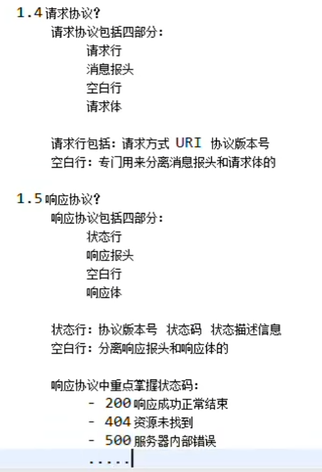
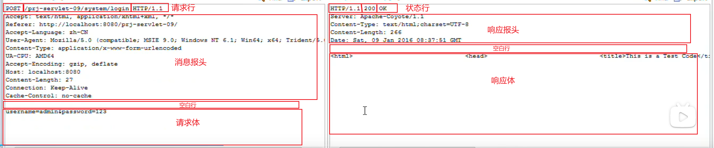

---

Created at: 2024-01-08
Last updated at: 2024-06-23
Source URL: about:blank


---

# 5-HttpServlet接口


**一、Http协议**




注意：GET请求支持缓存，第二次访问get请求时会走浏览器缓存，可以通过在GET请求后面加一个时间戳从而避免走缓存；POST请求不支持缓存，每次提交POST请求都会访问服务器。

**HTTP协议在同一个端口下连续发送多次请求，一会后连续收到多个响应，请问确定请求与响应的对应关系？**
回答：HTTP/1.1协议在同一个端口下发送一次请求，必须等待该请求的响应回来后才能发送下一次请求，也就是HTTP/1.1的两个请求的生命周期不能重叠。HTTP建立在TCP协议之上，也就是说HTTP/1.1的单个TCP连接在同一个时刻只能处理一个请求。虽然 HTTP/1.1 规范中规定了 Pipelining 来试图解决这个问题，但是这个功能在浏览器中默认是关闭的。
HTTP/2.0应运而生，提供了Multiplexing多路传输特性，可以在一个 TCP 连接中同时完成多个 HTTP 请求。
那么在 HTTP/1.1 时代，浏览器是如何提高页面加载效率的呢？主要有下面两点：

1. 维持和服务器已经建立的 TCP 连接，在同一连接上顺序处理多个请求（ HTTP1.0是短连接，一次请求与响应之后会立刻断开连接；而HTTP1.1 默认情况下建立 TCP 连接不会断开，只有在请求报头中声明 Connection: close 才会在请求完成后关闭连接，从而提高了页面加载效率）。
2. 和服务器建立多个 TCP 连接。既然一个TCP连接中不能并行请求，那就建立多个TCP连接。

**二、HttpServlet**
Http协议的请求中内容会封装到HttpRequest中，比如可以HttpRequest中的getMethod方法拿到请求行中的请求方式：
```
public class ServletTest04 extends GenericServlet {

    //用户每次请求时执行一次
    @Override
    public void service(ServletRequest servletRequest, ServletResponse servletResponse) throws ServletException, IOException {
        HttpServletRequest httpServletRequest = (HttpServletRequest) servletRequest;
        `String method = httpServletRequest.getMethod();`
        if ("GET".equals(method)) {
            System.out.println("这是一个GET请求");
        } else if ("POST".equals(method)) {
            System.out.println("这是一个POST请求");
        }
    }
}
```

开发中需要对Get请求和POST请求做不同的处理，显然上述代码每次都需要重复编写一次，只是if-else里的内容不同而已，于是可以使用模板方法模式将这段重复的代码提取出来（Tomcat提供的HttpServlet的实现原理类似）。
```
public class HttpServlet extends GenericServlet {
    @Override
    public final void service(ServletRequest servletRequest, ServletResponse servletResponse) throws ServletException, IOException {
        HttpServletRequest httpServletRequest = (HttpServletRequest) servletRequest;
        HttpServletResponse httpServletResponse = (HttpServletResponse) servletResponse;
        String method = httpServletRequest.getMethod();
        if ("GET".equals(method)) {
            doGet(httpServletRequest, httpServletResponse);
        } else if ("POST".equals(method)) {
            doPost(httpServletRequest, httpServletResponse);
        }
    }

    //http状态码405表示服务器不支持该请求方式，http status 405 - http nethod GET is not supported by this url
    public void doGet(HttpServletRequest httpServletRequest, HttpServletResponse httpServletResponse) throws IOException {
        httpServletResponse.setContentType("text/html;charset=utf-8");
        PrintWriter out = httpServletResponse.getWriter();
        out.println("405-该Servlet不支持GET请求");
        throw new RuntimeException("405");
    }

    public void doPost(HttpServletRequest httpServletRequest, HttpServletResponse httpServletResponse) throws IOException {
        httpServletResponse.setContentType("text/html;charset=utf-8");
        PrintWriter out = httpServletResponse.getWriter();
        out.println("405-该Servlet不支持post请求");
        throw new RuntimeException("405");
    }
}
```

于是以后写Servlet可以直接继承HttpServlet重写doGet方法或者doPost方法，比如LoginHttpServlet、LogoutHttpServlet：
向LoginHttpServlet发送get请求会向前端返回异常，同时服务器端会抛异常
```
public class LoginHttpServlet extends HttpServlet {
    @Override
    public void doPost(HttpServletRequest httpServletRequest, HttpServletResponse httpServletResponse) throws IOException {
        httpServletResponse.setContentType("text/html;charset=utf-8");
        PrintWriter out = httpServletResponse.getWriter();
        out.println("200，登录成功！");
    }
}
```
向LogoutHttpServlet发送post请求会向前端返回异常，同时服务器端会抛异常
```
public class LogoutHttpServlet extends HttpServlet {
    @Override
    public void doGet(HttpServletRequest httpServletRequest, HttpServletResponse httpServletResponse) throws IOException {
        httpServletResponse.setContentType("text/html;charset=utf-8");
        PrintWriter out = httpServletResponse.getWriter();
        out.println("200，退出成功！");
    }
}
```

