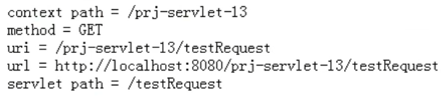
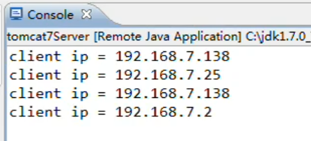

---

Created at: 2024-01-09
Last updated at: 2024-03-28
Source URL: about:blank


---

# 6- HttpServletRequest接口 和 HttpServletResponse接口


**一、HttpServletRequest接口**
HttpServletRequest继承自ServletRequest接口，同样由Web容器实现。
```
public interface HttpServletRequest extends ServletRequest
```
HttpServletRequest对象封装了HTTP协议请求的全部内容，用户的每一次请求Tomcat都会new一个HttpServletRequest对象，也就是一次请求对应着一个HttpServletRequest对象，所以HttpServletRequest对象的生命周期是短暂的。

1、获取请求提交的数据
表单提交的数据会自动封装到HttpServletRequest对象中，HttpServletRequest会用Map集合存这些数据，其中value是一个字符串类型的一维数组，因为表单可以有多选框。
```
public class ServletTest05 extends HttpServlet{
    @Override
    protected void doPost(HttpServletRequest req, HttpServletResponse resp) throws ServletException, IOException {
        //1.获取一维数组中的首元素
        String username = req.getParameter("username");
        //2.获取一维数据
        String[] sports = req.getParameterValues("sports");
        //3.获取Map集合所有的key
        Enumeration<String> names = req.getParameterNames();
        //4.获取整个Map集合
        Map<String, String[]> map = req.getParameterMap();
    }
}
```

2、获取请求的信息
```
public class ServletTest06 extends HttpServlet {
    @Override
    protected void doPost(HttpServletRequest req, HttpServletResponse resp) throws ServletException, IOException {
        String contextPath = req.getContextPath();//获取上下文路径，webapp的路径，也就是 项目名
        String method = req.getMethod();//获取浏览器的请求方式
        String uri = req.getRequestURI();//获取URI
        StringBuffer url = req.getRequestURL();//获取URL
        String servletPath = req.getServletPath();//获取Servlet Path
        String remoteAddr = req.getRemoteAddr();//获取客户端IP地址
    }
}
```
结果：


从上面的结果可以看到：
    req.getRequestURI() = req.getContextPath() + req.getServletPath()
    uri = 项目名 + servlet请求路径(在web.xml里面配置的路径)

**3、向HttpServletRequest中存取数据**
**request范围：只能在同一次请求中传递数据！（转发可以，重定向不行）**
```
public class AServlet extends HttpServlet {
    @Override
    protected void doPost(HttpServletRequest req, HttpServletResponse resp) throws ServletException, IOException {
        //向request范围存数据
        req.setAttribute("name", "zahngsan");
        //从request范围取数据
        String name = (String) req.getAttribute("name");
        //从request范围中移除数据
        req.removeAttribute("name");
    }
}
```

**4、在服务器端转发请求**
在服务器端转发请求不会创建新的HttpServletRequest对象，即调用新的Servlet的service方法时复用之前的request和response对象，所以这始终是一次请求与响应，可以使用getAttribute方法获取request对象中的数据。
```
//获取请求转发器对象
RequestDispatcher requestDispatcher = `req.getRequestDispatcher("/b");`
//转发请求
requestDispatcher.forward(req, resp);
```

 5、设置读取HttpServletRequest对象中从浏览器发送过来的数据的编码格式
```
//设置读取GET或者POST请求发送过来数据的编码格式
`req.setCharacterEncoding("UTF-8");`
String name = req.getParameter("name");
```

**6、获取请求体中的Cookie**
```
public class GetCookieServlet extends HttpServlet {
    @Override
    protected void doGet(HttpServletRequest request, HttpServletResponse response) throws ServletException, IOException {
        `Cookie[] cookies = request.getCookies();`
        System.out.println(Arrays.toString(cookies));
    }
}
```

**7、从请求中获取Session对象**
```
public class SessionServlet extends HttpServlet {
    @Override
    protected void doGet(HttpServletRequest request, HttpServletResponse response) throws ServletException, IOException {
        `HttpSession session = request.getSession();`
    }
}
```

**二、HttpServletResponse接口**
HttpServletResponse继承自ServletResponse：
```
public interface HttpServletResponse extends ServletResponse
```
**1、重定向（重点）**
重定向是两次请求，即服务器向浏览器发送了一个重定向响应，然后浏览器紧接着又发起了一次"XXX/b"的请求。
```
public class ServletTest07 extends HttpServlet {
    @Override
    protected void doPost(HttpServletRequest req, HttpServletResponse resp) throws ServletException, IOException {
        `resp.sendRedirect(req.getContextPath() + "/b");`
    }
}
```
转发和重定向都可以完成资源跳转，但是二者的区别十分重要：
a. 转发是Request的方法；重定向是response的方法。
b. 转发是直接在服务器端完成，自始至终只是一次请求，浏览器地址栏的地址不会发生变化；但是重定向是两次请求，浏览器地址栏上地址会发生变化。
c. 因为转发是在服务器端完成，所以填写地址的时候不用加webapp根路径；但是重定向是浏览器完成的，所以需要加上webapp根路径。
d. 重定向可以完成跨app的资源跳转，即可以跳转到任意地址。
f.  转发应为浏览器地址栏地址不变，所以不能解决刷新地址栏重复提交表单数据的问题；但是重定向可以解决这个问题，因为浏览器地址栏地址变了
h. 重定向无法访问到/WEB-INF，但是转发可以访问到。因为/WEB-INF下的文件无法直接通过浏览器访问，但是可以在服务器端被访问。

2、设置响应体数据的编码格式
这个需要在获取响应的输出流前设置
```
httpServletResponse.setContentType("text/html;charset=utf-8");
```

3、获取响应的输出流
```
PrintWriter out = httpServletResponse.getWriter();
out.println("200，登录成功！");
```

**4、向响应体中设置Cookie**
```
public class CreateAndSendCookieToBrowserServlet extends HttpServlet {
    @Override
    public void doGet(HttpServletRequest request, HttpServletResponse response) {
        Cookie cookie1 = new Cookie("username", "zhangsan");
 `response.addCookie(cookie1);`
    }
}
```

