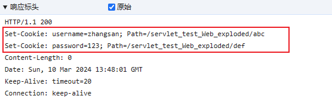
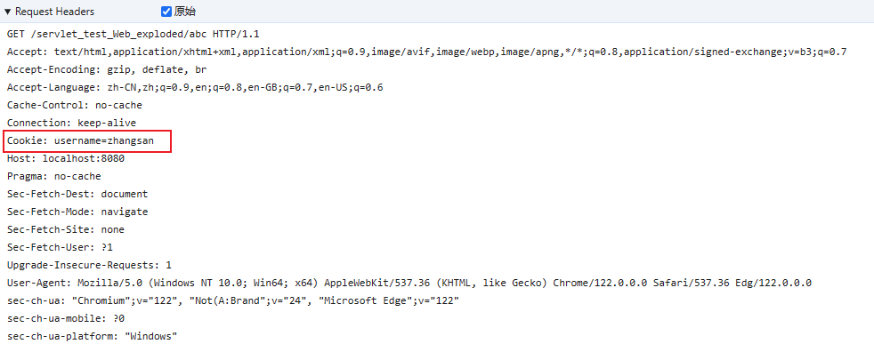
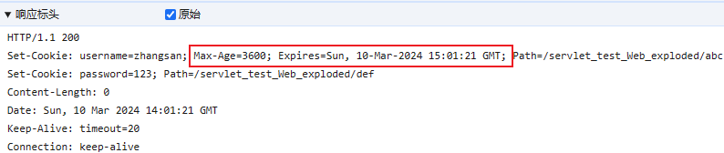

---

Created at: 2024-03-10
Last updated at: 2025-02-25
Source URL: about:blank


---

# 7-Cookie


Cookie用于在浏览器端保存会话状态，浏览器可以将Cookie保存在内存中，也可以保存在外存中，如果保存在内存中，则关闭浏览器Cookie也会被删除，如果保存在外存中，浏览器关闭Cookie依然存在，除非Cookie失效。Cookie这种机制是HTTP协议规定的。

`**1、在响应体中设置Cookie**`
在响应体中设置Cookie，从而让浏览器保存Cookie。浏览器保存Cookie时会将其与一个请求路径绑定， 下次向服务器发送该路径的请求的时候，浏览器会在请求体中带上该Cookie。
在Servlet规范中也定义了对应的类，即Cookie（Cookie本身就是保存在浏览器端，所以浏览器肯定提供了可以用JavaScript操作Cookie的接口）。
在创建服务器端的Cookie并将其设置到HttpServletResponse中，浏览器接受到响应之后会设置Cookie。
默认绑定的请求路径是创建Cookie时的请求的上一级路径，比如：
CreateAndSendCookieToBrowserServlet的请求路径是： localhost:8080/servlet\_test\_Web\_exploded/createCookie，那么cookie绑定的路径是 /servlet\_test\_Web\_exploded
当然也可以设置的Cookie的请求路径：
```
public class CreateAndSendCookieToBrowserServlet extends HttpServlet {
    @Override
    public void doGet(HttpServletRequest request, HttpServletResponse response) {
 `Cookie cookie1 = new Cookie("username", "zhangsan");`
 `Cookie cookie2 = new Cookie("password", "123");`
 `cookie1.setPath(request.getContextPath() + "/abc");`
 `cookie2.setPath(request.getContextPath() + "/def");`
        `response.addCookie(cookie1);`
 `response.addCookie(cookie2);`
    }
}
```
响应体：

请求体：


`**2、设置Cookie的有效时长**`
MaxAge>0会将Cookie保存到磁盘上，关闭浏览器也不会删除，直到到达有效时长才会被删除。
```
public class CreateAndSendCookieToBrowserServlet extends HttpServlet {
    @Override
    public void doGet(HttpServletRequest request, HttpServletResponse response) {
        Cookie cookie1 = new Cookie("username", "zhangsan");
        Cookie cookie2 = new Cookie("password", "123");
        cookie1.setPath(request.getContextPath() + "/abc");
        cookie2.setPath(request.getContextPath() + "/def");
        `cookie1.setMaxAge(60 * 60); //设置Cookie有效时长为1个小时`
        response.addCookie(cookie1);
        response.addCookie(cookie2);
    }
}
```


**3、从请求体中获取Cookie**
```
public class GetCookieServlet extends HttpServlet {
    @Override
    protected void doGet(HttpServletRequest request, HttpServletResponse response) throws ServletException, IOException {
        `Cookie[] cookies = request.getCookies();`
        PrintWriter writer = response.getWriter();
        for (Cookie cookie : cookies) {
            writer.println(`cookie.getName()`);
            writer.println(`cookie.getValue()`);
        }
    }
}
```

