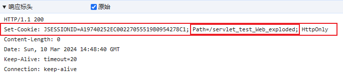
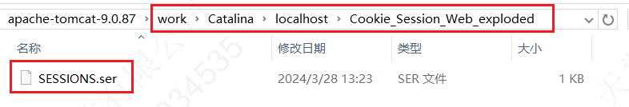

---

Created at: 2024-03-10
Last updated at: 2024-04-03
Source URL: about:blank


---

# 8-Session


Cookie保存在客户端，Session与之对应，是保存在服务器端的会话信息，由Web容器实现这个机制，也就是说不管是不是Servlet容器，都应该实现Session机制，在Servlet中，Session对应的接口是javax.servlet.http.HttpSession（Java语言的Web服务器都是实现Servlet规范的容器，其他语言如Python的Django就不是实现Servlet规范，但是也需要是实现Session机制，Web容器最基本的功能 ）。

1、从请求中获取Session对象
同一个会话每次请求都是用一个session对象
```
public class SessionServlet extends HttpServlet {
    @Override
    protected void doGet(HttpServletRequest request, HttpServletResponse response) throws ServletException, IOException {
        `HttpSession session = request.getSession(); //根据jsessionid获取session对象，如果没有获取到则新建session对象`
 `HttpSession session2 = request.getSession(false); //根据jsessionid获取session对象，如果没有获取到则返回null`
        session.getId(); //拿到JSESSIONID
        session.isNew();  //是否首次创建session
        session.setAttribute("username", "zhansgan"); //在session中设置值
        session.getAttribute("username"); //从Session中获取值
        session.removeAttribute("username");  //删除session中的值
        session.getMaxInactiveInterval();  //获取session的超时时间
        session.setMaxInactiveInterval(3);  //设置session的超时时间
        session.invalidate(); //使session失效

  session.getServletContext(); //获取ServletContext对象
    }
}
```

**2、实现原理**
实现原理：HttpSession session = request.getSession();执行时，如果请求体中没有带name为jsessionid的cookie，那么此时会在响应体中设置一个jsessionid的cookie，然后再创建一个Session对象，最后将jsessionid与session对象放在Map中，那么下次同一个会话的请求都会带上相同的jsessionid，从而每次都可以在服务器端拿到相同的session。

jsessionid绑定的请求路径是根路径，也就是项目名，所以以后同一个会话的所有请求都会带上相同的jsessionid。
（从实现原理上看，Session的实现完全依赖于Cookie，并不依赖于jsessionid这个名称，也就是Session所依赖的Cookie的名称并不是非得取jsessionid这个名字，完全可以用其他名字，取决于Web容器的实现，Servlet容器应该都是用的jsessionid这个名字。）

Session的实现完全依赖于Cookie，所以如果浏览器禁用Cookie，Session机制也就失效了，如果仍然想使用Session，可以在URL请求上拼接jsessionid，如：
```
http://localhost:8080/servlet_test_Web_exploded/abc;JSESSIONID=A19740252EC00227055519B0954278C1
```
服务器仍然可以从请求路径中拿到jsessionid，从而拿到对应的session对象，所以并不一定是浏览器关闭了，会话就完全实效了，只有当服务器端的session对象被删除了会话才算是完全实效了。

3、设置session对象的超时时间
服务器实效Session对象的时机：session对象长时间没有被访问则会被删除，可以在web.xml中设置。
```
<session-config>
    <!--默认是30分钟，这里设置为120分钟-->
    <session-timeout>120</session-timeout>
</session-config>
```

4、Session钝化与活化
为了保证客户端不关闭，服务器重启后，两次获取的session是同一个，tomcat会对Session进行钝化和活化：

* session的钝化：在服务器正常关闭之前，将session对象序列化到硬盘上，在tomcat的目录下的work目录中，会生成SESSIONS.ser文件。
* session的活化：在服务器启动时会读取work目录中的SESSIONS.ser文件，将其反序列化到内存中的session对象，并删除SESSIONS.ser文件。



