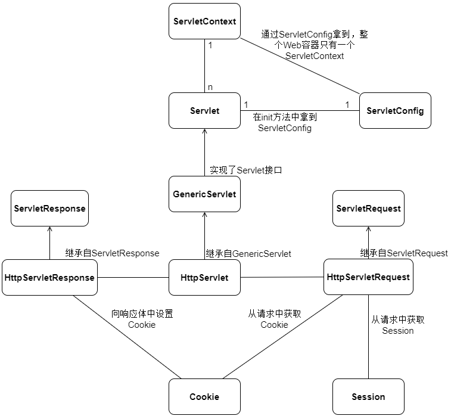
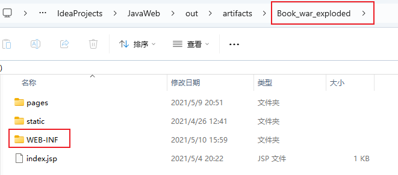
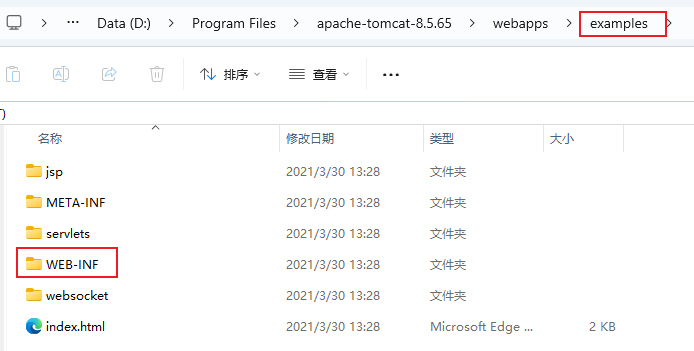

---

Created at: 2024-03-10
Last updated at: 2024-03-28


---

# 9-总结


**一、Servlet中的重点接口和类的关系**


**二、数据域的可见范围**
三种可见范围：请求范围（HttpRequest）、会话范围（Session）、应用范围（ServletContext），分别对应：HttpRequest、Session和ServletContext，都可以getAttribute、setAttribute和removeAttribute，其可见范围的排序是：ServletContext > Session > HttpRequest。

**三、请求路径总结：**
**1、浏览器发送的请求需要带上 “/项目名”，比如**
1.1 JSP中的请求路径：
```
<a href="/项目名/资源路径"></a>
<form action="/项目名/资源路径"></form>
```
1.2 重定向：    
```
response.sendRedirect("/项目名/资源路径");
```
1.3 Cookie设置path，这是Servlet发送给浏览器的，也要加上“/项目名”
```
cookie.setPath("/项目名/资源路径");
```
总结：只要是浏览器感知的都要加上“/项目名”（浏览器发送的 或者发送给 浏览器的）

**2、Servlet中的路径不需要带上“/项目名”，比如：**
2.1 在web.xml中配置请求路径时不要带上“/项目名”，例如<servlet-mapping>
```
    <servlet-mapping>
        <-name>HelloServlet</servlet-name>
        <url-pattern>/hello</url-pattern>
    </servlet-mapping>
```
2.3 转发：
```
request.getRequestDispatcher("/资源路径").forward(request, response);
```
总结：只要是servlet感知的不要带上“/项目名”

什么是“/项目名”？
WEB-INF的上一级就是“/项目名”



**3、<servlet-mapping>下的<url-pattern>的编写方式**
3.1 <url-pattern>可以写多个
```
<servlet-mapping>
    <servlet-name>ManagerOrderServlet</servlet-name>
    `<url-pattern>/manager/orderServlet</url-pattern>`
 `<url-pattern>/manager/orderController</url-pattern>`
</servlet-mapping>
```

3.2 模糊匹配
```
<url-pattern>/manager/orderController</url-pattern>  //精准匹配
<url-pattern>/manager/*</url-pattern>
<url-pattern>*Controller</url-pattern>  //后缀匹配
<url-pattern>/*</url-pattern>  //全部匹配
```

