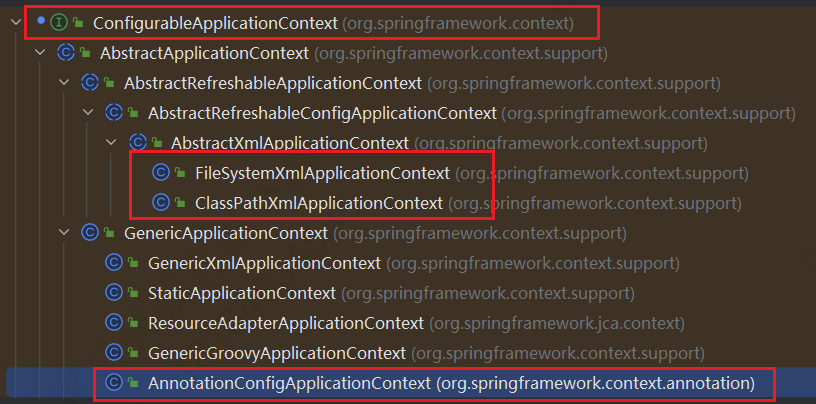

---

Created at: 2024-03-19
Last updated at: 2024-05-21
Source URL: https://www.zhihu.com/question/381216328


---

# 1-IOC的本质


IOC（Inversion of Control）是一种编程思想，即把对象的创建与属性的赋值交给容器进行统一处理。

**手写简易的IOC容器：**
@Bean注解：标注此注解的类会被创建一个实例对象放到IOC容器中
```
@Target(ElementType.TYPE)
@Retention(RetentionPolicy.RUNTIME)
public @interface Bean {
}
```

@Di注解：按照类型从容器中取对象实例赋值给实例变量
```
@Target({ElementType.FIELD})
@Retention(RetentionPolicy.RUNTIME)
public @interface Di {
}
```

@ComponentScan注解：指明需要扫描哪些包
```
@Target(ElementType.TYPE)
@Retention(RetentionPolicy.RUNTIME)
public @interface ComponentScan {
   String[] value();
}
```

ApplicationContext接口：
```
public interface ApplicationContext {
   Object getBean(Class clazz);
}
```

AnnotationApplicationContext：
```
public class AnnotationApplicationContext implements ApplicationContext {

   //存储bean的容器
   private HashMap<Class, Object> iocContainer = new HashMap<>();
   private int rootPathLength;

   public AnnotationApplicationContext(Class configClass) throws Exception {
       ComponentScan componentScan = (ComponentScan) configClass.getAnnotation(ComponentScan.class);
       for (String packagePath : componentScan.value()) {
           packagePath = packagePath.replace('.', '\\');
           String dir = Thread.currentThread().getContextClassLoader().getResource(packagePath).getFile();
           rootPathLength = dir.length() - packagePath.length();
           loadBean(new File(dir));
       }
       di();
   }

   /**
    * 扫描包中标注有@Bean注解的类，创建对象放到容器中
    */
   private void loadBean(File dir) throws Exception {
       if (!dir.isDirectory()) {
           return;
       }
       for (File file : dir.listFiles()) {
           if (file.isDirectory()) {
               loadBean(file);
           }
           String fileName = file.getPath().substring(rootPathLength - 1);
           if (fileName.contains(".class")) {
               String clazz = fileName.replace("\\", ".").replace(".class", "");
               Class aClass = Class.forName(clazz);
               if (!aClass.isInterface()) {
                   Annotation beanAnno = aClass.getAnnotation(Bean.class);
                   if (beanAnno != null) {
                       Object bean = aClass.getConstructor().newInstance();
                       if (aClass.getInterfaces().length > 0) {
                           iocContainer.put(aClass.getInterfaces()[0], bean);
                       } else {
                           iocContainer.put(aClass, bean);
                       }
                   }
               }
           }
       }
   }

   /**
    * 给标注有@Di注解的示例变量赋值
    */
   private void di() throws IllegalAccessException {
       for (Map.Entry<Class, Object> entry : iocContainer.entrySet()) {
           Class aClass = entry.getKey();
           Field[] fields = aClass.getDeclaredFields();
           for (Field field : fields) {
               Di diAnno = field.getAnnotation(Di.class);
               if (diAnno != null) {
                   field.setAccessible(true);
                   field.set(entry.getValue(), iocContainer.get(field.getType()));
               }
           }
       }
   }

   @Override
   public Object getBean(Class clazz) {
       return iocContainer.get(clazz);
   }
}
```

测试：
配置类：
```
@ComponentScan("pojo")
public class IocConfig {
}
```

启动类：
```
public class IocTest {
   public static void main(String[] args) throws Exception {
       AnnotationApplicationContext context = new AnnotationApplicationContext(IocConfig.class);
       Object bean = context.getBean(Teacher.class);
       System.out.println(bean);
   }
}
```

#### **IoC容器在Spring的实现**

**BeanFactory：** 是 IoC 容器的基本实现，是 Spring 内部使用的接口。面向 Spring 本身，不提供给开发人员使用。
**ApplicationContext：** BeanFactory 的子接口，提供了更多高级特性。面向 Spring 的使用者，几乎所有场合都使用 ApplicationContext 而不是底层的 BeanFactory。
**ApplicationContext的主要实现类：**
****

|     |     |
| --- | --- |
| 类型名 | 简介  |
| ConfigurableApplicationContext | ApplicationContext 的子接口，包含一些扩展方法 refresh() 和 close() ，让 ApplicationContext 具有启动、关闭和刷新上下文的能力。 |
| ClassPathXmlApplicationContext | 通过读取类路径下的 XML 格式的配置文件创建 IOC 容器对象 |
| FileSystemXmlApplicationContext | 通过文件系统路径读取 XML 格式的配置文件创建 IOC 容器对象 |
| AnnotationConfigApplicationContext | 通过注解读取配置创建IOC容器 |

