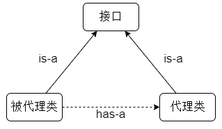

---

Created at: 2024-03-20
Last updated at: 2024-03-25
Source URL: about:blank


---

# 4-代理模式


**1、静态代理**
接口
```
public interface Calculator {
   int add(int i, int j);
   int sub(int i, int j);
   int mul(int i, int j);
   int div(int i, int j);
}
```
实现类
```
public class CalculatorImpl implements Calculator {
   @Override
   public int add(int i, int j) {
       int result = i + j;
       System.out.println("方法内部 result = " + result);
       return result;
   }
   @Override
   public int sub(int i, int j) {
       int result = i - j;
       System.out.println("方法内部 result = " + result);
       return result;
   }
..........
}
```
上述代码已经固化下来了，不能改动（比如是引入的jar包，又或者是为了版本兼容，旧的代码不能改动），但是现在需求是要为上述实现类加上某种功能，比如打日志、权限控制等，在不改动原有代码的情况下怎么实现？
这时可以想到面向接口编程的好处了，即 再写一个实现该接口的实现类，同时在该实现类中持有Calculator的实例变量：
```
public class CalculatorStaticProxy `implements Calculator`{
    // 将被代理的目标对象声明为成员变量
    `private Calculator target;`

    public CalculatorStaticProxy(Calculator target) {
        this.target = target;
    }
    @Override
    public int add(int i, int j) {
        // 附加功能由代理类中的代理方法来实现
        System.out.println("[日志] add 方法开始了，参数是：" + i + "," + j);
        // 通过目标对象来实现核心业务逻辑
        int addResult = target.add(i, j);
        System.out.println("[日志] add 方法结束了，结果是：" + addResult);
        return addResult;
    }
    @Override
    public int sub(int i, int j) {
        // 附加功能由代理类中的代理方法来实现
        System.out.println("[日志] sub 方法开始了，参数是：" + i + "," + j);
        // 通过目标对象来实现核心业务逻辑
        int subResult = target.sub(i, j);
        System.out.println("[日志] sub 方法结束了，结果是：" + subResult);
        return subResult;
    }
...........
}
```
之后通过代理类对象访问被代理类对象：
```
public static void main(String[] args) {
    CalculatorImpl calculatorImpl = new CalculatorImpl();
    CalculatorStaticProxy staticProxy = new CalculatorStaticProxy(calculatorImpl);
    int res = staticProxy.add(1, 1);
    System.out.println(res);
}
```

这就是静态代理，很明显，静态代理的劣势有：

1. 每个被代理的方法都需要重复同样的代理功能，即又大量的重复编码。
2. 如果有多个实现类，那么每个实现类都需要写相应的代理类。

**2、动态代理**
动态代理可以解决静态代理面临的两个问题，动态代理的核心有两点，一是需要在运行时动态生成代理类及其对象，二是使用反射调用方法。JDK提供了动态代理的实现。

首先是实现InvocationHandler接口，这个接口是一个函数式接口，作用就是封装代理逻辑，有一个特别的点是，`需要向接口的实现传递被代理类的对象`，因为代理逻辑的核心是调用被代理类对象的方法。
```
public class CalculatorLogInvocationHandler implements InvocationHandler {

 `Calculator calculator;`

    public CalculatorLogInvocationHandler(Calculator calculator) {
        this.calculator = calculator;
    }
    @Override
    public Object invoke(Object proxy, Method method, Object[] args) throws Throwable {
        System.out.println("[日志] " + method.getName() + " 方法开始了，参数是：" + args[0] + "," + args[1]);
        Object res = `method.invoke(calculator, args); //调用被代理类对象的方法`
        System.out.println("[日志] " + method.getName() + " 方法结束了，结果是：" + res);
        return res;
    }
}
```
通过Proxy.newProxyInstance()方法拿到代理类对象，从而实现通过代理类对象访问被代理类对象。
```
public class CalculatorDynamicProxy {
    public static void main(String[] args) {
        CalculatorImpl calculatorImpl = new CalculatorImpl();
        /**
         * `把代理类对象返回给用户，从而实现通过代理类对象访问被代理类对象`
 `* 代理类及其对象在运行时产生，代理类和被代理类都实现了Calculator接口`
 `* 代理类里每个方法的实现都相当于是return calculatorLogInvocationHandler.invoke(this, method, args)`
         */
        Calculator proxyIns01 = (Calculator) Proxy.newProxyInstance(
                calculatorImpl.getClass().getClassLoader(),
                calculatorImpl.getClass().getInterfaces(),
                new CalculatorLogInvocationHandler(calculatorImpl));
        proxyIns01.add(1, 1);
    }
}
```
因为被代理类对象也实现了Calculator接口，所以被代理对象还可以继续被代理，这里使用的Lambda表达式，变量proxyIns01被闭包了：
```
public class CalculatorDynamicProxy {
    public static void main(String[] args) {
        CalculatorImpl calculatorImpl = new CalculatorImpl();
        /**
         * 把代理类对象返回给用户，从而实现通过代理类对象访问被代理类对象
         * 代理类及其对象在运行时产生，代理类和被代理类都实现了person接口
         * 代理类里每个方法的实现都相当于是return calculatorLogInvocationHandler.invoke(this, method, args)
         */
        Calculator proxyIns01 = (Calculator) Proxy.newProxyInstance(
                calculatorImpl.getClass().getClassLoader(),
                calculatorImpl.getClass().getInterfaces(),
                new CalculatorLogInvocationHandler(calculatorImpl));
        proxyIns01.add(1, 1);

        System.out.println("------------------------------------------------------------");

        /**
        * 因为被代理类对象也实现了Calculator接口，所以被代理对象还可以继续被代理
        * */
        Calculator proxyIns02 = (Calculator) Proxy.newProxyInstance(
                proxyIns01.getClass().getClassLoader(),
                proxyIns01.getClass().getInterfaces(),
                (proxy, method, args1) -> {
                    System.out.println("[日志] " + method.getName() + " 方法开始了，参数是：" + args1[0] + "," + args1[1]);
                    Object res = method.invoke(proxyIns01, args1);
                    System.out.println("[日志] " + method.getName() + " 方法结束了，结果是：" + res);
                    return res;
                });
        proxyIns02.add(1, 1);
    }
}
```

**3、总结**
无论是静态代理还是动态代理，在实现都遵循：

* 代理类需要实现被代理类所实现的接口（is-a）
* 代理类需要持有被代理类类型的成员变量（has-a）

使用构造器给代理类类型成员变量赋值，那么还包含use-a的关系。
类之前的关系如下图所示：


装饰者模式的类之前的关系也是这样的，在上述代码中，被代理类对象也实现了Calculator接口，所以被代理对象还可以继续被代理，这也体现了装饰者的思想。
装饰者模式和代理模式在实现上是相同的，他俩之前的差异主要体现在思想上：
装饰器模式更关注为被装饰类增加功能（比如JDK中的缓存流），而代理模式则更加强调是对访问的管控，使客户端不感知被代理对象的存在。在实现上的体现是，装饰者重写被装饰类的每一个方法时，虽然装饰的核心思想是相同的，但是每个方法代码实现有很大的差别，所以每个方法都有必要重写，而代理模式则不然，所以代理模式可以把代理逻辑都封装在InvocationHandler接口里。

