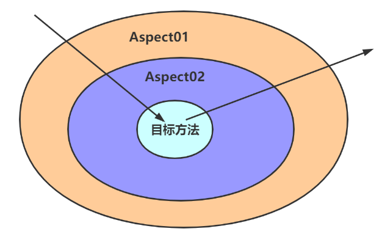

---

Created at: 2024-03-25
Last updated at: 2024-03-26
Source URL: https://zhuanlan.zhihu.com/p/426442535


---

# 5-AOP


**一、AspectJ、CGLIB 和 JDK动态代理 三者是什么关系？**

* AOP（Aspect Orient Programming，面向切面编程）框架要包含两部分，一是实现代理模式，这个是实现AOP思想的核心；二是作为框架要为用户提供简便的编程模式，比如通过XML配置或者通过注解配置。
* 代理模式：代理模式分为静态代理和动态代理，其中 静态 和 动态 分别指的是 编译时 和 运行时，即如果在编译时生成代理类那么就是静态代理，如果在运行时才生产代理类则称为动态代理。
* AspectJ便是一个AOP框架，即AspectJ和Spring AOP各自都是一套独立的面向切面编程的解决方案。AspectJ的代理模式是静态代理，AspectJ利用它自己的编译器将代理逻辑织入（weaver）到被代理类中，最终只生成一个class文件。参见： https://zhuanlan.zhihu.com/p/426442535 中的例子。而Spring使用的是CGLIB 和 JDK动态代理实现的代理模式，它俩都是动态代理，并没有使用AspectJ的静态代理。那为什么Spring中会出现AspectJ的字样呢，比如导包、使用@AspectJ定义切面类的时候？这是因为实现AOP框架的第二个要点，即为用户提供编程模式，Spring应该是完全参考了AspectJ，比如使用AspectJ的Annotation定义切面(Aspect)、切入点(PointCut)等。
* 由于Spring AOP是基于动态代理来实现的，在容器启动时需要生成代理实例，在方法调用上也会增加栈的深度，而AspectJ在实际运行之前就完成了织入，它生成的类是没有额外运行时开销的，所以Spring AOP的性能较AspectJ的差。
* Spring AOP与CGLIB 和 JDK动态代理的关系：
	* Spring AOP使用CGLIB 和 JDK动态代理实现了代理模式，默认使用JDK动态代理（SpringBoot2.x默认使用cglib动态代理）**。**
	* <aop:aspectj-autoproxy proxy-target-class="false"/> 时，如果目标类有实现接口，则使用JDK动态代理，反之则使用cglib动态代理。<aop:aspectj-autoproxy proxy-target-class="true"/> 时，直接使用cglib动态代理。

于是，在Spring中，如果一个类被切了（目标类），那么IOC容器中就没有这个类的对象了，有的只是这个类的代理类对象，这个代理类对象是：
① 如果这个类实现了一个接口，那么代理类对象就是这个接口的实现类，所以不能通过这个类的类型拿到代理类对象，只能通过这个接口的类型拿到。
② 如果这个类没有实现接口，那么代理类对象就是这个类的子类，所以能通过这个类的类型拿到代理类对象。
这个代理类对象在容器中的id是被切的类（被代理类）的类名首字母小写，所以通过目标类的id肯定能获取到代理类对象，然后再进行类型转换。

* CGLIB 和 JDK动态代理 都是动态代理，它俩在实现上的区别是，CGLIB在运行时动态生成被代理类的子类，重写被代理类的方法，而JDK动态代理则是实现被代理类实现的接口；共同点是代理类都要拿到被代理类的实例对象，因为核心的业务逻辑还是要交给目标类对象来执行（都需要保持has-a的关系，参见  https://juejin.cn/post/7042484603365359646  中使用cglib生产代理的例子）。
* CGLIB动态代理无法代理的方法：
	* 因为final修饰的类和方法不能被继承，所以CGLIB不能代理final修饰的类和方法。
	* private方法可以被继承，但是CGLIB依然不能代理private方法，原因是private方法没有多态。（子类可以重写父类的private方法，并且子类重写的方法是通过反射调用被代理类对象的方法，而反射是可以访问private的，所以CGLIB不能代理private方法的原因并不是因为子类无法访问父类的private方法，真正的原因是因为private方法没有多态，CGLIB动态代理的原理是生成被代理类的子类，这个子类的对象会被赋值给父类的引用，如果方法没有多态，那么最终调用不到代理类对象的方法，从而无法实现代理的目的。）
	* static方法没有继承一说，也就没有多态，所以CGLIB不能代理static方法。

```
public class AClass {
    private void print() {
        System.out.println("A");
    }
    static public void staticPrint() {
        System.out.println("static A");
    }
    public static void main(String[] args) {
        AClass a = new BClass();
        a.print(); //输出 A ，表示private可以被继承，但是没有多态
        /**************************************************/
        a.staticPrint(); //输出 A，静态方法本来就没有继承一说，所以更加没有多态
    }
}
class BClass extends AClass {
    private void print() {
        System.out.println("B");
    }
    static public void staticPrint() {
        System.out.println("static B");
    }
}
```

* JDK动态代理无法代理的方法：
	* JDK动态代理只能代理接口中的方法，接口中的方法都是public的，所以JDK动态代理只能代理public方法。
	* 接口中也可以有static方法，同样因为static方法没有多态，所以JDK动态代理不能代理static方法。
* AspectJ是在编译阶段向被代理类中织入代码，所以AspectJ静态代理没有以上的限制，什么样的方法都可以代理。AspectJ可以做Spring AOP干不了的事情，它是AOP编程的完全解决方案，AspectJ支持所有切入点，不仅仅是方法织入。

**二、基于注解的AOP**
**1、基于注解的AOP步骤：**
1.开启基于注解的AOP模式
```
<!-- 开启基于注解的AOP模式 -->
<aop:aspectj-autoproxy/>
```
2.使用@Aspect注解注册切面类，并使用@Component注解将切面类注入到IOC容器中
3.配置切面类中通知方法的切入点
```
@Aspect
@Order(1)
@Component
public class LogUtils {

    @Before("execution(public * aop.CalculatorImpl.*(int, int))")
    public void before(JoinPoint joinPoint) {
        Object[] args = joinPoint.getArgs();
        //拿到目标方法的方法签名
        Signature signature = joinPoint.getSignature();
        String name = signature.getName();
        System.out.println("==前置通知 @Before：调用" + name + "，参数：" + Arrays.toString(args)+ "==");
    }

    /**
     * @AfterReturning的 returning属性 指明用于接收目标方法返回值的参数
     * 这个参数的类型要往大了写，不然不能接收，所以是Object
     */
    @AfterReturning(value = "execution(public * aop.CalculatorImpl.*(int, int))", returning = "result")
    public void afterReturn(JoinPoint joinPoint, Object result) {
        Signature signature = joinPoint.getSignature();
        String name = signature.getName();
        System.out.println("==返回通知 @AfterReturn：调用" + name + "，结果：" + result+ "==");
    }

    /**
     * @AfterThrowing throwing属性 指明用于接收目标方法抛出异常的参数，只是接收异常，并不会吞掉异常
     * 异常的类型往大了写，不然不能接收，所以是Exception
     */
    @AfterThrowing(value = "execution(public * aop.CalculatorImpl.*(int, int))", throwing = "e")
    public void afterThrowing(JoinPoint joinPoint, Exception e) {
        String name = joinPoint.getSignature().getName();
        System.out.println("==异常通知 @AfterThrowing：调用" + name + "，异常：" + e+ "==");
    }

    @After("execution(public * aop.CalculatorImpl.*(int, int))")
    public void after(JoinPoint joinPoint) {
        String name = joinPoint.getSignature().getName();
        System.out.println("==后置通知 @After：调用" + name + "，结束！==");
    }

    @Around("execution(public * aop.CalculatorImpl.*(int, int))")
    public Object aroundNotice(ProceedingJoinPoint proceedingJoinPoint) {
        Object result = null;
        try {
            System.out.println("===环绕通知前置===");
            Object[] args = proceedingJoinPoint.getArgs();
            //等同于动态代理中的 method.invoke(object, args); 就是调用目标方法，放行
            //`只有环绕通知放行以后，前置通知、返回通知、异常通知和后置通知才会执行`
            result = proceedingJoinPoint.proceed(args);
            System.out.println("===环绕通知返回===");
        } catch (Throwable throwable) {
            System.out.println("===环绕通知异常===");
            throwable.printStackTrace();
        } finally {
            System.out.println("===环绕通知后置===");
        }
        /**
         * 如果环绕通知返回值是null，并且目标方法的返回值是基本数据类型，那么就无法接收null，所以就会抛下面的异常
         * org.springframework.aop.AopInvocationException: Null return value from advice does not match primitive return type for:
         */
        return result;
    }
}
```

名词解释：

* 切面类（Aspect）：切面类中的一个方法可以代理一类方法，每个被代理的方法是一个点，于是切面类中的一个方法都可以被看作是一条线，一个切面类中有很多这样的线，于是便组成了面，这就是为什么称为切面类。
* 切入点（Pointcut）：在面上画一条线是从一个点开始的，这个点被称为切入点，可以用一个表达式来串联这条线上的所有点。
* 连接点（JoinPoint）：这条线上的每一点就是一个连接点，也就是被代理的方法。
* 通知（advice）：指切面类中的方法。

多个切面切同一个目标方法时，多个切面执行的顺序：切面类默认以类名的排序，类名小的优先级高，越靠近外层；可以使用@Order()注解修改，value的值越小，优先级越高，默认Integer.MAX\_VALUE，即最后执行。


**2、五种通知：**

1. @Before：前置通知
2. @AfterReturning：返回通知
3. @AfterThrowing：异常通知
4. @After：后置通知
5. @Around：环绕通知

同一个切面里通知方法执行的顺序：
```
try{
    --环绕通知前置--
------------------------------
   try{
        @Before：前置通知
        目标方法
        @AfterReturning：返回通知
   } catch {
        @AfterThrowing：异常通知
        （把异常重新抛出）
   } finally {
        @After：后置通知
   }
-------------------------------
   --环绕通知返回后置--
} catch {
   --环绕通知异常--
} finally {
   --环绕通知后置--
}
```

**3、切入点表达式语法**

切入点表达式的写法： execution("目标方法的声明")
通配符 \* ：

* 用“\*”号代替“权限修饰符”和“返回值”部分表示“权限修饰符”和“返回值”不限
* 在包名的部分，一个“\*”号只能代表包的层次结构中的一层，表示这一层是任意的，例如 execution(public int org.example.\*.aop.CalculatorImpl.\*(\*, int))
* 在类名的部分，类名部分整体用“\*”号代替，表示类名任意，例如 execution(public int org.example.aop.\*.\*(\*, int))
* 在类名的部分，可以使用“\*”号代替类名的一部分，例如 \*Service 匹配所有名称以Service结尾的类或接口
* 在方法名部分，可以使用“\*”号表示方法名任意，例如 execution(public int org.example.aop.CalculatorImpl.\*(\*, int))
* 在方法名部分，可以使用“\*”号代替方法名的一部分，例如 \*Operation 匹配所有方法名以Operation结尾的方法

通配符 .. ：

* 在包名的部分，使用“..”表示包名任意、包的层次深度任意，例如 execution(public int aop..CalculatorImpl.\*(..))
* 在方法参数列表部分，使用(..)表示参数列表任意
* 在方法参数列表部分，使用(int, ..)表示参数列表以一个int类型的参数开头

在方法参数列表部分，基本数据类型和对应的包装类型是不一样的，例如切入点表达式中使用 int 和实际方法中 Integer 是不匹配的

**4、重用切入点表达式**
1.随便声明一个空实现的void方法，使用 @Pointcut 注解
```
@Pointcut("execution(* com.atguigu.aop.annotation.*.*(..))")
public void pointCut(){}
```
2.在同一个切面中使用
```
@Before("pointCut()")
public void beforeMethod(JoinPoint joinPoint){
}
```
3.在不同切面中使用
```
@Before("com.atguigu.aop.CommonPointCut.pointCut()")
public void beforeMethod(JoinPoint joinPoint) {
}
```

**5、获取连接点的信息**
1.连接点是指被代理的方法，在通知方法上JoinPoint类型的参数就可以获取到连接点的信息。
```
@Before("execution(public int com.atguigu.aop.annotation.CalculatorImpl.*(..))")
public void beforeMethod(JoinPoint joinPoint){
     //拿到目标方法的方法签名
     Signature signature = joinPoint.getSignature();
     String methodName = signature.getName();
    //获取目标方法到的实参信息
    String args = Arrays.toString(joinPoint.getArgs());
    System.out.println("Logger-->前置通知，方法名："+methodName+"，参数："+args);
}
```

2.获取目标方法的返回值
@AfterReturning中的属性returning用来指明要将目标方法的返回值赋值给通知方法的哪个参数。这个参数的类型要往大了写，不然不能接收，所以是Object。
```
@AfterReturning(value = "execution(* com.atguigu.aop.annotation.CalculatorImpl.*(..))", returning = "result")
public void afterReturningMethod(JoinPoint joinPoint, Object result){
    String methodName = joinPoint.getSignature().getName();
    System.out.println("Logger-->返回通知，方法名："+methodName+"，结果："+result);
}
```

3.获取目标方法的异常
@AfterThrowing中的属性throwing用来指明要将目标方法的异常赋值给通知方法的哪个参数。异常的类型往大了写，不然不能接收，所以是Exception。
```
@AfterThrowing(value = "execution(* com.atguigu.aop.annotation.CalculatorImpl.*(..))", throwing = "e")
public void afterThrowing(JoinPoint joinPoint, Exception e) {
    String name = joinPoint.getSignature().getName();
    System.out.println("==异常通知 @AfterThrowing：调用" + name + "，异常：" + e+ "==");
}
```

**三、基于XML的AOP**
切面类写好后在XML中进行如下配置即可。
```
<bean class="aop.ValidateAspect" id="validateAspect"/>

<!-- 基于xml配置AOP -->
<aop:config>
  <!-- 指定切面类，相当于@Aspect -->
  <aop:aspect ref="validateAspect" order="2">
    <!-- 指明被切方法（目标方法） -->
    <aop:pointcut id="calculatorImplPointcut" expression="execution(public * aop.CalculatorImpl.*(..))"/>
    <!-- 指明通知方法  -->
    <aop:before method="before" pointcut-ref="calculatorImplPointcut"/>
    <aop:after-returning method="afterReturning" pointcut-ref="calculatorImplPointcut" returning="result"/>
    <aop:after-throwing method="afterThrowing" pointcut-ref="calculatorImplPointcut" throwing="e"/>
    <aop:after method="after" pointcut-ref="calculatorImplPointcut"/>
    <aop:around method="aroundNotice" pointcut-ref="calculatorImplPointcut"/>
  </aop:aspect>
</aop:config>
```

