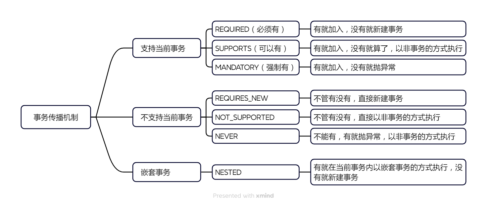

---

Created at: 2024-03-26
Last updated at: 2025-02-25
Source URL: about:blank


---

# 6-声明式事务


**一、声明式事务的概念**
编程式事务：
```
Connection conn = ...;
try {
    // 开启事务：关闭事务的自动提交
    conn.setAutoCommit(false);
    // 核心操作
    .......
    // 提交事务
    conn.commit();
}catch(Exception e){
    // 回滚事务
    conn.rollBack();
}finally{
    // 释放数据库连接
    conn.close();
}
```
编程式事务的形式就是AOP环绕通知的形式，所以可以使用代理模式抽离编程式事务的重复编码，Spring的声明式事务正是利用AOP将事务的过程配置化，从而免去重复编码。

**二、基于注解的声明式事务**
**1、在spring配置文件中添加事务的配置**
```
<?xml version="1.0" encoding="UTF-8"?>
<beans xmlns="http://www.springframework.org/schema/beans"
       xmlns:xsi="http://www.w3.org/2001/XMLSchema-instance"
       xmlns:context="http://www.springframework.org/schema/context"
       xmlns:tx="http://www.springframework.org/schema/tx"
       xmlns:aop="http://www.springframework.org/schema/aop"
       xsi:schemaLocation="http://www.springframework.org/schema/beans http://www.springframework.org/schema/beans/spring-beans.xsd http://www.springframework.org/schema/context https://www.springframework.org/schema/context/spring-context.xsd http://www.springframework.org/schema/tx http://www.springframework.org/schema/tx/spring-tx.xsd http://www.springframework.org/schema/aop https://www.springframework.org/schema/aop/spring-aop.xsd">

    <context:component-scan base-package="dao,service"/>

    <!--
      数据源配置步骤：
        1.导入属性配置配置文件
        2.将数据库连接池加入ioc容器
     -->
    <context:property-placeholder location="classpath:druid.properties"/>
    <bean class="com.alibaba.druid.pool.DruidDataSource" id="druidDataSource">
        <property name="username" value="${jdbc.username}"/>
        <property name="password" value="${jdbc.password}"/>
        <property name="url" value="${jdbc.url}"/>
        <property name="driverClassName" value="${jdbc.driverClassName}"/>
    </bean>

    <!--
     `基于注解的声明式事务配置步骤：`
 `1.配置事务管理器（事务管``理器就是切面类，所以需要导入AOP的那几个包），设置``其数据源（即数据库连接池）`
 `2.开启基于注解的事务控制模式 <tx:annotation-driven transaction-manager=""/>`
 `3.给需要事务控制的方法加上注解@Transactional`
     -->
    <bean id="transactionManager" class="org.springframework.jdbc.datasource.DataSourceTransactionManager">
        <property name="dataSource" ref="druidDataSource"/>
    </bean>
    <!--
        `1.开启基于注解的事务控制模式，需要引入tx命名空间`
 `2.transaction-manager属性的默认值是transactionManager，如果事务管理器bean的id正好就是这个默认值，则可以省略这个属性`
    -->
    <tx:annotation-driven transaction-manager="transactionManager"/>

    <!-- 配置JdbcTemplate用于操作数据库 -->
    <bean class="org.springframework.jdbc.core.JdbcTemplate" id="jdbcTemplate">
        <!-- <property name="dataSource" value="#{druidDataSource}"/> -->
        <property name="dataSource" ref="druidDataSource"/>
    </bean>
</beans>
```

**2、使用注解添加事务的配置**

1. 在配置类上使用@EnableTransactionManagement注解开启事务管理
2. 添加事务管理器（事务管理器就是切面类），设置其数据源（即数据库连接池）

```
@Configuration
@ComponentScan("com.atguigu.spring6")
`@EnableTransactionManagement`
public class SpringConfig {

    @Bean
    public DataSource getDataSource(){
        DruidDataSource dataSource = new DruidDataSource();
        dataSource.setDriverClassName("com.mysql.cj.jdbc.Driver");
        dataSource.setUrl("jdbc:mysql://localhost:3306/spring?characterEncoding=utf8&useSSL=false");
        dataSource.setUsername("root");
        dataSource.setPassword("root");
        return dataSource;
    }

    @Bean(name = "jdbcTemplate")
    public JdbcTemplate getJdbcTemplate(DataSource dataSource){
        JdbcTemplate jdbcTemplate = new JdbcTemplate();
        jdbcTemplate.setDataSource(dataSource);
        return jdbcTemplate;
    }

    @Bean
    public `DataSourceTransactionManager` getDataSourceTransactionManager(DataSource dataSource){
        DataSourceTransactionManager dataSourceTransactionManager = new DataSourceTransactionManager();
        dataSourceTransactionManager.setDataSource(dataSource);
        return dataSourceTransactionManager;
    }
}
```

**3、使用@Transactional注解声明事务**

* @Transactional标识在方法上，则只会影响该方法（只切这一个方法）
* @Transactional标识的类上，则会影响类中所有的方法（切该类的所有方法）；事务不应该加在dao层，dao层的每个方法只是负责执行一条sql语句，事务应该面向业务，加在service方法中。

```
@Transactional(isolation = Isolation.READ_COMMITTED,
        propagation = Propagation.REQUIRED,
        rollbackFor = Exception.class,
        // readOnly = true,
        timeout = 1)
public void checkout(String name, String isbn) {
    //查询价格
    int price = bookDao.getBookPrice(isbn);
    //减余额
    bookDao.updateAccountBalance(name, price);
    //减库存
    bookDao.updateBookStock(isbn);
}
```

3.1 readOnly属性：readOnly=true开启一个只读事务，默认false。

3.2 timeout属性设置事务的超时时间，超时回滚，单位：秒，默认-1表示不会超时。

3.3 事务的隔离级别
```
@Transactional(isolation = Isolation.DEFAULT)//使用数据库默认的隔离级别
@Transactional(isolation = Isolation.READ_UNCOMMITTED)//读未提交
@Transactional(isolation = Isolation.READ_COMMITTED)//读已提交
@Transactional(isolation = Isolation.REPEATABLE_READ)//可重复读
@Transactional(isolation = Isolation.SERIALIZABLE)//串行化
```

**3.3 设置出现异常的回滚策略**
默认发生运行时异常（非检查异常）和Error会回滚（前提是得把异常抛出去，因为事务方法就是aop的目标方法），发生编译时异常（受检查异常）不会回滚。
用下面两个属性指定会回滚的受检查异常（非检查异常依旧会回滚）：

* rollbackFor 指定抛出哪些异常会回滚
* rollbackForClassName 指定会回滚的异常的全类名

用下面两个属性指定不会回滚的非检查异常：

* noRollbackFor 指定抛出哪些异常不会回滚
* noRollbackForClassName 指定不会回滚的异常的全类名

下面的方法会出现java.io.FileNotFoundException，但是事务不会回滚，因为FileNotFoundException是受检查异常，最后只减了余额，没有扣库存。
```
@Transactional
public void checkout(String name, String isbn) throws FileNotFoundException {
    int price = bookDao.getBookPrice(isbn);
    //减余额
    bookDao.updateAccountBalance(name, price);
    new FileInputStream("noExistFile.txt");
    //减库存
    bookDao.updateBookStock(isbn);
}
```
所以一般会指定rollbackFor = Exception.class，这样发生运行时异常和受检查异常就都会回滚了。

**3.4 事务的传播行为**
Spring 事务传播机制是指，多个事务的方法在相互调用时，事务是如何在这些方法间传播的，事务传播机制分为 3 大类，总共 7 种：
```
@Transactional(propagation = Propagation.REQUIRED)
@Transactional(propagation = Propagation.SUPPORTS)
@Transactional(propagation = Propagation.MANDATORY)
@Transactional(propagation = Propagation.REQUIRES_NEW)
@Transactional(propagation = Propagation.NOT_SUPPORTED)
@Transactional(propagation = Propagation.NEVER)
@Transactional(propagation = Propagation.NESTED)
```

NESTED嵌套事务的实现方式是savepoint，当一个方法被指定为嵌套事务，方法开始时会设置一个savepoint，当方法被回滚时，只会回滚到该savepoint，并不会影响到整个事务。

* NESTED 与 REQUIRED 的区别：共同点是内外层公用一个事务；不同点是，REQUIRED方法回滚时，会直接回滚整个事务，而NESTED 只会回滚到savepoint。
* NESTED 与REQUIRED\_NEW 的区别：REQUIRED\_NEW 内外层是两个独立的事务，各自的回滚与提交互不影响。

SAVEPOINT使用例子：
```
mysql> select * from book;
Empty set (0.01 sec)

mysql> start transaction;
Query OK, 0 rows affected (0.00 sec)

mysql> SAVEPOINT s1;
Query OK, 0 rows affected (0.00 sec)

mysql> insert into book(isbn, book_name, price) values('ISBN_001', 'book100', 100);
Query OK, 1 row affected (0.00 sec)

mysql> SAVEPOINT s2;
Query OK, 0 rows affected (0.00 sec)

mysql> INSERT INTO book(isbn, book_name, price) VALUES('ISBN_002', 'book200', 200);
Query OK, 1 row affected (0.00 sec)

mysql> SAVEPOINT s3;
Query OK, 0 rows affected (0.00 sec)

mysql> INSERT INTO book(isbn, book_name, price) VALUES('ISBN_003', 'book300', 300);
Query OK, 1 row affected (0.00 sec)

mysql> rollback to SAVEPOINT s2;
Query OK, 0 rows affected (0.00 sec)

mysql> commit;
Query OK, 0 rows affected (0.00 sec)

mysql> select * from book;
+----------+-----------+-------+
| isbn     | book_name | price |
+----------+-----------+-------+
| ISBN_001 | book100   |   100 |
+----------+-----------+-------+
1 row in set (0.00 sec)
```

**三、基于XML的声明式事务**
```
<!-- 基于xml配置声明式事务：
      1.配置事务管理器（事务切面），设置其数据源
      2.指明事务方法（被切方法）
      3.配置事务的属性
-->
<aop:config>
    <!-- 配置事务通知和切入点表达式（这里切了一大片） -->
    <aop:advisor advice-ref="txAdvice" pointcut="execution(* com.atguigu.spring.tx.xml.service.impl.*.*(..))"></aop:advisor>
</aop:config>
<!-- tx:advice标签：配置事务通知 -->
<!-- id属性：给事务通知标签设置唯一标识，便于引用 -->
<!-- transaction-manager属性：关联事务管理器 -->
<tx:advice id="txAdvice" transaction-manager="transactionManager">
    <tx:attributes>
        <!-- tx:method标签：配置具体的事务方法 -->
        <!-- name属性：指定方法名，可以使用星号代表多个字符 -->
        <tx:method name="get*" read-only="true"/>
        <tx:method name="query*" read-only="true"/>
        <tx:method name="find*" read-only="true"/>
        <tx:method name="save*" read-only="false" rollback-for="java.lang.Exception" propagation="REQUIRES_NEW"/>
        <tx:method name="update*" read-only="false" rollback-for="java.lang.Exception" propagation="REQUIRES_NEW"/>
        <tx:method name="delete*" read-only="false" rollback-for="java.lang.Exception" propagation="REQUIRES_NEW"/>
    </tx:attributes>
</tx:advice>
```

