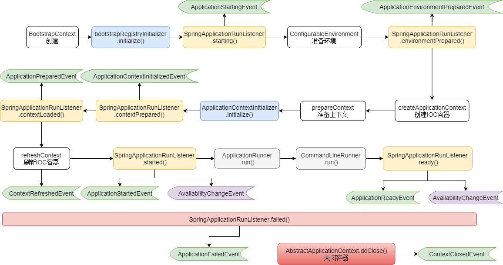

---

Created at: 2024-06-06
Last updated at: 2024-07-28
Source URL: about:blank


---

# 0.原理




SpringApplication.run(String... args)的流程：
创建BootstrapContext引导上下文
```
DefaultBootstrapContext bootstrapContext = createBootstrapContext();
```
点进createBootstrapContext()，调用bootstrapRegistryInitializer的initialize方法
```
this.bootstrapRegistryInitializers.forEach((initializer) -> initializer.initialize(bootstrapContext));
```
拿到所有的SpringApplicationRunListener，点进去主要是getSpringFactoriesInstances()方法，其作用是通过spring.factories文件中指定的全类名创建Bean，比如找到文件中SpringApplicationRunListener指定的全类名创建Bean。
```
SpringApplicationRunListeners listeners = getRunListeners(args);
```
```
List<SpringApplicationRunListener> listeners = getSpringFactoriesInstances(SpringApplicationRunListener.class,
       argumentResolver);
```
调用SpringApplicationRunListener的starting(）方法
```
listeners.starting(bootstrapContext, this.mainApplicationClass);
```
准备环境ConfigurableEnvironment，这一步是把启动参数等绑定到环境变量中
```
ConfigurableEnvironment environment = prepareEnvironment(listeners, bootstrapContext, applicationArguments);
```
点进prepareEnvironment()方法，把启动参数等绑定到环境变量后会调用SpringApplicationRunListener的environmentPrepared()方法
```
listeners.environmentPrepared(bootstrapContext, environment);
```
打印banner
```
Banner printedBanner = printBanner(environment);
```
创建IOC容器，这里仅仅是创建，并没有注入Bean
```
context = createApplicationContext();
```
准备上下文（准备IOC容器），这里只是在加载配置，并没有创建Bean
```
prepareContext(bootstrapContext, context, environment, listeners, applicationArguments, printedBanner);
```
点进prepareContext()，加载配置后先调用了ApplicationContextInitializer的initialize方法
```
applyInitializers(context);
```
然后调用了SpringApplicationRunListener的contextPrepared()方法
```
listeners.contextPrepared(context);
```
再接着关闭了bootstrapContext，close方法广播了BootstrapContextClosedEvent事件（这个事件不是很重要）
```
bootstrapContext.close(context);
```
最后在向IOC容器中注入几个SpringBoot特别指定的Bean后调用SpringApplicationRunListener的contextLoaded()方法
```
listeners.contextLoaded(context);
```
刷新IOC容器，从refreshContext()方法一直点进去，是AbstractApplicationContext.java的refresh()，这里是IOC容器刷新的经典方法，最后一步finishRefresh();方法会发送ContextRefreshedEvent事件
```
refreshContext(context);
```
调用SpringApplicationRunListener的started()方法
```
listeners.started(context);
```
调用ApplicationRunner和CommandLineRunner的run(args)方法
```
callRunners(context, applicationArguments);
```
最后调用SpringApplicationRunListener的ready()方法
```
listeners.ready(context, startup.ready());
```
以上流程如果出错了调用SpringApplicationRunListener的failed()方法
```
listeners.failed(context, exception);
```
最后容器关闭调用AbstractApplicationContext.doClose()方法会广播ContextClosedEvent事件

使用SpringApplicationRunListener监听器时，我们需要实现SpringApplicationRunListener接口，然后再在spring.factories文件指定：
```
org.springframework.boot.SpringApplicationRunListener=org.example.springbootdemo.MyRunListener
```
问题：为什么要指定，都实现接口了，难道JVM不能找到所有实现某一接口的子类？
答：理论上是可以的，但是这需要把类路径下的所有class加载到方法区，这可能会让方法区OOM，并且类加载需要完成一系列流程（加载、连接、初始化），会严重拖慢运行速度，所以必须指定。

