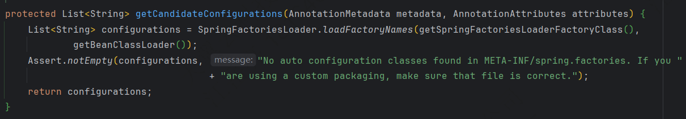
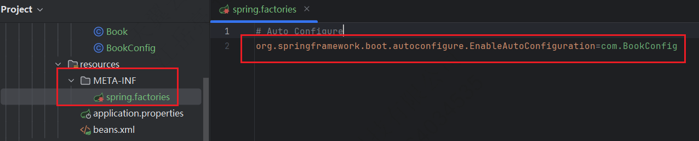

---

Created at: 2023-07-18
Last updated at: 2025-03-09
Source URL: about:blank


---

# 1.SpringBoot入门


**一、SpringBoot WEB项目搭建步骤**
**1、所有springboot项目都必须继承自 spring-boot-starter-parent**
```
<parent>
    <groupId>org.springframework.boot</groupId>
    <artifactId>spring-boot-starter-parent</artifactId>
    <version>3.0.5</version>
</parent>
```
**2、导入场景启动器**
```
<dependencies>
    <!-- web开发的场景启动器 -->
    <dependency>
        <groupId>org.springframework.boot</groupId>
        <artifactId>spring-boot-starter-web</artifactId>
    </dependency>
</dependencies>
```
**3、主程序**
```
@SpringBootApplication //这是一个SpringBoot应用
public class MainApplication {
    public static void main(String[] args) {
        SpringApplication.run(MainApplication.class,args);
    }
}
```
**4、业务接口**
```
@RestController
public class HelloController {
    @GetMapping("/hello")
    public String hello(){
        return "Hello,Spring Boot 3!";
    }
}
```
**5、测试**
默认启动访问： localhost:8080
**6、打包**
```
<!--    SpringBoot应用打包插件-->
<build>
    <plugins>
        <plugin>
            <groupId>org.springframework.boot</groupId>
            <artifactId>spring-boot-maven-plugin</artifactId>
        </plugin>
    </plugins>
</build>
```
mvn clean package 把项目打成可执行的jar包
java -jar demo.jar 启动项目

拓展，**自定义banner**： 类路径添加 banner.txt 或 设置spring.banner.location 就可以定制 banner。
```
#指定banner文件的位置
spring.banner.location=classpath:banner.txt
#指定banner文件的编码
spring.banner.charset=utf-8
#关闭banner
spring.main.banner-mode=off
```

**二、关键注解**
**1、@SpringBootApplication**
@SpringBootApplication 是 @SpringBootConfiguration、@EnableAutoConfiguration、@ComponentScan 这三个注解的合成注解。
@SpringBootConfiguration 与 @Configuration 作用相同，所以@SpringBootApplication注解标识的类既是主程序类，也是一个配置类。
@SpringBootApplication的默认的扫描范围就是@ComponentScan的扫描范围，即配置类所在的包及其所有子包，也可也以使用@SpringBootApplication的scanBasePackages属性指定扫描的包。

**2、@Import**
注解@Import用于向ioc容器中注册组件，调用的是类的无参构造器，组件的id是类的全类名。
将第三方包的组件注册到容器中可以使用@Bean方法，还可以使用@Import，@Import相当于是提供了一种更加便捷注册组件的方式。
```
@Import(User.class)
@Configuration(proxyBeanMethods = false)
public class MyConfig {
}
```
此外，还有一个注解@ImportResource，用于导入xml配置文件中Bean，使用SpringBoot都是全注解配置，所以这个注解一般不用。
```
@ImportResource("classpath:beans.xml")
@Configuration(proxyBeanMethods = false)
public class MyConfig {
}
```

**3、条件注解@ConditionalOnXxx**
比较常见的：

* @ConditionalOnClass：如果类路径中存在这个类，则触发指定行为
* @ConditionalOnMissingClass：如果类路径中不存在这个类，则触发指定行为
* @ConditionalOnBean：如果容器中存在这个Bean（组件），则触发指定行为
* @ConditionalOnMissingBean：如果容器中不存在这个Bean（组件），则触发指定行为

```
@ConditionalOnRepositoryType (org.springframework.boot.autoconfigure.data)
@ConditionalOnDefaultWebSecurity (org.springframework.boot.autoconfigure.security)
@ConditionalOnSingleCandidate (org.springframework.boot.autoconfigure.condition)
@ConditionalOnWebApplication (org.springframework.boot.autoconfigure.condition)
@ConditionalOnWarDeployment (org.springframework.boot.autoconfigure.condition)
@ConditionalOnJndi (org.springframework.boot.autoconfigure.condition)
@ConditionalOnResource (org.springframework.boot.autoconfigure.condition)
@ConditionalOnExpression (org.springframework.boot.autoconfigure.condition)
@ConditionalOnClass (org.springframework.boot.autoconfigure.condition)
@ConditionalOnEnabledResourceChain (org.springframework.boot.autoconfigure.web)
@ConditionalOnMissingClass (org.springframework.boot.autoconfigure.condition)
@ConditionalOnNotWebApplication (org.springframework.boot.autoconfigure.condition)
@ConditionalOnProperty (org.springframework.boot.autoconfigure.condition)
@ConditionalOnCloudPlatform (org.springframework.boot.autoconfigure.condition)
@ConditionalOnBean (org.springframework.boot.autoconfigure.condition)
@ConditionalOnMissingBean (org.springframework.boot.autoconfigure.condition)
@ConditionalOnMissingFilterBean (org.springframework.boot.autoconfigure.web.servlet)
@Profile (org.springframework.context.annotation)
@ConditionalOnInitializedRestarter (org.springframework.boot.devtools.restart)
@ConditionalOnGraphQlSchema (org.springframework.boot.autoconfigure.graphql)
@ConditionalOnJava (org.springframework.boot.autoconfigure.condition)
```
```
@Configuration
public class MyConfig {
    @ConditionalOnBean(name = "dog01")
    @Bean
    public Person person01(){
        return new Person("Jackson", 18);
    }
}
```

**4、属性绑定**
4.1 第一种方式：
@ConfigurationProperties + @Component
```
@ConfigurationProperties(prefix = "person")
@Component
public class Person {
}
```
这种方式通过setter方法注入，如果@Component标注的组件有有参数的构造器，这个构造器的参数会从容器中自动注入值，从而会和setter注入冲突，但是肯定是setter注入覆盖构造器注入。
4.2 第二种方式：
在属性类上标注@ConfigurationProperties：
```
@ConfigurationProperties(prefix = "pet")
public class Pet {
}
```
在配置类上使用@EnableConfigurationProperties开启属性类的属性绑定：
```
@Configuration
@EnableConfigurationProperties(value = Pet.class)
public class WebConfig {
}
```
配置文件的名称是 application.properties 或者 application.yaml
这种方式需要Bean有全参数构造器或者setter方法任意一种即可。
4.3 第三种方式：
@Component + @Value标注在属性上
@Value(${name:default}) ，default表示默认值，即在配置文件取不到值的时候取默认值。
```
@Component
public class Car {
    @Value("${mycar.brand:BWM}")
    String brand;
    @Value("${mycar.price:19.98}")
    Double price;
}
```

**三、获取IOC容器的方式**
1\. 实现ApplicationContextAware接口
```
@Component
public class SpringContextUtil implements ApplicationContextAware {
    private static ApplicationContext context;

    @Override
    public void setApplicationContext(ApplicationContext applicationContext) {
        context = applicationContext;
    }

    public static ApplicationContext getApplicationContext() {
        return context;
    }
}
```

2.直接使用@Autowired注入ApplicationContext
```
@Service
public class MyService {
    private ApplicationContext applicationContext;

    @Autowired
    public MyService(ApplicationContext applicationContext) {
        this.applicationContext = applicationContext;
    }
}
```

3.通过SpringApplication静态访问
在主类或者配置类中，可以通过SpringApplication.run(...)返回的对象来访问ApplicationContext。
```
@SpringBootApplication
public class MyApplication {
    public static ApplicationContext context;

    public static void main(String[] args) {
        context = SpringApplication.run(MyApplication.class, args);
    }
}
```

**四、依赖管理和自动配置**
SpringBoot的两大特点：依赖管理 和 自动配置 。

**4.1 依赖管理**
springboot项目必须继承自 spring-boot-starter-parent，spring-boot-starter-parent 的父项目是 spring-boot-dependencies，spring-boot-dependencies 把所有常见的jar的依赖版本都声明好了，其中包括SpringBoot官方的场景启动器，所以我们导入官方场景启动器的时候不用写版本号。但是在引入第三方场景启动器和没有在spring-boot-dependencies中声明的依赖时，需要写版本号。

* 官方提供的场景：命名为：spring-boot-starter-\*
* 第三方提供场景：命名为：\*-spring-boot-starter

**4.2 自动配置**
spring-boot-starter-web 场景启动器会导入 spring-boot-starter，spring-boot-starter是所有starter的starter，最基础核心starter，spring-boot-starter导入了 spring-boot-autoconfigure，spring-boot-autoconfigure包里面都有SpringBoot内置的各种场景器的AutoConfiguration自动配置类，虽然全场景的自动配置类都在 spring-boot-autoconfigure这个包，但并不是全都开启，因为自动配置类上都有各种条件注解，只有在导入相应的场景启动器之后，自动配置类才会生效，从而完成自动配置。
@SpringBootApplication 是 @SpringBootConfiguration、@EnableAutoConfiguration、@ComponentScan 这三个注解的合成注解。@ComponentScan的默认扫描范围是配置类所在的包及其所有子包，并不会扫描到spring-boot-autoconfigure包，起关键作用的是@EnableAutoConfiguration注解。
```
@Target(ElementType.TYPE)
@Retention(RetentionPolicy.RUNTIME)
@Documented
@Inherited
@AutoConfigurationPackage
@Import(AutoConfigurationImportSelector.class)
public @interface EnableAutoConfiguration {
```
@EnableAutoConfiguration注解上面的@Import(AutoConfigurationImportSelector.class)，AutoConfigurationImportSelector类有个方法表示这个组件会找META-INF/spring.factories文件（SpringBoot2.0是这个文件，3.0换文件名了），spring.factories文件中指明了自动配置类的全类名，批量加载这些自动配置类就可以完成自动配置了。

所以如果我们自己也想自动配置也可以在META-INF目录下整一个spring.factories文件

每个自动配置类都可能有这个注解@EnableConfigurationProperties(xxxProperties.class)，用来把配置文件中指定前缀的属性值封装到 xxxProperties属性类中，所以只需要改配置文件的值，核心组件的底层参数都能修改。

**总结自动配置流程：**

1. 导入spring-boot-starter-web 场景启动器。
2. 场景启动器导入spring-boot-starter。
3. spring-boot-starter导入了 spring-boot-autoconfigure，spring-boot-autoconfigure囊括了所有内置场景器的所有配置类。
4. @EnableAutoConfiguration的@Import(AutoConfigurationImportSelector.class)找META-INF/spring.factories文件，然后批量加载配置类。
5. 配置类根据条件注解和xxxProperties属性类完成配置。

**4.3 自定义Starter**
1.创建一个配置类，并使用@Configuration和条件注解（如@ConditionalOnClass、@ConditionalOnMissingBean等）来指定何时应用这些配置。
```
@Configuration
public class MyServiceAutoConfiguration {

    @Bean
    @ConditionalOnMissingBean // 仅在没有用户定义的bean时创建
    public MyService myService() {
        return new MyService();
    }
}
```
2.配置spring.factories，为了让Spring Boot能够发现你的自动配置类，需要在src/main/resources/META-INF/spring.factories文件中添加相应的配置。
```
org.springframework.boot.autoconfigure.EnableAutoConfiguration=\ com.example.MyServiceAutoConfiguration
```
3.遵循Spring Boot的设计理念和最佳实践，创建两个模块：一个是自动配置模块，另一个是starter模块。starter模块只包含pom.xml文件，用于引入自动配置模块和其他必要的依赖。
理论上可以直接把自动配置模块当作starter来用，但是这样做会失去上述提到的许多好处。因此，建议遵循Spring Boot的最佳实践，通过创建单独的starter模块来封装自动配置模块及其相关依赖，从而提高项目的可维护性和灵活性。
```
<project xmlns="http://maven.apache.org/POM/4.0.0"
         xmlns:xsi="http://www.w3.org/2001/XMLSchema-instance"
         xsi:schemaLocation="http://maven.apache.org/POM/4.0.0 http://maven.apache.org/xsd/maven-4.0.0.xsd">
<modelVersion>4.0.0</modelVersion>
<groupId>com.example</groupId>
<artifactId>my-spring-boot-starter</artifactId>
<version>0.0.1-SNAPSHOT</version>

<dependencies>
    <!-- 自动配置模块 -->
    <dependency>
        <groupId>com.example</groupId>
        <artifactId>my-spring-boot-autoconfigure</artifactId>
        <version>0.0.1-SNAPSHOT</version>
    </dependency>

    <!-- 其他依赖 -->
</dependencies>
</project>
```
4.使用自定义的Starter
```
<dependency>
    <groupId>com.example</groupId>
    <artifactId>my-spring-boot-starter</artifactId>
    <version>0.0.1-SNAPSHOT</version>
</dependency>
```

