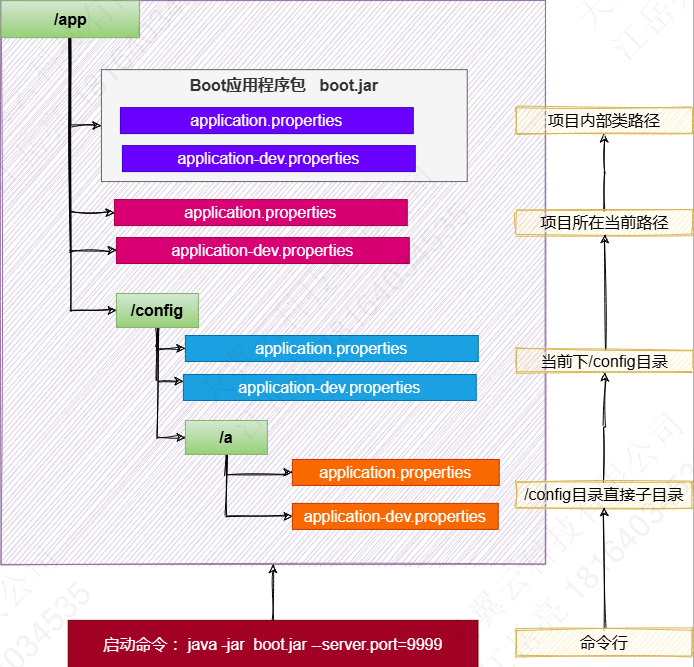

---

Created at: 2024-06-04
Last updated at: 2024-06-04
Source URL: about:blank


---

# 2.环境配置


**一、通过SpringApplication配置参数**
启动SpringBoot常用的写法是：
```
@SpringBootApplication
public class Main {
    public static void main(String[] args) {
        ApplicationContext applicationContext = SpringApplication.run(Main.class, args);
    }
}
```
SpringApplication.run(Main.class, args);点进去发现其实是new SpringApplication(Main.class);，所以还可以使用下面的写法，并且SpringApplication还提供了一些setter方法用于配置启动参数
```
@SpringBootApplication
public class Main {
    public static void main(String[] args) {
        SpringApplication application = new SpringApplication(Main.class);
        application.setBannerMode(Banner.Mode.OFF);
        Properties properties = new Properties();
        properties.setProperty("server.port", "8888");
        application.setDefaultProperties(properties);
        ApplicationContext applicationContext = application.run(args);
    }
}
```
还可以使用FluentBuilder API（流式写法）：
```
@SpringBootApplication
public class Main {
    public static void main(String[] args) {
  new SpringApplicationBuilder()
      .sources(Parent.class)
      .child(Application.class)
      .bannerMode(Banner.Mode.OFF)
      .run(args);
 }
}
```

**二、Profiles文件**
2.1、Profile配置文件

* application.properties是主配置文件，在任意时候都生效，还可以用 application-{profile}.properties 指定特定环境的配置文件，比如开发环境的配置文件application-dev.properties（{profile}可以任意指定，不必非得用dev表示开发环境）。如果在两种配置文件中存在相同的配置，那么profile配置文件的优先级要高于主配置文件。
* 配置文件的位置：SpringBoot 应用启动时会在 类路径、类路径下的/config包及其子包 下寻找application.properties和application.yaml，优先级是 config的子包 > config包 > 类路径，也就是后面找到的配置覆盖前面的配置。
* 同时存在properties文件和yaml文件时，properties配置文件的优先级高于yaml配置。

2.2、激活环境
在主配置文件中激活指定环境：
```
spring.profiles.active=dev,test
```
SpringBoot的默认环境叫default，使用spring.profiles.active不会覆盖default环境，比如增加上述配置之后一共存在default\\dev\\test三种环境，也可以指定默认环境，但是不推荐使用：
```
spring.profiles.default=dev
```
还可以在命令行启动参数上指定激活环境：
```
--spring.profiles.active=dev,test
```

2.3、包含环境
包含环境的配置只能写在主配置文件application.properties中；激活环境只会生效指定的环境，但是包含环境在任何时候都会生效。
```
spring.profiles.include=aaa,bbb
```

2.4、环境分组
可以给多个profile配置文件分组，然后激活指定分组，比如prod组：
```
spring.profiles.group.prod=db,mq
```

2.5、@Profile注解
@Profile标注在组件上可以让组件在指定的环境下才注入到IOC容器中。还可以标注在@Configuration类上，或者@Bean方法上，即只在指定环境下配置类才生效。
```
@Profile("dev")
@Component
@ConfigurationProperties(prefix = "mycar")
public class Car {
}
```

2.6、加载指定的配置文件
方式一：@PropertySource加载指定的配置文件（需要标注在@Configuration类上），配置文件的名字可以任意，而激活环境和包含环境的配置文件名字必须带有 application- 前缀。
```
@PropertySource("classpath:aaa.properties")
@Configuration
public class MyConfig {
}
```
方式二：在配置文件中使用 spring.config.import 导入额外配置
```
spring.config.import=classpath:/aaa.properties
```

**最佳实战：**
生效的环境 = 激活的环境/默认环境 + 包含的环境 ：

* 基础的配置mybatis、log、xxx：写到包含环境中
* 需要动态切换变化的 db、redis：写到激活的环境中

**三、外部化配置**
将SpringBoot应用打成jar包之后，在同一层目录下放一个application.properties配置文件，只会生效jar外的application.properties，jar包内的application.properties不会生效，从而达到不用重新打包应用即可修改配置的效果，简化了运维。
jar包外配置文件的位置：SpringBoot 应用启动时会在 当前路径、当前路径下的/config目录及其子目录 下寻找application.properties和application.yaml，优先级是 config的子目录 > config目录 > 当前路径，也就是后面找到的配置覆盖前面的配置。

**四、命令行配置**
所有参数均可由命令行传入，使用 _\--参数项=参数值_，将会被添加到环境变量中，并优先于配置文件。

**五、配置优先级**
5.1 各种配置的优先级
优先级由低到高（后面的会覆盖前面的）：

1. **默认属性（通过SpringApplication.setDefaultProperties指定的）**
2. @PropertySource指定加载的配置（需要写在@Configuration类上才可生效）
3. **配置文件（application.properties/yml等）**
4. RandomValuePropertySource支持的 random.\* 配置（如：@Value("${random.int}")）
5. OS 环境变量
6. Java 系统属性（System.getProperties()）
7. JNDI 属性（来自java:comp/env）
8. ServletContext 初始化参数
9. ServletConfig 初始化参数
10. SPRING\_APPLICATION\_JSON属性（内置在环境变量或系统属性中的 JSON）
11. **命令行参数**
12. 测试属性。(@SpringBootTest进行测试时指定的属性)
13. 测试类@TestPropertySource注解
14. Devtools 设置的全局属性。($HOME/.config/spring-boot)

结论：配置可以写到很多位置，常见的优先级顺序：命令行\> 配置文件\> springapplication配置

5.2 包外 > 包内
jar包外的application-{profile}.properties/yml > jar 包外的application.properties/yml >  jar 包内的application-{profile}.properties/yml > jar 包内的application.properties/yml

总结：

* 命令行 > 包外 > 包内
* profile配置 > 默认配置
* properties配置 > yaml配置



**六、属性占位符**
配置文件中可以使用 ${name:default}形式取出之前配置过的值：
```
app.name=MyApp
app.description=${app.name} is a Spring Boot application written by ${username:Unknown}
```

可以使用@Value、@ConfigurationProperties将配置文件中的值绑定到组件的属性中。

