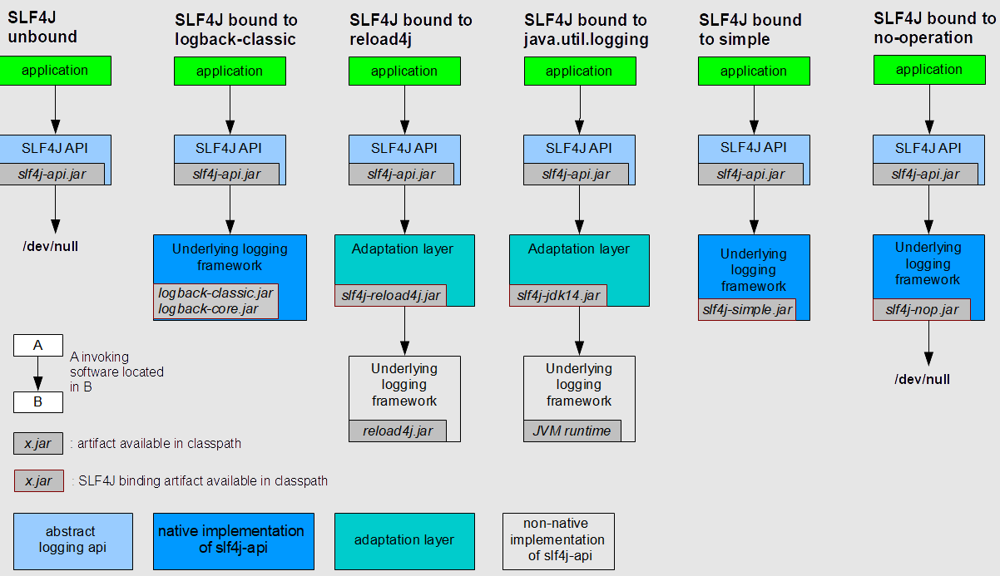
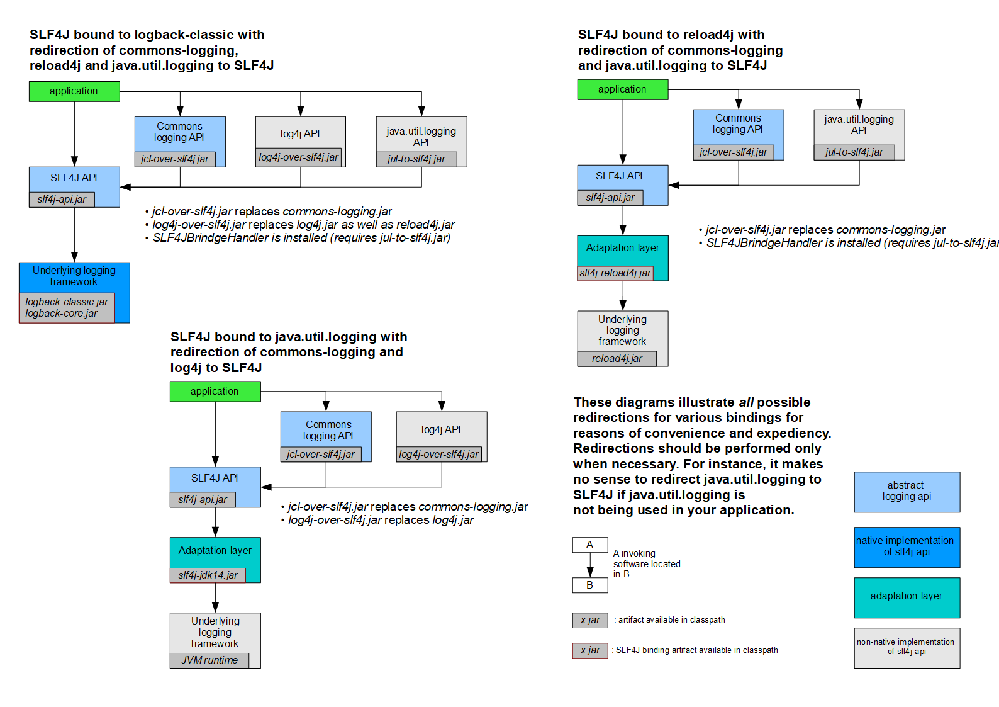
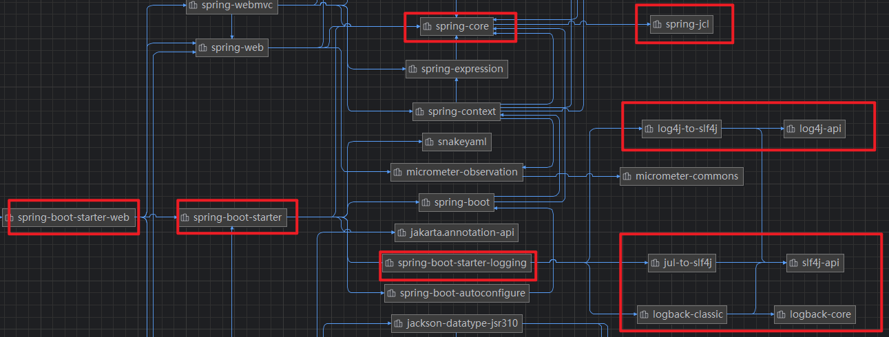

---

Created at: 2023-07-22
Last updated at: 2025-03-09
Source URL: about:blank


---

# 3.日志


**一、日志框架**
**1、常见日志框架的介绍**
日志门面是定义标准的接口，日志实现是接口的具体实现，它俩的关系与JDBC和数据库驱动的关系一样。门面模式（外观模式）属于设计模式中的一种。

|     |     |
| --- | --- |
| 日志门面 | 日志实现 |
| JCL(Jakarta Commons Logging)<br>SLF4j(Simple Logging Facade for Java） | Log4j<br>JUL(java.util.logging)<br>Logback<br>Log4j2 |

发展历史如下：

1. log4j：Apache开发的，最早的Java日志框架，现在已经不用了。

1. JUL：sun公司模仿log4j开发的，加入到了JDK。
2. JCL(Jakarta Commons Logging)：为了解耦日志接口与实现，Apache 推出了 JCL(Jakarta Commons Logging)，JCL定义了一套日志接口，具体实现则由 Log4j 或 JUL 来完成。
3. Slf4j&Logback：开发log4j的大佬关于JCL与Apache产生分歧后独立创建了 Slf4j 和 Logback 两个项目。Slf4j 是一个日志门面，只提供接口，Logback 提供了具体的实现，它相较于 log4j 有更快的执行速度和更完善的功能。
4. Log4j2：此时Apache拥有JCL&log4j 的组合，但log4j和JUL都干不过Logback，为了防止 JCL&Log4j 被 Slf4j&Logback 组合取代，Apache推出Log4j2，性能上远远超过Log4j。

**2、SLF4j的使用**
引入SLF4j的几种使用方式：

1. slf4j-api.jar : 只使用门面，日志会写到/dev/null。
2. slf4j-api.jar & logback-classic.jar & logback-core.jar : 经典组合，也是最常用的组合。
3. slf4j-api.jar & slf4j-reload4j.jar & reload4j.jar : 日志实现是reload4j.jar，不是原生支持slf4j的实现，所以需要引入适配层slf4j-reload4j.jar转换一下（适配器模式）。
4. slf4j-api.jar & slf4j-jdk14.jar :  日志实现是JVM，需要引入适配层slf4j-jdk14.jar。
5. slf4j-api.jar & slf4j-simple.jar : 日志实现是slf4j-simple.jar。
6. slf4j-api.jar & slf4j-nop.jar : 日志实现是slf4j-nop.jar，相当于没有实现。


当你的应用程序引入其他jar包，而这些jar包使用了其他日志框架比如JCL、log4j、JUL，为了统一日志实现，这个时候你就需要解决遗留API问题（Bridging legacy APIs），如下图，以第一种情况为例说明，你的项目使用的日志框架的组合是 slf4j&logback，但是引入的依赖分别使用了JCL、log4j、JUL，为了将日志实现统一成logback，那么首先需要排除JCL、log4j、JUL的依赖，但是排除之后引入的jar会报错，这个时候就需要分别再引入jcl-over-slf4j.jar、log4j-over-slf4j.jar、jul-slf4j.jar三个jar，这三个jar在实现上是调用slf4j的api，从而完成了桥接。

使用slf4j打印日志：
```
import org.slf4j.Logger;
import org.slf4j.LoggerFactory;
public class HelloWorld {
    public static void main(String[] args) {
        Logger logger = LoggerFactory.getLogger(HelloWorld.class);
        logger.info("Hello World");
    }
}
```

**二、SpringBoot的日志**
大致理解：SpringBoot使用slf4j作为日志门面，logback作为日志实现；Spring使用JCL作为门面，spring-jcl作为日志实现，spring-jcl的实现有一个Slf4jAdapter，所以它也是委托给了slf4j。

在spring-boot-autoconfigure中的logging包中没有xxxAutoConfiguration类，说明日志没有自动配置类，这是因为xxxAutoConfiguration是容器创建好之后往容器里面注册的组件，而日志在程序启动时就需要能用，所以日志并不是使用自动配置类进行配置，而是利用**监听器**机制配置的。
在SpringBoot中使用日志可以像前面那样用LoggerFactory创建一个Logger，也可以导入lombok，然后利用@Slf4j注解标注在类上，相当于给类加了一个这样的实例变量：
```
Logger log = LoggerFactory.getLogger(XXX.class);
```
比如：
```
@SpringBootApplication
@Slf4j
public class SpringbootDemoApplication {
    public static void main(String[] args) {
        SpringApplication.run(SpringbootDemoApplication.class, args);
        log.info("Hello Slf4j, 参数args: {}", Arrays.toString(args));
    }
}
```

**日志的配置**
SpringBoot的日志在配置文件中以logging开始。默认值放在spring-boot包的additional-spring-configuration-metadata.json文件中。
1、日志的格式
```
2024-05-25T14:57:15.368+08:00  INFO 22024 --- [springboot-demo] [           main] o.e.s.SpringbootDemoApplication          : Starting SpringbootDemoApplication using Java 22.0.1 with PID 22024 (D:\Project\IdeaProjects\springboot-demo\target\classes started by Jmoon in D:\Project\IdeaProjects\springboot-demo)
2024-05-25T14:57:15.372+08:00  INFO 22024 --- [springboot-demo] [           main] o.e.s.SpringbootDemoApplication          : No active profile set, falling back to 1 default profile: "default"
2024-05-25T14:57:16.101+08:00 ERROR 22024 --- [springboot-demo] [           main] o.a.catalina.core.AprLifecycleListener   : An incompatible version [1.2.27] of the Apache Tomcat Native library is installed, while Tomcat requires version [1.2.34]
```
默认输出格式：

1. 时间和日期：毫秒级精度
2. 日志级别：ERROR, WARN, INFO, DEBUG, or TRACE.
3. 进程 ID
4. \---： 消息分割符
5. 线程名： 使用\[\]包含
6. Logger 名： 通常是产生日志的类名
7. 消息： 日志记录的内容

注意： logback 没有FATAL级别，对应的是ERROR。
```
#设置控制台日志的格式
logging.pattern.console=
#控制文件中日志的格式
logging.pattern.file=
#单独只设置日志中日期的格式
logging.pattern.dateformat=
```

2、日志的级别
由低到高：ALL < TRACE < DEBUG < INFO < WARN < ERROR < FATAL < OFF，只会打印指定级别及以上级别的日志，SpringBoot日志默认级别是 INFO。

1. ALL：打印所有日志
2. TRACE：追踪框架详细流程日志，一般不使用
3. DEBUG：开发调试细节日志
4. INFO：关键、感兴趣信息日志
5. WARN：警告但不是错误的信息日志，比如：版本过时
6. ERROR：业务错误日志，比如出现各种异常
7. FATAL：致命错误日志，比如jvm系统崩溃
8. OFF：关闭所有日志记录

```
#默认级别
logging.level.root=info
#精确的调整某个包的日志级别
logging.level.com.ctyun.controller=warn
```

3、日志分组
将包分组，然后统一设置日志级别
```
# 分组
logging.group.tomcat=org.apache.catalina,org.apache.coyote,org.apache.tomcat
# 调整日志级别
logging.level.tomcat=trace
```
SpringBoot 预定义两个分组，可以分别指定这两个分组的日志级别：

|     |     |
| --- | --- |
| Name | Loggers |
| web | org.springframework.core.codec<br>org.springframework.http<br>org.springframework.web<br>org.springframework.boot.actuate.endpoint.web<br>org.springframework.boot.web.servlet.ServletContextInitializerBeans |
| sql | org.springframework.jdbc.core<br>org.hibernate.SQL<br>org.jooq.tools.LoggerListener |

4、日志文件输出
4.1 输出路径
默认只输出到控制台，如果需要保存到文件需要进行设置：
```
#设置日志文件的输出路径，默认文件名是spring.log，如果设置了logging.file.name，则logging.file.path无效
logging.file.path=D:\\
#可以同时设置文件路径和文件名，如果指定了文件名，则默认保存在项目根路径下
logging.file.name=mylog.log
```

4.2 文件归档与滚动切割

* 归档：每天的日志单独存到一个文档中。
* 切割：每个文件10MB，超过大小切割成另外一个文件。

每天的日志应该独立分割出来存档，如果使用logback（SpringBoot 默认整合），可以通过application.properties/yaml文件指定日志滚动规则。如果是其他日志系统，需要自行配置（添加log4j2.xml或log4j2-spring.xml），支持的滚动规则设置如下：

|     |     |
| --- | --- |
| 配置项 | 描述  |
| logging.logback.rollingpolicy.file-name-pattern | 日志存档的文件名格式（默认值：${LOG\_FILE}.%d{yyyy-MM-dd}.%i.gz） |
| logging.logback.rollingpolicy.clean-history-on-start | 应用启动时是否清除以前存档（默认值：false） |
| logging.logback.rollingpolicy.max-file-size | 存档前，每个日志文件的最大大小（默认值：10MB） |
| logging.logback.rollingpolicy.total-size-cap | 日志文件被删除之前，可以容纳的最大大小（默认值：0B）。设置1GB则磁盘存储超过 1GB 日志后就会删除旧日志文件 |
| logging.logback.rollingpolicy.max-history | 日志文件保存的最大天数(默认值：7). |

5、自定义配置
通常修改 application.properties 配置文件就能满足我们的日志配置需求，如果不够，可以编写日志框架的配置文件放在类路径下，比如logback-spring.xml，log4j2-spring.xml：

|     |     |
| --- | --- |
| 日志系统 | 自定义 |
| Logback | logback-spring.xml, logback-spring.groovy, logback.xml, or logback.groovy |
| Log4j2 | log4j2-spring.xml or log4j2.xml |
| JDK (Java Util Logging) | logging.properties |

建议日志配置文件名中使用\-spring（例如，logback-spring.xml 而不是 logback.xml）。直接使用logback.xml，框架会直接读配置文件，如果加上-spring则会先由SpringBoot读取，这时就可以使用Spring另外提供的标签。最佳实战：自己要写配置，配置文件名加上 xx-spring.xml 。

6、切换日志实现
比如切换log4j2，做法是，重新引入spring-boot-starter并排除spring-boot-starter-logging，按照Maven就近原则，只生效我们导入的，然后再导入spring-boot-starter-log4j2。
```
<dependency>
    <groupId>org.springframework.boot</groupId>
    <artifactId>spring-boot-starter-web</artifactId>
</dependency>
<dependency>
    <groupId>org.springframework.boot</groupId>
    <artifactId>spring-boot-starter</artifactId>
    <exclusions>
        <exclusion>
            <groupId>org.springframework.boot</groupId>
            <artifactId>spring-boot-starter-logging</artifactId>
        </exclusion>
    </exclusions>
</dependency>
<dependency>
    <groupId>org.springframework.boot</groupId>
    <artifactId>spring-boot-starter-log4j2</artifactId>
</dependency>
```

