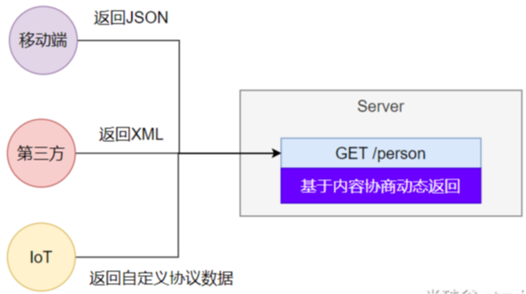

---

Created at: 2023-07-23
Last updated at: 2024-06-05
Source URL: about:blank


---

# 7.Web开发-内容协商


内容协商是指根据请求指定的内容格式返回相应格式的数据。


**SpringBoot支持两种内容协商的方式：**
1、基于请求头内容协商：（默认开启）
客户端向服务端发送请求，携带HTTP标准的Accept请求头，Accept: application/json、text/xml、text/yaml，服务端根据客户端请求头期望的数据类型返回相应格式的数据。
2、基于请求参数内容协商：（需要开启）
比如发生请求 GET /projects/spring-boot?format=json 时返回JSON格式化数据，发送 GET /projects/spring-boot?format=xml 时返回XML数据。
```
# 开启基于请求参数的内容协商功能。 默认参数名：format。 默认此功能不开启
spring.mvc.contentnegotiation.favor-parameter=true
# 指定内容协商时使用的参数名。默认是 format
spring.mvc.contentnegotiation.parameter-name=type
```

**响应XML格式的数据：**
spring-boot-starter-web 已经导入了 spring-boot-starter-json，所以默认支持JSON格式，如果需要支持XML格式，则需要导入：
```
<dependency>
    <groupId>com.fasterxml.jackson.dataformat</groupId>
    <artifactId>jackson-dataformat-xml</artifactId>
</dependency>
```
然后再需要序列化成XML格式的类上标注注解：
```
`@JacksonXmlRootElement  // 可以写出为xml文档`
@Data
public class Person {
    private Long id;
    private String userName;
}
```

**自定义内容返回**
比如增加返回yaml格式数据的支持
1、导入yaml的依赖
```
<dependency>
    <groupId>com.fasterxml.jackson.dataformat</groupId>
    <artifactId>jackson-dataformat-yaml</artifactId>
</dependency>
```
2、编写配置，新增一种媒体类型
```
#新增一种媒体类型，text/yaml 或者 application/yaml 都可以
spring.mvc.contentnegotiation.media-types.yaml=text/yaml
```
3、自定义HttpMessageConverter
```
public class MyYamlHttpMessageConverter extends AbstractHttpMessageConverter<Object> {

    private ObjectMapper objectMapper = null; //把对象转成yaml

    public MyYamlHttpMessageConverter(){
        //告诉SpringBoot这个MessageConverter支持哪种媒体类型  //媒体类型
        super(new MediaType("text", "yaml", Charset.forName("UTF-8")));
        YAMLFactory factory = new YAMLFactory()
                .disable(YAMLGenerator.Feature.WRITE_DOC_START_MARKER); //去掉文档分隔符 ---- 
        this.objectMapper = new ObjectMapper(factory);
    }

    @Override
    protected boolean supports(Class<?> clazz) {
        //只要是对象类型，不是基本类型
        return true;
    }

    @Override  //@RequestBody
    protected Object readInternal(Class<?> clazz, HttpInputMessage inputMessage) throws IOException, HttpMessageNotReadableException {
        return null;
    }

    @Override //@ResponseBody 把对象怎么写出去
    protected void writeInternal(Object methodReturnValue, HttpOutputMessage outputMessage) throws IOException, HttpMessageNotWritableException {
        //try-with写法，自动关流
        try(OutputStream os = outputMessage.getBody()){
            this.objectMapper.writeValue(os,methodReturnValue);
        }
    }
}
```
4、把自定义的HttpMessageConverter通过webMvcConfigurer注册到容器中
```
@Bean
public WebMvcConfigurer webMvcConfigurer(){
    return new WebMvcConfigurer() {
        @Override //配置一个能把对象转为yaml的messageConverter
        public void configureMessageConverters(List<HttpMessageConverter<?>> converters) {
            converters.add(new MyYamlHttpMessageConverter());
        }
    };
}
```

