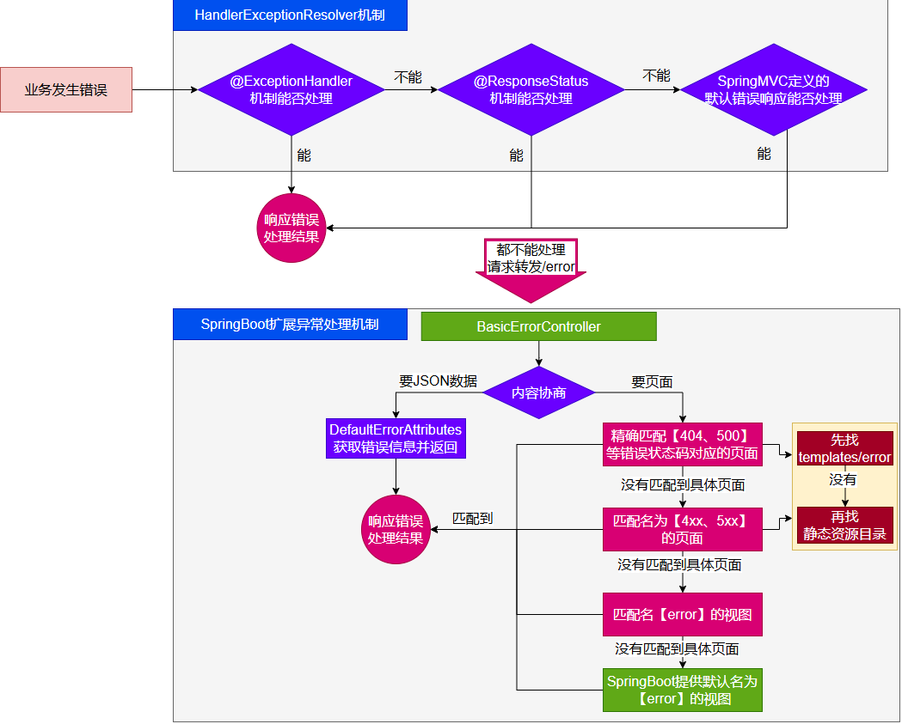

---

Created at: 2023-07-25
Last updated at: 2024-06-05
Source URL: about:blank


---

# 8.Web开发-错误处理


错误处理的自动配置都在ErrorMvcAutoConfiguration中，两大核心机制：

1. SpringBoot 会内容协商处理错误，响应页面或JSON数据。
2. SpringMVC的错误处理机制依然保留，SpringMVC处理不了，才会交给SpringBoot进行处理。

SpringBoot引入Web场景之后的错误处理流程如下：


发生错误以后，SpringMVC的错误处理机制处理不了会转发/error请求，SpringBoot在底层写好一个 BasicErrorController的组件，专门处理这个/error请求。
ErrorMvcAutoConfiguration中：
```
@Bean
@ConditionalOnMissingBean(value = ErrorController.class, search = SearchStrategy.CURRENT)
public BasicErrorController basicErrorController(ErrorAttributes errorAttributes,
       ObjectProvider<ErrorViewResolver> errorViewResolvers) {
    return new BasicErrorController(errorAttributes, this.serverProperties.getError(),
          errorViewResolvers.orderedStream().collect(Collectors.toList()));
}
```
BasicErrorController就是普通的Controller，它有两个关键的方法，分别返回HTML页面和JSON格式数据：
```
@RequestMapping(produces = MediaType.TEXT_HTML_VALUE) //返回HTML
public ModelAndView errorHtml(HttpServletRequest request, HttpServletResponse response) {
    HttpStatus status = getStatus(request);
    Map<String, Object> model = Collections
          .unmodifiableMap(getErrorAttributes(request, getErrorAttributeOptions(request, MediaType.TEXT_HTML)));
    response.setStatus(status.value());
    `ModelAndView modelAndView = resolveErrorView(request, response, status, model);`
    `return (modelAndView != null) ? modelAndView : new ModelAndView("error", model);`
}
@RequestMapping //返回 ResponseEntity, JSON
public ResponseEntity<Map<String, Object>> error(HttpServletRequest request) {
    HttpStatus status = getStatus(request);
    if (status == HttpStatus.NO_CONTENT) {
       return new ResponseEntity<>(status);
    }
    Map<String, Object> body = getErrorAttributes(request, getErrorAttributeOptions(request, MediaType.ALL));
    return new ResponseEntity<>(body, status);
}
```
返回页面的时候需要通过resolveErrorView方法解析得到ModelAndView，而resolveErrorView方法则调用错误视图解析器ErrorViewResolver，在ErrorMvcAutoConfiguration中自动配置了一个默认错误视图解析器：
```
@Bean
@ConditionalOnBean(DispatcherServlet.class)
@ConditionalOnMissingBean(ErrorViewResolver.class)
DefaultErrorViewResolver conventionErrorViewResolver() {
    return new DefaultErrorViewResolver(this.applicationContext, this.resources);
}
```

DefaultErrorViewResolver的解析规则是（该规则与上图展示的流程对应）：

1. 如果发生了500、404、503、403 这些错误

1. 如果有模板引擎，默认在 classpath:/templates/error/**精确码.html**
2. 如果没有模板引擎，在静态资源文件夹下找 **精确码.html**

2. 如果匹配不到精确码.html这些精确的错误页，就去找5xx.html，4xx.html**模糊匹配**

1. 如果有模板引擎，默认在 classpath:/templates/error/5xx.html
2. 如果没有模板引擎，在静态资源文件夹下找 5xx.html

最后如果没解析到ModelAndView，那么BasicErrorController的errorHtml方法最后一行会新建一个error路径的ModelAndView，最后去模板引擎路径templates下找 error.html页面，如果没有error.html页面，那么使用SpringBoot提供的默认error视图。
在ErrorMvcAutoConfiguration中，SpringBoot提供的默认白页功能，名为 error 的 view：
```
@Configuration(proxyBeanMethods = false)
@ConditionalOnProperty(prefix = "server.error.whitelabel", name = "enabled", matchIfMissing = true)
@Conditional(ErrorTemplateMissingCondition.class)
protected static class WhitelabelErrorViewConfiguration {
    private final StaticView defaultErrorView = new StaticView();

    @Bean(name = "error")
    @ConditionalOnMissingBean(name = "error")
    public View defaultErrorView() {
       return this.defaultErrorView;
    }

    // If the user adds @EnableWebMvc then the bean name view resolver from
    // WebMvcAutoConfiguration disappears, so add it back in to avoid disappointment.
    @Bean
    @ConditionalOnMissingBean
    public BeanNameViewResolver beanNameViewResolver() {
       BeanNameViewResolver resolver = new BeanNameViewResolver();
       resolver.setOrder(Ordered.LOWEST_PRECEDENCE - 10);
       return resolver;
    }
}

```

错误处理最佳实战

* 前后分离
	* 后台发生的所有错误，@ControllerAdvice + @ExceptionHandler进行统一异常处理。
* 服务端页面渲染
	* 不可预知的一些，HTTP码表示的服务器或客户端错误
		* 给classpath:/templates/error/下面，放常用精确的错误码页面。500.html，404.html
		* 给classpath:/templates/error/下面，放通用模糊匹配的错误码页面。 5xx.html，4xx.html
	* 发生业务错误
		* 核心业务，每一种错误，都应该代码控制，跳转到自己定制的错误页。
		* 通用业务，classpath:/templates/error.html页面，显示错误信息。

