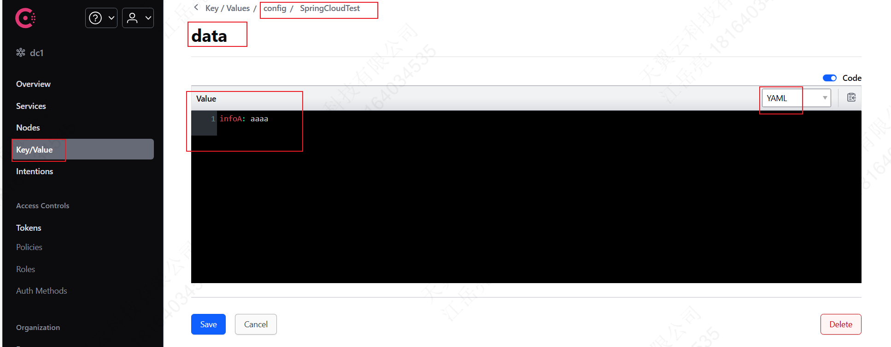

---

Created at: 2024-08-07
Last updated at: 2025-03-09
Source URL: https://docs.spring.io/spring-cloud-consul/reference/quickstart.html


---

# 2-Consul


主要使用Consul提供的 **服务发现** 和 **配置中心** 两项服务。

**一、安装启动Consul**
以开发者模式启动：consul agent -dev
以服务器模式启动并将配置数据持久化：consul  agent -server -data-dir D:\\consul\\data
访问：http://localhost:8500/

**二、引入SpringCloud开发环境**
BOM 与 POM的区别？
POM文件是Maven的配置文件，如果Maven项目指定打包为POM类型，比如spring-boot-starter-parent，这种工程只是用来管理依赖，不包含java代码文件，在该POM文件可以使用<dependencyManagement>管理依赖的版本，但不引入，也可以使用<dependencies>引入依赖，如果POM文件只包含<dependencyManagement>，那么就称这种POM为BOM（Bill of Materials，物料清单）。
```
<artifactId>spring-boot-starter-parent</artifactId>
<packaging>pom</packaging>
<name>spring-boot-starter-parent</name>
```
BOM可以被继承，子项目继承了BOM中<dependencyManagement>的所有定义，但没实际引入依赖，
```
<parent>
    <groupId>org.springframework.boot</groupId>
    <artifactId>spring-boot-starter-parent</artifactId>
    <version>3.3.2</version>
    <relativePath/> <!-- lookup parent from repository -->
</parent>
```
子项目只能继承一个BOM，如果子项目还想引入其他BOM中<dependencyManagement>的所有定义，则应该使用<scope>import</scope>（这个标签值只能在dependencyManagement标签下使用，并且仅用于type为"pom"的dependency，其意义为引入该dependency的pom中<dependencyManagement>的所有定义。）：
```
<properties>
    <spring-cloud.version>2023.0.2</spring-cloud.version>
</properties>
<dependencyManagement>
    <dependencies>
        <dependency>
            <groupId>org.springframework.cloud</groupId>
            <artifactId>spring-cloud-dependencies</artifactId>
            <version>${spring-cloud.version}</version>
            <type>pom</type>
            `<scope>import</scope>`
        </dependency>
    </dependencies>
</dependencyManagement>
```
spring-cloud-dependencies 是一个BOM，管理了所有SpringCloud的依赖，所以首先需要在<dependencyManagement>中引入。下面这个starter使用其他SpringCloud组件时一般都被动引入了，所以在项目中不引入也行：
```
<dependency>
    <groupId>org.springframework.cloud</groupId>
    <artifactId>spring-cloud-starter</artifactId>
</dependency>
```
参考： [Maven中pom文件内scope标签中import值的详解 - 之之小侠 - 博客园 (cnblogs.com)](https://www.cnblogs.com/zhizhixiaoxia/p/14041697.html)

**三、服务发现**
服务发现：把服务注册到Consul中，其他服务可以直接使用服务名访问该服务（DNS）。
1、向Consul中注册服务
引入服务发现的依赖
```
<dependency>
    <groupId>org.springframework.cloud</groupId>
    <artifactId>spring-cloud-starter-consul-discovery</artifactId>
</dependency>
```
启动项目即可自动注册到Consul，Consul默认的地址是localhost:8500，可以在application.yml中改：
```
spring:
  application:
    name: cloud-payment-service
  cloud:
    consul:
      host: localhost
      port: 8500
```
Consul需要对服务进行健康检查，所以还需要引入actuator：
```
<dependency>
    <groupId>org.springframework.boot</groupId>
    <artifactId>spring-boot-starter-actuator</artifactId>
</dependency>
```

2、服务发现
```
@Resource
public void serviceUrl(DiscoveryClient discoveryClient) {
    List<ServiceInstance> list = discoveryClient.getInstances("cloud-payment-service");
    list.forEach(si -> System.out.println(si.getHost() + ":" + si.getPort()));
}
```

3、使用服务发现调用其他服务
使用RestTemplate进行调用，所以先创建RestTemplate，必须添加@LoadBalanced注解，这个注解的功能有两个，一是把服务名转换成ip+post，二是如果该服务有多个，还能按一定的策略负载均衡地调用（客户端侧的负载均衡）。
```
@Configuration
public class RestTemplateConfig {
    @Bean
    @LoadBalanced
    public RestTemplate restTemplate() {
        return new RestTemplate();
    }
}
```
使用服务名调用服务，
```
public String serviceMethod() {
    Map<String, String> vars = Collections.singletonMap("id", "1");
    String res = restTemplate.getForObject("http://cloud-payment-service/pay/get/{id}", String.class, vars);
    return res;
}
```
注意，如果被调用的服务如果返回500的http状态吗，那么在调用者这里会抛异常，也将返回500。

**四、配置中心**
1、引入依赖
```
<!--SpringCloud consul config-->
<dependency>
    <groupId>org.springframework.cloud</groupId>
    <artifactId>spring-cloud-starter-consul-config</artifactId>
</dependency>
<dependency>
    <groupId>org.springframework.cloud</groupId>
    <artifactId>spring-cloud-starter-bootstrap</artifactId>
</dependency>
```

2、添加bootstrap.yml，在程序启动时容器创建前加载，优先于application.yml
```
spring:
  application:
    name: SpringCloudTest
  cloud:
    consul:
      host: localhost
      port: 8500
      discovery:
        service-name: ${spring.application.name}
      config:
        enabled: true
        profile-separator: '-' # default value is ","，we update '-'
        format: YAML
```

3、在Consul中添加KV
默认读取配置的路径：
```
config/SpringCloudTest-dev/data # 如果激活了dev配置文件
config/application/data
```


4、读取配置
```
@RequestMapping("/req2")
public String req2(@Value("${infoA}") String str) {
    return str;
}
```
当consul上的配置改变了，上面代码读到的结果也会立刻发生改变，但是下面的情况不会，因为这个配置只会在构造bean的时候读一次。
```
@Value("${infoA}")
private String info;
```

