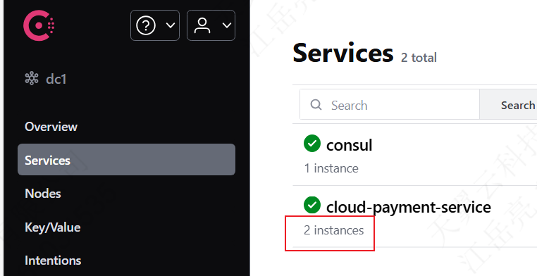

---

Created at: 2024-08-09
Last updated at: 2025-03-09
Source URL: file:///D:/PersonalData/%E5%AD%A6%E4%B9%A0/SpringCloud/SpringCloud%E7%AC%AC3%E5%AD%A32024.html


---

# 3-spring-cloud-loadbalancer


Nginx是服务器端的负载均衡，loadbalancer是客户端的负载均衡。
**一、单独使用loadbalancer，不使用服务发现**
官网的例子（ [Getting Started | Client-Side Load-Balancing with Spring Cloud LoadBalancer](https://spring.io/guides/gs/spring-cloud-loadbalancer)）
1、引入依赖
```
<!--loadbalancer-->
<dependency>
    <groupId>org.springframework.cloud</groupId>
    <artifactId>spring-cloud-starter-loadbalancer</artifactId>
</dependency>
```
2、在客户端上加@LoadBalanced注解即可实现负载均衡访问服务，@LoadBalancerClient指明访问服务的策略，这里需要使用这个注解指明服务的地址（硬编码在代码里，所以不推荐使用，更推荐使用服务发现的方式）
```
@Configuration
@LoadBalancerClient(name = "say-hello", configuration = SayHelloConfiguration.class)
public class WebClientConfig {
    @LoadBalanced
    @Bean
    WebClient.Builder webClientBuilder() {
        return WebClient.builder();
    }
}
```
```
public class SayHelloConfiguration {
    @Bean
    @Primary
    ServiceInstanceListSupplier serviceInstanceListSupplier() {
        return new DemoServiceInstanceListSuppler("say-hello");
    }
}

class DemoServiceInstanceListSuppler implements ServiceInstanceListSupplier {

    private final String serviceId;

    DemoServiceInstanceListSuppler(String serviceId) {
        this.serviceId = serviceId;
    }

    @Override
    public String getServiceId() {
        return serviceId;
    }

    @Override
    public Flux<List<ServiceInstance>> get() {
        return Flux.just(Arrays
                .asList(new DefaultServiceInstance(serviceId + "1", serviceId, "localhost", 8090, false),
                        new DefaultServiceInstance(serviceId + "2", serviceId, "localhost", 9092, false),
                        new DefaultServiceInstance(serviceId + "3", serviceId, "localhost", 9999, false)));
    }
}
```

**二、使用服务发现**
1、引入Consul服务发现的依赖spring-cloud-starter-consul-discovery也就引入了loadbalancer的依赖了，可以不用单独引入。
2、启动被访问的服务多次

3、在客户端上加@LoadBalanced注解即可实现负载均衡访问服务
```
@Configuration
public class RestTemplateConfig {
    @Bean
    @LoadBalanced //使用@LoadBalanced注解赋予RestTemplate负载均衡的能力
    public RestTemplate restTemplate() {
        return new RestTemplate();
    }
}
```
服务发现底层使用的是DiscoveryClient类。

**三、负载均衡策略选择**
默认的策略是RoundRobinLoadBalancer（轮询），可以替换成RandomLoadBalancer（随机）：
```
public class CustomLoadBalancerConfiguration {
    @Bean
    ReactorLoadBalancer<ServiceInstance> randomLoadBalancer(Environment environment,
            LoadBalancerClientFactory loadBalancerClientFactory) {
        String name = environment.getProperty(LoadBalancerClientFactory.PROPERTY_NAME);
        return new RandomLoadBalancer(loadBalancerClientFactory
                .getLazyProvider(name, ServiceInstanceListSupplier.class),
                name);
    }
}

@Configuration
@LoadBalancerClient(value = "cloud-payment-service",configuration =CustomLoadBalancerConfiguration.class)
public class RestTemplateConfig
{
    @Bean
    @LoadBalanced //使用@LoadBalanced注解赋予RestTemplate负载均衡的能力
    public RestTemplate restTemplate(){
        return new RestTemplate();
    }
}
```
还可以自定义负载均衡策略，注意@LoadBalancerClient可以指定服务名，从而实现访问不同服务使用不同的策略。

