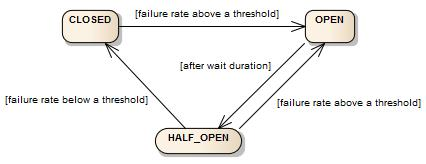

---

Created at: 2024-08-09
Last updated at: 2025-03-09
Source URL: https://tongyi.aliyun.com/qianwen/?sessionId=8c649e78dec44f8faf229a11ee7ee2a4


---

# 5-Resilience4j


**为什么访问量大了之后会造成服务崩溃？**
1、内存资源有限。每个请求都建一个线程，线程池的最大线程数都用完了也得在阻塞队列上建相应的对象，这会造成至少两个问题，一是请求长时间无法得到处理，最终导致服务不可用；二是等待队列一直无限增长导致可能会造成OOM，若此时其他线程也需要申请堆内存，那么其他线程也会因为申请不到内存而OOM，甚至连锁反应导致整个JVM的退出。
2、主机的网络协议栈有很多缓冲区，比如在接受数据的时候有RingBuffer、recv\_buffer，大量的TCP连接的高并发访问可能会造成缓冲区装不下而丢包。
3、主机的网卡性能在传输速度是有上限的，当网络传输速度过大，达到网卡上限时，就会发生丢包。
4、客户端到服务器之间的网络链路也会丢包，网络架构一般是核心层、汇聚层 和 接入层，如果在服务器端接入层的网络设备性能不行也会造成丢包，这个时候就要考虑升级服务器的带宽了。
客户端的请求会依次经过4->3->2->1，每个环节都可能会丢包，不过最要还是在应用层，其实应用层不光只内存资源紧张会造成服务崩溃，整个应用的各个环节、组件都可能会，比如CPU资源，数据库资源等。

正是因为服务器可能扛不住高并发请求，所以需要引入限流措施，让服务器快速大量地拒绝请求，从而不至于让服务器崩溃（让一部分请求直接死掉，从而让另一部分活下来，不至于所有都挂了）。其实丢包也是一种限流，但是这种方式对用户十分不友好，因为用户得不到任何提示，所以引入了服务降级措施。

Resilience4j是一个容错框架，包含熔断、限流等工具，可以用它来构建高可用的应用。官网： [resilience4j](https://resilience4j.readme.io/)

**CircuitBreaker断路器**
不对服务调用考虑过多，最直接的方式是如果响应不是2xx就直接抛异常（比如404找不到、500服务器内部错误、504超时），然后在代码里使用try...catch...捕获异常，在catch里实现服务降级的逻辑。这样的处理方式没有什么问题，只不过整个微服务集群可能不够健壮，比如如果是504超时，那有可能是被调用的服务繁忙，这时如果还持续去请求，一来会让调用者大量请求线程处于阻塞状态，消耗主机资源，二是可能会让被调用的服务崩溃，所以应该主动去限制不让调用者再发送请求了；再比如404、500，无论在进行多少次请求也还是一样的结果，所以可以直接限制不让调用者发送请求，从而减少对网络资源的占用。CircuitBreaker断路器就是用来干这件事的，使用CircuitBreaker包装的调用如果失败率或者超时率大于提前设定的阈值，那么CircuitBreaker会打开从而让后续调用直接被拒绝。

CircuitBreaker是SpringCloud提供的标准接口，它有两个主要实现：Resilience4J 和 Spring Retry 。

CircuitBreaker提供了三种主要的状态：closed、open、half\_open，和两种特殊的状态：DISABLED 和 FORCED\_OPEN。closed是允许访问状态，open是禁止访问状态，half\_open是部分可访问状态。DISABLED是始终允许访问，FORCED\_OPEN是始终禁止访问。

CircuitBreaker处于COLSED（闭合）状态允许正常访问，当失败率或者慢调用率超过设定的阈值时，CircuitBreaker会转换成OPEN（打开）状态，这时不允许进行访问，等待一定的时间之后CircuitBreaker转变成HALF\_OPEN（半开）状态，这时允许指定数量的请求正常访问，如果这些请求的失败率仍然超过阈值，那么再次进入OPEN状态，否则进入CLOSED状态。

主要的配置：

|     |     |     |
| --- | --- | --- |
| **配置项** | **默认值** | **描述** |
| slidingWindowType | COUNT\_BASED | 滑动窗口类型， COUNT\_BASED基于次数， TIME\_BASED基于时间 |
| slidingWindowSize | 100 | 滑动窗口大小，如果是COUNT\_BASED类型则单位是次，如果是TIME\_BASED类型则单位是秒 |
| minimumNumberOfCalls | 100 | 计算滑动窗口失败率和慢调用率时需要的最小调用次数 |
| failureRateThreshold | 50  | 失败调用率 |
| slowCallRateThreshold | 100 | 慢调用率，调用时间超过 slowCallDurationThreshold则认为慢 |
| slowCallDurationThreshold | 60000 \[ms\] | 慢调用阈值 |
| automaticTransitionFromOpenToHalfOpenEnabled | false | 是否自动从open转变到half-open，如果是true会有个线程监控，当waitDurationInOpenState时间到了就自动转变，如果是false则需要进行一次调用才可以（调用的时候再判断是否到waitDurationInOpenState，如果到了就转变成half-open）。 |
| waitDurationInOpenState | 60000 \[ms\] | 从open转变到half-open需要等待的时间 |
| maxWaitDurationInHalfOpenState | 0 \[ms\] | 在half-open的最长等待时间，超过这个时间会转变成open状态 |
| permittedNumberOfCallsInHalfOpenState | 10  | 在half-open时允许调用的次数，若失败率和慢调用率仍然超过阈值则再次进入open状态，否则进入close状态（相当于在half-open状态是一个基于次数的窗口） |

1、导入依赖
```
<dependency>
    <groupId>io.github.resilience4j</groupId>
    <artifactId>resilience4j-all</artifactId>
    <version>${resilience4jVersion}</version>
</dependency>
```
2、示例
```
public static void main(String[] args) throws Throwable {
    // Create a custom configuration for a CircuitBreaker
    CircuitBreakerConfig circuitBreakerConfig = CircuitBreakerConfig.custom()
            .slidingWindowType(CircuitBreakerConfig.SlidingWindowType.COUNT_BASED) //滑动窗口类型
            .slidingWindowSize(5) //滑动窗口大小
            .minimumNumberOfCalls(3) //计算滑动窗口失败率和慢调用率时需要的最小调用次数
            .failureRateThreshold(50) //失败调用率
            .slowCallRateThreshold(50) //慢调用率
            .waitDurationInOpenState(Duration.ofMillis(30000)) //从open转变到half-open需要等待的时间
            .permittedNumberOfCallsInHalfOpenState(3) //在half-open时允许调用的次数
            .build();

    // Create a CircuitBreakerRegistry with a custom global configuration
    CircuitBreakerRegistry circuitBreakerRegistry =
            CircuitBreakerRegistry.of(circuitBreakerConfig);

    // Get or create a CircuitBreaker from the CircuitBreakerRegistry
    // with a custom configuration
    CircuitBreaker circuitBreakerWithCustomConfig = circuitBreakerRegistry
            .circuitBreaker("name2", circuitBreakerConfig);

    // When I decorate my function
    CheckedConsumer<Integer> checkedConsumer = CircuitBreaker.decorateCheckedConsumer(circuitBreakerWithCustomConfig,
            t -> {
                if (t == 0) {
                    throw new RuntimeException("fail");
                } else {
                    System.out.println("success");
                }
            });
    Scanner sc = new Scanner(System.in);
    while (true) {
        int i = sc.nextInt();
        try {
            checkedConsumer.accept(i);
        } catch (Throwable e) {
           //服务降级，给用户友好提示
            System.out.println("调用失败了，原因是：" + e + "，请稍后重试！");
        }
        // 还可以使用Vavr库提供的函数式编程方式进行调用
        // Try.success(sc.nextInt()).andThen(checkedConsumer.unchecked()).failed().andThen(cause -> System.out.println("调用失败了，原因是" + cause.getMessage() + "，请稍后重试！"));
    }
}
```
连续输入0 0 1之后再输入1就被禁止访问了，说明如果滑动窗口大小 >= minimumNumberOfCalls，只要窗口中保存的调用次数达到minimumNumberOfCalls就开始触发计算失败率。滑动窗口大小 < minimumNumberOfCalls时则以滑动窗口大小为准。
当达到min(窗口大小，minimumNumberOfCalls)后会触发一次计算失败率，如果仍然处于CLOSED状态，那么以后每次进来一个请求，如果窗口已满就会挤掉最旧的请求，像队列那样，并计算失败率。
```
0
调用失败了，原因是：java.lang.RuntimeException: fail，请稍后重试！
0
调用失败了，原因是：java.lang.RuntimeException: fail，请稍后重试！
1
success
1
调用失败了，原因是：io.github.resilience4j.circuitbreaker.CallNotPermittedException: CircuitBreaker 'name2' is OPEN and does not permit further calls，请稍后重试！
```
当从CLOSED状态转变成OPEＮ状态时，窗口中的请求会被清空。
等待30s后处于half-open，只允许调用3次，再输入1 0 1，失败率小于阈值，所以第三次过后就变成了CLOSED状态，这三个请求并不会被保存在窗口中。
```
1
success
0
调用失败了，原因是：java.lang.RuntimeException: fail，请稍后重试！
1
success
```

**RateLimiter限流器**

常见限流算法：

1. 滚动时间窗口
2. 滑动时间窗口
3. 漏桶算法
4. 令牌桶算法

一、滚动时间窗口 和 滑动时间窗口
滚动时间窗口 和 滑动时间窗口 有时也被称为 计数器法。滚动时间窗口给每一个时间窗口设置一个最大请求量，在时间窗口内的某个时刻达到最大请求量之后，窗口剩下的时间会直接拒绝或阻塞到来的请求，每个窗口之间没有重叠。滚动时间窗口简单粗暴，但在两个窗口的临界点处可能会出现流量尖峰的问题，比如0.9秒时有100个请求，1.1秒时也有100个请求，虽然第一秒和第二秒确实都在各自的时间范围内限制了100个请求，但是从0.5秒1.5秒这一秒之间却有200个请求。为了避免这个问题，可以使用滑动时间窗口，滑动时间窗口更加精细地划分时间窗口，比如再将1秒划分成10个格子，然后随时间的流逝，窗口跟着时间滑动，每次都是计算最近10个格子的请求量，如果前9个格子的请求量已经达到100个请求，那么下一个100毫秒会直接拒绝或阻塞到来的请求，滑动窗口的缺点是，存储和计算的开销更大。

二、漏桶算法
漏桶的出水口大小一定，从而保证请求处理速度永远不会超过设定的值，最简单的实现方式是使用信号量Semaphore来限制并发量（我自己认为的）。

三、令牌桶算法
有一个固定容量的桶，然后以稳定的速率生成令牌放在桶中，因为桶的容量固定，令牌满了就不生产了。当有请求时，需要获取令牌才能通过，桶中有充足的令牌时，突发的流量可以直接获取令牌通过，当令牌取光后，后面的请求就得等生成令牌后才能通过，这种情况下请求通过的速率就变得稳定了。令牌桶的优点是可用处理突发流量，所以被广泛的应用于各种限流工具中，比如Guava的RateLimiter。

参考： [逐行拆解Guava限流器RateLimiter - 知乎](https://zhuanlan.zhihu.com/p/439682111)

令牌桶算法 与 漏桶算法 的区别：漏桶算法的信号量Semaphore取完之后需要还回来后面的请求才能再取，但是令牌桶算法并不需要把令牌还回来，而是直接生成新的令牌放到桶中。
令牌桶算法 与 滚动时间窗口 的区别：令牌桶算法在时间片到达的生成一个令牌，而不是直接把桶填满，但是滚动时间窗口就是每次都直接把桶填满。

Resilience4j的RateLimiter有两种实现：AtomicRateLimiter 和 SemaphoreBasedRateLimiter。AtomicRateLimiter就是滚动时间窗口，对于SemaphoreBasedRateLimiter，官网只用了一句话进行简单介绍，感觉应该是和AtomicRateLimiter都是滚动时间窗口，只不过AtomicRateLimiter 使用AtomicReference实现，而SemaphoreBasedRateLimiter使用Semaphore实现，区别是使用AtomicReference实现对于单线程的连续多次调用也可进行流控，而使用Semaphore实现只对多线程调用进行流控（我自己的猜测）。

Resilience4j对于RateLimiter的内部实现的描述如下图，RateLimiter的两个重要的参数： limitRefreshPeriod表示刷新时间间隔， limitForPeriod表示每个时间片允许通过的最大请求数，下图中设置的是1。线程2获取的时候允许通过的最大请求数为0，所以它被挂起了，直到下一个时间片刷新最大请求数，图中的-1无关紧要，只是一种实现方式而已，表示线程2成功保留（reserve）了一个允许（令牌），下一个时间片刷新的时候要减去这个-1，如果设置了线程的最大等待时间，并且线程获取到这个允许（令牌）要经历好几个时间片，那么它就无法保留（reserve）成功，会直接返回失败，然后服务降级。
把下面这张图的逻辑套在令牌桶算法上也成立，因为这时候桶的大小是1，令牌桶算法在时间片到达的生成一个令牌，就是直接把桶填满了。但是官网对于limitRefreshPeriod 和 limitForPeriod的说法是 The period of a limit refresh. After each period the rate limiter sets its permissions count back to the limitForPeriod value，也是当周期到来会直接设置为limitForPeriod，这是滚动时间窗口的逻辑。

RateLimiter的配置参数：

|     |     |     |
| --- | --- | --- |
| **配置项** | **默认值** | **描述** |
| timeoutDuration | 5 \[s\] | 线程最大等待时间 |
| limitRefreshPeriod | 500 \[ns\] | 时间片长度，每隔limitRefreshPeriod刷新一次，将允许处理的最大请求数量重置为limitForPeriod。 |
| limitForPeriod | 50  | 在一个时间片内允许执行的最大请求数 |

示例：
```
public class main01 {
    public static void main(String[] args) throws InterruptedException {
        RateLimiterConfig config = RateLimiterConfig.custom()
                .limitRefreshPeriod(Duration.ofSeconds(1)) // 1秒刷新1次
                .limitForPeriod(5) //刷新的时候会直接把允许调用的次数设置为5次
                .timeoutDuration(Duration.ofMillis(25)) //如果请求调用没有获取到，最多等待25毫秒
                .build();
        // Create registry
        RateLimiterRegistry rateLimiterRegistry = RateLimiterRegistry.of(config);
       // Use registry
        RateLimiter rateLimiterWithDefaultConfig = rateLimiterRegistry
                .rateLimiter("name1");
        // Decorate your call to BackendService.doSomething()
        CheckedRunnable restrictedCall = RateLimiter
                .decorateCheckedRunnable(rateLimiterWithDefaultConfig, () -> {
                    System.out.println("decorate CheckedRunnable");
                });
        for (int i = 0; i < 7; i++) {
            Try.run(restrictedCall::run)
                    .onFailure((throwable) -> {
                        System.out.println("1秒之后才刷新，但是设置的是 请求调用 最多等25毫秒，所以这里直接返回超时（是否超时可以在调用的时候立刻计算得到，并不要一直等到超时），ex: " + throwable.getMessage());
                    });
        }
        TimeUnit.SECONDS.sleep(1);
        for (int i = 0; i < 7; i++) {
            Try.run(restrictedCall::run)
                    .onFailure((throwable) -> {
                        System.out.println("1秒之后才刷新，但是设置的是 请求调用 最多等25毫秒，所以这里直接返回超时（是否超时可以在调用的时候立刻计算得到，并不要一直等到超时），ex: " + throwable.getMessage());
                    });
        }
    }
}
```
执行结果：
```
decorate CheckedRunnable
decorate CheckedRunnable
decorate CheckedRunnable
decorate CheckedRunnable
decorate CheckedRunnable
1秒之后才刷新，但是设置的是 请求调用 最多等25毫秒，所以这里直接返回超时（是否超时可以在调用的时候立刻计算得到，并不要一直等到超时），ex: RateLimiter 'name1' does not permit further calls
1秒之后才刷新，但是设置的是 请求调用 最多等25毫秒，所以这里直接返回超时（是否超时可以在调用的时候立刻计算得到，并不要一直等到超时），ex: RateLimiter 'name1' does not permit further calls
decorate CheckedRunnable
decorate CheckedRunnable
decorate CheckedRunnable
decorate CheckedRunnable
decorate CheckedRunnable
1秒之后才刷新，但是设置的是 请求调用 最多等25毫秒，所以这里直接返回超时（是否超时可以在调用的时候立刻计算得到，并不要一直等到超时），ex: RateLimiter 'name1' does not permit further calls
1秒之后才刷新，但是设置的是 请求调用 最多等25毫秒，所以这里直接返回超时（是否超时可以在调用的时候立刻计算得到，并不要一直等到超时），ex: RateLimiter 'name1' does not permit further calls
```

**Bulkhead舱壁**
Bulkhead说是用来隔离资源，避免某类调用异常时而占用所有资源，导致影响整个系统，但是感觉实现上并不是这样，更像是再限流，和RateLimiter一样的流控工具，不过不重要，感觉Bulkhead应该不常用。Bulkhead有两种实现：SemaphoreBulkhead 和 FixedThreadPoolBulkhead。

SemaphoreBulkhead 就像前面说的漏桶算法一样，通过信号量Semaphore来限制并发量，只对多线程有效，不会限制单线程的多次调用。SemaphoreBulkhead 的配置如下：

|     |     |     |
| --- | --- | --- |
| **配置项** | **默认值** | **描述** |
| maxConcurrentCalls | 25  | 最大并发数 |
| maxWaitDuration | 0   | 线程的最大等待时间 |

示例：
```
public static void main(String[] args) {
    // Create a custom configuration for a Bulkhead
    BulkheadConfig config = BulkheadConfig.custom()
            .maxConcurrentCalls(5)
            .maxWaitDuration(Duration.ofMillis(1))
            .build();
    // Create a BulkheadRegistry with a custom global configuration
    BulkheadRegistry bulkheadRegistry = BulkheadRegistry.of(config);
    Bulkhead bulkhead = bulkheadRegistry.bulkhead("name");
    Supplier<String> supplier = () -> {
        try {
            Thread.sleep(2000);
        } catch (InterruptedException e) {
            e.printStackTrace();
        }
        return "Hello from Supplier";
    };
    Supplier<String> decoratedSupplier = Bulkhead.decorateSupplier(bulkhead, supplier);
    for (int i = 0; i < 10; i++) {
        new Thread(() -> {
            String result = Try.ofSupplier(decoratedSupplier)
                    .recover(throwable -> "Hello from Recovery").get();
            System.out.println(result);
        }).start();
    }
}
```

FixedThreadPoolBulkhead没太搞懂。

**Resilience4j 与 SpringBoot 结合使用**
从前面的例子可以看到，Resilience4j的容错工具都是套在一个方法调用上，所以Resilience4j的用法就是套在任何一个容错的方法上，在这个方法中可以调用其他接口，作为调用者，同时这个方法也可以被其他方法调用，作为被调用者。在调用者和被调用者上套上Resilience4j的容错工具时的思考方式有点不同，比如熔断器加在调用者一端，那么当被调用者出现故障时，熔断器可以直接阻止调用者的调用，但同时调用者也可能作为被调用者被其他服务调用，这个时候又是另外一种思考方式和理念。总之，我们要站在被调用者的立场上给接口和方法加Resilience4j容错，比如如果本方法出错，应该熔断降级，再比如本方法十分消耗系统资源，应该被限流。

**CircuitBreaker断路器在SpringBoot中使用**
1、引入依赖
2、配置
```
resilience4j.circuitbreaker:
  configs:
    default:
      slidingWindowSize: 100
      permittedNumberOfCallsInHalfOpenState: 10
      waitDurationInOpenState: 10000
      failureRateThreshold: 60
      eventConsumerBufferSize: 10
      registerHealthIndicator: true
    someShared:
      slidingWindowSize: 50
      permittedNumberOfCallsInHalfOpenState: 10
  instances:
    backendA:
      baseConfig: default
      waitDurationInOpenState: 5000
    backendB:
      baseConfig: someShared
```
3、使用@CircuitBreaker断路器装饰接口
```
@GetMapping("/get_user")
@CircuitBreaker(name = "backendA", fallbackMethod = "getUserFallback")
public String getUser(@RequestParam("id") Integer id) {
    logger.info("[getUser][准备调用 user-service 获取用户({})详情]", id);
    return restTemplate.getForEntity("http://127.0.0.1:18080/user/get?id=" + id, String.class).getBody();
}
//服务降级
public String getUserFallback(Integer id, Throwable throwable) {
    logger.info("[getUserFallback][id({}) exception({})]", id, throwable.getClass().getSimpleName());
    return "mock:User:" + id;
}
```

**RateLimiter限流器在SpringBoot中使用**
1、引入依赖
2、配置
```
resilience4j:
  ratelimiter:
   configs:
     default:
        limit-for-period: 1 # 每个周期内，允许的请求数。默认为 50
        limit-refresh-period: 10s # 每个周期的时长，单位：微秒。默认为 500
        timeout-duration: 5s # 被限流时，阻塞等待的时长，单位：微秒。默认为 5s
        register-health-indicator: true # 是否注册到健康监测
  instances:
    backendB:
      baseConfig: default
```
3、使用@RateLimiter限流器装饰接口
```
@GetMapping("/get_user")
@RateLimiter(name = "backendB", fallbackMethod = "getUserFallback")
public String getUser(@RequestParam("id") Integer id) {
    return "User:" + id;
}
//服务降级
public String getUserFallback(Integer id, Throwable throwable) {
    logger.info("[getUserFallback][id({}) exception({})]", id, throwable.getClass().getSimpleName());
    return "mock:User:" + id;
}
```
在请求被限流时，Resilience4j 不会执行 #getUser(Integer id) 方法，而是直接抛出 RequestNotPermitted 异常，然后就进入 fallback 降级处理。@RateLimiter 注解的 fallbackMethod 属性对应的 fallback 方法，不仅仅处理被限流时抛出的 RequestNotPermitted 异常，也处理 #getUser(Integer id) 方法执行时的普通异常。

