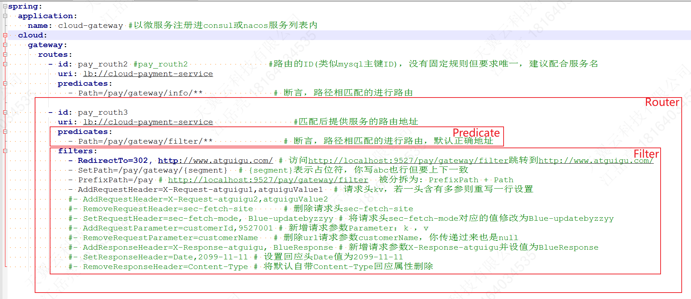

---

Created at: 2024-11-16
Last updated at: 2025-03-09
Source URL: https://docs.spring.io/spring-cloud-gateway/reference/spring-cloud-gateway-server-mvc/glossary.html


---

# 7-Gateway


以前两个微服务之间的调用很直接，现在出于安全、监控、方便统一管理等需求，不再允许直接调用，所有的请求都必须经过网关，由网关进行路由转发，这就Spring Cloud Gateway的目的。
参考官网： [Spring Cloud Gateway](https://spring.io/projects/spring-cloud-gateway#overview)
以前是通过Feign直接调目标微服务：
```
@FeignClient(value = "")
public interface PayFeignApi {
    /**
     * 新增一条支付相关流水记录
     */
    @PostMapping(value = "/pay/add")
    public ResultData addPay(@RequestBody PayDTO payDTO);
}
```
现在改成调Gateway，再由Gateway转发到cloud-payment-service
```
@FeignClient(value = "cloud-gateway")
public interface PayFeignApi {
    /**
     * 新增一条支付相关流水记录
     */
    @PostMapping(value = "/pay/add")
    public ResultData addPay(@RequestBody PayDTO payDTO);
}
```
并非一定要用Feign调，直接向网关发送http请求也可以被网关转发，所以在项目中加入Gateway之后所有的请求应该都先到网关。
Nginx和Spring Cloud Gateway都是在做请求转发的工作，只不过二者的侧重点不同，Nginx负责承接外部进来的请求，Gateway主要负责微服务之间请求，当然外部进来的请求也要先到Gateway。

**Spring Cloud Gateway的三个重要术语：**

* Route（路由）：由一个ID、目的URI、一系列Predicate、一系列Filter 组成，也就是Route包含Predicate和Filter。
* Predicate（断言）：匹配条件。
* Filter（过滤器）：匹配成功之后，在请求之前和响应之后做一些动作，比如可以修改请求头和响应头。

`Gateway的工作流程：先检查Predicate，所有Predicate都匹配之后就做Filter中的动作，最后拼接上uri然后发送请求到目标微服务。`可以看到，Gateway将所有微服务的接口都集中在一起了，所以Predicate中的Path很重要，所有微服务之间不能有重复的Path，保证这一点也很简单，每个微服务有特定的名字，把这个名字作为Path的前缀。


**uri**
uri: lb://cloud-payment-service，lb表示loadbanlance，cloud-payment-service是在注册中心注册的微服务。

**Predicate**
Spring Cloud Gateway有很多内置的断言，如下，方便直接配置，当然也可以自定义。

* The After Request Predicate：表示请求必须发生在指定的时间之后，否则不放行
* The Before Request Predicate：表示请求必须发生在指定的时间之前，否则不放行
* The Between Request Predicate：表示请求必须发生在指定的时间之间，否则不放行
* The Cookie Request Predicate：表示请求必须包含指定的cookie
* The Header Request Predicate：表示必须包含指定的请求头
* The Host Request Predicate：表示请求头中的Host必须是指定的形式（正则表达式）
* The Method Request Predicate：请求方式必须是指定的方式
* `The Path Request Predicate：请求的路径`
* The Query Request Predicate：请求必须包含指定的查询参数
* The RemoteAddr Route Predicate Factory
* The Weight Request Predicate：可以给不同的路由分组，并指定权重值，权重值决定了流量的大小。
* The XForwarded Remote Addr Route Predicate Factory

The After Request Predicate表示请求必须发生在指定的时间之后，否则不放行。
```
spring:
  cloud:
    gateway:
        routes:
        - id: after_route
          uri: https://example.org
          predicates:
          - After=2017-01-20T17:42:47.789-07:00[America/Denver]
```
The Cookie Request Predicate表示请求必须包含指定的cookie，cookie是键值对，值不能省略。
Spring Cloud Gateway有两种配置风格：Shortcut Configuration（快捷配置） 和 Fully Expanded Arguments（完全配置），下面全部使用Shortcut Configuration。
对于键值对，Shortcut Configuration的配置风格是：
1、键和值配置的时候以逗号分隔，值是正则表达式的形式。
2、如果值可以省略，配置的时候可以不包含值，表示只要求只包含该键，对值没有要求。
3、如果有多个cookie则以列表形式配置。
```
spring:
  cloud:
    gateway:
        routes:
        - id: cookie_route
          uri: https://example.org
          predicates:
          - Cookie=chocolate2, ch.p
          - Cookie=chocolate3, xxxx
```
The Header Request Predicate表示必须包含指定的请求头，和cookie一样以键值对的形式配置。
The Host Request Predicate表示请求头中的Host必须是指定的形式（正则表达式），这个Host断言是一个列表，多个正则表达式以逗号分隔
```
spring:
  cloud:
    gateway:
        routes:
        - id: host_route
          uri: https://example.org
          predicates:
          - Host=**.somehost.org,**.anotherhost.org
```
The Method Request Predicate：请求方式必须是指定的方式，和Host断言一样是一个列表
The Path Request Predicate匹配请求的路径，也是一个列表，{segment}是路径变量，可以匹配任意值，这个变量可以在Filter中使用。
```
spring:
  cloud:
    gateway:
        routes:
        - id: path_route
          uri: https://example.org
          predicates:
          - Path=/red/{segment},/blue/{segment}
```
The Query Request Predicate：请求必须包含指定的查询参数，查询参数断言是键值对，值是正则表达式，值可以省略，配置的时候可以不包含值，表示只要求只包含该键，对值没有要求。
```
spring:
  cloud:
    gateway:
        routes:
        - id: query_route
          uri: https://example.org
          predicates:
          - Query=green
          - Query=red, gree.
```
The Weight Request Predicate：可以给不同的路由分组，并指定权重值，权重值决定了流量的大小。下面的配置会将80%的流量给https://weighthigh.org。
```
spring:
  cloud:
    gateway:
        routes:
        - id: weight_high
          uri: https://weighthigh.org
          predicates:
          - Weight=group1, 8
        - id: weight_low
          uri: https://weightlow.org
          predicates:
          - Weight=group1, 2
```

**自定义断言**
1、创建类名以RoutePredicateFactory结尾的类，比如MyRoutePredicateFactory，前缀My将作为配置文件中的配置项
2、新建静态内部类MyRoutePredicateFactory.Config，配置文件中配置的值会赋值给Config中的变量
3、继承AbstractRoutePredicateFactory<MyRoutePredicateFactory.Config>
4、空参构造方法，内部调用super
5、重写父类的shortcutFieldOrder()方法，用于快捷配置
6、重写apply方法，断言的逻辑封装在apply方法里
比如下面断言表示请求参数中必须要有一个"userType"参数且与配置文件配置的一致
```
@Component
public class MyRoutePredicateFactory extends AbstractRoutePredicateFactory<MyRoutePredicateFactory.Config> {
    public MyRoutePredicateFactory() {
        super(MyRoutePredicateFactory.Config.class);
    }
    //这个Config类就是我们的路由断言规则，重要
    @Validated
    public static class Config {
        @Setter
        @Getter
        @NotEmpty
        private String userType; //钻/金/银和yml配置的会员等级
    }
    @Override
    public List<String> shortcutFieldOrder() {
        return Collections.singletonList("userType");
    }
    @Override
    public Predicate<ServerWebExchange> apply(MyRoutePredicateFactory.Config config) {
        return new Predicate<ServerWebExchange>() {
            @Override
            public boolean test(ServerWebExchange serverWebExchange) {
                //检查request的参数里面，userType是否为指定的值，符合配置就通过
                //http://localhost:9527/pay/gateway/get/1?userType=diamond
                String userType = serverWebExchange.getRequest().getQueryParams().getFirst("userType");
                if (userType == null) {
                    return false;
                }
                //如果说参数存在，就和config的数据进行比较
                if (userType.equalsIgnoreCase(config.getUserType())) {
                    return true;
                }
                return false;
            }
        };
    }
}
```
快捷配置方式：
```
spring:
  application:
    name: cloud-gateway #以微服务注册进consul或nacos服务列表内
  cloud:
    gateway:
      routes:
        - id: pay_routh1 #pay_routh1                #路由的ID(类似mysql主键ID)，没有固定规则但要求唯一，建议配合服务名
          uri: lb://cloud-payment-service                #匹配后提供服务的路由地址
          predicates:
            - Path=/pay/gateway/get/**              # 断言，路径相匹配的进行路由
            - My=gold
```
完全配置方式：
```
spring:
 application:
 name: cloud-gateway #以微服务注册进consul或nacos服务列表内
 cloud:
 gateway:
 routes:
 - id: pay_routh1 #pay_routh1                #路由的ID(类似mysql主键ID)，没有固定规则但要求唯一，建议配合服务名
 uri: lb://cloud-payment-service                #匹配后提供服务的路由地址
 predicates:
 - Path=/pay/gateway/get/**              # 断言，路径相匹配的进行路由
 - name: My
 args:
 userType: diamond
```

**Filter**
Filter同样也有很多内置的，也可以自定义，内置的大致可以分成一下几类：
修改请求头：

* AddRequestHeader GatewayFilter Factory
* RemoveRequestHeader GatewayFilter Factory
* SetRequestHeader GatewayFilter Factory

修改请求参数：

* AddRequestParameter GatewayFilter Factory
* RemoveRequestParameter GatewayFilter Factory

修改响应头：

* AddResponseHeader GatewayFilter Factory
* RemoveResponseHeader GatewayFilter Factory
* SetResponseHeader GatewayFilter Factory

Path相关：

* PrefixPath GatewayFilter Factory
* SetPath GatewayFilter Factory
* RedirectTo GatewayFilter Factory

默认Filter

* Default Filters

AddRequestHeader GatewayFilter Factory，添加请求头，如下配置在请求头中添加X-Request-Red=Blue-{segment}，其中的{segment}便是URL中路径变量。
```
spring:
  cloud:
    gateway:
      routes:
      - id: add_request_header_route
        uri: https://example.org
        predicates:
        - Path=/red/{segment}
        filters:
        - AddRequestHeader=X-Request-Red, Blue-{segment}
```
PrefixPath GatewayFilter Factory，断言匹配之后会给请求路径加上一个前缀，比如下面向网关发送/hello请求，最后网关转发的请求的路径是https://example.org/mypath/hello
```
spring:
  cloud:
    gateway:
      routes:
      - id: prefixpath_route
        uri: https://example.org
        filters:
        - PrefixPath=/mypath
```
SetPath GatewayFilter Factory，网关转发的时候直接把请求路径完全替换掉，比如下面发送给网关请求是/red/a，网关转发的路径是https://example.org/xx
```
spring:
  cloud:
    gateway:
      routes:
      - id: setpath_route
        uri: https://example.org
        predicates:
        - Path=/red/a
        filters:
        - SetPath=/xx
```
RedirectTo GatewayFilter Factory，网关直接返回一个重定向响应
```
spring:
  cloud:
    gateway:
      routes:
      - id: prefixpath_route
        uri: https://example.org
        filters:
        - RedirectTo=302, https://acme.org
```
Default Filters是一个一系列Filter的列表，默认作用于所有routes路由
```
spring:
  cloud:
    gateway:
      default-filters:
      - AddResponseHeader=X-Response-Default-Red, Default-Blue
      - PrefixPath=/httpbin
```

**自定义Filter**
1、自定义GatewayFilter，和上面一样，针对单一route
2、自定义GlobalFilter，和Default Filters一样，针对所有routes

